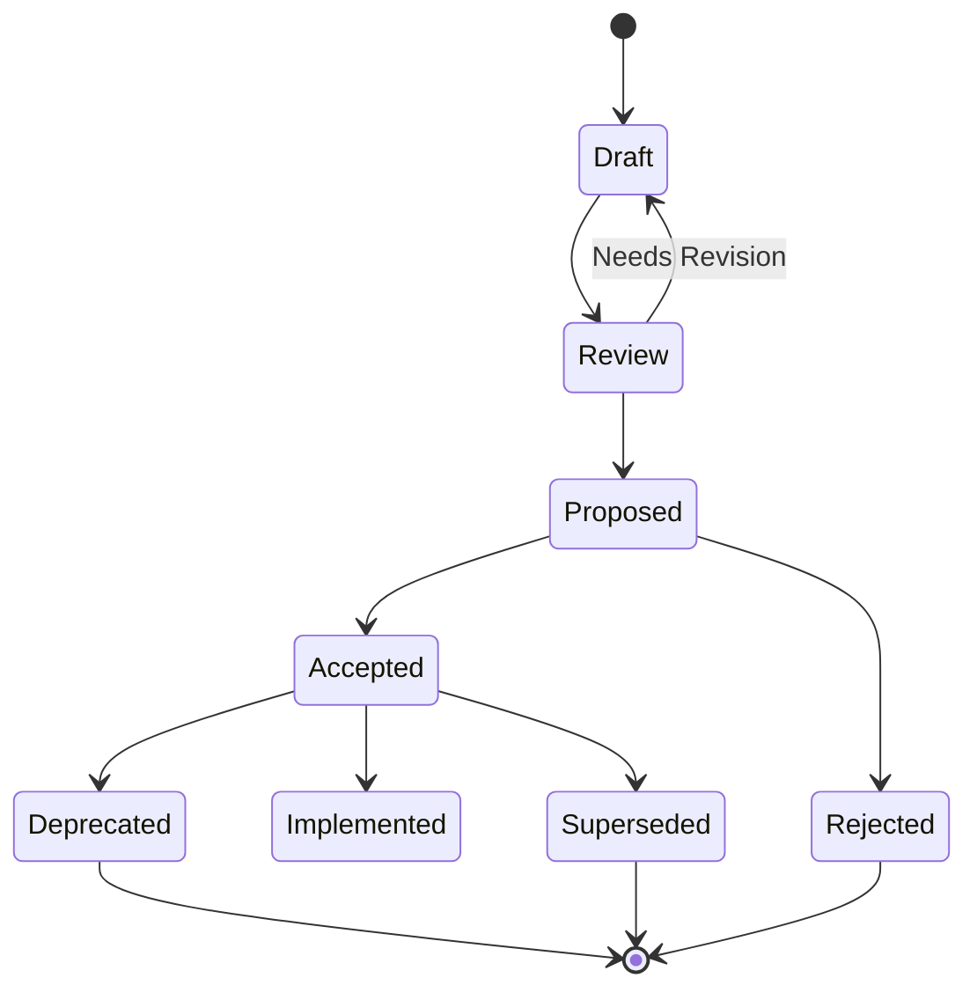

# CLAUDE.md - Architectural Decisions Repository

## 🏗️ Purpose

This directory contains Architecture Decision Records (ADRs) that document significant architectural choices for this project. ADRs provide transparency into why specific technical decisions were made and serve as valuable context for future development.

---

## 📋 Directory Structure

```
05_ARCHITECTURAL_DECISIONS/
├── CLAUDE.md                    # This file
├── ADR_001_Database_Choice.md   # Example ADR
├── ADR_002_Authentication.md    # Example ADR
└── ...                         # Additional ADRs
```

---

## 🎯 What Goes Here

### Include These Decisions
- **Technology Stack**: Framework choices, database selection, infrastructure decisions
- **Architecture Patterns**: Microservices vs monolith, event-driven design, API patterns
- **Security Approaches**: Authentication methods, authorization patterns, data protection
- **Data Management**: Database schema design, data flow patterns, caching strategies
- **Development Practices**: CI/CD pipeline design, testing strategies, deployment approaches
- **Integration Decisions**: Third-party service selections, protocol choices

### Don't Include These
- **Implementation Details**: Specific code changes (use task documentation)
- **Temporary Decisions**: Short-term workarounds or quick fixes
- **Personal Preferences**: Decisions without significant impact or reasoning
- **Business Requirements**: Use milestone PRDs in `02_REQUIREMENTS/`

---

## 📝 ADR Creation Guidelines

### When to Create an ADR
Create an ADR when you're making a decision that:
- ✅ **Has long-term impact** on the system architecture
- ✅ **Affects multiple components** or teams
- ✅ **Is difficult or expensive to reverse** once implemented
- ✅ **Requires stakeholder alignment** or approval
- ✅ **Involves significant trade-offs** between alternatives
- ✅ **Sets precedent** for future similar decisions

### ADR Creation Process
1. **Identify the Problem**: What architectural challenge needs resolution?
2. **Research Options**: Gather information about viable alternatives
3. **Analyze Trade-offs**: Evaluate pros, cons, costs, and risks
4. **Gather Input**: Consult with stakeholders and subject matter experts
5. **Document Decision**: Use the ADR template from `../99_TEMPLATES/adr_template.md`
6. **Review & Approve**: Follow the approval process outlined in the template
7. **Communicate**: Share with affected teams and stakeholders
8. **Track Implementation**: Monitor progress and outcomes

---

## 🏷️ Naming Convention

### File Naming Pattern
```
ADR_{###}_{Brief_Description}.md
```

**Examples**:
- `ADR_001_Database_Selection.md`
- `ADR_002_Authentication_Strategy.md`
- `ADR_003_Microservices_Architecture.md`
- `ADR_004_API_Gateway_Choice.md`

### ID Assignment
- **Sequential numbering**: ADR_001, ADR_002, ADR_003, etc.
- **Zero-padded**: Always use 3 digits (001, 002, 010, 100)
- **No gaps**: If an ADR is superseded, don't reuse numbers
- **Global sequence**: Numbers are unique across the entire project

---

## 📊 ADR Status Management

### Status Lifecycle


### Status Definitions
- **Draft**: Initial creation, work in progress
- **Review**: Ready for stakeholder review and feedback
- **Proposed**: Formal proposal awaiting approval decision
- **Accepted**: Approved for implementation
- **Implemented**: Decision has been implemented
- **Deprecated**: No longer relevant but kept for historical reference
- **Superseded**: Replaced by a newer ADR
- **Rejected**: Decision was not approved

---

## 🔗 Cross-References and Relationships

### ADR Relationships
- **Supersedes**: This ADR replaces older decisions
- **Superseded By**: This ADR has been replaced
- **Related**: Connected decisions that should be considered together
- **Conflicts With**: Decisions that cannot coexist
- **Depends On**: Prerequisite decisions that must be in place

### Integration with Other Simone Components
- **Link to Milestones**: Reference relevant milestone PRDs
- **Connect to Tasks**: Reference implementation tasks in sprints
- **Cross-reference**: Link to relevant documentation in `01_PROJECT_DOCS/`
- **Update Manifest**: Ensure project manifest reflects architectural decisions

---

## 🎯 Template Usage

### Using the ADR Template
```bash
# Copy template to new ADR
cp ../99_TEMPLATES/adr_template.md ADR_001_Database_Selection.md

# Fill in all required sections:
# 1. Replace all {PLACEHOLDER} tokens
# 2. Complete metadata in YAML frontmatter
# 3. Add Mermaid diagrams where helpful
# 4. Include decision matrix with scoring
# 5. Document all alternatives considered
```

### Required Template Sections
- **Context & Problem Statement**: Why is this decision needed?
- **Decision**: What was chosen and why?
- **Alternatives Considered**: What other options were evaluated?
- **Consequences**: What are the positive and negative impacts?
- **Implementation Plan**: How will this be implemented?
- **Risk Assessment**: What could go wrong?
- **Success Metrics**: How will success be measured?

---

## 📈 Quality Standards

### Review Checklist
Before marking an ADR as "Accepted":
- [ ] **Problem clearly defined**: The architectural challenge is well articulated
- [ ] **Multiple alternatives evaluated**: At least 2-3 options were considered
- [ ] **Trade-offs analyzed**: Pros, cons, costs, and risks are documented
- [ ] **Stakeholders consulted**: Relevant team members provided input
- [ ] **Implementation plan exists**: Clear path from decision to reality
- [ ] **Success metrics defined**: Measurable outcomes are specified
- [ ] **Risks identified**: Potential issues and mitigations are documented
- [ ] **Cross-references complete**: Links to related ADRs and documents

### Documentation Standards
- **Be Concise**: Focus on the decision and reasoning, not implementation details
- **Use Diagrams**: Include Mermaid diagrams for complex relationships
- **Include Data**: Provide metrics, benchmarks, or research that influenced the decision
- **Show Your Work**: Document the decision-making process, not just the outcome
- **Think Long-term**: Consider future implications and evolution paths

---

## 🔄 Maintenance and Updates

### Regular Maintenance Tasks
- **Quarterly Review**: Assess if implemented ADRs are meeting expectations
- **Status Updates**: Move ADRs through lifecycle states as implementation progresses
- **Impact Analysis**: Document actual outcomes vs. predicted consequences
- **Lessons Learned**: Update with real-world experience and insights

### When to Update ADRs
- **Status Changes**: When implementation begins or completes
- **New Information**: When assumptions change or new data emerges
- **Outcome Assessment**: When success metrics can be evaluated
- **Superseding Decisions**: When newer ADRs replace existing ones

### Deprecation Process
1. **Mark as Deprecated**: Update status and add deprecation reason
2. **Reference Replacement**: Link to superseding ADR if applicable
3. **Preserve History**: Never delete, maintain for historical context
4. **Update Cross-references**: Ensure other documents point to current decisions

---

## 🚀 Common Claude Code Commands

### Creating a New ADR
```bash
# Use Simone command to create ADR from template
/project:simone:create_adr "Database selection for user data"

# Manual creation with proper numbering
cp ../99_TEMPLATES/adr_template.md ADR_001_Database_Selection.md
```

### Reviewing ADR Status
```bash
# Search for ADRs by status
grep -r "status: accepted" *.md

# Find all implemented decisions
grep -r "status: implemented" *.md

# Check for ADRs needing review
grep -r "next_review_date" *.md | grep $(date +%Y-%m)
```

### Updating ADR Cross-References
```bash
# Find ADRs that reference specific topics
grep -r "authentication" *.md
grep -r "database" *.md

# Validate internal links
grep -r "\[.*\](ADR_.*\.md)" *.md
```

---

## 📚 Example ADR Topics

### Infrastructure & Platform
- Cloud provider selection (AWS vs Azure vs GCP)
- Container orchestration platform (Kubernetes vs Docker Swarm)
- CI/CD pipeline tooling (GitHub Actions vs Jenkins vs GitLab)
- Monitoring and observability stack

### Data & Storage
- Primary database technology (PostgreSQL vs MySQL vs MongoDB)
- Caching strategy (Redis vs Memcached vs in-memory)
- Data backup and disaster recovery approach
- Data privacy and compliance framework

### Application Architecture
- Monolith vs microservices architecture
- API design patterns (REST vs GraphQL vs gRPC)
- Event-driven architecture patterns
- Frontend framework selection

### Security & Compliance
- Authentication and authorization strategy
- API security and rate limiting approach
- Data encryption standards
- Compliance framework (SOC2, GDPR, HIPAA)

### Development Practices
- Testing strategy and pyramid
- Code review and quality gates
- Branching and release strategy
- Documentation standards and tools

---

## 🎯 Success Indicators

### Quality Indicators
- **Decision Clarity**: Team members understand why decisions were made
- **Reduced Debates**: Fewer arguments about settled architectural questions
- **Faster Onboarding**: New team members can understand system reasoning
- **Consistent Implementation**: Decisions are being followed in practice

### Process Indicators
- **Timely Creation**: ADRs are created when decisions are made, not after
- **Stakeholder Input**: Relevant team members contribute to decision-making
- **Regular Updates**: ADR status reflects actual implementation progress
- **Impact Tracking**: Outcomes are measured against predicted consequences

### Outcome Indicators
- **Reduced Technical Debt**: Good architectural decisions minimize future problems
- **Improved Velocity**: Clear decisions enable faster development
- **Better Quality**: Thoughtful architecture reduces bugs and issues
- **Team Alignment**: Shared understanding of architectural principles

---

## 🔧 Troubleshooting

### Common Issues and Solutions

**"ADR numbering conflicts"**
- ✅ Use sequential numbering without gaps
- ✅ Check existing ADRs before assigning numbers
- ✅ Reserve number when starting ADR draft

**"Too many ADRs for small decisions"**
- ✅ Focus on significant architectural impacts
- ✅ Use task documentation for implementation details
- ✅ Consider grouping related small decisions

**"ADRs getting out of date"**
- ✅ Schedule regular ADR review sessions
- ✅ Update status as implementation progresses
- ✅ Include ADR maintenance in definition of done

**"Stakeholders not participating"**
- ✅ Make ADR review part of architectural review process
- ✅ Assign specific reviewers for each ADR
- ✅ Present ADRs in team meetings for discussion

---

## 📋 Quick Reference

### ADR Creation Checklist
- [ ] Copy from template: `../99_TEMPLATES/adr_template.md`
- [ ] Assign sequential ADR number
- [ ] Use descriptive title in filename
- [ ] Fill all YAML frontmatter fields
- [ ] Complete all template sections
- [ ] Add Mermaid diagrams where helpful
- [ ] Include decision matrix with alternatives
- [ ] Schedule stakeholder review
- [ ] Update project manifest with reference
- [ ] Link from related milestone/sprint documentation

### Review and Approval Checklist
- [ ] Problem statement is clear and compelling
- [ ] Multiple alternatives were considered
- [ ] Decision rationale is well-reasoned
- [ ] Consequences are realistic and complete
- [ ] Implementation plan is feasible
- [ ] Risks are identified with mitigations
- [ ] Success metrics are measurable
- [ ] All stakeholders have provided input
- [ ] Technical review completed
- [ ] Business impact assessed
- [ ] Compliance requirements addressed

---

*This directory is part of the Simone Framework v2.1. For questions about ADR creation or the architectural decision process, refer to the project manifest or consult with the technical lead.*