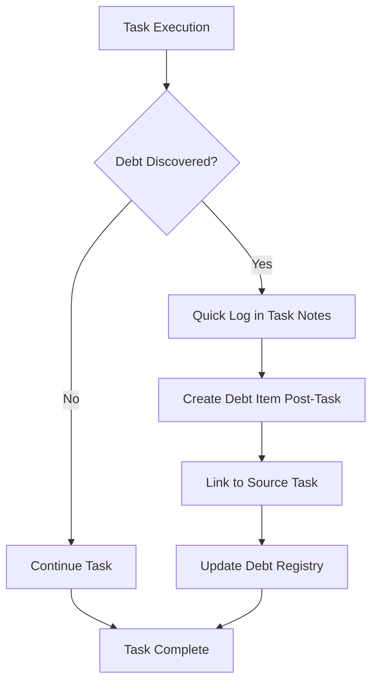
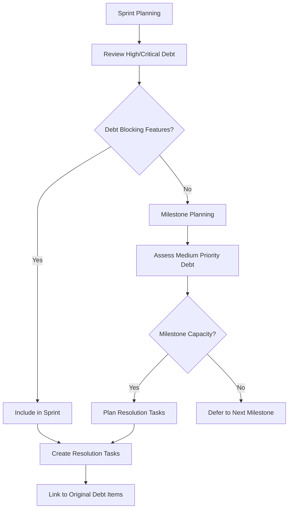
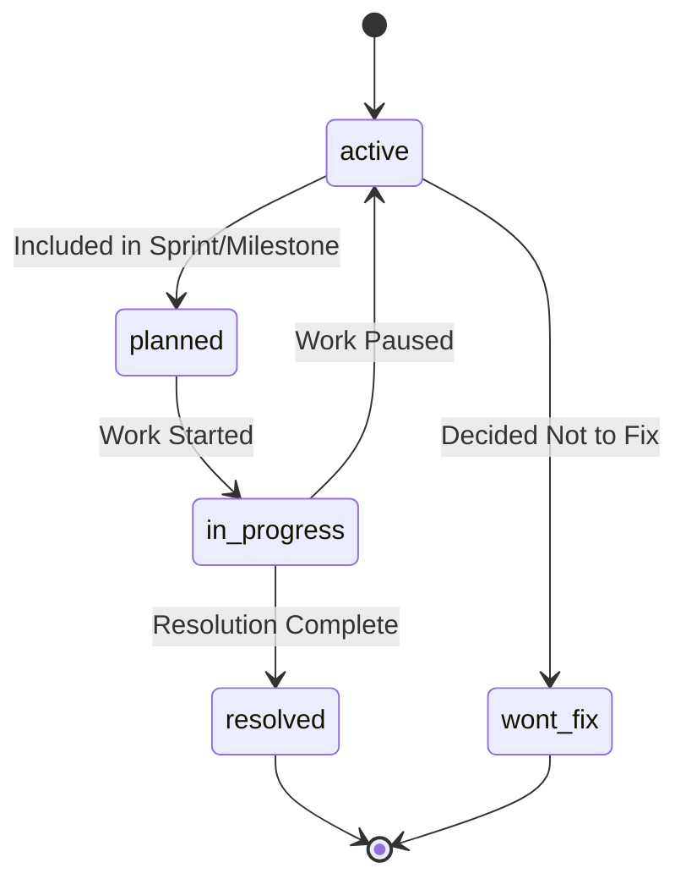
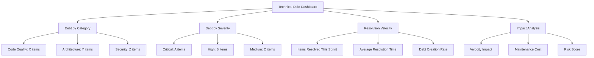

# CLAUDE.md - Technical Debt Management System

## Overview
The Technical Debt Management System provides structured tracking, categorization, and resolution planning for accumulated technical debt within the Simone framework. This system helps teams make informed decisions about when to address debt without disrupting current development flow.

## Core Philosophy

### Technical Debt Definition
Technical debt represents shortcuts, compromises, or suboptimal solutions implemented to meet immediate needs that create future maintenance burden, reduce development velocity, or increase system risk.

### Strategic Approach
- **Capture, Don't Fix**: Log debt when discovered without disrupting current tasks
- **Informed Decisions**: Provide data for strategic debt resolution planning
- **Progressive Resolution**: Integrate debt resolution into regular development cycles
- **Context Preservation**: Maintain detailed context for future decision-making

## Directory Structure
```
07_TECHNICAL_DEBT/
├── CLAUDE.md                    # This file - usage instructions
├── DEBT_REGISTRY.md            # Master registry of all debt items
├── RESOLVED/                   # Archive of resolved debt items
│   └── TD_###_resolved.md
└── ACTIVE/                     # Current debt items
    ├── TD_001_code_quality.md
    ├── TD_002_architecture.md
    └── TD_###_description.md
```

## Debt Categories

### Code Quality Debt
- **Duplicated code**: Copy-paste implementations that should be abstracted
- **Complex methods**: Functions that exceed complexity thresholds
- **Poor naming**: Variables, functions, or classes with unclear names
- **Missing error handling**: Inadequate exception handling or validation
- **Code smells**: Anti-patterns that reduce maintainability

### Architecture Debt
- **Design violations**: Code that breaks established architectural patterns
- **Tight coupling**: Components with excessive interdependencies
- **Missing abstractions**: Repeated patterns that should be generalized
- **Scalability limitations**: Designs that won't scale with growth
- **Technology obsolescence**: Outdated libraries or frameworks

### Security Debt
- **Authentication gaps**: Missing or weak authentication mechanisms
- **Authorization flaws**: Inadequate permission controls
- **Input validation**: Missing or insufficient input sanitization
- **Data exposure**: Sensitive data handling issues
- **Compliance gaps**: Regulatory requirement violations

### Performance Debt
- **Inefficient algorithms**: Suboptimal algorithm choices
- **Database issues**: Poor query performance or schema design
- **Resource leaks**: Memory, connection, or file handle leaks
- **Caching gaps**: Missing caching where beneficial
- **Network inefficiencies**: Excessive or poorly optimized network calls

### Documentation Debt
- **Missing documentation**: Undocumented code or systems
- **Outdated documentation**: Documentation that doesn't match implementation
- **Missing ADRs**: Architectural decisions without documentation
- **Poor code comments**: Inadequate inline documentation
- **Missing runbooks**: Operational procedures not documented

### Testing Debt
- **Test coverage gaps**: Missing unit, integration, or e2e tests
- **Flaky tests**: Tests that pass/fail inconsistently
- **Outdated tests**: Tests that don't reflect current implementation
- **Missing test data**: Inadequate test scenarios or edge cases
- **Test maintenance**: Tests that are difficult to maintain or understand

## Severity Levels

### Critical (Immediate Action Required)
- **Security vulnerabilities**: Active security risks
- **Production blockers**: Issues preventing deployments
- **Data corruption risks**: Potential for data loss or corruption
- **Compliance violations**: Regulatory requirement breaches
- **System instability**: Issues causing crashes or significant downtime

### High (Plan for Next Sprint)
- **Performance degradation**: Noticeable impact on user experience
- **Maintenance velocity**: Significantly slowing development
- **Risk accumulation**: Multiple medium risks in same area
- **Customer impact**: Issues affecting customer satisfaction
- **Team productivity**: Problems reducing team effectiveness

### Medium (Include in Milestone Planning)
- **Code maintainability**: Making changes more difficult
- **Future scalability**: Will become problematic with growth
- **Development friction**: Slowing down specific workflows
- **Quality concerns**: Reducing overall code quality
- **Knowledge gaps**: Creating dependencies on specific individuals

### Low (Address During Refactoring)
- **Code clarity**: Minor improvements to readability
- **Convention violations**: Deviations from coding standards
- **Optimization opportunities**: Performance improvements that aren't urgent
- **Nice-to-have features**: Missing conveniences that don't block work
- **Cleanup items**: General housekeeping and organization

## Impact Assessment Framework

### Development Velocity Impact
- **Immediate**: How does this debt affect current sprint velocity?
- **Short-term**: Impact on next 2-3 sprints if unaddressed
- **Long-term**: Cumulative effect over 6+ months
- **Scaling**: How impact changes with team size or system growth

### Maintenance Cost Analysis
- **Time overhead**: Additional time required for related changes
- **Cognitive load**: Mental effort required to work around the debt
- **Error probability**: Likelihood of introducing bugs due to debt
- **Learning curve**: Impact on new team member onboarding

### Risk Assessment
- **Technical risk**: Probability and impact of technical failures
- **Business risk**: Potential business consequences if unaddressed
- **Compliance risk**: Regulatory or security compliance implications
- **Opportunity cost**: Features or improvements delayed due to debt

## Workflow Integration

### Debt Discovery and Logging


### Resolution Planning


## File Naming Conventions

### Debt Items
- **Format**: `TD_###_brief_description.md`
- **Examples**: 
  - `TD_001_duplicate_user_validation.md`
  - `TD_002_missing_error_handling.md`
  - `TD_003_inefficient_database_queries.md`

### Resolved Items
- **Format**: `TD_###_resolved.md` (moved to RESOLVED/ directory)
- **Archive**: Original file moved, not deleted, for future reference

## Metadata Standards

### YAML Frontmatter (Required)
```yaml
debt_id: "TD_###"
title: "Brief Description"
category: "code_quality|architecture|security|performance|documentation|testing"
severity: "critical|high|medium|low"
created_date: "YYYY-MM-DD"
discovered_by: "Team Member Name"
discovered_in: "TASK_ID or context"
status: "active|planned|in_progress|resolved|wont_fix"
resolution_target: "YYYY-MM-DD" # when resolution is planned
estimated_effort: "hours"
business_impact: "description"
technical_impact: "description"
affected_components: ["component1", "component2"]
related_debt: ["TD_###", "TD_###"] # related debt items
blocking_tasks: ["TASK_ID"] # tasks blocked by this debt
```

### Status Workflow


## Integration with Simone Commands

### Automatic Debt Logging
- **Code Review**: Review process should identify and log debt items
- **Task Completion**: Post-task retrospective should capture discovered debt
- **Project Review**: Include debt assessment in project health snapshots
- **Architecture Changes**: ADR process should flag potential debt creation

### Command Integration Points
- `do_task.md`: Add debt logging step to workflow
- `code_review.md`: Include debt identification in review criteria
- `project_review.md`: Add debt metrics to health assessment
- `commit.md`: Option to reference resolved debt items

## Metrics and Reporting

### Debt Metrics Dashboard


### Key Performance Indicators
- **Debt Load**: Total active debt items by category and severity
- **Debt Velocity**: Rate of debt creation vs. resolution
- **Age Distribution**: How long debt items remain unresolved
- **Resolution Efficiency**: Effort estimated vs. actual for resolved items
- **Impact Reduction**: Measured improvement after debt resolution

## Quality Standards

### Debt Item Requirements
- [ ] **Clear Description**: Specific issue description with context
- [ ] **Impact Assessment**: Quantified or qualitative impact analysis
- [ ] **Root Cause**: Understanding of why debt was created
- [ ] **Resolution Approach**: Proposed solution or investigation needed
- [ ] **Effort Estimation**: Time required for resolution
- [ ] **Dependencies**: Other work required before resolution possible

### Documentation Quality
- [ ] **Reproducible**: Enough detail for any team member to understand
- [ ] **Actionable**: Clear next steps for resolution
- [ ] **Traceable**: Links to source code, tasks, or documentation
- [ ] **Current**: Information remains accurate and relevant
- [ ] **Complete**: All required metadata fields populated

## Best Practices

### When to Log Debt
- **During Code Review**: Reviewer identifies suboptimal implementation
- **During Task Work**: Developer encounters existing problematic code
- **During Bug Investigation**: Root cause reveals systemic issues
- **During Performance Analysis**: Bottlenecks or inefficiencies discovered
- **During Security Audit**: Vulnerabilities or compliance gaps found

### When NOT to Log Debt
- **Personal Preferences**: Style or approach differences without clear impact
- **Future Optimizations**: Premature optimization without demonstrated need
- **Speculative Issues**: Problems that might occur under unknown conditions
- **One-off Occurrences**: Issues that are unlikely to recur or expand

### Resolution Prioritization
1. **Critical/Security**: Always highest priority
2. **High Impact on Current Work**: Blocking or significantly slowing development
3. **Cumulative Effect**: Multiple medium items in same area
4. **Strategic Opportunities**: Refactoring work provides natural resolution opportunity
5. **Learning Opportunities**: Good items for junior developers to tackle

## Template Usage

### Creating New Debt Items
1. Copy template from `99_TEMPLATES/technical_debt_template.md`
2. Name file following convention: `TD_###_brief_description.md`
3. Place in `07_TECHNICAL_DEBT/ACTIVE/` directory
4. Fill all required metadata fields
5. Update `DEBT_REGISTRY.md` with new item

### Resolving Debt Items
1. Update status to `in_progress` when work begins
2. Create resolution task(s) in appropriate sprint
3. Link resolution task to debt item
4. Update status to `resolved` when complete
5. Move file to `RESOLVED/` directory with `_resolved` suffix
6. Update `DEBT_REGISTRY.md` to reflect resolution

## Integration Examples

### Task Template Updates
Add debt logging section to task templates:
```markdown
## Technical Debt Assessment
- [ ] **Debt Discovered**: Any technical debt identified during implementation?
- [ ] **Debt Created**: Any shortcuts taken that create future maintenance burden?
- [ ] **Debt Resolved**: Any existing debt addressed as part of this task?

### Debt Items
- **Discovered**: [List any debt items that should be logged]
- **Created**: [Document any conscious technical debt creation with justification]
- **Resolved**: [Reference any debt items addressed: TD_###]
```

### Code Review Integration
Add debt identification to review checklist:
```markdown
### Technical Debt Review
- [ ] **Architecture Compliance**: Code follows established patterns
- [ ] **Quality Standards**: No obvious code smells or anti-patterns
- [ ] **Performance Considerations**: No obvious performance issues
- [ ] **Security Review**: No security vulnerabilities introduced
- [ ] **Debt Logging**: Any identified debt items logged appropriately
```

## Common Patterns

### Debt Clustering
Often debt items cluster around:
- **Legacy Components**: Older code that predates current standards
- **Rapid Development Areas**: Features built under time pressure
- **Complex Domains**: Areas with inherent complexity or frequent changes
- **Integration Points**: Boundaries between systems or services
- **Performance Critical Paths**: Code that handles high volume or low latency requirements

### Resolution Strategies
- **Big Bang Refactoring**: Complete rewrite of problematic area
- **Gradual Improvement**: Incremental fixes over multiple sprints
- **Wrapping**: Add abstraction layer to isolate debt
- **Documentation**: Document workarounds until resolution possible
- **Monitoring**: Add alerts to detect when debt causes issues

## Tools and Automation

### Automated Debt Detection
Consider integrating tools that can automatically identify certain types of debt:
- **Code Analysis**: SonarQube, CodeClimate for code quality issues
- **Performance Monitoring**: APM tools for performance debt
- **Security Scanning**: SAST/DAST tools for security debt
- **Dependency Analysis**: Tools to identify outdated dependencies

### Integration Hooks
```bash
# Example: Post-commit hook to prompt for debt logging
# .git/hooks/post-commit
if git diff --name-only HEAD~1..HEAD | grep -q "\.js$\|\.ts$\|\.py$"; then
    echo "Code changes detected. Any technical debt to log? (y/n)"
    read -n 1 answer
    if [ "$answer" = "y" ]; then
        echo "Create debt item at: .simone/07_TECHNICAL_DEBT/ACTIVE/"
    fi
fi
```

## Troubleshooting

### Common Issues
- **Debt Overload**: Too many debt items making prioritization difficult
  - **Solution**: Regular grooming sessions to close irrelevant items
- **Inconsistent Logging**: Some team members not logging discovered debt
  - **Solution**: Make debt logging part of definition-of-done
- **Analysis Paralysis**: Over-analyzing debt instead of addressing it
  - **Solution**: Set time limits for debt investigation and resolution planning

### Maintenance Tasks
- **Weekly**: Review new debt items for proper categorization
- **Sprint End**: Update debt statuses and close resolved items
- **Monthly**: Analyze debt trends and adjust logging practices
- **Quarterly**: Review debt resolution velocity and process effectiveness

---

## Quick Reference

### Severity Assessment Questions
- **Critical**: Is this causing production issues or security vulnerabilities?
- **High**: Is this significantly impacting development velocity or user experience?
- **Medium**: Will this become a bigger problem if left unaddressed for months?
- **Low**: Is this mainly a code quality or maintenance convenience issue?

### Category Classification
- **Code Quality**: Is this about readability, maintainability, or code organization?
- **Architecture**: Does this affect system design, coupling, or scalability?
- **Security**: Are there authentication, authorization, or data protection concerns?
- **Performance**: Does this impact response times, throughput, or resource usage?
- **Documentation**: Is information missing or outdated?
- **Testing**: Are there gaps in test coverage or test quality?

---

*Technical Debt Management System v1.0 | Integrated with Simone Framework | Evidence-based prioritization*