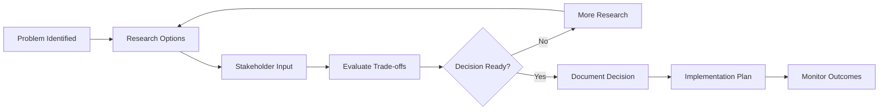

# {ADR_ID}: {TITLE}

**Status**: {STATUS} | **Impact**: {IMPACT_LEVEL} | **Risk**: {RISK_LEVEL} | **Complexity**: {COMPLEXITY}
**Date**: {DATE} | **Updated**: {UPDATED_DATE} | **Type**: {DECISION_TYPE}

## Quick Reference

### Decision Summary
{DECISION_SUMMARY}

### Key Stakeholders
- **Decision Makers**: {DECISION_MAKERS}
- **Implementers**: {IMPLEMENTERS}
- **Affected Teams**: {AFFECTED_TEAMS}

### Timeline
- **Proposed**: {PROPOSAL_DATE}
- **Review Period**: {REVIEW_START_DATE} - {REVIEW_END_DATE}
- **Decision Date**: {DECISION_DATE}
- **Implementation Target**: {IMPLEMENTATION_TARGET_DATE}

### Decision Process Flow

## 1. Context & Problem Statement

### Background
{BACKGROUND_CONTEXT}

### Problem Statement
{PROBLEM_STATEMENT}

### Current Situation
{CURRENT_SITUATION}

### Driving Forces
- **Business Drivers**: {BUSINESS_DRIVERS}
- **Technical Drivers**: {TECHNICAL_DRIVERS}
- **External Drivers**: {EXTERNAL_DRIVERS}

### Constraints
- **Technical Constraints**: {TECHNICAL_CONSTRAINTS}
- **Business Constraints**: {BUSINESS_CONSTRAINTS}
- **Time Constraints**: {TIME_CONSTRAINTS}
- **Resource Constraints**: {RESOURCE_CONSTRAINTS}

## 2. Decision

### Core Decision
{CORE_DECISION}

### Rationale
{DECISION_RATIONALE}

### Key Principles Applied
- **Architectural Principles**: {ARCHITECTURAL_PRINCIPLES}
- **Design Principles**: {DESIGN_PRINCIPLES}
- **Business Principles**: {BUSINESS_PRINCIPLES}

### Scope
- **What's Included**: {SCOPE_INCLUDED}
- **What's Excluded**: {SCOPE_EXCLUDED}
- **Future Considerations**: {FUTURE_SCOPE}

## 3. Alternatives Considered

### Alternative 1: {ALTERNATIVE_1_NAME}
- **Description**: {ALTERNATIVE_1_DESCRIPTION}
- **Pros**: {ALTERNATIVE_1_PROS}
- **Cons**: {ALTERNATIVE_1_CONS}
- **Cost**: {ALTERNATIVE_1_COST}
- **Risk**: {ALTERNATIVE_1_RISK}
- **Why Not Chosen**: {ALTERNATIVE_1_REJECTION_REASON}

### Alternative 2: {ALTERNATIVE_2_NAME}
- **Description**: {ALTERNATIVE_2_DESCRIPTION}
- **Pros**: {ALTERNATIVE_2_PROS}
- **Cons**: {ALTERNATIVE_2_CONS}
- **Cost**: {ALTERNATIVE_2_COST}
- **Risk**: {ALTERNATIVE_2_RISK}
- **Why Not Chosen**: {ALTERNATIVE_2_REJECTION_REASON}

### Alternative 3: {ALTERNATIVE_3_NAME}
- **Description**: {ALTERNATIVE_3_DESCRIPTION}
- **Pros**: {ALTERNATIVE_3_PROS}
- **Cons**: {ALTERNATIVE_3_CONS}
- **Cost**: {ALTERNATIVE_3_COST}
- **Risk**: {ALTERNATIVE_3_RISK}
- **Why Not Chosen**: {ALTERNATIVE_3_REJECTION_REASON}

### Decision Matrix
| Criteria | Weight | Selected | Alt 1 | Alt 2 | Alt 3 |
|----------|---------|----------|-------|-------|-------|
| {CRITERIA_1} | {WEIGHT_1} | {SELECTED_SCORE_1} | {ALT1_SCORE_1} | {ALT2_SCORE_1} | {ALT3_SCORE_1} |
| {CRITERIA_2} | {WEIGHT_2} | {SELECTED_SCORE_2} | {ALT1_SCORE_2} | {ALT2_SCORE_2} | {ALT3_SCORE_2} |
| {CRITERIA_3} | {WEIGHT_3} | {SELECTED_SCORE_3} | {ALT1_SCORE_3} | {ALT2_SCORE_3} | {ALT3_SCORE_3} |
| **Total** | **{TOTAL_WEIGHT}** | **{SELECTED_TOTAL}** | **{ALT1_TOTAL}** | **{ALT2_TOTAL}** | **{ALT3_TOTAL}** |

## 4. Consequences

### Positive Consequences
- **Business Benefits**: {BUSINESS_BENEFITS}
- **Technical Benefits**: {TECHNICAL_BENEFITS}
- **Operational Benefits**: {OPERATIONAL_BENEFITS}
- **Team Benefits**: {TEAM_BENEFITS}

### Negative Consequences
- **Business Costs**: {BUSINESS_COSTS}
- **Technical Debt**: {TECHNICAL_DEBT}
- **Operational Overhead**: {OPERATIONAL_OVERHEAD}
- **Team Impact**: {TEAM_IMPACT}

### Neutral Consequences
- **Trade-offs**: {TRADEOFFS}
- **Changes Required**: {CHANGES_REQUIRED}

### Long-term Implications
- **Architectural Evolution**: {ARCHITECTURAL_EVOLUTION}
- **Maintainability**: {MAINTAINABILITY_IMPACT}
- **Scalability**: {SCALABILITY_IMPACT}
- **Future Flexibility**: {FLEXIBILITY_IMPACT}

## 5. Implementation Plan

### Implementation Strategy
{IMPLEMENTATION_STRATEGY}

### Phases
#### Phase 1: {PHASE_1_NAME}
- **Duration**: {PHASE_1_DURATION}
- **Activities**: {PHASE_1_ACTIVITIES}
- **Deliverables**: {PHASE_1_DELIVERABLES}
- **Success Criteria**: {PHASE_1_SUCCESS_CRITERIA}

#### Phase 2: {PHASE_2_NAME}
- **Duration**: {PHASE_2_DURATION}
- **Activities**: {PHASE_2_ACTIVITIES}
- **Deliverables**: {PHASE_2_DELIVERABLES}
- **Success Criteria**: {PHASE_2_SUCCESS_CRITERIA}

#### Phase 3: {PHASE_3_NAME}
- **Duration**: {PHASE_3_DURATION}
- **Activities**: {PHASE_3_ACTIVITIES}
- **Deliverables**: {PHASE_3_DELIVERABLES}
- **Success Criteria**: {PHASE_3_SUCCESS_CRITERIA}

### Migration Strategy
{MIGRATION_STRATEGY}

### Rollback Plan
{ROLLBACK_PLAN}

### Testing Strategy
{TESTING_STRATEGY}

## 6. Risk Assessment

### Risk Level: {RISK_LEVEL}

### Identified Risks
1. **{RISK_1_TITLE}** (Probability: {RISK_1_PROBABILITY}, Impact: {RISK_1_IMPACT})
   - **Description**: {RISK_1_DESCRIPTION}
   - **Mitigation**: {RISK_1_MITIGATION}
   - **Contingency**: {RISK_1_CONTINGENCY}

2. **{RISK_2_TITLE}** (Probability: {RISK_2_PROBABILITY}, Impact: {RISK_2_IMPACT})
   - **Description**: {RISK_2_DESCRIPTION}
   - **Mitigation**: {RISK_2_MITIGATION}
   - **Contingency**: {RISK_2_CONTINGENCY}

3. **{RISK_3_TITLE}** (Probability: {RISK_3_PROBABILITY}, Impact: {RISK_3_IMPACT})
   - **Description**: {RISK_3_DESCRIPTION}
   - **Mitigation**: {RISK_3_MITIGATION}
   - **Contingency**: {RISK_3_CONTINGENCY}

### Risk Monitoring
{RISK_MONITORING_PLAN}

## 7. Success Metrics

### Quantitative Metrics
- **Performance**: {PERFORMANCE_METRICS}
- **Quality**: {QUALITY_METRICS}
- **Adoption**: {ADOPTION_METRICS}
- **Cost**: {COST_METRICS}

### Qualitative Metrics
- **User Satisfaction**: {USER_SATISFACTION_METRICS}
- **Developer Experience**: {DEVELOPER_EXPERIENCE_METRICS}
- **Maintainability**: {MAINTAINABILITY_METRICS}

### Measurement Plan
{MEASUREMENT_PLAN}

### Review Schedule
- **1 Month**: {ONE_MONTH_REVIEW}
- **3 Months**: {THREE_MONTH_REVIEW}
- **6 Months**: {SIX_MONTH_REVIEW}
- **1 Year**: {ONE_YEAR_REVIEW}

## 8. Compliance & Governance

### Compliance Requirements
{COMPLIANCE_REQUIREMENTS}

### Governance Process
{GOVERNANCE_PROCESS}

### Approval Requirements
- [ ] **Technical Lead Approval**: {TECH_LEAD_APPROVAL}
- [ ] **Architecture Review**: {ARCHITECTURE_REVIEW}
- [ ] **Security Review**: {SECURITY_REVIEW}
- [ ] **Compliance Review**: {COMPLIANCE_REVIEW}
- [ ] **Stakeholder Sign-off**: {STAKEHOLDER_SIGNOFF}

### Audit Trail
{AUDIT_TRAIL}

## 9. Documentation & Communication

### Documentation Requirements
- [ ] **Architecture Documentation**: {ARCHITECTURE_DOC_REQUIREMENTS}
- [ ] **API Documentation**: {API_DOC_REQUIREMENTS}
- [ ] **User Documentation**: {USER_DOC_REQUIREMENTS}
- [ ] **Operations Documentation**: {OPS_DOC_REQUIREMENTS}

### Communication Plan
{COMMUNICATION_PLAN}

### Training Requirements
{TRAINING_REQUIREMENTS}

## 10. Related Information

### Dependencies
- **Upstream Dependencies**: {UPSTREAM_DEPENDENCIES}
- **Downstream Dependencies**: {DOWNSTREAM_DEPENDENCIES}
- **External Dependencies**: {EXTERNAL_DEPENDENCIES}

### Related ADRs
- **Supersedes**: {SUPERSEDES_ADRS}
- **Superseded By**: {SUPERSEDED_BY_ADR}
- **Related**: {RELATED_ADRS}
- **Conflicts With**: {CONFLICTING_ADRS}

### Reference Documents
- **Requirements**: [Milestone PRD](../02_REQUIREMENTS/{MILESTONE_ID}/{MILESTONE_ID}_PRD.md)
- **Architecture**: [Architecture Documentation](../01_PROJECT_DOCS/ARCHITECTURE.md)
- **Standards**: [Technical Standards](../01_PROJECT_DOCS/TECHNICAL_STANDARDS.md)
- **Project Context**: [Project Manifest](../00_PROJECT_MANIFEST.md)

### External References
{EXTERNAL_REFERENCES}

## 11. Decision Log

### Review History
{REVIEW_HISTORY}

### Decision Process
{DECISION_PROCESS}

### Stakeholder Input
{STAKEHOLDER_INPUT}

### Votes/Consensus
{VOTES_CONSENSUS}

## 12. Implementation Status

### Current Status
{CURRENT_STATUS}

### Progress Tracking
- **Phase 1**: {PHASE_1_STATUS}
- **Phase 2**: {PHASE_2_STATUS}
- **Phase 3**: {PHASE_3_STATUS}

### Issues Encountered
{ISSUES_ENCOUNTERED}

### Lessons Learned
{LESSONS_LEARNED}

### Next Steps
{NEXT_STEPS}

---

## Review Checklist

### Pre-Review
- [ ] **Problem Statement Clear**: Problem is well-defined and understood
- [ ] **Context Complete**: All relevant context is provided
- [ ] **Alternatives Analyzed**: Multiple alternatives were considered
- [ ] **Stakeholders Identified**: All affected parties are identified

### Technical Review
- [ ] **Architecture Alignment**: Decision aligns with overall architecture
- [ ] **Technical Feasibility**: Solution is technically feasible
- [ ] **Performance Impact**: Performance implications are understood
- [ ] **Security Considerations**: Security implications are addressed
- [ ] **Scalability**: Solution supports scalability requirements

### Business Review
- [ ] **Business Value**: Business value is clearly articulated
- [ ] **Cost-Benefit Analysis**: Costs and benefits are well understood
- [ ] **Risk Assessment**: Risks are identified and mitigated
- [ ] **Compliance**: Compliance requirements are met

### Process Review
- [ ] **Stakeholder Engagement**: Appropriate stakeholders were consulted
- [ ] **Documentation Quality**: Documentation is clear and complete
- [ ] **Decision Rationale**: Decision rationale is well-reasoned
- [ ] **Implementation Plan**: Implementation plan is realistic

---

## Metadata

### Creation Info
- **Created**: {CREATED_DATE}
- **Creator**: {CREATOR}
- **Template Version**: {TEMPLATE_VERSION}

### Review Info
- **Last Reviewed**: {LAST_REVIEWED_DATE}
- **Next Review**: {NEXT_REVIEW_DATE}
- **Review Cycle**: {REVIEW_CYCLE}

### Status Tracking
- **Status History**: {STATUS_HISTORY}
- **Implementation Progress**: {IMPLEMENTATION_PROGRESS}%
- **Review Status**: {REVIEW_STATUS}

---

**Status**: {STATUS} | **Last Updated**: {UPDATED_DATE} | **Next Review**: {NEXT_REVIEW_DATE}