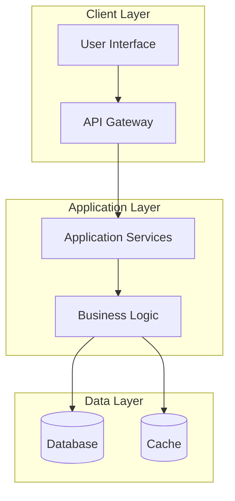
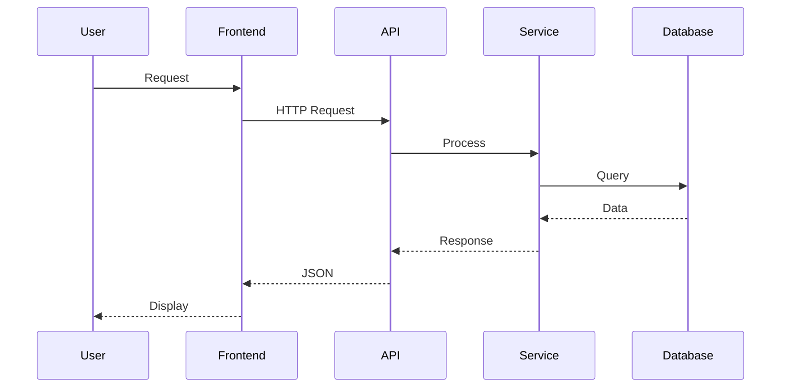

# {PROJECT_NAME} Architecture

**Status**: {STATUS} | **Last Updated**: {LAST_UPDATED} | **Version**: {VERSION}

## Quick Reference

### Tech Stack
- **Language**: {PRIMARY_LANGUAGE}
- **Framework**: {PRIMARY_FRAMEWORK}
- **Database**: {DATABASE_TYPE}
- **Testing**: {TEST_FRAMEWORK}
- **Deployment**: {DEPLOYMENT_PLATFORM}

### Key Decisions
- See [ADR Index](../05_ARCHITECTURAL_DECISIONS/README.md) for detailed decisions
- Current milestone: {CURRENT_MILESTONE}
- Architecture maturity: {ARCHITECTURE_MATURITY}

## 1. Project Context & Vision

### Purpose
{PROJECT_PURPOSE}

### Key Business Goals
{BUSINESS_GOALS}

### Success Metrics
{SUCCESS_METRICS}

## Architecture Discovery Checklist

> 💡 **Initialization Guide**: Use this checklist during project setup to ensure comprehensive architecture documentation.

### Tech Stack Detection (Auto-Analysis)
- [ ] **Primary Language**: {PRIMARY_LANGUAGE} - Detected from file extensions and package files
- [ ] **Framework**: {PRIMARY_FRAMEWORK} - Identified from dependencies and project structure
- [ ] **Database**: {DATABASE_TYPE} - Found in configuration files and dependencies
- [ ] **Testing Framework**: {TEST_FRAMEWORK} - Detected from test directories and dependencies
- [ ] **Build Tools**: {BUILD_TOOLS} - Identified from build configuration files
- [ ] **Package Manager**: {PACKAGE_MANAGER} - Detected from lock files and configurations

### Project Structure Analysis
- [ ] **Folder Organization**: {FOLDER_PATTERNS} - Mapped directory structure and patterns
- [ ] **Module Patterns**: {MODULE_ORGANIZATION} - Identified how code is organized into modules
- [ ] **Configuration Management**: {CONFIG_APPROACH} - Located and analyzed config files
- [ ] **Environment Setup**: {ENV_REQUIREMENTS} - Detected development environment requirements
- [ ] **Script Analysis**: {SCRIPT_INVENTORY} - Identified build, test, and deployment scripts

### Architectural Pattern Detection
- [ ] **Primary Architecture**: {ARCHITECTURE_PATTERN} - MVC, microservices, monolithic, etc.
- [ ] **Design Patterns**: {DESIGN_PATTERNS} - Singleton, Factory, Observer, etc.
- [ ] **Data Access**: {DATA_PATTERNS} - ORM, Repository, DAO, etc.
- [ ] **API Style**: {API_PATTERNS} - REST, GraphQL, RPC, etc.
- [ ] **Authentication**: {AUTH_PATTERNS} - JWT, OAuth, Session-based, etc.

## 2. System Architecture

### High-Level Overview
{SYSTEM_OVERVIEW}

### System Architecture Diagram


### Core Components
{CORE_COMPONENTS}

### Data Flow


{DATA_FLOW}

### Integration Points
{INTEGRATION_POINTS}

## 3. Development Architecture

### Project Structure
```
{PROJECT_STRUCTURE}
```

### Code Organization Patterns
- **Modules**: {MODULE_PATTERN}
- **Services**: {SERVICE_PATTERN}
- **Data Access**: {DATA_ACCESS_PATTERN}
- **Configuration**: {CONFIG_PATTERN}

### Development Workflow
- **Branching Strategy**: {BRANCHING_STRATEGY}
- **Testing Strategy**: {TESTING_STRATEGY}
- **Code Review Process**: {CODE_REVIEW_PROCESS}
- **CI/CD Pipeline**: {CICD_PIPELINE}

## 4. Technical Standards

### Coding Standards
- **Style Guide**: {STYLE_GUIDE}
- **Naming Conventions**: {NAMING_CONVENTIONS}
- **Documentation Standards**: {DOCUMENTATION_STANDARDS}

### Quality Gates
- **Code Coverage**: {CODE_COVERAGE_TARGET}%
- **Performance**: {PERFORMANCE_TARGETS}
- **Security**: {SECURITY_STANDARDS}

## 5. Testing Architecture

### Test Strategy
- **Unit Tests**: {UNIT_TEST_APPROACH}
- **Integration Tests**: {INTEGRATION_TEST_APPROACH}
- **E2E Tests**: {E2E_TEST_APPROACH}
- **Performance Tests**: {PERFORMANCE_TEST_APPROACH}

### Test Data Management
{TEST_DATA_STRATEGY}

## 6. Deployment & Infrastructure

### Environments
- **Development**: {DEV_ENVIRONMENT}
- **Staging**: {STAGING_ENVIRONMENT}
- **Production**: {PROD_ENVIRONMENT}

### Deployment Strategy
{DEPLOYMENT_STRATEGY}

### Monitoring & Observability
{MONITORING_STRATEGY}

## 7. Security & Compliance

### Security Measures
{SECURITY_MEASURES}

### Compliance Requirements
{COMPLIANCE_REQUIREMENTS}

### Data Protection
{DATA_PROTECTION_STRATEGY}

## 8. Performance & Scalability

### Performance Requirements
{PERFORMANCE_REQUIREMENTS}

### Scalability Strategy
{SCALABILITY_STRATEGY}

### Caching Strategy
{CACHING_STRATEGY}

## 9. Development Workflow Integration

### Simone Integration
- **Task Management**: How architecture supports task-based development
- **Sprint Planning**: How architecture influences sprint organization
- **Code Reviews**: Architecture compliance in reviews
- **Testing**: Architecture-driven testing approach

### Development Patterns
- **Feature Development**: {FEATURE_DEVELOPMENT_PATTERN}
- **Bug Fixes**: {BUG_FIX_PATTERN}
- **Refactoring**: {REFACTORING_PATTERN}

## 10. Evolution Strategy

### Architecture Versioning
- **Version**: {CURRENT_VERSION}
- **Change Log**: See [Architecture Changes](ARCHITECTURE_CHANGES.md)
- **Migration Strategy**: {MIGRATION_STRATEGY}

### Future Considerations
{FUTURE_ARCHITECTURE_CONSIDERATIONS}

### Technical Debt Management
{TECHNICAL_DEBT_STRATEGY}

## 11. Decision Context

### Key Architectural Decisions
- [ADR-001: {DECISION_TITLE}](../05_ARCHITECTURAL_DECISIONS/ADR001_{DECISION_NAME}.md)
- [ADR-002: {DECISION_TITLE}](../05_ARCHITECTURAL_DECISIONS/ADR002_{DECISION_NAME}.md)
- [ADR-003: {DECISION_TITLE}](../05_ARCHITECTURAL_DECISIONS/ADR003_{DECISION_NAME}.md)

### Trade-offs Made
{ARCHITECTURAL_TRADEOFFS}

### Constraints
{ARCHITECTURAL_CONSTRAINTS}

## 12. References & Resources

### Related Documents
- [Project Manifest](../00_PROJECT_MANIFEST.md)
- [Current Milestone](../02_REQUIREMENTS/{CURRENT_MILESTONE}/)
- [Long-term Vision](LONG_TERM_VISION.md)
- [API Documentation](API_DOCUMENTATION.md)

### External Resources
{EXTERNAL_RESOURCES}

### Team Contacts
{TEAM_CONTACTS}

---

## Quick Start Guide

### For New Developers
1. **Setup**: {SETUP_INSTRUCTIONS}
2. **First Task**: {FIRST_TASK_GUIDANCE}
3. **Development Flow**: {DEVELOPMENT_FLOW}

### For Code Reviews
- [ ] Follows established patterns
- [ ] Aligns with current milestone goals
- [ ] Includes appropriate tests
- [ ] Documents any architectural changes

### For Sprint Planning
- Architecture supports current milestone: {MILESTONE_SUPPORT}
- No architectural blockers: {ARCHITECTURAL_BLOCKERS}
- Performance considerations: {PERFORMANCE_CONSIDERATIONS}

---

**Template Version**: 3.0.0 (Unified with initialization checklist)  
**Framework Version**: 3.0.0  
**Last Updated**: 2025-01-14

**Note**: This architecture document is a living document that evolves with the project. Update it as architectural decisions are made and reference relevant ADRs for decision context.

**v3.0.0 Update**: This template now includes the complete architecture initialization checklist, eliminating the need for a separate checklist file.