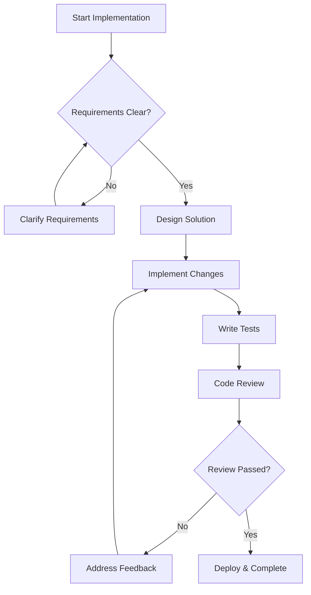
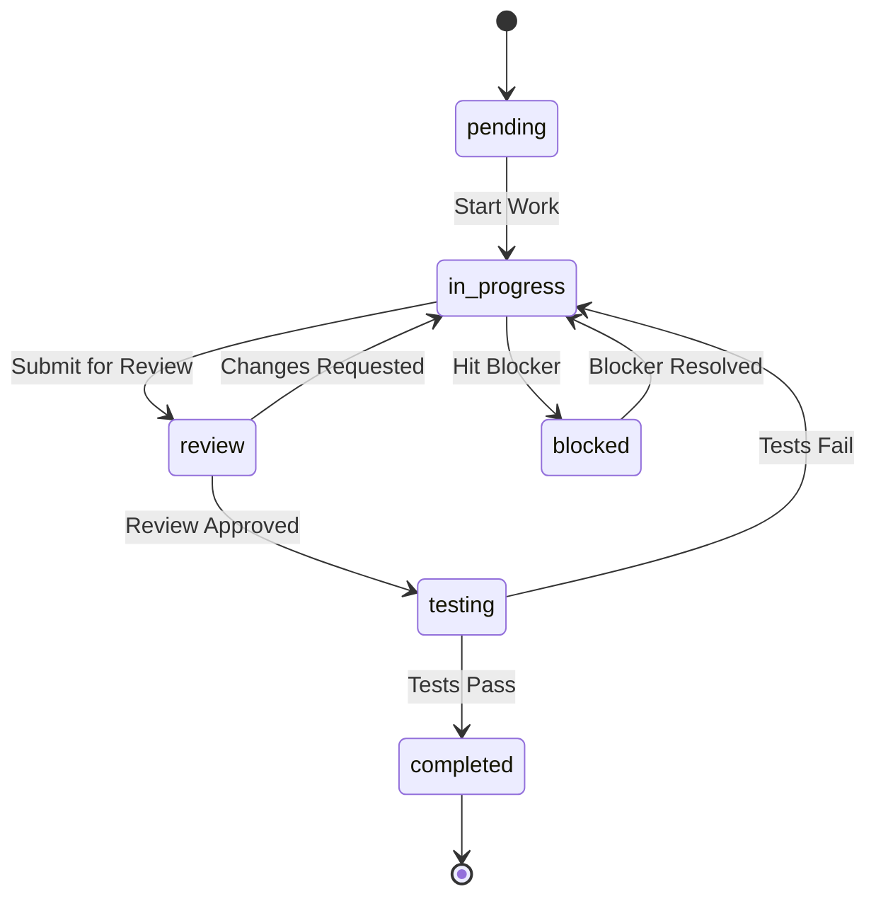

# {TASK_ID}: {TASK_TITLE}

**Type**: {TASK_TYPE} | **Status**: {STATUS} | **Priority**: {PRIORITY}
**Complexity**: {COMPLEXITY} | **Estimated**: {ESTIMATED_EFFORT}h | **Assignee**: {ASSIGNEE}

## Overview

### Description
{TASK_DESCRIPTION}

### Business Context
{BUSINESS_CONTEXT}

### Technical Context
{TECHNICAL_CONTEXT}

### Success Criteria
- [ ] {SUCCESS_CRITERIA_1}
- [ ] {SUCCESS_CRITERIA_2}
- [ ] {SUCCESS_CRITERIA_3}

## Requirements

### Functional Requirements
1. **{FUNCTIONAL_REQ_1_TITLE}**
   - {FUNCTIONAL_REQ_1_DESCRIPTION}
   - **Acceptance Criteria**: {FUNCTIONAL_REQ_1_AC}

2. **{FUNCTIONAL_REQ_2_TITLE}**
   - {FUNCTIONAL_REQ_2_DESCRIPTION}
   - **Acceptance Criteria**: {FUNCTIONAL_REQ_2_AC}

### Non-Functional Requirements
- **Performance**: {PERFORMANCE_REQUIREMENTS}
- **Security**: {SECURITY_REQUIREMENTS}
- **Usability**: {USABILITY_REQUIREMENTS}
- **Maintainability**: {MAINTAINABILITY_REQUIREMENTS}

### Acceptance Criteria
- [ ] {ACCEPTANCE_CRITERIA_1}
- [ ] {ACCEPTANCE_CRITERIA_2}
- [ ] {ACCEPTANCE_CRITERIA_3}
- [ ] {ACCEPTANCE_CRITERIA_4}
- [ ] {ACCEPTANCE_CRITERIA_5}

## Technical Implementation

### Architecture Impact
{ARCHITECTURE_IMPACT}

### Components Affected
- **{COMPONENT_1}**: {COMPONENT_1_CHANGES}
- **{COMPONENT_2}**: {COMPONENT_2_CHANGES}
- **{COMPONENT_3}**: {COMPONENT_3_CHANGES}

### Implementation Approach
{IMPLEMENTATION_APPROACH}

### Technical Design
{TECHNICAL_DESIGN}

### Implementation Flow

### Code Changes Required
1. **{CODE_CHANGE_1}**
   - **File**: {FILE_PATH_1}
   - **Type**: {CHANGE_TYPE_1}
   - **Description**: {CHANGE_DESCRIPTION_1}

2. **{CODE_CHANGE_2}**
   - **File**: {FILE_PATH_2}
   - **Type**: {CHANGE_TYPE_2}
   - **Description**: {CHANGE_DESCRIPTION_2}

### Database Changes
{DATABASE_CHANGES}

### API Changes
{API_CHANGES}

## Testing Strategy

### Test Plan
{TEST_PLAN}

### Unit Tests
- [ ] {UNIT_TEST_1}
- [ ] {UNIT_TEST_2}
- [ ] {UNIT_TEST_3}

### Integration Tests
- [ ] {INTEGRATION_TEST_1}
- [ ] {INTEGRATION_TEST_2}
- [ ] {INTEGRATION_TEST_3}

### E2E Tests
- [ ] {E2E_TEST_1}
- [ ] {E2E_TEST_2}

### Performance Tests
{PERFORMANCE_TEST_REQUIREMENTS}

### Security Tests
{SECURITY_TEST_REQUIREMENTS}

## Dependencies & Constraints

### Task Dependencies
- **Depends on**: {TASK_DEPENDENCIES}
- **Blocks**: {BLOCKING_TASKS}
- **Related**: {RELATED_TASKS}

### External Dependencies
- **Third-party Services**: {THIRD_PARTY_DEPENDENCIES}
- **Infrastructure**: {INFRASTRUCTURE_DEPENDENCIES}
- **Team Dependencies**: {TEAM_DEPENDENCIES}

### Constraints
- **Technical Constraints**: {TECHNICAL_CONSTRAINTS}
- **Business Constraints**: {BUSINESS_CONSTRAINTS}
- **Time Constraints**: {TIME_CONSTRAINTS}

## Risk Assessment

### Risk Level: {RISK_LEVEL}

### Identified Risks
1. **{RISK_1_TITLE}** (Probability: {RISK_1_PROBABILITY}, Impact: {RISK_1_IMPACT})
   - **Description**: {RISK_1_DESCRIPTION}
   - **Mitigation**: {RISK_1_MITIGATION}

2. **{RISK_2_TITLE}** (Probability: {RISK_2_PROBABILITY}, Impact: {RISK_2_IMPACT})
   - **Description**: {RISK_2_DESCRIPTION}
   - **Mitigation**: {RISK_2_MITIGATION}

### Contingency Plans
{CONTINGENCY_PLANS}

## Implementation Subtasks

### Phase 1: Preparation
- [ ] **{SUBTASK_1_1}** (Est: {SUBTASK_1_1_EFFORT}h)
  - **Description**: {SUBTASK_1_1_DESCRIPTION}
  - **Acceptance**: {SUBTASK_1_1_ACCEPTANCE}

- [ ] **{SUBTASK_1_2}** (Est: {SUBTASK_1_2_EFFORT}h)
  - **Description**: {SUBTASK_1_2_DESCRIPTION}
  - **Acceptance**: {SUBTASK_1_2_ACCEPTANCE}

### Phase 2: Core Implementation
- [ ] **{SUBTASK_2_1}** (Est: {SUBTASK_2_1_EFFORT}h)
  - **Description**: {SUBTASK_2_1_DESCRIPTION}
  - **Acceptance**: {SUBTASK_2_1_ACCEPTANCE}

- [ ] **{SUBTASK_2_2}** (Est: {SUBTASK_2_2_EFFORT}h)
  - **Description**: {SUBTASK_2_2_DESCRIPTION}
  - **Acceptance**: {SUBTASK_2_2_ACCEPTANCE}

### Phase 3: Testing & Integration
- [ ] **{SUBTASK_3_1}** (Est: {SUBTASK_3_1_EFFORT}h)
  - **Description**: {SUBTASK_3_1_DESCRIPTION}
  - **Acceptance**: {SUBTASK_3_1_ACCEPTANCE}

- [ ] **{SUBTASK_3_2}** (Est: {SUBTASK_3_2_EFFORT}h)
  - **Description**: {SUBTASK_3_2_DESCRIPTION}
  - **Acceptance**: {SUBTASK_3_2_ACCEPTANCE}

### Phase 4: Documentation & Cleanup
- [ ] **{SUBTASK_4_1}** (Est: {SUBTASK_4_1_EFFORT}h)
  - **Description**: {SUBTASK_4_1_DESCRIPTION}
  - **Acceptance**: {SUBTASK_4_1_ACCEPTANCE}

## Quality Checklist

### Code Quality
- [ ] Code follows established patterns and conventions
- [ ] Code is properly documented with comments
- [ ] No code duplication or copy-paste code
- [ ] Error handling is comprehensive and appropriate
- [ ] Performance considerations are addressed

### Testing Quality
- [ ] Unit tests cover all business logic
- [ ] Integration tests verify component interactions
- [ ] E2E tests cover user workflows
- [ ] Edge cases are tested
- [ ] Test coverage meets minimum requirements ({MIN_COVERAGE}%)

### Documentation Quality
- [ ] Code is self-documenting with clear naming
- [ ] Complex logic is explained with comments
- [ ] API changes are documented
- [ ] Architecture changes are documented
- [ ] User-facing changes are documented

### Security & Compliance
- [ ] Security best practices followed
- [ ] Input validation implemented
- [ ] Authentication/authorization verified
- [ ] Data privacy requirements met
- [ ] Compliance requirements satisfied

## Review & Approval

### Code Review Checklist
- [ ] **Architecture Alignment**: Changes align with project architecture
- [ ] **Code Quality**: Code meets quality standards
- [ ] **Performance**: No performance regressions
- [ ] **Security**: Security requirements satisfied
- [ ] **Testing**: Adequate test coverage
- [ ] **Documentation**: Appropriate documentation provided

### Approval Criteria
- [ ] **Technical Lead Approval**: {TECH_LEAD}
- [ ] **Product Owner Approval**: {PRODUCT_OWNER} (if required)
- [ ] **Security Review**: {SECURITY_REVIEWER} (if required)
- [ ] **Performance Review**: {PERFORMANCE_REVIEWER} (if required)

## Output Log

### Implementation Log
{IMPLEMENTATION_LOG_PLACEHOLDER}

### Decision Log
{DECISION_LOG_PLACEHOLDER}

### Issue Log
{ISSUE_LOG_PLACEHOLDER}

## Related Documents

### Requirements
- [Milestone PRD](../02_REQUIREMENTS/{MILESTONE_ID}/{MILESTONE_ID}_PRD.md)
- [Technical Specs](../02_REQUIREMENTS/{MILESTONE_ID}/{MILESTONE_ID}_SPECS.md)

### Architecture
- [Architecture Documentation](../01_PROJECT_DOCS/ARCHITECTURE.md)
- [Related ADRs](../05_ARCHITECTURAL_DECISIONS/)

### Project Context
- [Project Manifest](../00_PROJECT_MANIFEST.md)
- [Sprint Plan](../{SPRINT_ID}_sprint_meta.md)

## Post-Completion

### Retrospective Notes
{RETROSPECTIVE_NOTES_PLACEHOLDER}

### Lessons Learned
{LESSONS_LEARNED_PLACEHOLDER}

### Future Improvements
{FUTURE_IMPROVEMENTS_PLACEHOLDER}

---

## Task Metadata

### Creation Info
- **Created**: {CREATED_DATE}
- **Creator**: {CREATOR}
- **Template Version**: {TEMPLATE_VERSION}

### Progress Tracking
- **Last Updated**: {UPDATED_DATE}
- **Progress**: {PROGRESS_PERCENTAGE}%
- **Time Spent**: {ACTUAL_EFFORT}h / {ESTIMATED_EFFORT}h

### Task Status Workflow

### Quality Metrics
- **Complexity Score**: {COMPLEXITY_SCORE}
- **Risk Score**: {RISK_SCORE}
- **Business Value Score**: {BUSINESS_VALUE_SCORE}

---

**Status**: {STATUS} | **Last Updated**: {UPDATED_DATE} | **Next Action**: {NEXT_ACTION}