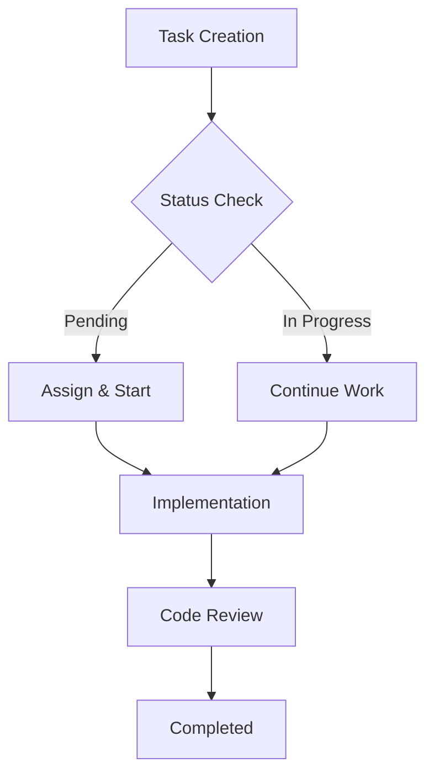

# CLAUDE.md - Simone Framework Structure Guide

## 🚨 CRITICAL: File Operation Rules
**MANDATORY READING**: All file operations MUST follow the rules in `.claude/CLAUDE_FILE_RULES.md`
- NEVER modify file paths or names from what the user specifies
- ALWAYS use exact paths as provided
- NO assumptions about "better" locations or names

## Overview
This is the root directory of the Simone framework structure. It contains all project documentation, requirements, sprints, and organizational files.

## Critical Files

### Project Manifest
**IMPORTANT**: The project manifest file MUST be named:
```
00_PROJECT_MANIFEST.md
```

**NOT**:
- ❌ `MANIFEST.md`
- ❌ `PROJECT_MANIFEST.md`
- ❌ `project_manifest.md`

The manifest is the central reference file that tracks:
- Project name and status
- Current milestone and sprint
- Project metadata
- Last updated timestamp

## Directory Structure
```
.simone/
├── 00_PROJECT_MANIFEST.md          # Central project reference (CORRECT NAME)
├── 01_PROJECT_DOCS/                # General project documentation
├── 02_REQUIREMENTS/                # Milestone-based requirements
├── 03_SPRINTS/                     # Sprint execution folders
├── 04_GENERAL_TASKS/               # Non-sprint tasks
├── 05_ARCHITECTURAL_DECISIONS/     # ADR documentation
├── 10_STATE_OF_PROJECT/            # Project review snapshots
└── 99_TEMPLATES/                   # Document templates
```

## Naming Conventions Summary

### Files
- **Project Manifest**: `00_PROJECT_MANIFEST.md`
- **Milestone Meta**: `M##_milestone_meta.md`
- **Sprint Meta**: `S##_M##_sprint_meta.md`
- **Task Files**: `TASK_##_*.md`
- **ADR Files**: `ADR_###_*.md`

### Folders
- **Milestones**: `M##_Milestone_Name/`
- **Sprints**: `S##_M##_Sprint_Name/`
- **State Snapshots**: `YYYY-MM-DD_HH-MM_snapshot/`

## Documentation Preferences

### Diagram Standards
This project prefers **Mermaid diagrams** for all visual representations. Use Mermaid whenever appropriate for:

- **Architecture Diagrams**: Use `graph` or `flowchart` for system architecture
- **Sequence Diagrams**: Use `sequenceDiagram` for API flows and interactions  
- **State Diagrams**: Use `stateDiagram-v2` for workflow and status transitions
- **Timeline Diagrams**: Use `timeline` for project milestones and sprints
- **Gantt Charts**: Use `gantt` for task scheduling and dependencies
- **Class Diagrams**: Use `classDiagram` for data models and relationships
- **Flowcharts**: Use `flowchart` for decision trees and process flows

**Example Integration:**


### When to Use Mermaid
- Complex system relationships need visualization
- Process flows with multiple decision points
- Timeline/milestone planning
- Architecture documentation
- API interaction flows
- State machine representations

## Important Notes for Claude Code

1. **Always create `00_PROJECT_MANIFEST.md`** when initializing a project
2. **Use the templates** from `99_TEMPLATES/` for consistency  
3. **Follow the naming conventions exactly** - they enable proper sorting and navigation
4. **Update the manifest** when creating milestones or sprints
5. **Use underscores** for spaces in folder and file names
6. **Use Mermaid diagrams** when visual representations would improve understanding

## Workflow Automation

### Claude Code Integration
- **Always use TodoWrite/TodoRead** for complex multi-step tasks
- **Batch tool calls** when possible for parallel execution
- **Use Agent tool** for keyword searches across large codebases
- **Commit workflow**: Use git status → git diff → commit with proper message format

### Smart Commands Integration
When creating Simone commands, ensure they:
- Auto-detect current context (milestone, sprint, task status)
- Validate dependencies before execution
- Update all related metadata atomically
- Log all changes for audit trail

## Quality Standards

### Documentation Quality Gates
- [ ] **Completeness**: All template sections filled appropriately
- [ ] **Clarity**: Technical details accessible to team members
- [ ] **Consistency**: Follows established patterns and naming
- [ ] **Currency**: Dates and status reflect actual state
- [ ] **Connectivity**: Proper cross-references between documents

### Code Integration Standards
- **Branch naming**: Must match task ID for traceability
- **Commit messages**: Reference task ID and use conventional format
- **PR titles**: Include milestone and sprint context
- **Review criteria**: Architecture alignment + Simone compliance

## Metadata Standards

### YAML Frontmatter Requirements
**Required fields for all documents:**
```yaml
# Core identification
id: "{DOCUMENT_ID}"
title: "{DOCUMENT_TITLE}"
type: "{DOCUMENT_TYPE}"
created_date: "{YYYY-MM-DD HH:MM}"
updated_date: "{YYYY-MM-DD HH:MM}"
status: "{STATUS}"

# Context linking
milestone_id: "{MILESTONE_ID}"
sprint_id: "{SPRINT_ID}" # if applicable
parent_doc: "{PARENT_DOC_ID}" # if applicable

# Tracking
version: "{SEMANTIC_VERSION}"
last_reviewer: "{REVIEWER_NAME}"
next_review_date: "{YYYY-MM-DD}"
```

### Status Taxonomies
**Universal Status Values:**
- `draft` → `review` → `approved` → `active` → `completed` → `archived`
- `blocked` (any status can transition to blocked)
- `deprecated` (for superseded documents)

**Priority Levels:** `low` | `medium` | `high` | `critical`
**Complexity Levels:** `simple` | `medium` | `complex` | `very_complex`
**Risk Levels:** `low` | `medium` | `high` | `critical`

## Cross-Reference Standards

### Link Patterns
- **Internal refs**: `[Document Title](../folder/document.md)`
- **Section refs**: `[Section Name](document.md#section-anchor)`
- **Task refs**: `TASK_##` (auto-linkable)
- **ADR refs**: `ADR_###` (auto-linkable)
- **Sprint refs**: `S##_M##` (auto-linkable)

### Dependency Tracking
- **Hard dependencies**: Must be completed before current item
- **Soft dependencies**: Helpful context but not blocking
- **Circular dependency detection**: Validate during creation
- **Impact analysis**: Track what depends on current item

## Common Initialization Mistakes
- Creating `MANIFEST.md` instead of `00_PROJECT_MANIFEST.md`
- Missing the leading zeros in numbered prefixes
- Using hyphens instead of underscores
- Creating files without using templates
- Not updating the manifest after structural changes
- **Forgetting YAML frontmatter** in new documents
- **Inconsistent status values** across related documents
- **Missing cross-references** to related work
- **Outdated timestamps** that don't reflect actual work

## Performance Optimization

### Claude Code Efficiency
- **Parallel tool execution**: Use single message with multiple tool calls
- **Context management**: Prefer Agent tool for exploratory searches
- **File reading strategy**: Batch read potentially useful files
- **Search optimization**: Use Glob → Grep → Read sequence for targeted searches

### Framework Efficiency
- **Template reuse**: Customize templates rather than creating from scratch
- **Metadata inheritance**: Child documents inherit parent context
- **Status propagation**: Parent status reflects child completion
- **Smart defaults**: Auto-populate predictable fields

## Integration Patterns

### MCP Server Integration
When MCP servers are available, leverage them for:
- **Sequential thinking**: Complex problem decomposition
- **Context persistence**: Cross-session state management  
- **Work history**: Pattern analysis and recommendations
- **External data**: Real-time information and validation

### Git Integration Best Practices
```bash
# Branch naming pattern
git checkout -b task/t##-s##-feature-name

# Commit message format
git commit -m "feat(t##): implement user authentication

- Add JWT token validation
- Update user model with roles
- Add integration tests

Refs: task-##-s##-user-authentication.md"
```

### CI/CD Integration
- **Pre-commit hooks**: Validate Simone metadata consistency
- **Build triggers**: Auto-update project status on deployments
- **Notification**: Slack/Teams updates on milestone completion
- **Metrics**: Track velocity and quality metrics

## Advanced Features

### Analytics & Reporting
- **Velocity tracking**: Historical task completion rates
- **Quality metrics**: Bug rates, review cycle times
- **Risk assessment**: Predictive analysis based on complexity
- **Resource utilization**: Team capacity vs. actual effort

### Automation Opportunities
- **Status sync**: Auto-update dependent tasks when blockers resolve
- **Template generation**: AI-assisted task breakdown from requirements
- **Review scheduling**: Calendar integration for review cycles
- **Notification workflows**: Smart alerts for approaching deadlines

### Scalability Considerations
- **Multi-team coordination**: Cross-team dependency management
- **Portfolio management**: Multi-project milestone alignment
- **Resource planning**: Capacity management across projects
- **Knowledge management**: Searchable decision and pattern library

## Troubleshooting Guide

### Common Issues & Solutions

**"Task status out of sync"**
- ✅ Run status validation across all task files
- ✅ Check manifest for conflicting information
- ✅ Verify dependency chain integrity

**"Branch naming conflicts"**
- ✅ Use timestamp suffix: `task/t##-s##-name-20250110-1430`
- ✅ Check for stale branches from previous iterations
- ✅ Coordinate with team on parallel work

**"Template fields missing"**
- ✅ Compare against template version in 99_TEMPLATES/
- ✅ Update template_version field after fixes
- ✅ Run completeness validation checklist

**"Cross-references broken"**
- ✅ Use relative paths consistently
- ✅ Update references after file renames
- ✅ Validate links during document reviews

### Validation Commands
```bash
# Validate all Simone metadata
find .simone -name "*.md" -exec grep -l "status:" {} \;

# Check for naming convention compliance  
find .simone -name "*" | grep -v "[0-9][0-9]_"

# Verify cross-reference integrity
grep -r "\[.*\](.*\.md)" .simone/ | grep -v "http"
```

---

## Quick Start Checklist

### New Project Setup
- [ ] Create `.simone/00_PROJECT_MANIFEST.md`
- [ ] Copy templates from `99_TEMPLATES/`
- [ ] Set up first milestone in `02_REQUIREMENTS/`
- [ ] Initialize first sprint in `03_SPRINTS/`
- [ ] Configure git hooks for metadata validation
- [ ] Set up team access and permissions

### New Team Member Onboarding  
- [ ] Review this CLAUDE.md file completely
- [ ] Understand current milestone and sprint
- [ ] Set up development environment per architecture docs
- [ ] Complete first assigned task using do_task.md command
- [ ] Participate in code review process
- [ ] Contribute to retrospective documentation

---

*Simone Framework v2.1 | Enhanced with Claude Code optimization | Mermaid visualization | Advanced metadata management*