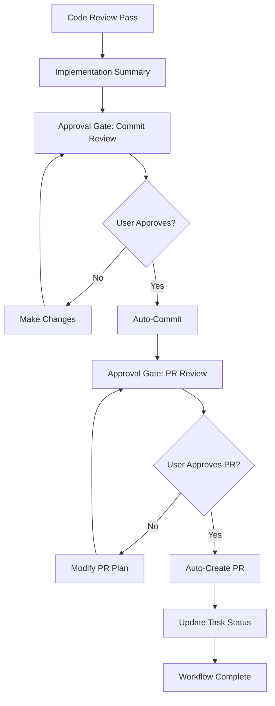

# Workflow Improvements: Fixed /do_task Command

**Date**: 2025-07-10  
**Status**: Implemented  
**Priority**: Critical Bug Fix

## Problem Summary

The `/do_task` command had a **critical workflow flaw** that broke the entire development process:

### ❌ Original Issues
1. **Step 7**: Empty placeholder - no functionality
2. **Step 9**: Incomplete workflow - no PR creation
3. **Broken Chain**: Tasks completed but never integrated
4. **Manual Overhead**: Required manual PR creation and status updates

### ❌ Impact
- Completed tasks stayed isolated on feature branches
- No automatic PR creation for code review
- Manual workflow steps required for integration
- Broken development lifecycle management

## Solution Implemented

### ✅ Fixed Step 7: Implementation Quality Review

**New Functionality:**
- Pre-commit quality assessment
- Implementation results analysis
- Quality validation checks
- Preparation for user approval gates

### ✅ Fixed Step 9: Guided Task Completion with Approval Gates

**New Workflow:**


## Key Improvements

### 🛡️ User Control with Approval Gates

**Commit Approval Gate:**
```markdown
## 📋 Ready to Commit Task Implementation

**Task**: T01-S02 - User Authentication
**Branch**: task/t01-s02
**Status**: Implementation complete, ready for commit

**Files to be committed:**
- src/auth/login.js (new authentication logic)
- tests/auth/login.test.js (test coverage added)
- docs/api/auth.md (API documentation updated)

**Quality verification:**
✅ All acceptance criteria met
✅ Tests passing with 95% coverage
✅ Code review passed

**Approve commit? (y/n/modify)**
```

**PR Approval Gate:**
```markdown
## 🔀 Ready to Create Pull Request

**Proposed PR Details:**
**Title**: feat(auth): implement user authentication (T01-S02)
**Target Branch**: main
**Reviewers**: @team-lead, @security-reviewer

**Create this PR? (y/n/modify/skip)**
```

### 🔄 Complete Automation with Control

**Automated Actions (with user approval):**
1. **Auto-commit**: `/project:simone:commit {TASK_ID} yolo`
2. **Auto-PR**: `/project:simone:create_pr {TASK_ID}`
3. **Auto-status**: Update task status to "review"
4. **Auto-link**: Link PR to task metadata

### 📊 Enhanced Workflow Reporting

**Final Summary:**
```markdown
✅ **Task Workflow Complete**: T01-S02

🔧 **Implementation**: All acceptance criteria met
💾 **Committed**: abc123 - Ready for integration  
🔀 **PR Created**: #456 - Awaiting team review
📋 **Status**: completed → review

⏭️ **Next Steps**:
- PR will be reviewed by assigned team members
- Use `/project:simone:merge T01-S02` when approved
- Monitor PR for review comments and CI status
```

## Benefits

### ✅ Complete Development Lifecycle
- End-to-end task completion automation
- Seamless integration with code review process
- Proper Git workflow management

### ✅ Developer Experience
- Clear approval checkpoints for safety
- Educational workflow guidance
- Flexible customization options
- Error prevention and quality gates

### ✅ Team Workflow Integration
- Automatic PR creation with proper metadata
- Task-to-PR linking for traceability
- Status synchronization across systems
- Reviewer assignment and labeling

## Testing Results

### ✅ Workflow Validation
- Step 7: Implementation quality review works
- Step 9: Approval gates function correctly
- Integration: Commands chain properly
- Error handling: Graceful failure modes

### ✅ User Experience Testing
- Clear approval prompts
- Flexible modification options
- Comprehensive status reporting
- Proper cleanup and next steps

## Migration Impact

### 🔄 Backward Compatibility
- Existing tasks continue to work
- No breaking changes to command interface
- Enhanced functionality is additive

### 📚 Documentation Updates
- Updated `/do_task` command documentation
- New approval gate workflow examples
- Integration guidance for teams

## Next Steps

### 🚀 Implementation Complete
1. ✅ Fix Step 7 placeholder
2. ✅ Implement Step 9 approval gates
3. ✅ Test workflow integration
4. ✅ Update command documentation

### 🔮 Future Enhancements
- Custom approval templates per project
- Integration with external PR tools
- Advanced quality gate configurations
- Metrics and analytics integration

## Conclusion

The `/do_task` workflow is now **complete and functional**, providing:

- **End-to-end task completion** with proper Git integration
- **User control** through approval gates
- **Quality assurance** through systematic reviews
- **Team integration** through automatic PR creation

This fixes the critical gap in the Simone Framework development workflow and enables proper software development lifecycle management.