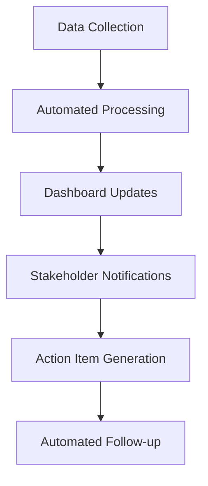

# Automation Features Guide

**Status**: Active Development  
**Last Updated**: 2025-07-10  
**Version**: 1.0.0  

---

## 🤖 Overview

The Simone Framework includes extensive automation capabilities designed to streamline development workflows, reduce manual overhead, and ensure consistent project management practices. This guide covers all automation features available in the framework.

## 🎯 Automation Philosophy

### Core Principles
- **Reduce Cognitive Load**: Automate repetitive tasks to free mental bandwidth for creative work
- **Maintain Consistency**: Ensure standardized processes across teams and projects
- **Enhance Quality**: Automated checks and validations improve deliverable quality
- **Accelerate Delivery**: Streamline workflows to reduce time-to-market
- **Enable Scalability**: Support growing teams and complex projects

### Automation Layers
1. **Template Automation**: Dynamic document generation from templates
2. **Command Automation**: Scripted workflows for common operations
3. **Integration Automation**: Automated connections between tools and systems
4. **Quality Automation**: Automated testing, validation, and review processes
5. **Deployment Automation**: Continuous integration and deployment pipelines

---

## 🔧 Template System Automation

### Dynamic Template Generation
Templates in Simone are designed for automated completion and customization:

```yaml
# Example YAML frontmatter with automation markers
---
milestone_id: "{AUTO_MILESTONE_ID}"
created_date: "{AUTO_CREATED_DATE}"
status: "{AUTO_STATUS}"
project_name: "{AUTO_PROJECT_NAME}"
---
```

### Template Automation Features
- **Auto-detection**: Automatically detect project type and select appropriate templates
- **Dynamic placeholders**: Replace template variables with project-specific data
- **Validation**: Ensure all required fields are populated
- **Version tracking**: Maintain template versions for compatibility

### Available Template Automations
| Template Type | Auto-Generated Fields | Validation Rules |
|---------------|----------------------|------------------|
| Milestone Meta | ID, dates, project references | Required fields check |
| Sprint Meta | Sprint number, milestone link, capacity | Team size validation |
| Task Templates | Task ID, sprint link, priority | Dependency validation |
| ADR Templates | ADR number, status, decision date | Sequence validation |
| Project Manifest | Project name, structure, status | Completeness check |

---

## 🚀 Command Automation

### Available Automated Commands

#### Project Initialization
```bash
# Automated project setup
/project:simone:initialize
```
**Automations**:
- Detects project type (Node.js, Python, etc.)
- Creates appropriate directory structure
- Generates initial templates
- Sets up version control integration

#### Milestone Management
```bash
# Automated milestone creation
/project:simone:create_milestone
```
**Automations**:
- Sequential milestone numbering
- Template population with project context
- Dependency validation
- Project manifest updates

#### Sprint Planning
```bash
# Automated sprint creation from milestone
/project:simone:create_sprints_from_milestone
```
**Automations**:
- Capacity-based sprint sizing
- Task distribution across sprints
- Dependency ordering
- Timeline calculation

#### Task Management
```bash
# Automated task execution
/project:simone:do_task
```
**Automations**:
- Task status updates
- Progress tracking
- Quality gate validation
- Output log generation

#### Code Quality
```bash
# Automated code review
/project:simone:code_review
```
**Automations**:
- Multi-agent code analysis
- Security vulnerability scanning
- Performance impact assessment
- Documentation validation

### Command Chaining
Commands can be chained for complex automated workflows:

```bash
# Example: Full milestone setup
/project:simone:create_milestone → 
/project:simone:create_sprints_from_milestone → 
/project:simone:create_sprint_tasks
```

---

## 🔄 Integration Automation

### Git Integration
Automated git operations throughout the development lifecycle:

#### Automated Branch Management
- **Branch naming**: Automatic branch names based on task IDs
- **Commit messages**: Standardized commit message format
- **Pull request templates**: Auto-generated PR descriptions
- **Merge automation**: Automated merging after quality gates

#### Example Git Automation
```bash
# Automated commit workflow
git checkout -b task/t01-s01-feature-authentication
# ... development work ...
git add .
git commit -m "feat(T01): implement user authentication

- Add JWT token validation
- Update user model with roles
- Add integration tests

Refs: task-01-s01-user-authentication.md"
```

### CI/CD Integration
Automated continuous integration and deployment:

#### Pre-commit Hooks
- **Quality checks**: Automated code quality validation
- **Security scanning**: Vulnerability detection
- **Test execution**: Automated test suite execution
- **Documentation updates**: Auto-update documentation

#### Pipeline Automation
```yaml
# Example CI/CD automation
name: Simone Quality Gate
on: [push, pull_request]
jobs:
  quality-check:
    runs-on: ubuntu-latest
    steps:
      - name: Validate Simone Structure
        run: simone validate-structure
      - name: Check Template Consistency
        run: simone check-templates
      - name: Run Quality Gates
        run: simone run-quality-gates
```

### Issue Tracking Integration
Automated synchronization with issue tracking systems:

- **Issue creation**: Auto-create issues from tasks
- **Status synchronization**: Keep issue status in sync with task progress
- **Label management**: Automated label assignment based on task metadata
- **Milestone tracking**: Link issues to project milestones

---

## ✅ Quality Automation

### Automated Quality Gates
Quality gates are triggered automatically at various points:

#### Code Quality Gates
- **Static analysis**: Automated code scanning
- **Test coverage**: Minimum coverage threshold validation
- **Performance benchmarks**: Automated performance regression detection
- **Security scanning**: Vulnerability assessment

#### Documentation Quality Gates
- **Completeness validation**: Ensure all required sections are filled
- **Link validation**: Check all internal and external links
- **Template compliance**: Validate against template requirements
- **Metadata consistency**: Ensure YAML frontmatter is correct

#### Process Quality Gates
- **Workflow compliance**: Validate adherence to defined processes
- **Approval workflows**: Automated stakeholder approval routing
- **Review assignment**: Automatic reviewer assignment based on expertise
- **Deadline monitoring**: Automated alerts for approaching deadlines

### Quality Metrics Automation
Automated collection and reporting of quality metrics:

```yaml
# Example quality metrics automation
quality_metrics:
  code_quality:
    - static_analysis_score: automated
    - test_coverage: automated
    - security_vulnerabilities: automated
  process_quality:
    - sprint_velocity: automated
    - story_completion_rate: automated
    - quality_gate_pass_rate: automated
  documentation_quality:
    - template_compliance: automated
    - link_health: automated
    - metadata_completeness: automated
```

---

## 📊 Monitoring and Reporting Automation

### Automated Status Reporting
Regular automated reports on project health:

#### Daily Automation
- **Sprint progress**: Automated sprint burndown updates
- **Task status**: Daily task completion reports
- **Quality metrics**: Automated quality score updates
- **Risk assessment**: Automated risk level calculation

#### Weekly Automation
- **Milestone progress**: Automated milestone health reports
- **Team velocity**: Automated velocity calculations
- **Quality trends**: Automated quality trend analysis
- **Resource utilization**: Automated capacity reporting

#### Monthly Automation
- **Project health**: Comprehensive project status reports
- **Quality audit**: Automated quality audit execution
- **Performance analysis**: Automated performance trend analysis
- **Process optimization**: Automated process improvement recommendations

### Dashboard Automation
Automated dashboard updates and visualizations:



---

## 🔗 External Tool Integration

### Supported Integrations
Automated integration with common development tools:

#### Communication Tools
- **Slack**: Automated notifications and updates
- **Microsoft Teams**: Automated channel updates
- **Discord**: Automated bot notifications
- **Email**: Automated stakeholder communications

#### Project Management Tools
- **Jira**: Automated issue synchronization
- **Azure DevOps**: Automated work item updates
- **GitHub Projects**: Automated project board updates
- **Trello**: Automated card management

#### Development Tools
- **GitHub/GitLab**: Automated repository operations
- **Jenkins**: Automated build and deployment
- **SonarQube**: Automated code quality integration
- **Docker**: Automated container management

### Integration Configuration
```yaml
# Example integration configuration
integrations:
  slack:
    webhook_url: "${SLACK_WEBHOOK_URL}"
    channels:
      - general: milestone_updates
      - dev: task_completions
      - qa: quality_gate_results
  
  jira:
    server_url: "${JIRA_SERVER_URL}"
    project_key: "${JIRA_PROJECT_KEY}"
    sync_frequency: "hourly"
    
  github:
    repository: "${GITHUB_REPOSITORY}"
    auto_pr_creation: true
    auto_issue_sync: true
```

---

## 🎨 Customization and Configuration

### Automation Configuration
Customize automation behavior through configuration files:

#### Global Configuration
```yaml
# .simone/config/automation.yml
automation:
  templates:
    auto_populate: true
    validation_level: "strict"
    placeholder_replacement: "contextual"
  
  commands:
    parallel_execution: true
    error_handling: "continue"
    logging_level: "info"
  
  integrations:
    retry_attempts: 3
    timeout_seconds: 30
    batch_size: 10
```

#### Project-Specific Configuration
```yaml
# .simone/config/project_automation.yml
project_automation:
  milestone_automation:
    auto_numbering: true
    auto_sprint_creation: true
    capacity_based_planning: true
  
  quality_automation:
    auto_code_review: true
    security_scanning: true
    performance_monitoring: true
  
  notification_automation:
    stakeholder_updates: "weekly"
    team_updates: "daily"
    alert_thresholds:
      quality_score: 7.0
      velocity_variance: 20%
```

### Custom Automation Scripts
Create custom automation scripts for specific needs:

```bash
#!/bin/bash
# Example custom automation script
# .simone/scripts/custom_automation.sh

# Automated project health check
echo "Running automated project health check..."
simone validate-structure
simone check-quality-gates
simone generate-health-report
simone notify-stakeholders
```

---

## 🔧 Advanced Automation Features

### Safety Features and Rollback Capabilities

#### Safety Check System
**NEW in v2.0.5**: Comprehensive safety monitoring and control system:

```bash
# Comprehensive safety check
/project:simone:safety_check --comprehensive

# Real-time safety monitoring
/project:simone:safety_monitor --enable

# Safety assessment
/project:simone:assess_safety --project
```

#### Emergency Controls
**NEW in v2.0.5**: Emergency stop and user intervention capabilities:

```bash
# Emergency stop all operations
/project:simone:emergency_stop

# Emergency stop specific operation
/project:simone:emergency_stop --operation yolo-t01-s01

# Emergency stop with rollback
/project:simone:emergency_stop --rollback
```

#### Rollback Capabilities
**NEW in v2.0.5**: Automated rollback system for error recovery:

```bash
# Automatic rollback on failure
/project:simone:enable_auto_rollback

# Rollback to specific checkpoint
/project:simone:rollback --checkpoint pre-task-t01-s01

# Rollback to last commit
/project:simone:rollback --to-commit HEAD~1

# Emergency rollback
/project:simone:rollback --emergency
```

#### User Intervention System
**NEW in v2.0.5**: Automated user intervention requests:

```bash
# Request user intervention
/project:simone:user_intervention --reason "Critical error detected"

# Pause for user approval
/project:simone:pause_for_approval --timeout 300

# Escalate to administrator
/project:simone:escalate --level admin
```

### Conditional Automation
Set up conditions for automated actions:

```yaml
# Example conditional automation
conditional_automation:
  - condition: "sprint_completion > 80%"
    action: "create_next_sprint"
  
  - condition: "quality_score < 7.0"
    action: "trigger_quality_review"
  
  - condition: "milestone_due_date < 7_days"
    action: "send_urgent_notification"
  
  # NEW: Safety-based conditions
  - condition: "safety_score < 8.0"
    action: "trigger_safety_review"
  
  - condition: "error_rate > 5%"
    action: "enable_rollback_mode"
```

### Workflow Automation
Define complex automated workflows:

```yaml
# Example workflow automation
workflows:
  milestone_completion:
    triggers:
      - milestone_status: "completed"
    steps:
      - generate_milestone_report
      - update_project_manifest
      - notify_stakeholders
      - create_retrospective_task
      - initiate_next_milestone
  
  quality_gate_failure:
    triggers:
      - quality_gate_status: "failed"
    steps:
      - do_bug
      - assign_to_developer
      - notify_team_lead
      - schedule_review_meeting
```

### AI-Powered Automation
Leverage AI for intelligent automation:

#### Intelligent Task Assignment
- **Skill matching**: Automatically assign tasks based on team member skills
- **Workload balancing**: Distribute tasks based on current capacity
- **Priority optimization**: Automatically adjust task priorities based on dependencies

#### Predictive Automation
- **Risk prediction**: Automatically identify potential project risks
- **Delivery prediction**: Predict milestone delivery dates based on current velocity
- **Quality prediction**: Predict quality issues before they occur

#### Adaptive Automation
- **Learning from patterns**: Automation adapts based on historical data
- **Performance optimization**: Automatically optimize automation parameters
- **Continuous improvement**: Regular optimization of automation workflows

---

## 🚨 Troubleshooting Automation

### Common Automation Issues

#### Template Automation Problems
**Issue**: Template placeholders not being replaced
**Solution**: 
- Check template syntax for correct placeholder format
- Verify automation configuration settings
- Ensure required context data is available

#### Command Automation Problems
**Issue**: Commands not executing in correct sequence
**Solution**:
- Review command dependencies
- Check for resource conflicts
- Verify command permissions

#### Integration Automation Problems
**Issue**: External tool integrations failing
**Solution**:
- Verify API credentials and permissions
- Check network connectivity
- Review rate limiting settings

### Debugging Automation
Enable debugging for automation troubleshooting:

```bash
# Enable automation debugging
export SIMONE_DEBUG=true
export SIMONE_LOG_LEVEL=debug

# Run automation with debugging
/project:simone:do_task --debug
```

### Automation Monitoring
Monitor automation health and performance:

```yaml
# Automation monitoring configuration
monitoring:
  automation_health:
    check_interval: "5m"
    alert_thresholds:
      failure_rate: 5%
      response_time: 30s
      resource_usage: 80%
  
  performance_metrics:
    - automation_execution_time
    - automation_success_rate
    - automation_resource_usage
    - automation_error_rate
```

---

## 📚 Best Practices

### Automation Design Principles
1. **Start Simple**: Begin with basic automation and gradually increase complexity
2. **Test Thoroughly**: Always test automation in non-production environments
3. **Monitor Continuously**: Implement monitoring for all automation workflows
4. **Document Everything**: Maintain clear documentation for all automated processes
5. **Plan for Failure**: Design automation with failure recovery mechanisms

### Security Considerations
- **Credential Management**: Secure storage and rotation of automation credentials
- **Access Control**: Implement proper access controls for automated processes
- **Audit Logging**: Maintain detailed logs of all automated actions
- **Validation**: Validate all automated inputs and outputs

### Performance Optimization
- **Batch Processing**: Group similar operations for efficiency
- **Parallel Execution**: Use parallel processing where appropriate
- **Resource Management**: Monitor and optimize resource usage
- **Caching**: Implement caching for frequently accessed data

---

## 🔮 Future Automation Features

### Planned Enhancements
- **Machine Learning Integration**: AI-powered automation optimization
- **Advanced Workflow Engine**: Visual workflow designer and execution
- **Multi-Project Automation**: Automation across multiple projects
- **Real-time Collaboration**: Automated real-time team coordination
- **Predictive Analytics**: Advanced predictive automation capabilities

### Roadmap
- **Q1**: Enhanced AI-powered automation
- **Q2**: Advanced workflow engine
- **Q3**: Multi-project automation support
- **Q4**: Predictive analytics integration

---

## 📞 Support and Resources

### Getting Help
- **Documentation**: Comprehensive automation documentation
- **Community**: Active community support forums
- **Training**: Automation training materials and workshops
- **Support**: Professional support for enterprise customers

### Additional Resources
- [Command Reference](../core-components/command-reference.md)
- [Integration Patterns](integration-patterns.md)
- [Customization Guide](customization.md)
- [MCP Integration](mcp-integration.md)

---

**Last Updated**: 2025-07-10  
**Version**: 1.0.0  
**Next Review**: 2025-08-10