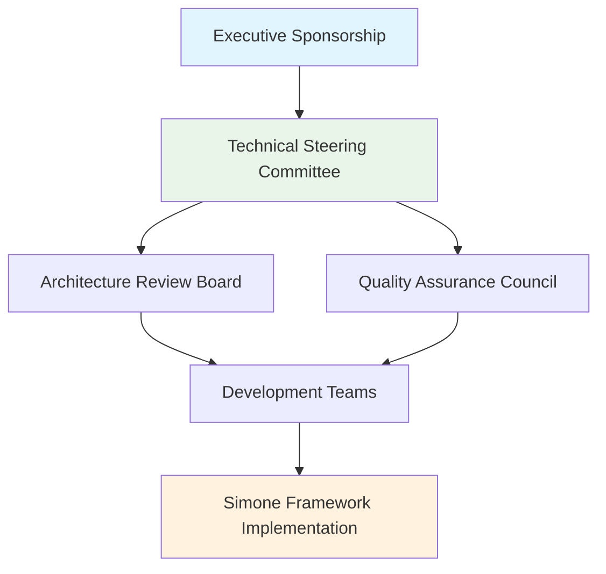
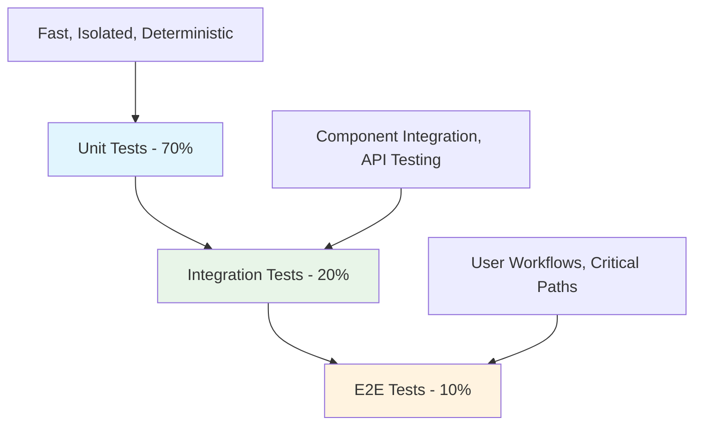
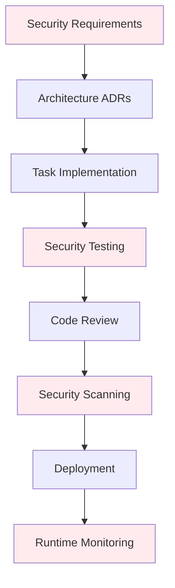

# Enterprise Standards

**Purpose**: Governance, compliance, and quality standards for enterprise Simone deployments  
**Audience**: Technical Leaders, Engineering Managers, Compliance Officers  
**Version**: 2.1.0

## Overview

Enterprise deployment of the Simone framework requires adherence to organizational governance, compliance requirements, and quality standards. This guide establishes enterprise-grade practices for teams building mission-critical software.

## Governance Framework

### Project Governance Structure



#### Executive Sponsorship
- **Strategic alignment** with business objectives
- **Resource allocation** for framework adoption
- **Change management** support across organization
- **Success metrics** definition and tracking

#### Technical Steering Committee
- **Framework standardization** across teams and projects
- **Tool integration** and technology stack decisions
- **Training and onboarding** program oversight
- **Performance monitoring** and optimization

#### Architecture Review Board (ARB)
- **ADR review and approval** for architectural decisions
- **Cross-project alignment** and reusability assessment
- **Technical debt management** strategies
- **Security and compliance** architecture validation

#### Quality Assurance Council
- **Quality standards** definition and enforcement
- **Testing strategies** and automation requirements
- **Code review processes** and approval criteria
- **Continuous improvement** initiatives

### Enterprise Deployment Standards

#### Multi-Team Coordination
```yaml
# Enterprise team structure
teams:
  platform_team:
    responsibility: "Framework maintenance and evolution"
    artifacts: ["Core templates", "Command enhancements", "Integration tools"]
    
  product_teams:
    responsibility: "Feature development using framework"
    artifacts: ["Product features", "Domain-specific templates", "User documentation"]
    
  infrastructure_team:
    responsibility: "CI/CD integration and deployment automation"
    artifacts: ["Pipeline templates", "Deployment scripts", "Monitoring setup"]
    
  qa_team:
    responsibility: "Quality standards and testing frameworks"
    artifacts: ["Test strategies", "Quality gates", "Compliance validation"]
```

#### Cross-Project Standards
- **Naming conventions** standardized across all projects
- **Template customization** approved by Technical Steering Committee
- **Quality metrics** consistent measurement and reporting
- **Integration patterns** reusable across teams and projects

## Compliance and Regulatory Standards

### Compliance Framework Integration

#### SOX Compliance (Sarbanes-Oxley)
- **Change management** with complete audit trails
- **Segregation of duties** in review and approval processes
- **Documentation retention** for regulatory requirements
- **Access controls** and approval workflows

**Simone Implementation**:
```yaml
# SOX compliance metadata
sox_compliance:
  change_approver: "{APPROVER_ID}"
  business_justification: "{BUSINESS_REASON}"
  risk_assessment: "{RISK_LEVEL}"
  audit_trail: "{AUDIT_REFERENCE}"
```

#### GDPR Compliance (General Data Protection Regulation)
- **Data handling documentation** in task templates
- **Privacy impact assessments** for data-related features
- **Data retention policies** in architectural decisions
- **Consent management** tracking and documentation

**Template Integration**:
```yaml
# GDPR considerations
gdpr_impact:
  data_processing: "{DATA_TYPE}"
  legal_basis: "{LEGAL_BASIS}"
  retention_period: "{RETENTION}"
  privacy_impact: "{IMPACT_LEVEL}"
```

#### HIPAA Compliance (Health Insurance Portability and Accountability Act)
- **PHI handling procedures** documented in security ADRs
- **Access logging** and audit trail requirements
- **Encryption standards** for data at rest and in transit
- **Incident response procedures** integrated into bug templates

#### ISO 27001 (Information Security Management)
- **Security risk assessments** in all task templates
- **Information asset classification** in project documentation
- **Security controls** validation in quality checklists
- **Continuous monitoring** integrated into project reviews

### Regulatory Documentation Requirements

#### FDA Validation (Software as Medical Device)
- **Design controls** documented through ADRs and specifications
- **Risk management** (ISO 14971) integrated into task templates
- **Configuration management** through git integration and versioning
- **Change control** with complete traceability from requirements to deployment

#### Financial Services Compliance
- **Model validation** for algorithmic trading and risk management
- **Operational risk management** in architectural decisions
- **Business continuity planning** in disaster recovery ADRs
- **Regulatory reporting** automated through template metadata

## Quality Standards Framework

### Code Quality Standards

#### Code Quality Metrics
```yaml
# Enterprise quality thresholds
quality_standards:
  code_coverage:
    minimum: 80%
    target: 90%
    critical_paths: 95%
    
  technical_debt:
    ratio: < 5%
    remediation_sla: "30 days for high priority"
    
  security_compliance:
    vulnerability_scan: "Required for all releases"
    penetration_testing: "Annual for production systems"
    
  performance_standards:
    response_time: "< 200ms for API endpoints"
    throughput: "> 1000 requests/second"
    availability: "99.9% uptime SLA"
```

#### Automated Quality Gates
1. **Pre-commit hooks** - Static analysis and formatting validation
2. **CI/CD pipeline gates** - Automated testing and security scanning
3. **Code review requirements** - Mandatory peer review with quality checklist
4. **Architecture compliance** - ADR alignment verification
5. **Security scanning** - SAST, DAST, and dependency vulnerability checks

### Testing Standards

#### Testing Pyramid Implementation


#### Testing Requirements by Project Type
| Project Type | Unit Tests | Integration Tests | E2E Tests | Performance Tests | Security Tests |
|--------------|------------|-------------------|-----------|-------------------|----------------|
| **Web Applications** | 80% coverage | API + Database | Critical user flows | Load testing | OWASP Top 10 |
| **APIs/Services** | 85% coverage | Service integration | Contract testing | Stress testing | API security |
| **Data Pipelines** | 75% coverage | End-to-end data flow | Data quality | Volume testing | Data privacy |
| **Mobile Apps** | 70% coverage | Backend integration | User journeys | Device testing | Mobile security |

### Documentation Standards

#### Documentation Quality Framework
1. **Completeness** - All template sections appropriately filled
2. **Currency** - Documentation updated with code changes
3. **Clarity** - Technical details accessible to team members
4. **Consistency** - Follows established patterns and conventions
5. **Connectivity** - Proper cross-references between documents

#### Documentation Audit Process
```yaml
# Monthly documentation audit
documentation_audit:
  frequency: "Monthly"
  coverage_areas:
    - project_manifests: "Health and status accuracy"
    - task_documentation: "Implementation guidance completeness"
    - architecture_decisions: "ADR currency and relevance"
    - quality_reviews: "Metrics accuracy and actionability"
  
  quality_metrics:
    template_compliance: "> 95%"
    cross_reference_integrity: "100%"
    metadata_completeness: "> 90%"
    stakeholder_satisfaction: "> 4.0/5.0"
```

## Risk Management Framework

### Enterprise Risk Categories

#### Technical Risks
- **Architecture debt** - Systematic technical debt tracking and remediation
- **Security vulnerabilities** - Proactive security assessment and mitigation
- **Performance degradation** - Continuous performance monitoring and optimization
- **Integration failures** - Comprehensive integration testing and monitoring

#### Process Risks
- **Framework adoption** - Change management and training effectiveness
- **Quality degradation** - Quality metrics monitoring and intervention
- **Compliance violations** - Regular compliance audits and remediation
- **Knowledge management** - Documentation quality and knowledge transfer

#### Business Risks
- **Project delivery** - Schedule and scope management with early warning systems
- **Resource allocation** - Capacity planning and skill development
- **Stakeholder satisfaction** - Regular feedback collection and action planning
- **Market responsiveness** - Agile delivery and customer feedback integration

### Risk Mitigation Strategies

#### Proactive Risk Management
1. **Risk registers** maintained in project manifests with regular updates
2. **Early warning indicators** through automated health monitoring
3. **Mitigation plans** documented and regularly tested
4. **Escalation procedures** with clear ownership and timelines
5. **Lessons learned** integration into future risk assessments

#### Risk Monitoring and Reporting
```yaml
# Risk dashboard metrics
risk_monitoring:
  technical_health:
    code_quality_score: "{SCORE}/10"
    security_posture: "{SCORE}/10"
    performance_index: "{SCORE}/10"
    
  process_health:
    adoption_rate: "{PERCENTAGE}"
    quality_compliance: "{PERCENTAGE}"
    documentation_quality: "{SCORE}/10"
    
  business_health:
    delivery_predictability: "{PERCENTAGE}"
    stakeholder_satisfaction: "{SCORE}/5"
    team_velocity: "{TASKS_PER_SPRINT}"
```

## Security Standards

### Security Architecture Framework

#### Security by Design Principles
1. **Least privilege** - Minimal access rights for all components
2. **Defense in depth** - Multiple layers of security controls
3. **Fail secure** - System failures default to secure state
4. **Zero trust** - Verify all access requests regardless of source
5. **Privacy by design** - Data protection built into system architecture

#### Security Integration Points


### Security Documentation Requirements

#### Security ADRs (Architecture Decision Records)
- **Threat modeling** for all architectural decisions
- **Security control selection** with rationale and implementation guidance
- **Compliance mapping** to relevant security frameworks
- **Risk assessment** with likelihood and impact analysis

#### Security Task Templates
```yaml
# Security-enhanced task metadata
security_considerations:
  threat_model_required: true
  security_review_required: true
  penetration_testing: false
  compliance_validation: ["SOX", "GDPR"]
  security_controls: ["authentication", "authorization", "encryption"]
```

## Performance Standards

### Performance Monitoring Framework

#### Performance Metrics Hierarchy
1. **Infrastructure metrics** - CPU, memory, network, storage utilization
2. **Application metrics** - Response time, throughput, error rates
3. **Business metrics** - User satisfaction, conversion rates, revenue impact
4. **User experience metrics** - Page load time, time to interactive, Core Web Vitals

#### Performance Budgets
```yaml
# Performance budget enforcement
performance_budgets:
  web_applications:
    first_contentful_paint: "< 1.5s"
    largest_contentful_paint: "< 2.5s"
    cumulative_layout_shift: "< 0.1"
    first_input_delay: "< 100ms"
    
  api_services:
    response_time_p95: "< 200ms"
    response_time_p99: "< 500ms"
    throughput: "> 1000 rps"
    error_rate: "< 0.1%"
    
  data_processing:
    batch_processing_time: "< 4 hours"
    real_time_latency: "< 10ms"
    data_quality_score: "> 99.9%"
```

### Performance Integration

#### Task-Level Performance Considerations
- **Performance requirements** documented in all relevant tasks
- **Performance testing** required for performance-impacting changes
- **Performance review** included in code review checklists
- **Performance monitoring** setup included in deployment tasks

#### Architecture-Level Performance Planning
- **Capacity planning** documented in architecture ADRs
- **Scalability strategies** planned and documented
- **Performance optimization** opportunities identified and prioritized
- **Performance regression** prevention through automated testing

## Continuous Improvement Framework

### Improvement Process

#### Regular Assessment Cycles
1. **Monthly** - Team retrospectives and process improvements
2. **Quarterly** - Quality metrics review and standard updates
3. **Semi-annually** - Framework effectiveness assessment
4. **Annually** - Enterprise standards comprehensive review

#### Feedback Integration
- **Developer feedback** on framework usability and effectiveness
- **Management feedback** on delivery predictability and quality
- **Customer feedback** on product quality and reliability
- **Compliance feedback** on audit findings and recommendations

### Metrics and KPIs

#### Enterprise Success Metrics
```yaml
# Enterprise KPI dashboard
enterprise_kpis:
  delivery_metrics:
    predictability: "> 85% on-time delivery"
    quality: "< 2% defect rate in production"
    velocity: "15% year-over-year improvement"
    
  process_metrics:
    framework_adoption: "> 90% team adoption"
    documentation_quality: "> 4.0/5.0 rating"
    compliance_score: "100% compliance audits passed"
    
  business_metrics:
    time_to_market: "25% reduction"
    customer_satisfaction: "> 4.5/5.0"
    cost_efficiency: "20% development cost reduction"
```

## Implementation Roadmap

### Phase 1: Foundation (Months 1-3)
- ✅ **Framework standardization** across teams
- ✅ **Quality standards** definition and tooling setup
- ✅ **Training programs** for teams and leadership
- ✅ **Pilot projects** with selected teams

### Phase 2: Expansion (Months 4-9)
- ✅ **Organization-wide rollout** with change management
- ✅ **Compliance integration** with regulatory requirements
- ✅ **Advanced automation** and tooling integration
- ✅ **Performance optimization** and monitoring setup

### Phase 3: Optimization (Months 10-12)
- ✅ **Continuous improvement** process establishment
- ✅ **Advanced features** adoption (YOLO mode, parallel execution)
- ✅ **Cross-organizational** knowledge sharing and best practices
- ✅ **ROI measurement** and business case validation

---

**Next Steps**: Review [Team Collaboration](./team-collaboration.md) for multi-team coordination patterns, or explore [Quality Management](./quality-management.md) for detailed quality processes.