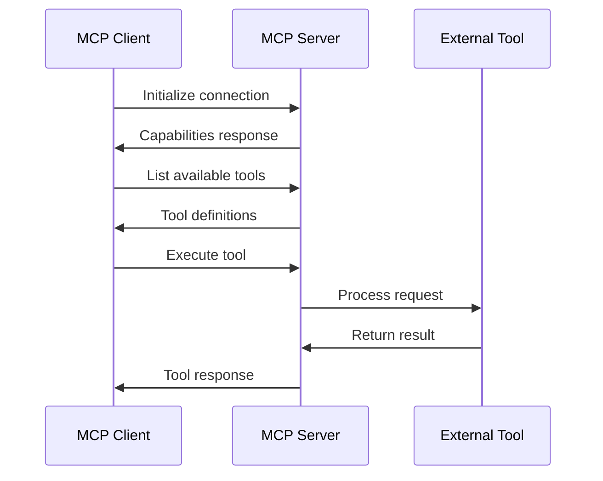

# MCP Integration Guide

**Last Updated**: 2025-07-10  
**Version**: 2.0.3  
**Framework**: Simone Framework

## Overview

The Model Context Protocol (MCP) enables seamless integration between AI models and external tools, data sources, and services. This guide covers how to integrate MCP servers with the Simone Framework to enhance development workflows with AI-powered capabilities.

## What is MCP?

MCP (Model Context Protocol) is a protocol that allows AI assistants like Claude to interact with external systems through a standardized interface. It enables:

- **Tool Integration**: Execute commands and scripts
- **Data Access**: Query databases and APIs
- **File Operations**: Read and modify files
- **Service Orchestration**: Coordinate multiple services

### Key Benefits

1. **Extensibility**: Add new capabilities without modifying core systems
2. **Standardization**: Consistent interface across different tools
3. **Security**: Controlled access with permission management
4. **Scalability**: Distribute workload across multiple servers

## MCP Architecture

### Core Components

```yaml
mcp_architecture:
  client:
    description: "AI model or application using MCP"
    responsibilities:
      - Send requests to servers
      - Handle responses
      - Manage connections
      
  server:
    description: "Service providing tools and resources"
    responsibilities:
      - Expose tools and functions
      - Process requests
      - Return structured responses
      
  transport:
    description: "Communication layer"
    options:
      - stdio: "Standard input/output"
      - http: "HTTP/HTTPS endpoints"
      - websocket: "Real-time bidirectional"
      
  protocol:
    description: "Message format and flow"
    features:
      - JSON-RPC 2.0 based
      - Async request/response
      - Error handling
```

### Message Flow



## Setting Up MCP with Simone

### Installation

```bash
# Install MCP SDK
npm install @modelcontextprotocol/sdk

# Install Simone MCP server
git clone https://github.com/simone-framework/mcp-server
cd mcp-server
npm install

# Configure Claude Code
claude-code --configure-mcp
```

### Basic Configuration

```json
// .claude/mcp-config.json
{
  "servers": {
    "simone": {
      "command": "node",
      "args": ["./mcp-server/index.js"],
      "env": {
        "SIMONE_PROJECT_ROOT": "${workspaceFolder}",
        "SIMONE_CONFIG": "${workspaceFolder}/.simone/config.yml"
      }
    },
    "database": {
      "command": "python",
      "args": ["./mcp-servers/database-server.py"],
      "env": {
        "DATABASE_URL": "${env:DATABASE_URL}"
      }
    }
  }
}
```

## Creating MCP Servers

### Basic Server Structure

```javascript
// mcp-server/index.js
import { Server } from '@modelcontextprotocol/sdk/server/index.js';
import { StdioServerTransport } from '@modelcontextprotocol/sdk/server/stdio.js';

class SimoneMCPServer {
  constructor() {
    this.server = new Server({
      name: 'simone-mcp-server',
      version: '1.0.0',
    }, {
      capabilities: {
        tools: {},
        resources: {},
      },
    });
    
    this.setupTools();
    this.setupResources();
  }
  
  setupTools() {
    // Register tool: Create task
    this.server.setRequestHandler('tools/list', async () => ({
      tools: [
        {
          name: 'create_task',
          description: 'Create a new task in Simone',
          inputSchema: {
            type: 'object',
            properties: {
              title: { type: 'string' },
              description: { type: 'string' },
              priority: { 
                type: 'string',
                enum: ['low', 'medium', 'high', 'critical']
              },
              assignee: { type: 'string' },
            },
            required: ['title', 'description'],
          },
        },
        {
          name: 'run_quality_check',
          description: 'Run quality checks on code',
          inputSchema: {
            type: 'object',
            properties: {
              target: { type: 'string' },
              checks: {
                type: 'array',
                items: {
                  type: 'string',
                  enum: ['lint', 'test', 'security', 'coverage']
                }
              },
            },
            required: ['target'],
          },
        },
      ],
    }));
    
    // Handle tool execution
    this.server.setRequestHandler('tools/call', async (request) => {
      const { name, arguments: args } = request.params;
      
      switch (name) {
        case 'create_task':
          return await this.createTask(args);
          
        case 'run_quality_check':
          return await this.runQualityCheck(args);
          
        default:
          throw new Error(`Unknown tool: ${name}`);
      }
    });
  }
  
  async createTask(args) {
    const { title, description, priority = 'medium', assignee } = args;
    
    // Create task using Simone Framework
    const task = await simone.createTask({
      title,
      description,
      priority,
      assignee,
      createdBy: 'mcp-integration',
    });
    
    return {
      content: [
        {
          type: 'text',
          text: `Task created: ${task.id} - ${task.title}`,
        },
      ],
    };
  }
  
  async runQualityCheck(args) {
    const { target, checks = ['lint', 'test'] } = args;
    const results = {};
    
    for (const check of checks) {
      results[check] = await simone.runCheck(check, target);
    }
    
    return {
      content: [
        {
          type: 'text',
          text: JSON.stringify(results, null, 2),
        },
      ],
    };
  }
  
  setupResources() {
    // Register resources
    this.server.setRequestHandler('resources/list', async () => ({
      resources: [
        {
          uri: 'simone://tasks/active',
          name: 'Active Tasks',
          description: 'List of currently active tasks',
          mimeType: 'application/json',
        },
        {
          uri: 'simone://metrics/quality',
          name: 'Quality Metrics',
          description: 'Current quality metrics',
          mimeType: 'application/json',
        },
      ],
    }));
    
    // Handle resource reads
    this.server.setRequestHandler('resources/read', async (request) => {
      const { uri } = request.params;
      
      if (uri === 'simone://tasks/active') {
        const tasks = await simone.getActiveTasks();
        return {
          contents: [
            {
              uri,
              mimeType: 'application/json',
              text: JSON.stringify(tasks, null, 2),
            },
          ],
        };
      }
      
      if (uri === 'simone://metrics/quality') {
        const metrics = await simone.getQualityMetrics();
        return {
          contents: [
            {
              uri,
              mimeType: 'application/json',
              text: JSON.stringify(metrics, null, 2),
            },
          ],
        };
      }
      
      throw new Error(`Unknown resource: ${uri}`);
    });
  }
  
  async run() {
    const transport = new StdioServerTransport();
    await this.server.connect(transport);
    console.error('Simone MCP server running');
  }
}

// Start server
const server = new SimoneMCPServer();
server.run().catch(console.error);
```

### Advanced Server Features

```javascript
// Advanced MCP server with prompts and notifications
class AdvancedSimoneMCPServer extends SimoneMCPServer {
  constructor() {
    super();
    this.setupPrompts();
    this.setupNotifications();
  }
  
  setupPrompts() {
    // Register prompts for guided workflows
    this.server.setRequestHandler('prompts/list', async () => ({
      prompts: [
        {
          name: 'sprint_planning',
          description: 'Guide through sprint planning process',
          arguments: [
            {
              name: 'sprint_number',
              description: 'Sprint number',
              required: true,
            },
          ],
        },
        {
          name: 'code_review',
          description: 'Perform comprehensive code review',
          arguments: [
            {
              name: 'pr_number',
              description: 'Pull request number',
              required: true,
            },
          ],
        },
      ],
    }));
    
    this.server.setRequestHandler('prompts/get', async (request) => {
      const { name, arguments: args } = request.params;
      
      if (name === 'sprint_planning') {
        return {
          messages: [
            {
              role: 'user',
              content: {
                type: 'text',
                text: this.getSprintPlanningPrompt(args.sprint_number),
              },
            },
          ],
        };
      }
      
      if (name === 'code_review') {
        return {
          messages: [
            {
              role: 'user',
              content: {
                type: 'text',
                text: this.getCodeReviewPrompt(args.pr_number),
              },
            },
          ],
        };
      }
    });
  }
  
  getSprintPlanningPrompt(sprintNumber) {
    return `
      Let's plan Sprint ${sprintNumber} using the Simone Framework.
      
      Please help me:
      1. Review the backlog and select high-priority items
      2. Estimate effort for each selected item
      3. Check team capacity and availability
      4. Create sprint goals and success criteria
      5. Assign tasks to team members
      6. Set up sprint tracking and monitoring
      
      Current backlog items are available at simone://backlog/items
      Team capacity is available at simone://team/capacity
    `;
  }
  
  setupNotifications() {
    // Send notifications for important events
    this.eventEmitter.on('task:completed', async (task) => {
      await this.server.notification({
        method: 'notifications/task_completed',
        params: {
          task_id: task.id,
          title: task.title,
          completed_by: task.assignee,
        },
      });
    });
    
    this.eventEmitter.on('quality:degraded', async (metrics) => {
      await this.server.notification({
        method: 'notifications/quality_alert',
        params: {
          metric: metrics.name,
          current_value: metrics.value,
          threshold: metrics.threshold,
          severity: 'high',
        },
      });
    });
  }
}
```

## MCP Tools for Simone

### Project Management Tools

```javascript
// Task management tools
const taskManagementTools = [
  {
    name: 'create_milestone',
    description: 'Create a new project milestone',
    inputSchema: {
      type: 'object',
      properties: {
        title: { type: 'string' },
        description: { type: 'string' },
        target_date: { type: 'string', format: 'date' },
        objectives: {
          type: 'array',
          items: { type: 'string' }
        },
      },
      required: ['title', 'target_date'],
    },
    handler: async (args) => {
      const milestone = await simone.milestones.create({
        ...args,
        status: 'active',
        created_at: new Date(),
      });
      
      return {
        success: true,
        milestone_id: milestone.id,
        message: `Milestone "${milestone.title}" created successfully`,
      };
    },
  },
  
  {
    name: 'update_task_status',
    description: 'Update the status of a task',
    inputSchema: {
      type: 'object',
      properties: {
        task_id: { type: 'string' },
        status: {
          type: 'string',
          enum: ['todo', 'in_progress', 'review', 'done', 'blocked']
        },
        comment: { type: 'string' },
      },
      required: ['task_id', 'status'],
    },
    handler: async (args) => {
      const task = await simone.tasks.updateStatus(
        args.task_id,
        args.status,
        {
          comment: args.comment,
          updated_by: 'mcp-integration',
        }
      );
      
      return {
        success: true,
        task,
        message: `Task ${task.id} status updated to ${args.status}`,
      };
    },
  },
  
  {
    name: 'generate_sprint_report',
    description: 'Generate a comprehensive sprint report',
    inputSchema: {
      type: 'object',
      properties: {
        sprint_id: { type: 'string' },
        include_metrics: { type: 'boolean', default: true },
        include_retrospective: { type: 'boolean', default: true },
      },
      required: ['sprint_id'],
    },
    handler: async (args) => {
      const report = await simone.reports.generateSprintReport({
        sprint_id: args.sprint_id,
        include: {
          metrics: args.include_metrics,
          retrospective: args.include_retrospective,
          velocity: true,
          burndown: true,
        },
      });
      
      return {
        success: true,
        report,
        export_formats: ['pdf', 'html', 'markdown'],
      };
    },
  },
];
```

### Quality Assurance Tools

```javascript
// Quality and testing tools
const qualityTools = [
  {
    name: 'run_test_suite',
    description: 'Execute test suite with coverage',
    inputSchema: {
      type: 'object',
      properties: {
        suite: {
          type: 'string',
          enum: ['unit', 'integration', 'e2e', 'all']
        },
        coverage: { type: 'boolean', default: true },
        parallel: { type: 'boolean', default: true },
      },
      required: ['suite'],
    },
    handler: async (args) => {
      const results = await simone.testing.runSuite({
        suite: args.suite,
        options: {
          coverage: args.coverage,
          parallel: args.parallel,
          reporters: ['json', 'html'],
        },
      });
      
      return {
        success: results.failed === 0,
        summary: {
          total: results.total,
          passed: results.passed,
          failed: results.failed,
          skipped: results.skipped,
          coverage: results.coverage,
        },
        duration: results.duration,
        report_url: results.reportUrl,
      };
    },
  },
  
  {
    name: 'security_scan',
    description: 'Run security vulnerability scan',
    inputSchema: {
      type: 'object',
      properties: {
        target: { type: 'string' },
        scan_type: {
          type: 'array',
          items: {
            type: 'string',
            enum: ['dependencies', 'code', 'secrets', 'config']
          }
        },
        severity_threshold: {
          type: 'string',
          enum: ['low', 'medium', 'high', 'critical'],
          default: 'medium'
        },
      },
      required: ['target'],
    },
    handler: async (args) => {
      const scan = await simone.security.scan({
        target: args.target,
        types: args.scan_type || ['dependencies', 'code'],
        threshold: args.severity_threshold,
      });
      
      return {
        success: scan.criticalCount === 0,
        vulnerabilities: {
          critical: scan.critical,
          high: scan.high,
          medium: scan.medium,
          low: scan.low,
        },
        recommendations: scan.recommendations,
        report_id: scan.reportId,
      };
    },
  },
];
```

### DevOps Tools

```javascript
// DevOps and deployment tools
const devopsTools = [
  {
    name: 'deploy_environment',
    description: 'Deploy to specified environment',
    inputSchema: {
      type: 'object',
      properties: {
        environment: {
          type: 'string',
          enum: ['development', 'staging', 'production']
        },
        version: { type: 'string' },
        strategy: {
          type: 'string',
          enum: ['rolling', 'blue-green', 'canary'],
          default: 'rolling'
        },
        dry_run: { type: 'boolean', default: false },
      },
      required: ['environment', 'version'],
    },
    handler: async (args) => {
      const deployment = await simone.deployment.deploy({
        environment: args.environment,
        version: args.version,
        strategy: args.strategy,
        dryRun: args.dry_run,
        notifications: ['slack', 'email'],
      });
      
      if (args.dry_run) {
        return {
          success: true,
          message: 'Dry run completed',
          changes: deployment.plannedChanges,
        };
      }
      
      return {
        success: deployment.status === 'success',
        deployment_id: deployment.id,
        url: deployment.url,
        duration: deployment.duration,
        rollback_command: deployment.rollbackCommand,
      };
    },
  },
  
  {
    name: 'scale_service',
    description: 'Scale service instances',
    inputSchema: {
      type: 'object',
      properties: {
        service: { type: 'string' },
        replicas: { type: 'integer', minimum: 0 },
        environment: {
          type: 'string',
          enum: ['development', 'staging', 'production']
        },
      },
      required: ['service', 'replicas', 'environment'],
    },
    handler: async (args) => {
      const scaling = await simone.infrastructure.scale({
        service: args.service,
        targetReplicas: args.replicas,
        environment: args.environment,
      });
      
      return {
        success: true,
        service: args.service,
        previous_replicas: scaling.previousReplicas,
        current_replicas: scaling.currentReplicas,
        status: scaling.status,
      };
    },
  },
];
```

## MCP Resources

### Dynamic Resource Providers

```javascript
// Resource provider for project data
class SimoneResourceProvider {
  constructor(simone) {
    this.simone = simone;
  }
  
  async listResources() {
    const resources = [];
    
    // Active sprints
    const sprints = await this.simone.sprints.getActive();
    sprints.forEach(sprint => {
      resources.push({
        uri: `simone://sprints/${sprint.id}`,
        name: `Sprint ${sprint.number}`,
        description: `Sprint running from ${sprint.startDate} to ${sprint.endDate}`,
        mimeType: 'application/json',
      });
    });
    
    // Recent tasks
    const tasks = await this.simone.tasks.getRecent({ limit: 50 });
    resources.push({
      uri: 'simone://tasks/recent',
      name: 'Recent Tasks',
      description: 'Last 50 tasks created or modified',
      mimeType: 'application/json',
    });
    
    // Quality metrics
    resources.push({
      uri: 'simone://metrics/quality/current',
      name: 'Current Quality Metrics',
      description: 'Real-time quality metrics',
      mimeType: 'application/json',
    });
    
    // Team members
    resources.push({
      uri: 'simone://team/members',
      name: 'Team Members',
      description: 'Current team members and roles',
      mimeType: 'application/json',
    });
    
    return resources;
  }
  
  async readResource(uri) {
    const parsed = new URL(uri);
    const path = parsed.pathname.split('/').filter(Boolean);
    
    switch (path[0]) {
      case 'sprints':
        return this.readSprint(path[1]);
        
      case 'tasks':
        return this.readTasks(path[1]);
        
      case 'metrics':
        return this.readMetrics(path.slice(1));
        
      case 'team':
        return this.readTeam(path[1]);
        
      default:
        throw new Error(`Unknown resource type: ${path[0]}`);
    }
  }
  
  async readSprint(sprintId) {
    const sprint = await this.simone.sprints.get(sprintId);
    const tasks = await this.simone.tasks.getBySprint(sprintId);
    const burndown = await this.simone.metrics.getBurndown(sprintId);
    
    return {
      uri: `simone://sprints/${sprintId}`,
      mimeType: 'application/json',
      text: JSON.stringify({
        sprint,
        tasks,
        metrics: {
          burndown,
          velocity: sprint.velocity,
          completion: sprint.completionPercentage,
        },
      }, null, 2),
    };
  }
  
  async readMetrics(path) {
    if (path[0] === 'quality' && path[1] === 'current') {
      const metrics = await this.simone.metrics.getQuality();
      
      return {
        uri: 'simone://metrics/quality/current',
        mimeType: 'application/json',
        text: JSON.stringify({
          timestamp: new Date().toISOString(),
          metrics: {
            coverage: metrics.testCoverage,
            build_success_rate: metrics.buildSuccessRate,
            code_quality_score: metrics.codeQualityScore,
            security_score: metrics.securityScore,
            performance_index: metrics.performanceIndex,
          },
          trends: metrics.trends,
        }, null, 2),
      };
    }
  }
}
```

### Resource Subscriptions

```javascript
// Real-time resource updates
class SimoneResourceSubscriptions {
  constructor(server, simone) {
    this.server = server;
    this.simone = simone;
    this.subscriptions = new Map();
    
    this.setupSubscriptions();
  }
  
  setupSubscriptions() {
    // Subscribe to task updates
    this.simone.events.on('task:updated', async (task) => {
      const subscribers = this.subscriptions.get('simone://tasks/updates');
      if (subscribers) {
        await this.notifySubscribers(subscribers, {
          type: 'task_updated',
          task,
          timestamp: new Date().toISOString(),
        });
      }
    });
    
    // Subscribe to quality metric changes
    this.simone.events.on('metrics:quality:changed', async (metrics) => {
      const subscribers = this.subscriptions.get('simone://metrics/quality/updates');
      if (subscribers) {
        await this.notifySubscribers(subscribers, {
          type: 'quality_metrics_changed',
          metrics,
          timestamp: new Date().toISOString(),
        });
      }
    });
    
    // Subscribe to deployment events
    this.simone.events.on('deployment:status', async (deployment) => {
      const subscribers = this.subscriptions.get('simone://deployments/updates');
      if (subscribers) {
        await this.notifySubscribers(subscribers, {
          type: 'deployment_status',
          deployment,
          timestamp: new Date().toISOString(),
        });
      }
    });
  }
  
  async subscribe(resourceUri, subscriberId) {
    if (!this.subscriptions.has(resourceUri)) {
      this.subscriptions.set(resourceUri, new Set());
    }
    
    this.subscriptions.get(resourceUri).add(subscriberId);
    
    // Send initial state
    const initialData = await this.getResourceData(resourceUri);
    await this.server.notification({
      method: 'resources/updated',
      params: {
        uri: resourceUri,
        data: initialData,
      },
    });
  }
  
  async unsubscribe(resourceUri, subscriberId) {
    const subscribers = this.subscriptions.get(resourceUri);
    if (subscribers) {
      subscribers.delete(subscriberId);
      if (subscribers.size === 0) {
        this.subscriptions.delete(resourceUri);
      }
    }
  }
  
  async notifySubscribers(subscribers, data) {
    for (const subscriberId of subscribers) {
      await this.server.notification({
        method: 'resources/updated',
        params: {
          subscriber_id: subscriberId,
          data,
        },
      });
    }
  }
}
```

## Advanced MCP Patterns

### Multi-Model Orchestration

```javascript
// Orchestrate multiple AI models for complex tasks
class MultiModelOrchestrator {
  constructor(simone) {
    this.simone = simone;
    this.models = new Map();
  }
  
  registerModel(name, config) {
    this.models.set(name, {
      endpoint: config.endpoint,
      capabilities: config.capabilities,
      specialization: config.specialization,
    });
  }
  
  async orchestrateCodeReview(pullRequest) {
    const tasks = [];
    
    // Security analysis with specialized model
    tasks.push(
      this.delegateToModel('security-analyzer', {
        task: 'analyze_security',
        code: pullRequest.changes,
        context: pullRequest.description,
      })
    );
    
    // Performance analysis
    tasks.push(
      this.delegateToModel('performance-expert', {
        task: 'analyze_performance',
        code: pullRequest.changes,
        baseline: await this.simone.metrics.getPerformanceBaseline(),
      })
    );
    
    // Architecture review
    tasks.push(
      this.delegateToModel('architecture-reviewer', {
        task: 'review_architecture',
        code: pullRequest.changes,
        patterns: await this.simone.architecture.getPatterns(),
      })
    );
    
    // Test coverage analysis
    tasks.push(
      this.delegateToModel('test-specialist', {
        task: 'analyze_test_coverage',
        code: pullRequest.changes,
        existing_tests: pullRequest.tests,
      })
    );
    
    const results = await Promise.all(tasks);
    
    return this.synthesizeResults(results);
  }
  
  async delegateToModel(modelName, request) {
    const model = this.models.get(modelName);
    if (!model) {
      throw new Error(`Model ${modelName} not registered`);
    }
    
    // Send request to specialized model
    const response = await fetch(model.endpoint, {
      method: 'POST',
      headers: {
        'Content-Type': 'application/json',
        'Authorization': `Bearer ${process.env.MODEL_API_KEY}`,
      },
      body: JSON.stringify(request),
    });
    
    return response.json();
  }
  
  synthesizeResults(results) {
    const review = {
      overall_score: this.calculateOverallScore(results),
      security: results[0],
      performance: results[1],
      architecture: results[2],
      testing: results[3],
      recommendations: this.generateRecommendations(results),
      action_required: this.determineActionRequired(results),
    };
    
    return review;
  }
}
```

### Context Management

```javascript
// Manage context across multiple MCP interactions
class MCPContextManager {
  constructor(maxTokens = 100000) {
    this.maxTokens = maxTokens;
    this.contexts = new Map();
  }
  
  async createContext(sessionId, initialData = {}) {
    const context = {
      id: sessionId,
      created: new Date(),
      lastAccessed: new Date(),
      data: initialData,
      history: [],
      tokens: 0,
    };
    
    this.contexts.set(sessionId, context);
    return context;
  }
  
  async addToContext(sessionId, type, content) {
    const context = this.contexts.get(sessionId);
    if (!context) {
      throw new Error(`Context ${sessionId} not found`);
    }
    
    const entry = {
      type,
      content,
      timestamp: new Date(),
      tokens: this.estimateTokens(content),
    };
    
    context.history.push(entry);
    context.tokens += entry.tokens;
    context.lastAccessed = new Date();
    
    // Manage context window
    if (context.tokens > this.maxTokens) {
      await this.pruneContext(context);
    }
    
    return context;
  }
  
  async pruneContext(context) {
    // Intelligent pruning based on relevance and recency
    const importantTypes = ['error', 'decision', 'milestone'];
    
    // Keep important entries
    const important = context.history.filter(
      entry => importantTypes.includes(entry.type)
    );
    
    // Keep recent entries
    const recent = context.history.slice(-20);
    
    // Combine and deduplicate
    const kept = [...new Set([...important, ...recent])];
    
    // Summarize pruned content
    const pruned = context.history.filter(entry => !kept.includes(entry));
    if (pruned.length > 0) {
      const summary = await this.summarizeEntries(pruned);
      kept.unshift({
        type: 'summary',
        content: summary,
        timestamp: new Date(),
        tokens: this.estimateTokens(summary),
      });
    }
    
    context.history = kept;
    context.tokens = kept.reduce((sum, entry) => sum + entry.tokens, 0);
  }
  
  async getRelevantContext(sessionId, query) {
    const context = this.contexts.get(sessionId);
    if (!context) return null;
    
    // Use embeddings to find relevant context
    const queryEmbedding = await this.getEmbedding(query);
    
    const relevantEntries = await Promise.all(
      context.history.map(async (entry) => {
        const embedding = await this.getEmbedding(entry.content);
        const similarity = this.cosineSimilarity(queryEmbedding, embedding);
        return { entry, similarity };
      })
    );
    
    // Return top relevant entries
    return relevantEntries
      .sort((a, b) => b.similarity - a.similarity)
      .slice(0, 10)
      .map(item => item.entry);
  }
}
```

## Security and Permissions

### MCP Security Model

```yaml
mcp_security:
  authentication:
    methods:
      - api_key: "Server-specific API keys"
      - oauth: "OAuth 2.0 flow"
      - mtls: "Mutual TLS certificates"
      
  authorization:
    model: "Role-based access control"
    roles:
      - name: "admin"
        permissions: ["*"]
        
      - name: "developer"
        permissions:
          - "tasks:*"
          - "code:read"
          - "metrics:read"
          
      - name: "viewer"
        permissions:
          - "*:read"
          
  permissions:
    resources:
      tasks:
        - "create"
        - "read"
        - "update"
        - "delete"
        
      deployments:
        - "create"
        - "read"
        - "approve"
        - "rollback"
        
      metrics:
        - "read"
        - "export"
```

### Implementing Security

```javascript
// Security middleware for MCP server
class MCPSecurityMiddleware {
  constructor(config) {
    this.config = config;
    this.permissions = new Map();
    this.loadPermissions();
  }
  
  async authenticate(request) {
    const authHeader = request.headers.authorization;
    if (!authHeader) {
      throw new Error('No authorization header');
    }
    
    if (authHeader.startsWith('Bearer ')) {
      const token = authHeader.substring(7);
      return this.verifyToken(token);
    }
    
    if (authHeader.startsWith('ApiKey ')) {
      const apiKey = authHeader.substring(7);
      return this.verifyApiKey(apiKey);
    }
    
    throw new Error('Invalid authorization method');
  }
  
  async authorize(user, resource, action) {
    const userPermissions = this.permissions.get(user.role) || [];
    
    // Check specific permission
    const specificPermission = `${resource}:${action}`;
    if (userPermissions.includes(specificPermission)) {
      return true;
    }
    
    // Check wildcard permissions
    const resourceWildcard = `${resource}:*`;
    const globalWildcard = '*';
    
    return userPermissions.includes(resourceWildcard) ||
           userPermissions.includes(globalWildcard);
  }
  
  wrap(handler) {
    return async (request) => {
      // Authenticate
      const user = await this.authenticate(request);
      
      // Extract resource and action from request
      const { resource, action } = this.extractResourceAction(request);
      
      // Authorize
      const authorized = await this.authorize(user, resource, action);
      if (!authorized) {
        throw new Error(`Unauthorized: ${resource}:${action}`);
      }
      
      // Add user context to request
      request.user = user;
      
      // Execute handler
      return handler(request);
    };
  }
  
  extractResourceAction(request) {
    // For tools
    if (request.method === 'tools/call') {
      const toolName = request.params.name;
      const [resource, action] = toolName.split('_');
      return { resource, action };
    }
    
    // For resources
    if (request.method.startsWith('resources/')) {
      const action = request.method.split('/')[1];
      const uri = request.params.uri;
      const resource = uri.split('://')[1].split('/')[0];
      return { resource, action };
    }
    
    return { resource: 'unknown', action: 'unknown' };
  }
}
```

## Best Practices

### MCP Server Development

```yaml
mcp_best_practices:
  design:
    - Keep servers focused and single-purpose
    - Use clear, descriptive tool names
    - Provide comprehensive schemas
    - Include helpful descriptions
    
  implementation:
    - Handle errors gracefully
    - Validate inputs thoroughly
    - Use async/await consistently
    - Implement proper logging
    
  performance:
    - Cache frequently accessed data
    - Implement request batching
    - Use connection pooling
    - Monitor resource usage
    
  security:
    - Always authenticate requests
    - Implement fine-grained permissions
    - Validate and sanitize inputs
    - Use secure communication
    
  maintenance:
    - Version your API
    - Document breaking changes
    - Provide migration guides
    - Monitor usage patterns
```

### Integration Patterns

```javascript
// Example: MCP integration with Simone workflows
class SimoneWorkflowMCP {
  async executeWorkflow(workflowName, params) {
    const workflow = await this.loadWorkflow(workflowName);
    const context = await this.createContext(params);
    
    for (const step of workflow.steps) {
      try {
        // Execute step
        const result = await this.executeStep(step, context);
        
        // Update context
        context.results[step.name] = result;
        
        // Check conditions
        if (step.condition && !this.evaluateCondition(step.condition, context)) {
          continue;
        }
        
        // Handle branching
        if (step.branches) {
          const branch = this.selectBranch(step.branches, context);
          if (branch) {
            await this.executeWorkflow(branch, context);
          }
        }
        
      } catch (error) {
        // Handle errors
        if (step.onError === 'fail') {
          throw error;
        } else if (step.onError === 'continue') {
          context.errors[step.name] = error;
          continue;
        } else if (step.onError === 'retry') {
          await this.retryStep(step, context, error);
        }
      }
    }
    
    return this.finalizeWorkflow(workflow, context);
  }
  
  async executeStep(step, context) {
    switch (step.type) {
      case 'tool':
        return this.executeTool(step.tool, step.params, context);
        
      case 'prompt':
        return this.executePrompt(step.prompt, context);
        
      case 'parallel':
        return this.executeParallel(step.tasks, context);
        
      case 'sequential':
        return this.executeSequential(step.tasks, context);
        
      default:
        throw new Error(`Unknown step type: ${step.type}`);
    }
  }
}
```

## Troubleshooting

### Common Issues

```yaml
troubleshooting:
  connection_issues:
    symptom: "MCP server not responding"
    causes:
      - Server not running
      - Incorrect configuration
      - Network issues
    solutions:
      - Check server logs
      - Verify configuration paths
      - Test with simple ping tool
      
  permission_errors:
    symptom: "Unauthorized error"
    causes:
      - Invalid credentials
      - Insufficient permissions
      - Expired tokens
    solutions:
      - Verify API keys
      - Check role assignments
      - Refresh authentication
      
  performance_issues:
    symptom: "Slow response times"
    causes:
      - Large context windows
      - Inefficient queries
      - Resource constraints
    solutions:
      - Implement pagination
      - Optimize database queries
      - Scale server resources
      
  data_inconsistency:
    symptom: "Stale or incorrect data"
    causes:
      - Caching issues
      - Sync delays
      - Race conditions
    solutions:
      - Implement cache invalidation
      - Use transactions
      - Add proper locking
```

### Debugging Tools

```javascript
// MCP debugging utilities
class MCPDebugger {
  constructor(server) {
    this.server = server;
    this.traces = [];
  }
  
  enableTracing() {
    // Intercept all requests
    this.server.on('request', (request) => {
      const trace = {
        id: generateId(),
        timestamp: new Date(),
        method: request.method,
        params: request.params,
        startTime: process.hrtime(),
      };
      
      this.traces.push(trace);
      request.traceId = trace.id;
    });
    
    // Intercept all responses
    this.server.on('response', (response, request) => {
      const trace = this.traces.find(t => t.id === request.traceId);
      if (trace) {
        trace.response = response;
        trace.duration = process.hrtime(trace.startTime);
        trace.endTime = new Date();
      }
    });
  }
  
  getTraces(filter = {}) {
    return this.traces.filter(trace => {
      if (filter.method && trace.method !== filter.method) {
        return false;
      }
      
      if (filter.minDuration) {
        const ms = trace.duration[0] * 1000 + trace.duration[1] / 1000000;
        if (ms < filter.minDuration) {
          return false;
        }
      }
      
      if (filter.hasError && !trace.response.error) {
        return false;
      }
      
      return true;
    });
  }
  
  exportTraces(format = 'json') {
    const traces = this.getTraces();
    
    if (format === 'json') {
      return JSON.stringify(traces, null, 2);
    }
    
    if (format === 'csv') {
      const headers = ['timestamp', 'method', 'duration_ms', 'status'];
      const rows = traces.map(trace => [
        trace.timestamp.toISOString(),
        trace.method,
        trace.duration[0] * 1000 + trace.duration[1] / 1000000,
        trace.response.error ? 'error' : 'success',
      ]);
      
      return [headers, ...rows].map(row => row.join(',')).join('\n');
    }
  }
}
```

## Conclusion

MCP integration with the Simone Framework opens up powerful possibilities for AI-enhanced development workflows. By creating custom MCP servers, teams can expose their tools and data to AI assistants, enabling more intelligent automation and assistance. The key to successful integration is thoughtful API design, robust security implementation, and continuous monitoring and improvement of the integration points.