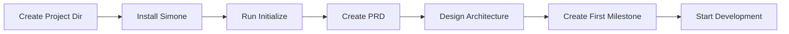
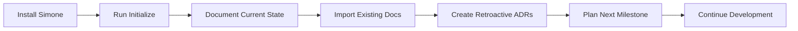
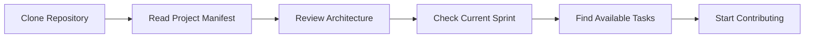

# Project Initialization Workflow

A step-by-step guide to setting up a new project or integrating Simone into an existing codebase.

## Overview

The project initialization workflow transforms any codebase into a Simone-managed project with proper structure, documentation, and Claude Code integration. This process works for both new projects and existing codebases.

## Prerequisites

- Simone Framework installed (see [Installation Guide](../getting-started/installation.md))
- Claude Code desktop application
- A project directory (new or existing)
- Basic project information (name, description, team)

## Initialization Process

### Step 1: Run the Initialize Command

Open your project in Claude Code and run:

```
/project:simone:initialize
```

This command will:
1. Detect if you're in an existing project or starting fresh
2. Create the complete `.simone/` directory structure
3. Generate initial project manifest
4. Set up all necessary templates
5. Configure Claude integration

### Step 2: Complete Project Manifest

The initialization creates `.simone/00_PROJECT_MANIFEST.md`. Update it with:

1. **Project Information**:
   ```yaml
   project_name: "Your Project Name"
   project_description: "Brief description of what the project does"
   project_version: "0.1.0"
   ```

2. **Team Information**:
   ```yaml
   team_members:
     - name: "Team Lead"
       role: "Technical Lead"
       responsibilities: ["Architecture", "Code Review"]
     - name: "Developer 1"
       role: "Backend Developer"
       responsibilities: ["API Development", "Database"]
   ```

3. **Technology Stack**:
   ```yaml
   technology_stack:
     languages: ["JavaScript", "Python"]
     frameworks: ["React", "FastAPI"]
     databases: ["PostgreSQL", "Redis"]
     infrastructure: ["AWS", "Docker"]
   ```

### Step 3: Create Initial Documentation

#### For New Projects

1. **Create Product Requirements Document (PRD)**:
   ```
   /project:simone:create_general_task "Create initial PRD"
   ```
   Then create `.simone/01_PROJECT_DOCS/PRD.md` using the template.

2. **Define Architecture**:
   ```
   /project:simone:create_general_task "Document initial architecture"
   ```
   Create `.simone/01_PROJECT_DOCS/ARCHITECTURE.md`.

3. **Set Up Development Standards**:
   - Code style guide
   - Git workflow
   - Testing requirements
   - Deployment process

#### For Existing Projects

1. **Document Current State**:
   - Architecture overview
   - Technology decisions
   - Known issues and technical debt
   - Team structure and responsibilities

2. **Import Existing Documentation**:
   - Move existing docs to `.simone/01_PROJECT_DOCS/`
   - Convert to Simone template format
   - Add YAML frontmatter metadata

3. **Create Architecture Decision Records (ADRs)**:
   - Document past architectural decisions
   - Explain current design choices
   - Identify areas for improvement

### Step 4: Set Up First Milestone

1. **Create Milestone Directory**:
   ```bash
   mkdir .simone/02_REQUIREMENTS/M01_Initial_Setup
   ```

2. **Define Milestone Scope**:
   Create `M01_META.md` with:
   - Objectives and deliverables
   - Success criteria
   - Timeline and resources
   - Risk assessment

3. **Break Down into Tasks**:
   - Infrastructure setup tasks
   - Core functionality tasks
   - Documentation tasks
   - Testing setup tasks

### Step 5: Configure Quality Standards

1. **Set Up Quality Gates**:
   Update project manifest with:
   ```yaml
   quality_gates:
     code_review_required: true
     automated_testing_required: true
     documentation_required: true
     security_scan_required: true
   ```

2. **Define Acceptance Criteria**:
   - Code coverage requirements (e.g., >80%)
   - Performance benchmarks
   - Security standards
   - Documentation completeness

3. **Create Review Templates**:
   - Code review checklist
   - PR template customization
   - Testing requirements

### Step 6: Initialize Git Integration

1. **Set Up Branch Protection**:
   ```bash
   # Main branch protection
   git config branch.main.protected true
   ```

2. **Configure Commit Standards**:
   - Use Simone commit template
   - Reference task IDs in commits
   - Follow conventional commit format

3. **Create Initial Commit**:
   ```
   /project:simone:commit "INIT" "Initialize Simone project structure"
   ```

## Workflow Patterns

### Pattern 1: Greenfield Project



**Best Practices**:
- Start with clear requirements
- Design before coding
- Set up CI/CD early
- Document decisions as ADRs

### Pattern 2: Existing Project Integration



**Best Practices**:
- Don't try to document everything at once
- Focus on active development areas first
- Gradually improve documentation coverage
- Use project reviews to identify gaps

### Pattern 3: Team Onboarding



**Onboarding Checklist**:
- [ ] Read `.simone/00_PROJECT_MANIFEST.md`
- [ ] Review `.simone/01_PROJECT_DOCS/ARCHITECTURE.md`
- [ ] Check current milestone in `.simone/02_REQUIREMENTS/`
- [ ] Look at active sprint in `.simone/03_SPRINTS/`
- [ ] Find unassigned tasks in `.simone/04_GENERAL_TASKS/`

## Common Customizations

### 1. Project-Specific Templates

Add custom templates for your project needs:
- API endpoint documentation template
- Database migration template
- Feature flag documentation template
- Performance test template

### 2. Workflow Automation

Create project-specific commands:
```bash
# .claude/commands/project/deploy.md
# Custom deployment command
```

### 3. Integration with External Tools

Connect Simone to your existing tools:
- JIRA integration for task sync
- Slack notifications for milestones
- CI/CD pipeline triggers
- Documentation publishing

## Validation Checklist

After initialization, verify:

- [ ] **Directory Structure**:
  ```bash
  ls -la .simone/
  # Should show all required directories
  ```

- [ ] **Project Manifest**:
  ```bash
  cat .simone/00_PROJECT_MANIFEST.md
  # Should have all metadata filled
  ```

- [ ] **Templates Available**:
  ```bash
  ls .simone/99_TEMPLATES/
  # Should show 14 template files
  ```

- [ ] **Claude Commands**:
  ```bash
  ls .claude/commands/simone/
  # Should show 23 command files
  ```

- [ ] **Git Configuration**:
  ```bash
  git status
  # Should show clean working directory
  ```

## Troubleshooting

### Issue: Initialize Command Not Found

**Solution**:
```bash
# Verify installation
ls .claude/commands/simone/initialize.md

# Re-run installer if needed
curl -sSL https://raw.githubusercontent.com/steig/claude-steig/main/install-simone.sh | bash
```

### Issue: Existing Files Conflict

**Solution**:
- Back up existing files first
- Use `--force` flag with installer
- Manually merge conflicting content

### Issue: Team Member Confusion

**Solution**:
- Create team onboarding guide
- Schedule walkthrough session
- Document project-specific workflows

## Next Steps

After successful initialization:

1. **Create First Sprint**: See [Sprint Execution Workflow](sprint-execution.md)
2. **Set Up Quality Process**: See [Quality Assurance Workflow](quality-assurance.md)
3. **Plan First Milestone**: See [Milestone Management](milestone-management.md)
4. **Start Development**: Use `/project:simone:create_general_task`

## Best Practices

1. **Start Small**: Don't try to plan everything upfront
2. **Iterate Frequently**: Refine process as you learn
3. **Document Decisions**: Use ADRs for important choices
4. **Maintain Momentum**: Keep documentation current
5. **Review Regularly**: Use project reviews to improve

## Integration with CI/CD

### GitHub Actions Example

```yaml
name: Simone Validation
on: [push, pull_request]

jobs:
  validate:
    runs-on: ubuntu-latest
    steps:
      - uses: actions/checkout@v2
      - name: Validate Simone Structure
        run: |
          # Check for required files
          test -f .simone/00_PROJECT_MANIFEST.md
          test -d .simone/99_TEMPLATES
          
      - name: Check Task References
        run: |
          # Validate task IDs in commits
          git log --oneline | grep -E "(TASK_|T[0-9]{3})"
```

### Pre-commit Hooks

```bash
#!/bin/bash
# .git/hooks/pre-commit

# Validate task references
if ! git diff --cached --name-only | grep -q ".simone/"; then
  echo "Warning: No Simone files updated"
fi

# Check for incomplete templates
if grep -r "{.*}" .simone/ --include="*.md"; then
  echo "Error: Incomplete template placeholders found"
  exit 1
fi
```

---

The initialization workflow sets the foundation for successful project management with Simone. Take time to properly initialize your project - it pays dividends throughout the development lifecycle.