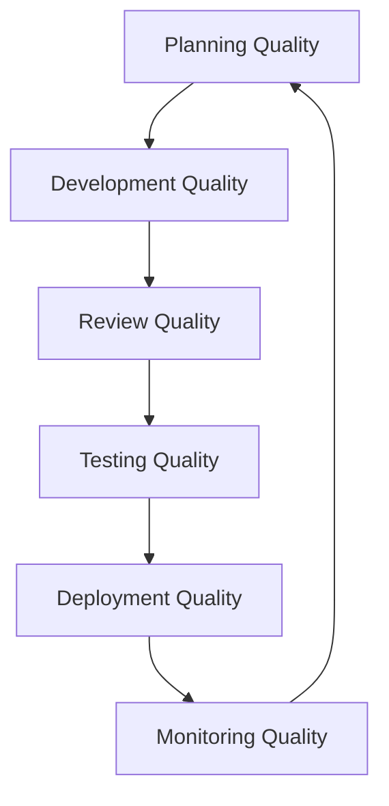

# Quality Assurance Workflow

Comprehensive guide for implementing and maintaining quality standards throughout the development lifecycle using the Simone Framework.

## Overview

Quality Assurance in Simone is not a phase but a continuous process integrated into every workflow. This guide covers quality gates, review processes, testing strategies, and compliance tracking to ensure consistent, high-quality deliverables.

## Quality Framework



## Quality Gates Configuration

### Project-Level Quality Standards

Define quality gates in `.simone/00_PROJECT_MANIFEST.md`:

```yaml
quality_gates:
  code_review_required: true
  automated_testing_required: true
  documentation_required: true
  security_scan_required: true
  performance_testing_required: true
  accessibility_testing_required: true

quality_thresholds:
  minimum_test_coverage: 80
  maximum_complexity: 10
  documentation_coverage: 90
  performance_budget:
    page_load_time: 3000  # ms
    api_response_time: 200  # ms
  security_score: "A"
  accessibility_score: 95

compliance_requirements:
  - "OWASP Top 10"
  - "WCAG 2.1 AA"
  - "SOC2 Type II"
  - "GDPR"
```

### Task-Level Quality Requirements

Each task includes quality criteria:

```yaml
quality_requirements:
  test_coverage: 85
  code_review_status: "approved"
  documentation_complete: true
  performance_impact: "neutral"
  security_review: "passed"
  
acceptance_criteria:
  - "All unit tests passing"
  - "Integration tests cover happy path"
  - "No regression in performance benchmarks"
  - "API documentation updated"
  - "Security scan shows no new vulnerabilities"
```

## Code Quality Workflow

### Pre-Development Quality

1. **Requirement Review**:
   ```
   /project:simone:discuss_review requirements "Review requirements for completeness"
   ```
   
   Checklist:
   - [ ] Requirements are specific and measurable
   - [ ] Acceptance criteria are defined
   - [ ] Technical constraints are documented
   - [ ] Dependencies are identified
   - [ ] Risk assessment is complete

2. **Design Review**:
   - Architecture alignment check
   - Design pattern validation
   - Security design review
   - Performance impact assessment
   - Scalability considerations

### During Development Quality

1. **Continuous Integration Checks**:
   ```yaml
   # .github/workflows/quality-checks.yml
   name: Quality Gates
   on: [push, pull_request]
   
   jobs:
     quality:
       runs-on: ubuntu-latest
       steps:
         - name: Code Linting
           run: npm run lint
         
         - name: Type Checking
           run: npm run typecheck
         
         - name: Unit Tests
           run: npm test -- --coverage
         
         - name: Coverage Check
           run: |
             if [ $(coverage) -lt 80 ]; then
               echo "Coverage below 80%"
               exit 1
             fi
   ```

2. **Pre-Commit Hooks**:
   ```bash
   # .git/hooks/pre-commit
   #!/bin/bash
   
   # Run linting
   npm run lint || exit 1
   
   # Check for console.logs
   if grep -r "console.log" src/; then
     echo "Remove console.log statements"
     exit 1
   fi
   
   # Validate task references
   if ! git diff --cached --name-only | grep -E "(TASK_|T[0-9]{3})"; then
     echo "Commit must reference a task"
     exit 1
   fi
   ```

3. **Real-Time Quality Monitoring**:
   ```
   /project:simone:code_review current_changes "Check code quality standards"
   ```

### Code Review Process

1. **Initiate Code Review**:
   ```
   /project:simone:create_pr TASK_001 main
   ```

2. **Review Checklist**:
   
   **Code Quality**:
   - [ ] Follows project coding standards
   - [ ] No code duplication (DRY principle)
   - [ ] Clear variable and function names
   - [ ] Appropriate comments and documentation
   - [ ] Error handling is comprehensive
   
   **Architecture**:
   - [ ] Follows established patterns
   - [ ] Maintains separation of concerns
   - [ ] No tight coupling introduced
   - [ ] Scalability considered
   - [ ] Performance impact assessed
   
   **Security**:
   - [ ] Input validation implemented
   - [ ] No hardcoded secrets
   - [ ] Authentication/authorization correct
   - [ ] SQL injection prevention
   - [ ] XSS prevention measures
   
   **Testing**:
   - [ ] Unit tests added/updated
   - [ ] Integration tests if needed
   - [ ] Edge cases covered
   - [ ] Test coverage meets standards
   - [ ] Tests are maintainable

3. **Review Documentation**:
   ```
   /project:simone:review_pr PR_123
   ```

## Testing Strategy

### Test Pyramid Implementation

```
         /\
        /E2E\        5%  - Critical user journeys
       /------\
      /  Integ  \    15% - API and integration tests  
     /----------\
    /    Unit     \  80% - Unit tests for logic
   /--------------\
```

### Test Planning

Create test plans in task documentation:

```markdown
## Testing Requirements

### Unit Tests
- [ ] Component logic tests
- [ ] Edge case handling
- [ ] Error scenarios
- [ ] Mock external dependencies

### Integration Tests
- [ ] API endpoint testing
- [ ] Database operations
- [ ] Third-party integrations
- [ ] Message queue interactions

### E2E Tests
- [ ] Critical user flows
- [ ] Cross-browser testing
- [ ] Mobile responsiveness
- [ ] Performance under load
```

### Test Execution

1. **Run Comprehensive Tests**:
   ```
   /project:simone:test all coverage
   ```

2. **Focused Testing**:
   ```
   /project:simone:test unit src/auth
   /project:simone:test integration api
   /project:simone:test e2e login-flow
   ```

3. **Performance Testing**:
   ```
   /project:simone:test performance api
   ```

### Test Quality Metrics

Track in project manifest:

```yaml
test_metrics:
  unit_test_count: 245
  integration_test_count: 45
  e2e_test_count: 12
  total_coverage: 85.3
  coverage_by_module:
    auth: 92
    api: 88
    database: 79
    frontend: 81
  test_execution_time: "3m 45s"
  flaky_test_count: 2
  last_full_run: "2024-03-10 14:30"
```

## Documentation Quality

### Documentation Standards

1. **Code Documentation**:
   ```javascript
   /**
    * Authenticates a user with the provided credentials.
    * 
    * @param {Object} credentials - User login credentials
    * @param {string} credentials.email - User email address
    * @param {string} credentials.password - User password
    * @returns {Promise<{token: string, user: Object}>} Auth token and user data
    * @throws {AuthenticationError} If credentials are invalid
    * @throws {RateLimitError} If too many attempts
    * 
    * @example
    * const { token, user } = await authenticate({
    *   email: 'user@example.com',
    *   password: 'securepassword'
    * });
    */
   ```

2. **API Documentation**:
   ```yaml
   # API endpoint documentation
   endpoint: /api/v1/auth/login
   method: POST
   description: Authenticate user and return JWT token
   request:
     content-type: application/json
     body:
       email: string, required, email format
       password: string, required, min 8 chars
   response:
     200:
       content-type: application/json
       body:
         token: string, JWT token
         user: object, user profile
     401:
       error: "Invalid credentials"
     429:
       error: "Too many attempts"
   ```

3. **User Documentation**:
   - Getting started guides
   - Feature documentation
   - Troubleshooting guides
   - FAQ sections
   - Video tutorials

### Documentation Review

```
/project:simone:testing_review documentation
```

Checks for:
- Completeness of documentation
- Accuracy and currentness
- Code examples working
- Links validity
- Formatting consistency

## Security Quality

### Security Review Process

1. **Static Analysis**:
   ```bash
   # Run security scanning
   npm audit
   snyk test
   semgrep --config=auto
   ```

2. **Security Checklist**:
   
   **Authentication & Authorization**:
   - [ ] Strong password requirements
   - [ ] Secure session management
   - [ ] Role-based access control
   - [ ] Multi-factor authentication option
   
   **Data Protection**:
   - [ ] Encryption at rest
   - [ ] Encryption in transit
   - [ ] PII data handling
   - [ ] Data retention policies
   
   **Input Validation**:
   - [ ] All inputs sanitized
   - [ ] SQL injection prevention
   - [ ] XSS prevention
   - [ ] CSRF protection
   
   **Infrastructure**:
   - [ ] Secure configurations
   - [ ] Latest security patches
   - [ ] Firewall rules
   - [ ] Access logging

3. **Security Testing**:
   ```
   /project:simone:test security full
   ```

### Vulnerability Management

Track security issues:

```yaml
# In task or bug documentation
security_assessment:
  vulnerabilities_found: 2
  severity_high: 0
  severity_medium: 1
  severity_low: 1
  remediation_status:
    - issue: "Weak password policy"
      severity: "medium"
      status: "fixed"
      fixed_in: "TASK_045"
    - issue: "Missing rate limiting"
      severity: "low"
      status: "in_progress"
      assigned_to: "TASK_067"
```

## Performance Quality

### Performance Standards

Define performance budgets:

```yaml
performance_budgets:
  web_vitals:
    LCP: 2500  # Largest Contentful Paint (ms)
    FID: 100   # First Input Delay (ms)
    CLS: 0.1   # Cumulative Layout Shift
  api_performance:
    p50_response_time: 100  # ms
    p95_response_time: 500  # ms
    p99_response_time: 1000 # ms
  database_performance:
    query_timeout: 5000     # ms
    connection_pool: 20
    slow_query_log: 1000    # ms
```

### Performance Testing

1. **Load Testing**:
   ```
   /project:simone:test performance load
   ```

2. **Stress Testing**:
   ```
   /project:simone:test performance stress
   ```

3. **Performance Monitoring**:
   ```javascript
   // Performance tracking
   performance.mark('api-call-start');
   const response = await fetchAPI();
   performance.mark('api-call-end');
   performance.measure('api-call', 'api-call-start', 'api-call-end');
   
   const measure = performance.getEntriesByName('api-call')[0];
   if (measure.duration > 500) {
     console.warn(`Slow API call: ${measure.duration}ms`);
   }
   ```

## Compliance Tracking

### Regulatory Compliance

Track compliance requirements:

```yaml
compliance_tracking:
  GDPR:
    status: "compliant"
    last_audit: "2024-02-15"
    next_audit: "2024-08-15"
    requirements:
      - "Data portability implemented"
      - "Right to erasure functional"
      - "Privacy by design documented"
      - "DPO appointed"
  
  SOC2:
    status: "in_progress"
    target_date: "2024-06-01"
    completed_controls: 45
    total_controls: 67
    
  WCAG:
    status: "partial"
    level: "AA"
    score: 87
    issues: ["Color contrast in dark mode", "Missing alt text"]
```

### Audit Preparation

1. **Documentation Review**:
   - Policies and procedures
   - Security documentation
   - Incident response plans
   - Access control matrices

2. **Evidence Collection**:
   - Access logs
   - Change management records
   - Security scan results
   - Training records

3. **Gap Analysis**:
   ```
   /project:simone:project_review compliance SOC2
   ```

## Quality Metrics Dashboard

### Real-Time Quality Monitoring

```
/project:simone:status quality detailed dashboard
```

Displays:
```
🎯 Quality Dashboard - Project X
================================

📊 Code Quality
├── Test Coverage: 85.3% ✅ (Target: 80%)
├── Code Complexity: 8.2 ✅ (Max: 10)
├── Technical Debt: 12 days ⚠️ 
└── Lint Issues: 0 ✅

🔍 Review Status  
├── Open PRs: 3
├── Avg Review Time: 4.2 hours ✅
├── Review Coverage: 100% ✅
└── Rejected PRs: 5%

🧪 Test Health
├── Passing Tests: 302/305 ⚠️
├── Flaky Tests: 2
├── Test Runtime: 3m 45s
└── Last Full Run: 2 hours ago

🔒 Security Status
├── Vulnerabilities: 0 High, 1 Medium, 3 Low
├── Security Score: A- ✅
├── Last Scan: Today
└── Compliance: GDPR ✅, SOC2 🔄

⚡ Performance
├── Page Load: 2.3s ✅ (Budget: 3s)
├── API p95: 145ms ✅ (Budget: 200ms)
├── Error Rate: 0.02% ✅
└── Uptime: 99.98% ✅
```

### Quality Trends

Track quality over time:

```yaml
quality_trends:
  - week: "2024-W10"
    coverage: 82.1
    complexity: 8.5
    review_time: 5.2
    bug_rate: 0.8
  - week: "2024-W11"
    coverage: 84.2
    complexity: 8.3
    review_time: 4.5
    bug_rate: 0.6
  - week: "2024-W12"
    coverage: 85.3
    complexity: 8.2
    review_time: 4.2
    bug_rate: 0.4
```

## Continuous Improvement

### Quality Retrospectives

Regular quality-focused retrospectives:

1. **Metrics Review**:
   - What metrics improved?
   - What metrics degraded?
   - Are targets appropriate?

2. **Process Evaluation**:
   - Which quality gates caught issues?
   - Which gates caused delays?
   - Process improvement ideas?

3. **Tool Assessment**:
   - Are tools effective?
   - Integration opportunities?
   - Training needs?

### Quality Action Items

Track improvement initiatives:

```markdown
## Quality Improvement Plan

### Q2 2024 Initiatives

1. **Increase Test Coverage**
   - Current: 85.3%
   - Target: 90%
   - Actions:
     - Add tests for legacy modules
     - Implement mutation testing
     - Test coverage reports in PRs

2. **Reduce Review Cycle Time**
   - Current: 4.2 hours
   - Target: 2 hours
   - Actions:
     - Automated PR assignments
     - Review SLAs
     - Better PR templates

3. **Improve Documentation**
   - Current: 75% complete
   - Target: 95% complete
   - Actions:
     - Documentation sprints
     - Auto-generated API docs
     - User feedback integration
```

## Quality Automation

### Automated Quality Checks

1. **CI/CD Pipeline**:
   ```yaml
   quality-gates:
     - stage: lint
       script: npm run lint
       allow_failure: false
     
     - stage: test
       script: npm test -- --coverage
       coverage: /Coverage: \d+\.\d+%/
       
     - stage: security
       script: npm audit && snyk test
       
     - stage: performance
       script: lighthouse ci
       
     - stage: documentation
       script: npm run docs:validate
   ```

2. **Automated Reporting**:
   ```javascript
   // Generate quality report
   async function generateQualityReport() {
     const metrics = {
       coverage: await getTestCoverage(),
       complexity: await getCodeComplexity(),
       security: await getSecurityScore(),
       performance: await getPerformanceMetrics(),
       documentation: await getDocCoverage()
     };
     
     return formatReport(metrics);
   }
   ```

3. **Quality Bots**:
   - PR size warnings
   - Coverage decrease alerts
   - Security vulnerability notifications
   - Performance regression detection

## Best Practices

### Quality-First Development

1. **Write Tests First**: TDD approach for critical logic
2. **Review Early**: Draft PRs for design feedback
3. **Automate Everything**: If you do it twice, automate it
4. **Measure Constantly**: Track metrics that matter
5. **Fix Immediately**: Don't let quality debt accumulate

### Team Quality Culture

1. **Shared Ownership**: Everyone owns quality
2. **Learning Culture**: Share quality failures openly
3. **Celebrate Success**: Recognize quality achievements
4. **Continuous Learning**: Regular training and updates
5. **Tool Investment**: Provide best quality tools

### Quality Communication

1. **Transparent Metrics**: Share quality dashboards
2. **Regular Updates**: Weekly quality summaries
3. **Stakeholder Education**: Explain quality value
4. **Success Stories**: Share quality wins
5. **Incident Learning**: Post-mortems for quality failures

---

Quality assurance in the Simone Framework is comprehensive, continuous, and integrated into every aspect of development. By following these workflows and maintaining high standards, teams can deliver reliable, secure, and performant software consistently.