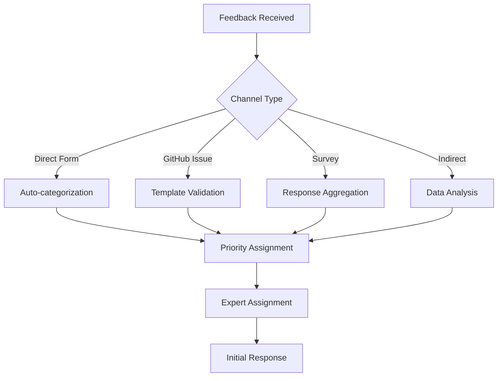

# User Feedback Collection System

---
title: "User Feedback Collection System"
type: "system_design"
category: "administration"
audience: ["maintainers", "product_managers", "community_managers"]
created_date: "2025-07-10"
updated_date: "2025-07-10"
version: "1.0.0"
status: "active"
priority: "high"
tags: ["feedback", "user_experience", "community", "improvement"]
related_docs: ["documentation-review-process.md", "../best-practices/community-engagement.md"]
---

## Overview

The Simone Framework User Feedback Collection System enables systematic gathering, analysis, and integration of user feedback to continuously improve the framework, documentation, and user experience.

## System Objectives

### Primary Goals
- **Comprehensive Collection**: Capture feedback from all user touchpoints
- **Rapid Response**: Acknowledge and address user concerns quickly
- **Actionable Insights**: Transform feedback into concrete improvements
- **Community Engagement**: Foster active user participation and contribution

### Success Metrics
- **Response Rate**: >20% user participation in feedback activities
- **Response Time**: <48 hours feedback acknowledgment
- **Resolution Rate**: >80% of actionable feedback addressed within 30 days
- **Satisfaction Improvement**: +0.5 average rating increase per quarter

---

## Feedback Collection Channels

### 1. Direct Feedback Channels

#### Documentation Feedback Forms
**Location**: Embedded in all documentation pages  
**Format**: Quick rating + optional comment  
**Implementation**:
```html
<!-- Embedded at bottom of each doc page -->
<div class="feedback-widget">
  <h4>Was this page helpful?</h4>
  <div class="rating-buttons">
    <button data-rating="5">👍 Very helpful</button>
    <button data-rating="4">👍 Helpful</button>
    <button data-rating="3">🤷 Somewhat helpful</button>
    <button data-rating="2">👎 Not helpful</button>
    <button data-rating="1">👎 Confusing</button>
  </div>
  <textarea placeholder="Tell us how we can improve this page..."></textarea>
  <button type="submit">Submit Feedback</button>
</div>
```

#### GitHub Issue Templates
**Purpose**: Structured reporting for bugs, features, and documentation  
**Templates**:

```markdown
<!-- .github/ISSUE_TEMPLATE/documentation_feedback.md -->
---
name: Documentation Feedback
about: Report issues or suggest improvements for documentation
title: "[DOCS] "
labels: documentation, feedback
assignees: ''
---

## Page/Section
<!-- Link to the documentation page or section -->

## Issue Type
- [ ] Inaccurate information
- [ ] Missing information
- [ ] Confusing explanation
- [ ] Broken link or example
- [ ] Improvement suggestion
- [ ] Other

## Description
<!-- Clear description of the issue or suggestion -->

## Expected Improvement
<!-- What would make this better? -->

## User Context
- Experience level: [Beginner/Intermediate/Advanced]
- Use case: [Personal project/Startup/Enterprise/Learning]
- Platform: [macOS/Windows/Linux]
```

#### User Survey System
**Frequency**: Quarterly comprehensive survey + event-triggered mini-surveys  
**Distribution**: Email, in-app notifications, community channels

**Quarterly Survey Topics**:
- Overall framework satisfaction
- Feature usage and gaps
- Documentation quality
- Learning curve and onboarding
- Community engagement
- Priority improvements

**Event-Triggered Surveys**:
- Post-installation feedback
- Post-tutorial completion
- Feature usage feedback
- Support interaction follow-up

### 2. Indirect Feedback Channels

#### Analytics & Usage Data
**Web Analytics**: Documentation page views, time spent, bounce rates  
**Search Analytics**: Failed searches, popular queries, exit pages  
**Error Tracking**: Common error patterns and user flow interruptions

**Key Metrics Tracked**:
```yaml
Documentation Analytics:
  - page_views_per_section
  - average_time_on_page
  - bounce_rate_by_page
  - search_success_rate
  - common_exit_points

User Journey Analytics:
  - installation_success_rate
  - tutorial_completion_rate
  - feature_adoption_rate
  - support_ticket_origins
  - community_engagement_patterns
```

#### Community Platform Monitoring
**Sources**: Forums, Discord/Slack, Reddit, Stack Overflow  
**Monitoring**: Mentions, questions, complaints, feature requests  
**Tools**: Social listening, keyword monitoring, sentiment analysis

#### Support Ticket Analysis
**Purpose**: Identify documentation gaps and common pain points  
**Analysis**: Categorization, trend identification, root cause analysis  
**Integration**: Feed insights back into documentation and feature planning

---

## Feedback Processing Workflow

### 1. Collection & Initial Triage



#### Automated Triage Rules
```yaml
Priority Assignment:
  Critical:
    - mentions: ["broken", "error", "crash", "security"]
    - sentiment: negative
    - page_type: ["installation", "getting-started"]
  
  High:
    - mentions: ["confusing", "unclear", "missing"]
    - user_type: ["new_user", "enterprise"]
    - feedback_type: ["documentation", "onboarding"]
  
  Medium:
    - mentions: ["improvement", "suggestion", "feature"]
    - sentiment: neutral_to_positive
    - impact: medium
  
  Low:
    - mentions: ["typo", "formatting", "minor"]
    - impact: low
```

### 2. Analysis & Investigation

#### Expert Review Process
1. **Subject Matter Expert Assignment**: Route to appropriate team member
2. **Investigation**: Deep dive into reported issue or suggestion
3. **Root Cause Analysis**: Identify underlying problems
4. **Impact Assessment**: Evaluate user impact and improvement potential
5. **Solution Design**: Develop improvement plan

#### Cross-Reference Analysis
- **Related Issues**: Link similar feedback across channels
- **Historical Patterns**: Identify recurring themes
- **User Segmentation**: Analyze by user type and experience level
- **Content Performance**: Correlate with analytics data

### 3. Response & Communication

#### User Communication Protocol
```yaml
Response Timeframes:
  Acknowledgment: 48 hours
  Initial Assessment: 1 week
  Resolution Timeline: 2 weeks
  Implementation Update: 4 weeks

Communication Templates:
  Acknowledgment:
    - Thank user for feedback
    - Confirm receipt and categorization
    - Provide expected timeline
    - Offer additional support channels
  
  Investigation Update:
    - Explain investigation findings
    - Outline proposed solution
    - Request additional clarification if needed
    - Provide realistic timeline
  
  Resolution Notification:
    - Describe implemented changes
    - Link to updated content
    - Request validation of improvement
    - Invite continued engagement
```

---

## Feedback Analysis Framework

### 1. Quantitative Analysis

#### Feedback Metrics Dashboard
```yaml
Collection Metrics:
  - feedback_volume_by_channel
  - response_rate_by_user_segment
  - feedback_sentiment_distribution
  - issue_category_breakdown

Quality Metrics:
  - documentation_satisfaction_scores
  - feature_usefulness_ratings
  - user_experience_satisfaction
  - recommendation_likelihood (NPS)

Performance Metrics:
  - response_time_averages
  - resolution_rate_by_category
  - user_satisfaction_with_response
  - repeat_feedback_rate
```

#### Trend Analysis
- **Time Series Analysis**: Feedback volume and sentiment over time
- **Correlation Analysis**: Link feedback to releases, documentation changes
- **Seasonality Patterns**: Identify peak feedback periods
- **Comparative Analysis**: Benchmark against previous periods

### 2. Qualitative Analysis

#### Content Analysis
- **Theme Identification**: Extract common topics and concerns
- **Sentiment Analysis**: Understand emotional context of feedback
- **User Journey Mapping**: Identify friction points in user experience
- **Pain Point Analysis**: Categorize and prioritize user problems

#### User Segmentation Analysis
```yaml
Segmentation Dimensions:
  Experience Level:
    - New users (0-30 days)
    - Intermediate users (1-6 months)
    - Advanced users (6+ months)
  
  Use Case:
    - Personal projects
    - Startup/small business
    - Enterprise
    - Educational/learning
  
  Engagement Level:
    - Active community members
    - Occasional users
    - One-time users
    - Support seekers

Analysis Framework:
  - Segment-specific pain points
  - Feature adoption by segment
  - Documentation preferences
  - Communication channel preferences
```

---

## Integration & Action Planning

### 1. Priority Matrix Framework

```yaml
Impact vs Effort Matrix:
  High Impact, Low Effort:
    - Priority: Critical
    - Timeline: 1-2 weeks
    - Examples: Fix broken links, update outdated examples
  
  High Impact, High Effort:
    - Priority: High
    - Timeline: 1-2 months
    - Examples: Major documentation restructure, new tutorial creation
  
  Low Impact, Low Effort:
    - Priority: Medium
    - Timeline: Monthly batch
    - Examples: Typo fixes, minor formatting improvements
  
  Low Impact, High Effort:
    - Priority: Low
    - Timeline: Quarterly review
    - Examples: Nice-to-have features, edge case documentation
```

### 2. Integration with Development Cycles

#### Sprint Planning Integration
- **Feedback Backlog**: Maintained in project management system
- **Sprint Allocation**: Reserve 20% capacity for feedback-driven improvements
- **Cross-Functional Planning**: Include feedback insights in feature planning
- **Release Coordination**: Align improvements with release cycles

#### Documentation Roadmap Impact
- **Quarterly Planning**: Incorporate major feedback themes
- **Content Strategy**: Adjust based on user needs and gaps
- **Resource Allocation**: Prioritize high-impact documentation areas
- **Success Metrics**: Define feedback-driven success criteria

---

## Community Engagement Strategies

### 1. Feedback Incentives

#### Recognition Programs
- **Contributor Spotlight**: Monthly recognition of valuable feedback providers
- **Community Champions**: Special status for consistently helpful users
- **Feedback Leaderboard**: Gamification of feedback participation
- **Thank You Program**: Personal thanks and follow-up with contributors

#### Tangible Rewards
- **Swag Programs**: Branded items for valuable contributors
- **Early Access**: Beta features for active community members
- **Expert Sessions**: Direct access to development team
- **Conference Opportunities**: Speaking or attendance opportunities

### 2. Feedback Loop Closure

#### Public Improvement Communication
- **Monthly Updates**: "You asked, we delivered" communications
- **Changelog Highlights**: Feedback-driven improvements in release notes
- **Case Studies**: Deep dives on major improvements from user feedback
- **Video Updates**: Personal messages about community-driven changes

#### Community Involvement in Solutions
- **Co-creation Sessions**: Involve users in solution design
- **Beta Testing**: Early feedback on improvements
- **Documentation Review**: Community review of new content
- **Feature Validation**: User testing of new capabilities

---

## Technology Implementation

### 1. Feedback Collection Infrastructure

#### Web-based Feedback Forms
```javascript
// Embedded feedback widget
class FeedbackWidget {
  constructor(config) {
    this.pageId = config.pageId;
    this.apiEndpoint = config.apiEndpoint;
    this.initializeWidget();
  }
  
  initializeWidget() {
    // Create feedback form UI
    this.renderWidget();
    this.attachEventListeners();
  }
  
  async submitFeedback(data) {
    const payload = {
      pageId: this.pageId,
      rating: data.rating,
      comment: data.comment,
      userAgent: navigator.userAgent,
      timestamp: new Date().toISOString(),
      sessionId: this.getSessionId()
    };
    
    await fetch(this.apiEndpoint, {
      method: 'POST',
      headers: { 'Content-Type': 'application/json' },
      body: JSON.stringify(payload)
    });
    
    this.showThankYou();
  }
}
```

#### API Integration
```yaml
Feedback API Endpoints:
  POST /api/feedback/documentation:
    - Collect page-specific feedback
    - Auto-categorize by page section
    - Trigger notification workflows
  
  POST /api/feedback/feature:
    - Collect feature-specific feedback
    - Link to product roadmap items
    - Integrate with development planning
  
  GET /api/feedback/analytics:
    - Provide aggregated feedback data
    - Support dashboard visualizations
    - Enable trend analysis
```

### 2. Analysis & Reporting Tools

#### Automated Analysis Pipeline
```python
# Feedback analysis pipeline
class FeedbackAnalyzer:
    def __init__(self):
        self.sentiment_analyzer = SentimentAnalyzer()
        self.theme_extractor = ThemeExtractor()
        self.priority_classifier = PriorityClassifier()
    
    def process_feedback(self, feedback_data):
        # Sentiment analysis
        sentiment = self.sentiment_analyzer.analyze(feedback_data.text)
        
        # Theme extraction
        themes = self.theme_extractor.extract_themes(feedback_data.text)
        
        # Priority classification
        priority = self.priority_classifier.classify(
            feedback_data, sentiment, themes
        )
        
        return {
            'id': feedback_data.id,
            'sentiment': sentiment,
            'themes': themes,
            'priority': priority,
            'recommended_action': self.get_recommendations(
                sentiment, themes, priority
            )
        }
```

#### Dashboard & Reporting
- **Real-time Dashboard**: Live feedback metrics and trends
- **Executive Reports**: Monthly/quarterly summary reports
- **Team Dashboards**: Department-specific feedback insights
- **Public Metrics**: Community-visible improvement metrics

---

## Success Measurement

### 1. Collection Effectiveness KPIs

#### Participation Metrics
- **Response Rate**: % of users providing feedback
- **Channel Utilization**: Feedback distribution across channels
- **Repeat Participation**: Users providing multiple feedback instances
- **Quality Score**: Average usefulness rating of feedback received

#### Coverage Metrics
- **Content Coverage**: % of documentation with feedback
- **User Segment Coverage**: Feedback representation across user types
- **Journey Coverage**: Feedback across different user journey stages
- **Issue Coverage**: % of known issues surfaced through feedback

### 2. Processing Efficiency KPIs

#### Response Performance
- **Acknowledgment Time**: Average time to initial response
- **Resolution Time**: Average time to implement improvements
- **User Satisfaction**: Rating of feedback handling process
- **Follow-up Engagement**: Users who re-engage after feedback

#### Quality Metrics
- **Action Rate**: % of feedback resulting in concrete actions
- **Impact Assessment**: Measured improvement from feedback integration
- **Cost Efficiency**: Cost per valuable feedback insight
- **Process Improvement**: Feedback process optimization metrics

### 3. Impact Assessment KPIs

#### User Experience Improvements
- **Satisfaction Trends**: Documentation and feature satisfaction over time
- **Task Success Rate**: Improvement in user task completion
- **Support Reduction**: Decrease in support tickets for covered topics
- **User Retention**: Correlation between feedback integration and retention

#### Business Impact
- **Feature Adoption**: Improvement in feature usage post-feedback integration
- **Community Growth**: Feedback system impact on community engagement
- **Development Efficiency**: Faster identification and resolution of issues
- **Strategic Alignment**: Feedback influence on product roadmap decisions

---

## Process Optimization

### 1. Continuous Improvement Cycle

#### Monthly Review Process
1. **Collection Analysis**: Review feedback volume and quality
2. **Processing Efficiency**: Evaluate response times and resolution rates
3. **Impact Assessment**: Measure improvement outcomes
4. **Process Refinement**: Optimize collection and processing workflows

#### Quarterly System Enhancement
1. **Technology Upgrades**: Platform and tool improvements
2. **Process Automation**: Increase efficiency through automation
3. **Integration Enhancement**: Better workflow integration
4. **Training Updates**: Team capability development

### 2. Scalability Planning

#### Growth Preparation
- **Volume Scaling**: Prepare for increased feedback volume
- **Geographic Expansion**: Multi-language and cultural considerations
- **Team Scaling**: Distributed feedback processing capabilities
- **Technology Scaling**: Infrastructure capacity planning

#### Advanced Capabilities
- **AI-Powered Analysis**: Machine learning for feedback insights
- **Predictive Analytics**: Anticipate user needs from feedback patterns
- **Personalization**: Customized feedback experiences by user type
- **Integration Ecosystem**: Connect with external feedback platforms

---

## Related Resources

### Implementation Templates
- [Feedback Form Templates](../templates/feedback-forms/)
- [GitHub Issue Templates](../.github/ISSUE_TEMPLATE/)
- [Survey Question Libraries](../templates/survey-templates/)

### Integration Tools
- [Analytics Integration Guide](analytics-integration.md)
- [Community Platform Setup](community-platform-setup.md)
- [Notification System Configuration](notification-system.md)

### Best Practices
- [Community Engagement Best Practices](../best-practices/community-engagement.md)
- [User Experience Guidelines](../best-practices/user-experience.md)
- [Communication Standards](../best-practices/communication-standards.md)

---

**System Owner**: Community Manager & Product Team  
**Review Frequency**: Monthly optimization, quarterly strategy review  
**Last Updated**: 2025-07-10  
**Next Review**: 2025-08-10