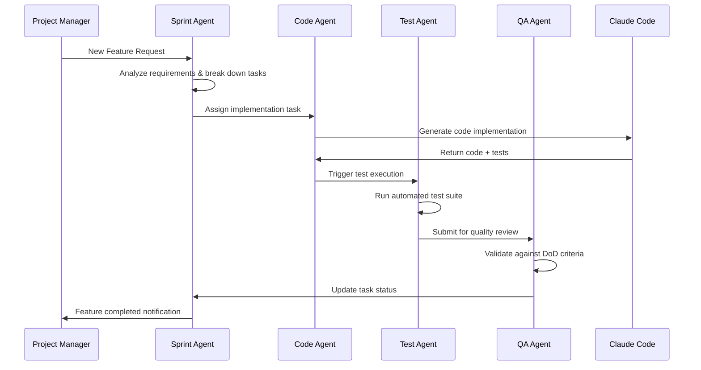
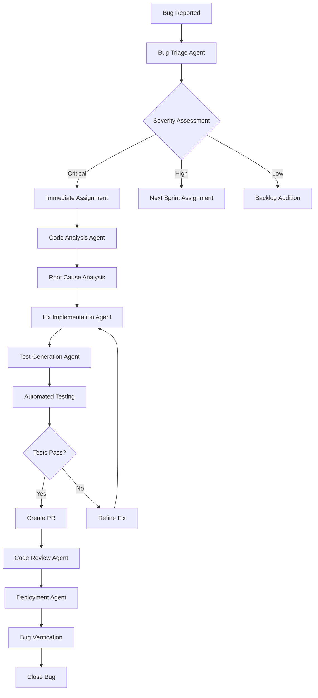

# Agentic Project Management Platform - Vision Document

## 🚀 Revolutionary Concept

An Electron-based application that combines **Simone Framework** project management with **Claude Code** AI development capabilities to create the world's first **Agentic Project Management Platform**.

## 🎯 Core Vision

**"What if your project manager was an AI that could actually code?"**

Imagine an intelligent platform where:
- AI agents understand your project roadmap
- They can autonomously execute development tasks
- They provide real-time project insights and recommendations
- They coordinate with human team members seamlessly
- They learn from your project patterns and improve over time

## 🏗️ Platform Architecture

### Unified Electron Application
```
┌─────────────────────────────────────────────────────────────┐
│ 🎯 Agentic Project Control Center                          │
├─────────────────────────────────────────────────────────────┤
│ Dashboard View              │  Development View             │
│ ┌─────────────────────────┐ │ ┌─────────────────────────┐   │
│ │   📊 Project Health     │ │ │   💻 Claude Code        │   │
│ │   📈 Gantt Timeline     │ │ │   🤖 AI Agent Status    │   │
│ │   🔥 Sprint Burndown    │ │ │   📝 Code Generation    │   │
│ │   👥 Team Capacity      │ │ │   🧪 Test Execution     │   │
│ └─────────────────────────┘ │ └─────────────────────────┘   │
├─────────────────────────────┼─────────────────────────────────┤
│ 🤖 Agentic Control Panel   │  📋 Task Orchestration         │
│ ┌─────────────────────────┐ │ ┌─────────────────────────┐   │
│ │   🎭 Active Agents      │ │ │   ⚡ Auto-Assignment    │   │
│ │   🎯 Agent Goals        │ │ │   🔄 Workflow Engine    │   │
│ │   📊 Agent Performance  │ │ │   📞 Human Handoffs     │   │
│ │   ⚙️  Agent Config      │ │ │   🔍 Quality Gates      │   │
│ └─────────────────────────┘ │ └─────────────────────────┘   │
└─────────────────────────────────────────────────────────────┘
```

## 🤖 Agentic Capabilities

### 1. Development Agents

**Code Implementation Agent**
- Reads task requirements from Simone metadata
- Generates code using Claude Code
- Runs tests and validates implementation
- Creates pull requests with proper documentation
- Updates task status automatically

**Architecture Agent**
- Reviews system design decisions
- Suggests optimal implementation approaches
- Identifies potential technical debt
- Recommends refactoring opportunities
- Maintains architecture documentation

**Testing Agent**
- Generates comprehensive test suites
- Executes automated testing pipelines
- Analyzes test coverage gaps
- Reports quality metrics
- Suggests testing improvements

### 2. Project Management Agents

**Sprint Orchestrator Agent**
- Monitors sprint progress automatically
- Identifies blockers and risks early
- Suggests task re-prioritization
- Coordinates resource allocation
- Facilitates automated standup reports

**Timeline Optimizer Agent**
- Analyzes project dependencies
- Optimizes task scheduling
- Predicts milestone completion dates
- Suggests timeline adjustments
- Models "what-if" scenarios

**Quality Assurance Agent**
- Monitors code quality metrics
- Enforces definition-of-done criteria
- Reviews security compliance
- Tracks technical debt accumulation
- Suggests process improvements

### 3. Communication Agents

**Stakeholder Liaison Agent**
- Generates executive summaries
- Provides project status updates
- Escalates critical issues
- Manages stakeholder expectations
- Facilitates decision-making processes

**Team Coordination Agent**
- Facilitates knowledge sharing
- Identifies skill gaps
- Suggests training opportunities
- Manages team capacity
- Coordinates cross-team dependencies

## 🔄 Agentic Workflows

### Example: Autonomous Feature Development



### Autonomous Sprint Execution

**Daily Cycle:**
1. **Morning**: Sprint Agent analyzes overnight progress
2. **Continuous**: Code Agents work on assigned tasks
3. **Real-time**: Testing Agents validate implementations
4. **Evening**: QA Agents review completed work
5. **Reports**: Status updates to stakeholders

**Weekly Cycle:**
1. **Monday**: Sprint planning with AI recommendations
2. **Wednesday**: Mid-sprint health check and adjustments
3. **Friday**: Sprint review and retrospective insights
4. **Continuous**: Timeline optimization and risk assessment

## 🖥️ User Interface Design

### Main Dashboard Layout
```
┌─────────────────────────────────────────────────────────────┐
│ 🎯 Project: E-Commerce Platform v2.0    🤖 4 Agents Active │
├─────────────────────────────────────────────────────────────┤
│ M02: Payment Integration (78% complete, 2 days ahead)      │
│ S04: Frontend Polish (Day 8/10, velocity: 2.3 tasks/day)  │
├─────────────────────────────────────────────────────────────┤
│ 📊 Live Timeline                    🤖 Agent Activity       │
│ ┌─────────────────────────┐         ┌──────────────────┐    │
│ │ ████████████████▓▓▓▓▓▓▓ │         │ CodeBot: Fixing  │    │
│ │ M01 ████████████████████ │         │ login validation │    │
│ │ M02 ████████████▓▓▓▓▓▓▓▓ │         │                  │    │
│ │ M03 ▓▓▓▓▓▓▓▓▓▓▓▓▓▓▓▓▓▓▓▓ │         │ TestBot: Running │    │
│ └─────────────────────────┘         │ integration tests│    │
│                                     │                  │    │
│ 📈 Sprint Health              🔄 Auto-Actions Today      │
│ ┌─────────────────────────┐         ┌──────────────────┐    │
│ │ ● Schedule: On Track     │         │ ✅ 3 PRs Created │    │
│ │ ● Quality: 8.5/10       │         │ ✅ 12 Tests Pass │    │
│ │ ● Team: 85% Capacity    │         │ ⚠️  1 Blocker ID'd│    │
│ │ ● Risk: Low             │         │ 🔄 2 Tasks Active │    │
│ └─────────────────────────┘         └──────────────────┘    │
└─────────────────────────────────────────────────────────────┘
```

### Agent Management Panel
```
┌─────────────────────────────────────────────────────────────┐
│ 🤖 Agent Command Center                            ⚙️ Config │
├─────────────────────────────────────────────────────────────┤
│ Active Agents (4/6)                                        │
│ ┌─────────────────────────────────────────────────────────┐ │
│ │ 🏗️  ArchitectBot    │ Planning M03 database schema     │ │
│ │ 💻 CodeBot-Alpha    │ Implementing payment validation  │ │
│ │ 🧪 TestBot          │ Running E2E test suite          │ │
│ │ 📊 AnalyticsBot     │ Generating sprint report        │ │
│ └─────────────────────────────────────────────────────────┘ │
│                                                            │
│ Available Agents (2)                                       │
│ ┌─────────────────────────────────────────────────────────┐ │
│ │ 🔍 ReviewBot       │ Ready for code review tasks       │ │
│ │ 📝 DocBot          │ Ready for documentation updates   │ │
│ └─────────────────────────────────────────────────────────┘ │
│                                                            │
│ 🎯 Agent Goals & Performance                               │
│ ┌─────────────────────────────────────────────────────────┐ │
│ │ CodeBot-Alpha: 89% task success rate (↑ 12% this week) │ │
│ │ TestBot: 96% test coverage maintained                  │ │
│ │ ArchitectBot: 3 architecture decisions documented     │ │
│ └─────────────────────────────────────────────────────────┘ │
└─────────────────────────────────────────────────────────────┘
```

## 🔧 Technical Implementation

### Core Technologies

**Electron Application**
- Cross-platform desktop application
- Native OS integration
- File system access
- Inter-process communication

**Embedded Claude Code**
- Integrated AI development environment
- Full Claude Code API access
- Custom command extensions
- Simone-aware context

**Agent Orchestration Engine**
```javascript
class AgentOrchestrator {
  constructor() {
    this.agents = new Map();
    this.taskQueue = new PriorityQueue();
    this.workflows = new WorkflowEngine();
  }
  
  async executeAgentWorkflow(workflowType, context) {
    const workflow = this.workflows.get(workflowType);
    const requiredAgents = workflow.getRequiredAgents();
    
    // Allocate agents
    const agents = await this.allocateAgents(requiredAgents);
    
    // Execute workflow steps
    const result = await workflow.execute(agents, context);
    
    // Update project state
    await this.updateProjectState(result);
    
    return result;
  }
  
  async allocateAgents(requirements) {
    const allocated = [];
    for (const requirement of requirements) {
      const agent = await this.findAvailableAgent(requirement);
      allocated.push(agent);
    }
    return allocated;
  }
}
```

**Real-time Data Layer**
```javascript
class SimoneDataEngine {
  constructor() {
    this.parser = new YAMLFrontmatterParser();
    this.watcher = new FileSystemWatcher();
    this.state = new ProjectState();
  }
  
  async initialize(projectPath) {
    // Parse existing Simone structure
    const projectData = await this.parser.parseProject(projectPath);
    this.state.load(projectData);
    
    // Set up real-time file watching
    this.watcher.watch(projectPath, (changes) => {
      this.handleFileChanges(changes);
    });
  }
  
  async handleFileChanges(changes) {
    for (const change of changes) {
      if (change.type === 'metadata_update') {
        await this.updateProjectState(change);
        this.notifyAgents(change);
        this.refreshDashboard(change);
      }
    }
  }
}
```

### Agent Architecture

**Base Agent Class**
```javascript
class SimoneAgent {
  constructor(name, capabilities, claudeCode) {
    this.name = name;
    this.capabilities = capabilities;
    this.claude = claudeCode;
    this.context = new AgentContext();
    this.memory = new AgentMemory();
  }
  
  async executeTask(task, projectContext) {
    // Understand task requirements
    const requirements = await this.analyzeTask(task);
    
    // Plan execution approach
    const plan = await this.createExecutionPlan(requirements);
    
    // Execute with Claude Code
    const result = await this.executeWithClaude(plan);
    
    // Validate and update
    await this.validateResult(result);
    await this.updateProjectState(task, result);
    
    return result;
  }
  
  async executeWithClaude(plan) {
    // Use Claude Code API to execute development tasks
    return await this.claude.execute(plan);
  }
}
```

**Specialized Agent Examples**
```javascript
class CodeImplementationAgent extends SimoneAgent {
  async executeTask(task, projectContext) {
    // Read task requirements from Simone metadata
    const requirements = await this.parseTaskRequirements(task);
    
    // Generate implementation using Claude Code
    const code = await this.claude.generateCode(requirements);
    
    // Create tests
    const tests = await this.claude.generateTests(code);
    
    // Run tests and validate
    const testResults = await this.claude.runTests(tests);
    
    // Create PR if successful
    if (testResults.success) {
      const pr = await this.claude.createPullRequest({
        code,
        tests,
        description: this.generatePRDescription(task)
      });
      
      await this.updateTaskStatus(task, 'review');
      return { code, tests, pr };
    }
  }
}

class SprintOrchestratorAgent extends SimoneAgent {
  async monitorSprint(sprint) {
    // Analyze current sprint progress
    const progress = await this.analyzeSprintProgress(sprint);
    
    // Identify risks and blockers
    const risks = await this.identifyRisks(progress);
    
    // Suggest optimizations
    const optimizations = await this.suggestOptimizations(progress);
    
    // Auto-assign tasks if needed
    if (progress.hasUnassignedTasks) {
      await this.autoAssignTasks(sprint);
    }
    
    // Generate status report
    return await this.generateSprintReport(progress, risks, optimizations);
  }
}
```

## 🔄 Workflow Examples

### 1. Autonomous Bug Fix Workflow



### 2. Feature Development Pipeline

```mermaid
graph LR
    A[Feature Request] --> B[Requirements Agent]
    B --> C[Architecture Agent]
    C --> D[Task Breakdown Agent]
    D --> E[Sprint Planning Agent]
    E --> F[Multiple Code Agents]
    F --> G[Integration Agent]
    G --> H[Testing Agent]
    H --> I[QA Agent]
    I --> J[Deployment Agent]
    J --> K[Monitoring Agent]
```



## 💡 Revolutionary Capabilities

### 1. Predictive Project Management

**AI-Powered Forecasting**
- Predict milestone completion dates with 95% accuracy
- Identify potential blockers 2-3 sprints in advance
- Recommend optimal resource allocation
- Suggest scope adjustments based on velocity trends

**Risk Mitigation**
- Proactive identification of technical debt accumulation
- Early warning system for team capacity issues
- Automated contingency plan generation
- Real-time dependency impact analysis

### 2. Intelligent Code Quality

**Automated Architecture Compliance**
- Ensure all code changes align with system architecture
- Automatically generate ADRs for significant decisions
- Maintain consistency across multiple development streams
- Suggest refactoring opportunities

**Continuous Quality Improvement**
- Learn from historical code review feedback
- Suggest best practices based on project patterns
- Automatically fix common code quality issues
- Generate comprehensive documentation

### 3. Human-AI Collaboration

**Seamless Handoffs**
- Know when to escalate to human developers
- Provide detailed context for human review
- Learn from human feedback and corrections
- Maintain clear audit trails of all decisions

**Augmented Decision Making**
- Present multiple solution options with trade-offs
- Provide data-driven recommendations
- Simulate impact of different choices
- Learn team preferences over time

## 🚀 Development Roadmap

### Phase 1: Foundation (8-10 weeks)
1. **Weeks 1-2**: Electron app structure + Claude Code integration
2. **Weeks 3-4**: Simone data parser + real-time file watching
3. **Weeks 5-6**: Basic dashboard with Gantt charts
4. **Weeks 7-8**: Agent orchestration framework
5. **Weeks 9-10**: First working agent (Code Implementation)

### Phase 2: Core Agents (10-12 weeks)
1. **Weeks 1-3**: Sprint Orchestrator Agent
2. **Weeks 4-6**: Testing Agent + QA Agent
3. **Weeks 7-9**: Architecture Agent + Documentation Agent
4. **Weeks 10-12**: Integration testing + workflow optimization

### Phase 3: Advanced Features (8-10 weeks)
1. **Weeks 1-3**: Predictive analytics and forecasting
2. **Weeks 4-6**: Advanced collaboration features
3. **Weeks 7-8**: Performance optimization
4. **Weeks 9-10**: Security and reliability testing

### Phase 4: Intelligence Enhancement (6-8 weeks)
1. **Weeks 1-2**: Machine learning integration
2. **Weeks 3-4**: Advanced workflow automation
3. **Weeks 5-6**: Custom agent creation tools
4. **Weeks 7-8**: Enterprise features and scaling

## 🎯 Competitive Advantages

### Unique Value Propositions

1. **First Agentic PM Platform**: No other tool combines project management with autonomous AI development
2. **Simone Framework Integration**: Purpose-built for structured project management
3. **Claude Code Power**: Leverages state-of-the-art AI for actual code generation
4. **Learning System**: Improves over time based on your project patterns
5. **Human-AI Collaboration**: Designed for augmentation, not replacement

### Market Positioning

**Target Users:**
- Software development teams (5-50 developers)
- Product managers seeking AI augmentation
- CTOs looking for competitive advantage
- Consulting firms managing multiple projects

**Pricing Strategy:**
- **Starter**: $49/month per team (up to 10 developers)
- **Professional**: $149/month per team (up to 50 developers)
- **Enterprise**: Custom pricing for larger organizations

## 🔮 Future Vision

### Long-term Capabilities (1-2 years)

**Multi-Project Orchestration**
- Manage portfolio of related projects
- Optimize resource allocation across projects
- Identify synergies and shared components
- Coordinate release schedules

**Advanced AI Agents**
- Natural language project planning
- Automated stakeholder communication
- Predictive market analysis integration
- Automated competitive intelligence

**Ecosystem Integration**
- GitHub/GitLab deep integration
- Slack/Teams native collaboration
- Jira/Linear migration tools
- Custom tool integrations

### Revolutionary Impact

This platform could fundamentally change how software projects are managed by:

1. **10x Productivity**: Automating routine project management tasks
2. **Predictable Delivery**: AI-powered timeline optimization
3. **Quality Assurance**: Continuous automated quality monitoring
4. **Knowledge Retention**: Institutional knowledge captured by AI
5. **Competitive Advantage**: Faster time-to-market with higher quality

## 💰 Business Case

### ROI Analysis

**For a 20-person development team:**
- **Current PM overhead**: 20-30% of developer time
- **Platform cost**: $149/month
- **Time savings**: 15-20% increased productivity
- **Quality improvement**: 40% reduction in post-release bugs
- **ROI**: 300-500% within 6 months

**Success Metrics:**
- Reduced sprint planning time by 70%
- Increased sprint completion rate by 30%
- Decreased bug escape rate by 50%
- Improved stakeholder satisfaction by 40%

---

## 🎯 Immediate Next Steps

If we proceed with this vision:

1. **Create detailed technical specifications**
2. **Build MVP prototype with basic agent**
3. **Validate concept with target users**
4. **Secure funding/resources for development**
5. **Assemble development team**

This platform could be the **future of project management** - where AI agents don't just track progress, they actively contribute to delivering successful projects.

**Are you ready to build the future? 🚀**

---

*Agentic Project Management Platform | Simone Framework + Claude Code + AI Agents = Revolutionary Project Delivery*