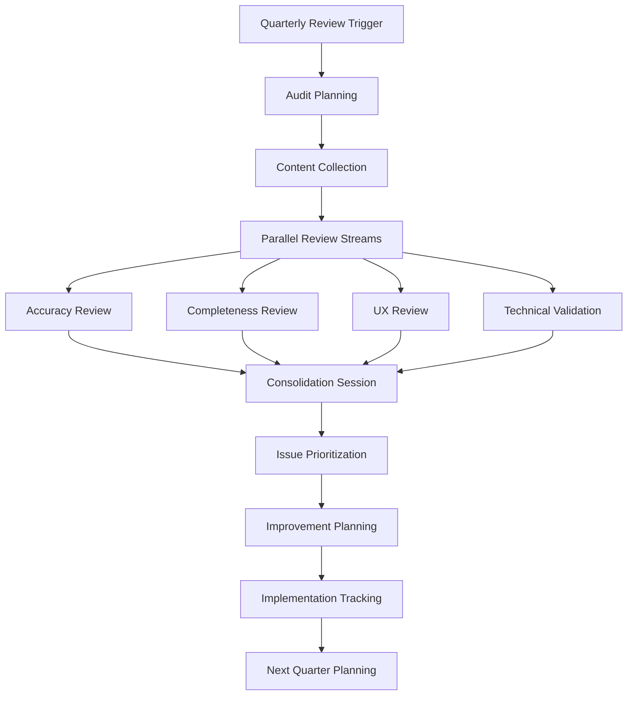
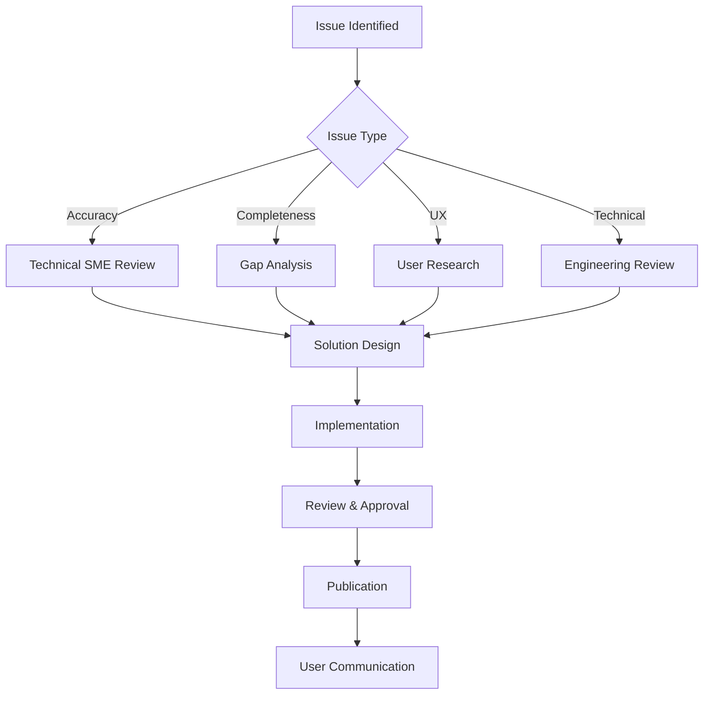
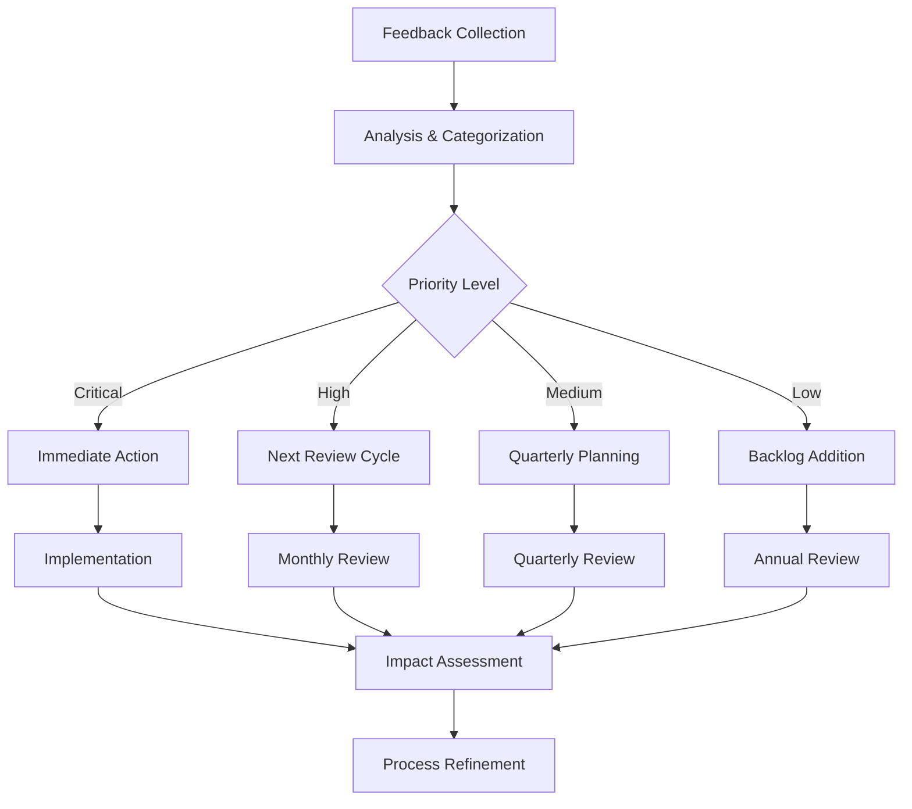

# Documentation Review Process

---
title: "Documentation Review Process"
type: "process"
category: "administration"
audience: ["maintainers", "contributors", "technical_writers"]
created_date: "2025-07-10"
updated_date: "2025-07-10"
version: "1.0.0"
status: "active"
review_cycle: "quarterly"
tags: ["documentation", "quality", "process", "review"]
related_docs: ["quality-management.md", "../best-practices/documentation-standards.md"]
---

## Overview

The Simone Framework Documentation Review Process ensures that all documentation remains accurate, comprehensive, and user-friendly. This process covers regular reviews, quality standards, and continuous improvement practices.

## Review Objectives

### Primary Goals
- **Accuracy**: Ensure all documentation reflects current system behavior
- **Completeness**: Verify coverage of all features and use cases
- **Usability**: Maintain clear, actionable, and accessible content
- **Consistency**: Standardize format, style, and structure across all docs

### Success Metrics
- **Coverage**: 100% of features documented
- **Accuracy**: <5% outdated content at any time
- **User Satisfaction**: >4.2/5 documentation usefulness rating
- **Maintenance**: <2 weeks resolution time for documentation issues

---

## Review Cycle Framework

### Quarterly Comprehensive Review

**Timeline**: First week of each quarter  
**Duration**: 1 week  
**Participants**: Documentation team, product owners, technical leads

#### Week Schedule
```
Monday    | Documentation Audit & Gap Analysis
Tuesday   | Content Accuracy Review
Wednesday | User Experience & Accessibility Review  
Thursday  | Technical Validation & Link Checking
Friday    | Prioritization & Planning Session
```

#### Deliverables
- [ ] Documentation audit report
- [ ] Priority improvement backlog
- [ ] Updated documentation roadmap
- [ ] Quality metrics dashboard

### Monthly Maintenance Review

**Timeline**: Second Friday of each month  
**Duration**: 2 hours  
**Participants**: Documentation maintainers, subject matter experts

#### Focus Areas
- Recent feature documentation updates
- User feedback and issue resolution
- Link validation and broken reference fixes
- Template and example updates

### Continuous Review (Ongoing)

**Trigger Events**:
- New feature releases
- API changes or deprecations
- User feedback submission
- Support ticket patterns indicating doc gaps

---

## Review Types & Checklists

### 1. Content Accuracy Review

**Purpose**: Verify documentation matches current system behavior

#### Checklist
- [ ] **Installation Instructions**
  - [ ] Test installation steps in clean environment
  - [ ] Verify all prerequisites are listed
  - [ ] Check compatibility with latest versions
  - [ ] Validate all download links and commands

- [ ] **Command Reference**
  - [ ] Test all example commands
  - [ ] Verify parameter descriptions
  - [ ] Check output examples match reality
  - [ ] Validate command availability

- [ ] **API Documentation**
  - [ ] Test all code examples
  - [ ] Verify parameter types and requirements
  - [ ] Check response format examples
  - [ ] Validate error code documentation

- [ ] **Configuration Examples**
  - [ ] Test all configuration snippets
  - [ ] Verify default values
  - [ ] Check file path references
  - [ ] Validate syntax examples

#### Tools
- `scripts/validate-examples.sh` - Automated code example testing
- `scripts/test-installation.sh` - Installation instruction verification
- `scripts/check-links.sh` - Link validation

### 2. Completeness Review

**Purpose**: Ensure comprehensive coverage of all features and use cases

#### Feature Coverage Matrix
| Component | User Guide | API Docs | Examples | Troubleshooting |
|-----------|------------|----------|----------|-----------------|
| Project Setup | ✓ | ✓ | ✓ | ✓ |
| Milestone Management | ✓ | ✓ | ✓ | ✓ |
| Sprint Planning | ✓ | ✓ | ✓ | ✓ |
| Task Management | ✓ | ✓ | ✓ | ✓ |
| Quality Gates | ✓ | ✓ | ✓ | ✓ |

#### Gap Analysis Checklist
- [ ] **New Features**: All released features documented within 1 sprint
- [ ] **Use Cases**: Common user workflows covered
- [ ] **Edge Cases**: Error scenarios and troubleshooting
- [ ] **Integration**: Third-party tool integration guides
- [ ] **Migration**: Upgrade and migration procedures

### 3. User Experience Review

**Purpose**: Optimize documentation for user needs and accessibility

#### UX Evaluation Criteria
- [ ] **Navigation & Structure**
  - [ ] Logical information hierarchy
  - [ ] Clear section organization
  - [ ] Effective cross-referencing
  - [ ] Search-friendly content structure

- [ ] **Content Quality**
  - [ ] Clear, concise writing
  - [ ] Appropriate technical level for audience
  - [ ] Actionable instructions
  - [ ] Helpful examples and illustrations

- [ ] **Accessibility**
  - [ ] WCAG 2.1 AA compliance for web content
  - [ ] Alternative text for images
  - [ ] Clear heading structure
  - [ ] Keyboard navigation support

#### User Journey Analysis
1. **New User Onboarding**
   - Getting started guide effectiveness
   - Time to first success measurement
   - Common stumbling points identification

2. **Feature Discovery**
   - Feature discoverability assessment
   - Search functionality evaluation
   - Related content suggestions

3. **Problem Resolution**
   - Troubleshooting guide completeness
   - Error message documentation
   - Support escalation pathways

### 4. Technical Validation Review

**Purpose**: Ensure technical accuracy and consistency

#### Technical Checklist
- [ ] **Code Examples**
  - [ ] Syntax validation
  - [ ] Execution testing
  - [ ] Security best practices
  - [ ] Performance considerations

- [ ] **System Requirements**
  - [ ] Platform compatibility
  - [ ] Version dependencies
  - [ ] Performance requirements
  - [ ] Security requirements

- [ ] **Architecture Documentation**
  - [ ] Diagram accuracy
  - [ ] Component relationships
  - [ ] Data flow correctness
  - [ ] Security model representation

---

## Review Roles & Responsibilities

### Documentation Review Board

**Composition**:
- **Documentation Lead** (Chair)
- **Product Owner** (Business perspective)
- **Technical Lead** (Technical accuracy)
- **UX Designer** (User experience)
- **QA Lead** (Quality validation)

**Responsibilities**:
- Quarterly review planning and execution
- Quality standards maintenance
- Review process improvement
- Documentation roadmap prioritization

### Subject Matter Experts (SMEs)

**Selection Criteria**:
- Deep knowledge of specific Simone Framework components
- Regular interaction with users
- Understanding of common use cases and pain points

**Responsibilities**:
- Technical accuracy review for assigned components
- User feedback interpretation
- Example validation and improvement
- Knowledge transfer to documentation team

### Community Contributors

**Involvement**:
- Feedback submission through established channels
- Documentation improvement suggestions
- Translation and localization efforts
- User experience insights sharing

---

## Quality Standards & Guidelines

### Documentation Quality Metrics

#### Quantitative Metrics
- **Coverage**: % of features with complete documentation
- **Accuracy**: % of tested examples that work correctly
- **Freshness**: % of content updated within target timeframes
- **Accessibility**: % of content meeting WCAG 2.1 AA standards

#### Qualitative Metrics
- **User Satisfaction**: Survey ratings and feedback analysis
- **Usability**: Task completion rates in user testing
- **Clarity**: Readability scores and expert assessment
- **Completeness**: Gap analysis and missing content identification

### Content Standards

#### Writing Standards
- **Clarity**: Use clear, concise language appropriate for the audience
- **Consistency**: Follow established style guide and terminology
- **Accuracy**: Ensure all information is current and correct
- **Actionability**: Provide specific, actionable instructions

#### Format Standards
- **Structure**: Use consistent heading hierarchy and organization
- **Markup**: Follow markdown best practices and conventions
- **Metadata**: Include complete YAML frontmatter
- **Cross-references**: Maintain accurate internal and external links

#### Example Standards
- **Functionality**: All code examples must execute successfully
- **Relevance**: Examples should reflect realistic use cases
- **Security**: Examples must follow security best practices
- **Maintenance**: Examples should be tested regularly

---

## Review Process Workflows

### Quarterly Review Workflow



### Issue Resolution Workflow



### Continuous Improvement Workflow



---

## Tools & Automation

### Automated Review Tools

#### Quality Validation Scripts
```bash
# Daily automated checks
./scripts/validate-docs.sh --quiet
./scripts/check-links.sh --skip-external
./scripts/validate-examples.sh --quick

# Weekly comprehensive validation
./scripts/test-installation.sh
./scripts/generate-command-docs.sh
./scripts/check-links.sh
```

#### Continuous Integration
- **Pre-commit hooks**: Markdown linting, YAML validation
- **Pull request checks**: Link validation, example testing
- **Nightly builds**: Full documentation validation suite
- **Release validation**: Comprehensive accuracy verification

### Review Management Tools

#### Documentation Tracking
- **Issue Tracking**: GitHub Issues with documentation labels
- **Review Scheduling**: Calendar integration for review cycles
- **Progress Monitoring**: Dashboard for review completion status
- **Quality Metrics**: Automated reporting and trend analysis

#### Collaboration Tools
- **Review Comments**: Structured feedback collection
- **Approval Workflows**: Multi-stage review approvals
- **Change Tracking**: Version control and change documentation
- **Communication**: Team notifications and status updates

---

## Feedback Integration

### User Feedback Channels

#### Direct Feedback
- **Documentation Comments**: Per-page feedback forms
- **GitHub Issues**: Structured issue templates for doc problems
- **User Surveys**: Quarterly satisfaction surveys
- **Support Tickets**: Documentation-related support analysis

#### Indirect Feedback
- **Analytics**: Page views, time spent, bounce rates
- **Search Queries**: Failed searches and popular queries  
- **Support Patterns**: Common questions indicating doc gaps
- **Community Discussions**: Forum and chat analysis

### Feedback Processing

#### Collection & Triage
1. **Automated Collection**: Feedback aggregation from all channels
2. **Initial Triage**: Categorization and priority assignment
3. **Expert Assignment**: Route to appropriate subject matter experts
4. **Impact Assessment**: Evaluate user impact and effort required

#### Response & Resolution
1. **Acknowledgment**: User notification within 48 hours
2. **Investigation**: Deep dive into reported issues
3. **Solution Development**: Content improvement or creation
4. **Implementation**: Updates with change notification
5. **Follow-up**: User satisfaction verification

---

## Success Measurement

### Key Performance Indicators

#### Documentation Quality KPIs
- **Accuracy Rate**: 95% of examples work correctly
- **Coverage Rate**: 100% of features documented within 2 sprints
- **Freshness Rate**: 90% of content updated within 6 months
- **User Satisfaction**: 4.2/5 average documentation rating

#### Process Efficiency KPIs
- **Review Completion**: 100% of scheduled reviews completed on time
- **Issue Resolution**: <2 weeks average resolution time
- **Feedback Response**: <48 hours acknowledgment time
- **Content Delivery**: <1 sprint for new feature documentation

#### User Impact KPIs
- **Task Success Rate**: 85% of users complete documented tasks
- **Time to Value**: <30 minutes for new user onboarding
- **Support Reduction**: 20% decrease in doc-related support tickets
- **Community Engagement**: Increasing community contributions

### Quarterly Review Outcomes

#### Review Report Template
```markdown
# Q[X] Documentation Review Report

## Executive Summary
- Review completion status
- Key findings and improvements
- Critical issues identified
- Next quarter priorities

## Metrics Summary
- Quality metrics comparison
- User satisfaction trends
- Process efficiency measures
- Community engagement stats

## Key Achievements
- Major documentation improvements
- Process optimizations
- Tool enhancements
- Community contributions

## Critical Issues
- High-priority problems identified
- Impact assessment
- Resolution timelines
- Risk mitigation plans

## Next Quarter Focus
- Priority improvement areas
- Resource allocation plans
- Process improvements
- Success metrics targets
```

---

## Process Improvement

### Continuous Enhancement

#### Review Process Evolution
- **Quarterly Process Review**: Evaluate and improve review procedures
- **Tool Enhancement**: Upgrade automation and collaboration tools
- **Training Updates**: Keep reviewers current on best practices
- **Industry Benchmarking**: Compare with documentation best practices

#### Community Involvement
- **Contributor Onboarding**: Enable community documentation contributions
- **Expert Network**: Build relationships with external subject matter experts
- **User Research**: Regular user interviews and usability testing
- **Feedback Loops**: Systematic collection and integration of improvement suggestions

### Annual Process Assessment

#### Comprehensive Evaluation
- **Process Effectiveness**: Quantitative and qualitative assessment
- **Resource Optimization**: Team allocation and tool utilization
- **Technology Upgrades**: Platform and tool modernization
- **Strategic Alignment**: Documentation strategy alignment with business goals

#### Strategic Planning
- **Long-term Roadmap**: Multi-year documentation strategy
- **Capability Development**: Team skills and tool capabilities
- **Partnership Opportunities**: External collaboration possibilities
- **Innovation Integration**: Emerging technology adoption

---

## Related Resources

### Internal Documentation
- [Documentation Standards](../best-practices/documentation-standards.md)
- [Quality Management Guide](quality-management.md)
- [Content Style Guide](../best-practices/content-style-guide.md)

### External References
- [Microsoft Writing Style Guide](https://docs.microsoft.com/en-us/style-guide/)
- [Google Developer Documentation Style Guide](https://developers.google.com/style)
- [WCAG 2.1 Guidelines](https://www.w3.org/WAI/WCAG21/quickref/)

### Tools & Scripts
- [Documentation Validation Scripts](../../scripts/)
- [Review Templates](../templates/review-templates/)
- [Quality Checklists](../templates/quality-checklists/)

---

**Process Owner**: Documentation Team Lead  
**Review Frequency**: Quarterly process review, annual comprehensive assessment  
**Last Updated**: 2025-07-10  
**Next Review**: 2025-10-10