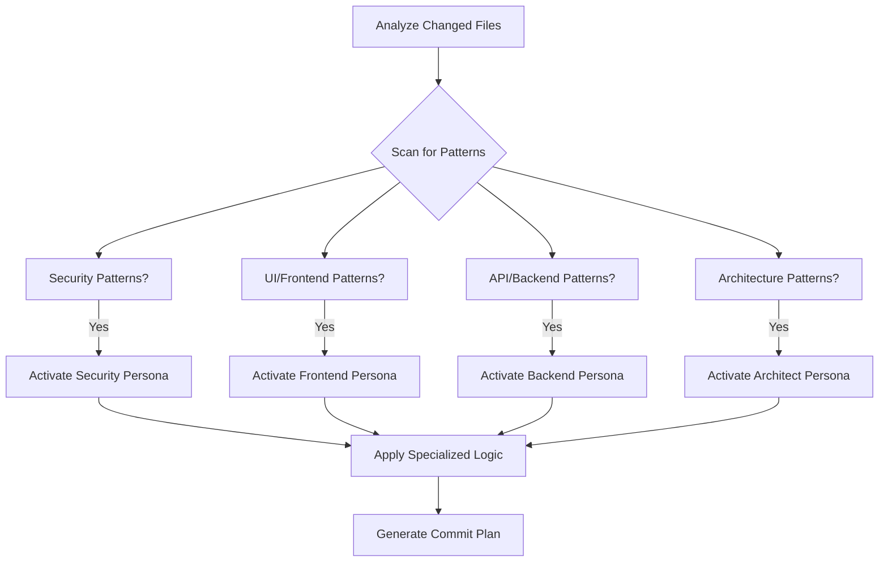
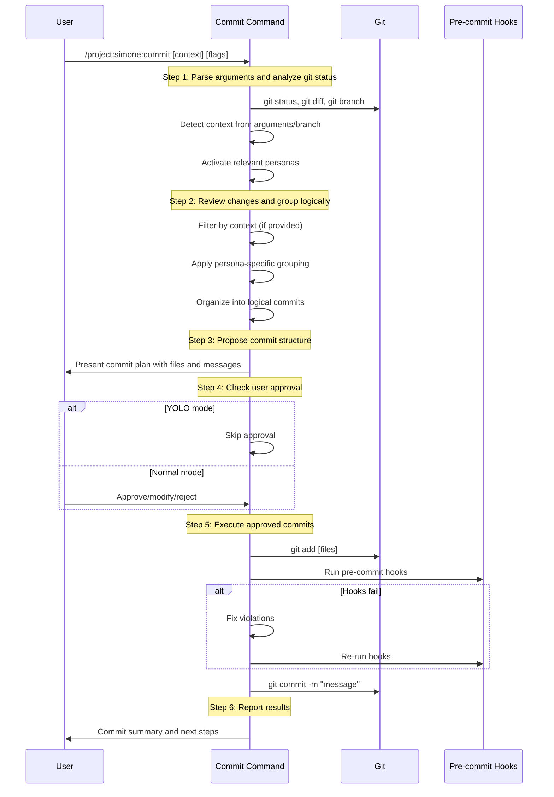
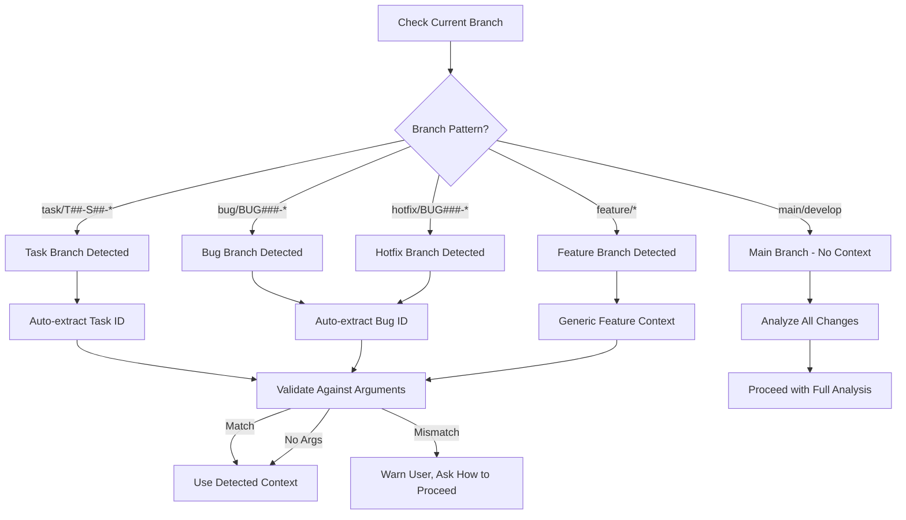
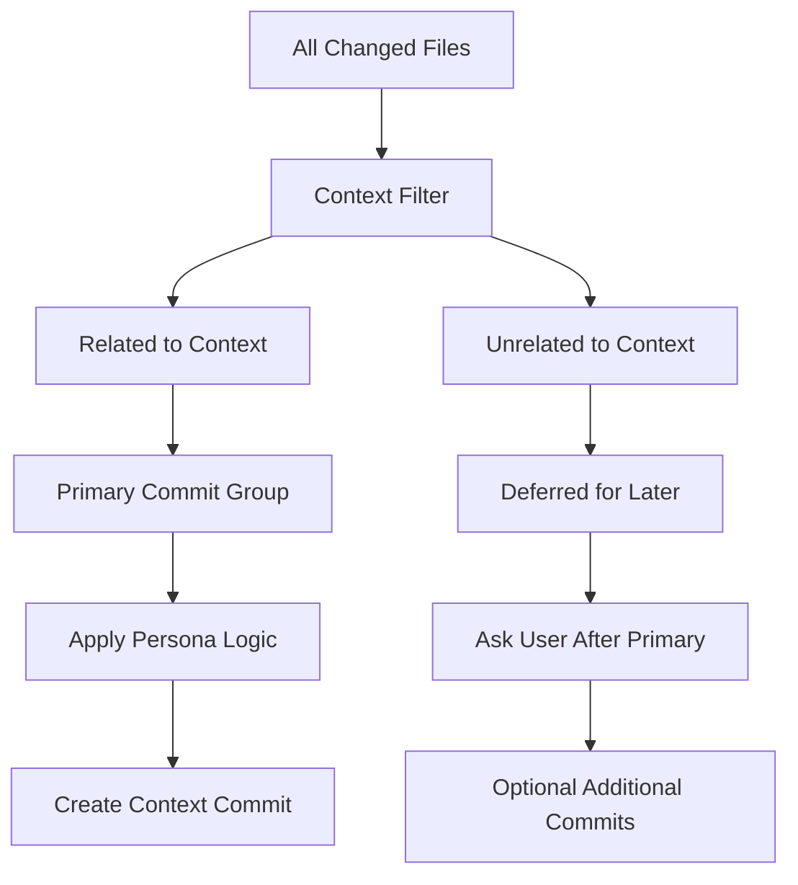
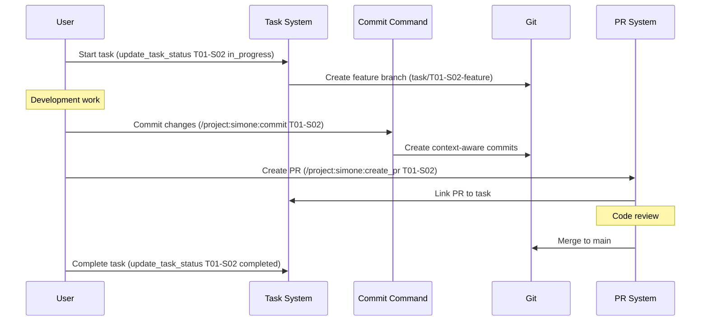

# Commit Command Documentation

## Overview

The `/project:simone:commit` command provides intelligent, context-aware git commit functionality with cognitive persona integration. It analyzes changed files, groups them logically, and creates meaningful commits with proper conventional commit formatting.

## Table of Contents

- [Core Features](#core-features)
- [Cognitive Personas Integration](#cognitive-personas-integration)
- [Usage Patterns](#usage-patterns)
- [Command Workflow](#command-workflow)
- [Context Detection](#context-detection)
- [Commit Organization](#commit-organization)
- [Advanced Features](#advanced-features)
- [Examples](#examples)
- [Best Practices](#best-practices)
- [Troubleshooting](#troubleshooting)

## Core Features

### 🎯 **Context-Aware Commits**
- **Task-based filtering**: Automatically identifies files related to specific tasks
- **Branch context detection**: Recognizes task/bug branches for automatic context
- **Logical grouping**: Organizes changes into coherent, reviewable commits
- **Smart filtering**: Separates related changes from unrelated modifications

### 🧠 **Cognitive Personas Integration**
- **Domain expertise**: Specialized commit analysis for different technical domains
- **Automatic activation**: Intelligent persona selection based on file changes
- **Multi-persona support**: Combines multiple perspectives for complex changes
- **Transparent reasoning**: Optional introspection mode for decision visibility

### 🔄 **Intelligent Workflow**
- **6-step process**: Systematic analysis, grouping, approval, and execution
- **User approval gates**: Optional confirmation before commits
- **Pre-commit validation**: Automatic fixing of hook violations
- **Progress tracking**: Todo-based progress management

## Cognitive Personas Integration

### Available Personas

| Persona | Focus Area | Use Cases |
|---------|------------|-----------|
| `--persona-architect` | System architecture, design patterns | Core system changes, architectural decisions |
| `--persona-security` | Security analysis, threat detection | Authentication, authorization, security fixes |
| `--persona-frontend` | UI/UX, user interfaces | Component changes, styling, accessibility |
| `--persona-backend` | APIs, databases, services | Server-side logic, data layer modifications |
| `--persona-analyzer` | Code quality, metrics | Refactoring, optimization, analysis improvements |
| `--persona-mentor` | Best practices, education | Code reviews, learning-focused commits |
| `--persona-refactorer` | Code cleanup, optimization | Maintenance, cleanup, technical debt |
| `--persona-performance` | Optimization, efficiency | Performance improvements, caching |
| `--persona-qa` | Testing, quality assurance | Test additions, quality validation |

### Automatic Persona Activation

The command automatically activates relevant personas based on file changes:



### Pattern Detection

**Security Patterns:**
- Authentication/authorization code
- Validation logic
- Encryption/decryption
- Access control lists
- Security configuration

**Frontend Patterns:**
- React/Vue/Angular components
- CSS/SCSS/styling files
- HTML templates
- User interface logic
- Accessibility features

**Backend Patterns:**
- API endpoints
- Database models/migrations
- Service layer code
- Middleware
- Server configuration

**Architecture Patterns:**
- Core system changes
- Design pattern implementations
- Structural modifications
- Framework updates
- Infrastructure changes

## Usage Patterns

### Basic Usage

```bash
# Commit all changes with intelligent grouping
/project:simone:commit

# Commit changes for specific task
/project:simone:commit T01-S02

# Commit with specific persona
/project:simone:commit --persona-security

# Auto-commit without approval (YOLO mode)
/project:simone:commit YOLO
```

### Advanced Usage

```bash
# Multiple personas with introspection
/project:simone:commit T001 --persona-security --persona-qa --introspect

# Architecture changes with deep analysis
/project:simone:commit --persona-architect --think-deep

# Bug fix with quality focus
/project:simone:commit BUG123 --persona-analyzer --persona-qa

# Performance optimization tracking
/project:simone:commit --persona-performance --introspect
```

### Context-Specific Usage

```bash
# Sprint-level commits
/project:simone:commit S02

# Bug fix commits
/project:simone:commit BUG001

# General task commits
/project:simone:commit T003

# Completed task commits
/project:simone:commit TX01-S02
```

## Command Workflow

The commit command follows a systematic 6-step process:



### Step Details

#### Step 1: Parse Arguments and Analyze Git Status
- **Git analysis**: Runs `git status`, `git diff --staged`, `git diff`, `git branch --show-current` in parallel
- **Context detection**: Identifies task/bug/sprint context from arguments or branch name
- **Persona activation**: Automatically selects relevant personas based on file patterns
- **Branch validation**: Verifies context matches current branch if applicable

#### Step 2: Review Changes and Group Logically
- **Context filtering**: Separates changes related to specified context
- **Persona-driven grouping**: Applies specialized logic based on activated personas
- **Logical organization**: Groups related changes into coherent commits
- **Dependency analysis**: Orders commits based on logical dependencies

#### Step 3: Propose Commit Structure
- **Commit planning**: Defines files, messages, and reasoning for each commit
- **Conventional commits**: Uses proper conventional commit format
- **Context inclusion**: Incorporates task/bug IDs in commit messages
- **Review preparation**: Organizes commits for effective code review

#### Step 4: Check User Approval
- **Approval gate**: Presents complete plan for user confirmation (unless YOLO mode)
- **Modification support**: Allows users to adjust messages or scope
- **Flexibility**: Supports partial approval or complete plan changes

#### Step 5: Execute Approved Commits
- **File staging**: Uses `git add` for specified files
- **Pre-commit validation**: Runs and fixes any pre-commit hook violations
- **Commit creation**: Executes commits with approved messages
- **Sequential processing**: Handles multiple commits in proper order

#### Step 6: Report Results
- **Summary**: Lists created commits with SHAs and messages
- **Status**: Reports remaining changes and repository state
- **Next steps**: Suggests follow-up actions (PR creation, status updates)

## Context Detection

### Task ID Patterns

The command recognizes several task ID formats:

**Sprint Tasks:**
- Format: `T<NN>-S<NN>` (e.g., T01-S02, T03-S02)
- Location: `.simone/03_SPRINTS/S##_M##_*/`
- Completed: `TX<NN>-S<NN>` format

**General Tasks:**
- Format: `T<NNN>` (e.g., T001, T002)
- Location: `.simone/04_GENERAL_TASKS/`
- Completed: `TX<NNN>` format

**Bug Reports:**
- Format: `BUG<NNN>` (e.g., BUG001, BUG002)
- Location: `.simone/06_BUGS/`
- Associated files: Bug reports, fixes, related tasks

**Sprint-Level:**
- Format: `S<NN>` (e.g., S01, S02)
- Scope: All tasks within the specified sprint
- Pattern: `T*-S<NN>` matching

### Branch Context Detection



### Context Validation

When context is detected from both arguments and branch name:

1. **Match**: Use the detected context
2. **Mismatch**: Warn user and ask how to proceed
3. **Argument only**: Use argument context
4. **Branch only**: Use branch context
5. **Neither**: Analyze all changes

## Commit Organization

### Context-Based Filtering

When context is provided:



### Persona-Driven Grouping

Each persona applies specialized grouping logic:

**Architecture Persona:**
- Groups by system components
- Separates structural from functional changes
- Orders by dependency hierarchy
- Focuses on design pattern consistency

**Security Persona:**
- Isolates security-critical changes
- Groups authentication/authorization together
- Separates security fixes from features
- Validates sensitive information handling

**Frontend Persona:**
- Groups UI components by feature
- Separates styling from logic
- Orders by component hierarchy
- Focuses on user experience coherence

**Backend Persona:**
- Groups API changes by domain
- Separates data layer from business logic
- Orders by service dependencies
- Focuses on system integration

### Logical Grouping Rules

**Standard Grouping Logic:**
1. **Task completion**: All files related to specific task
2. **Feature additions**: New functionality grouped by scope
3. **Configuration updates**: Infrastructure and config changes
4. **Documentation updates**: Docs grouped by type/domain
5. **Bug fixes**: Fixes grouped by affected functionality
6. **Refactoring**: Code improvements separate from features
7. **Tests**: Test changes grouped with related functionality

**Commit Separation Criteria:**
- **Independent revertibility**: Each commit can be reverted safely
- **Logical coherence**: Changes serve single purpose
- **Review efficiency**: Commits are reviewable in reasonable scope
- **Dependency respect**: Dependent changes in proper order

## Advanced Features

### Introspection Mode (`--introspect`)

When `--introspect` flag is used, the command provides transparent reasoning:

```markdown
🤔 **Thinking Process:**
- Detected 3 modified files: auth.js, login.component.ts, auth.test.js
- Security patterns found: authentication logic, token validation
- Frontend patterns found: login component, user interface
- Activating Security + Frontend personas

🎯 **Decision Rationale:**
- Group 1: auth.js + auth.test.js (backend security logic + tests)
- Group 2: login.component.ts (frontend user interface)
- Separation reason: Backend security logic should be reviewed separately from UI

🔍 **Dependency Analysis:**
- auth.js provides API consumed by login.component.ts
- Safe to commit auth.js first, then frontend component
- No circular dependencies detected

✅ **Final Commit Structure:**
1. "feat(auth): implement token validation system" (auth.js, auth.test.js)
2. "feat(ui): add login component with token integration" (login.component.ts)
```

### Multi-Model Consensus (`--consensus`)

For complex changes, the command can use multiple models to reach consensus on optimal commit organization:

```markdown
🤝 **Consensus Analysis:**
- Model A suggests: Group by file type (all .js together)
- Model B suggests: Group by feature domain (auth together)
- Model C suggests: Group by testing strategy (impl + tests)

📊 **Consensus Result:**
- 2/3 models prefer domain-based grouping
- Final decision: Group by feature domain
- Confidence: High (67% agreement)
```

### Deep Analysis (`--think-deep`)

Extended analysis for complex change sets:

```markdown
🔬 **Deep Analysis:**
- Change impact assessment: 15 files across 4 domains
- Complexity analysis: 3 high-complexity, 8 medium, 4 low
- Risk assessment: 2 security-sensitive files identified
- Test coverage: 80% of changes have corresponding tests
- Documentation impact: 3 docs need updates

📈 **Optimization Recommendations:**
- Split into 5 commits for optimal review
- Security changes in isolated commit
- Documentation updates in final commit
- Estimated review time: 45-60 minutes total
```

## Examples

### Example 1: Simple Task Commit

```bash
# Command
/project:simone:commit T01-S02

# Context Detection
Context provided: 'T01-S02' - I will focus on changes related to this context
Found task file: .simone/03_SPRINTS/S02_M01_Auth/T01-S02_user_authentication.md
Related files: src/auth/auth.service.js, src/auth/auth.test.js, src/components/Login.vue

# Proposed Commit
Files: src/auth/auth.service.js, src/auth/auth.test.js, src/components/Login.vue
Message: "feat(auth): implement t01-s02 user authentication system"
Reasoning: All files are part of the user authentication task implementation

# Result
✅ Commit created: a1b2c3d "feat(auth): implement t01-s02 user authentication system"
```

### Example 2: Multi-Persona Analysis

```bash
# Command
/project:simone:commit --persona-security --persona-frontend --introspect

# Introspection Output
🤔 Thinking Process:
- Security persona activated: Found authentication patterns
- Frontend persona activated: Found UI component changes
- Analyzing optimal commit structure...

🎯 Decision Rationale:
- Security-critical auth logic should be reviewed separately
- UI components have different review requirements
- Separating concerns for specialized review

# Proposed Commits
Commit 1 (Security focus):
Files: src/auth/*, tests/auth/*
Message: "feat(security): implement authentication middleware"

Commit 2 (Frontend focus):
Files: src/components/Login.vue, src/styles/auth.scss
Message: "feat(ui): add login interface with security integration"
```

### Example 3: Bug Fix with Quality Focus

```bash
# Command
/project:simone:commit BUG123 --persona-analyzer --persona-qa

# Analysis
Bug ID detected: BUG123
Found bug report: .simone/06_BUGS/BUG123_login_validation.md
QA persona: Emphasizing test coverage and validation
Analyzer persona: Focusing on code quality improvements

# Proposed Commit
Files: src/auth/validation.js, tests/auth/validation.test.js, .simone/06_BUGS/BUG123_login_validation.md
Message: "fix(auth): resolve bug123 login validation error"
Reasoning: Bug fix with comprehensive test coverage and documentation update
```

### Example 4: YOLO Mode

```bash
# Command
/project:simone:commit T03-S01 YOLO

# Processing
Context provided: 'T03-S01' - Auto-commit mode enabled
Skipping user approval as requested
Auto-detecting personas: Architecture, Backend

# Result
✅ Auto-committed: b4c5d6e "feat(api): implement t03-s01 user profile endpoints"
Files committed: 8 files
No user interaction required
```

## Best Practices

### Commit Message Guidelines

**Conventional Commit Format:**
```
<type>(<scope>): <description>

[optional body]

[optional footer]
```

**Type Guidelines:**
- `feat:` New features or functionality
- `fix:` Bug fixes and error corrections
- `refactor:` Code improvements without functionality changes
- `docs:` Documentation updates
- `test:` Test additions or modifications
- `chore:` Maintenance tasks and configuration
- `hotfix:` Critical fixes for production issues

**Scope Guidelines:**
- Use domain-specific scopes: `auth`, `api`, `ui`, `db`
- Keep scopes consistent within project
- Avoid overly broad scopes like `misc` or `general`

**Task/Bug Integration:**
- Include task IDs in lowercase: `t01-s02`, `bug123`
- Place context in description, not scope
- Example: `feat(auth): implement t01-s02 user authentication`

### Context Usage Recommendations

**When to Use Context:**
- ✅ Working on specific task implementation
- ✅ Fixing identified bugs
- ✅ Completing sprint-related work
- ✅ Large changes spanning multiple domains

**When to Skip Context:**
- ❌ Small, isolated changes
- ❌ Emergency hotfixes
- ❌ Maintenance and cleanup tasks
- ❌ Documentation-only updates

### Persona Selection Guidelines

**Single Persona:**
- Use when changes are clearly domain-specific
- Provides focused, specialized analysis
- Faster processing and simpler decisions

**Multiple Personas:**
- Use for cross-domain changes
- Provides comprehensive analysis
- Better for complex architectural changes
- Use `--introspect` to understand reasoning

**Automatic Activation:**
- Trust automatic persona detection for most cases
- Override only when you have specific needs
- Combine with `--introspect` to learn patterns

### Review Optimization

**Optimal Commit Size:**
- **Small commits**: 1-5 files, single logical change
- **Medium commits**: 5-15 files, feature implementation
- **Large commits**: 15+ files, major refactoring or new modules

**Review Considerations:**
- Separate security-sensitive changes
- Group related tests with implementation
- Isolate configuration from code changes
- Document breaking changes in separate commits

## Troubleshooting

### Common Issues

**Issue: "No changes found related to context"**
```bash
# Cause: Task ID doesn't match any modified files
# Solution: Check task file and git diff
git diff --name-only
grep -r "T01-S02" .simone/
```

**Issue: "Context mismatch between branch and arguments"**
```bash
# Cause: Branch name suggests different task than argument
# Current branch: task/T02-S01-feature
# Argument: T01-S02
# Solution: Clarify which context to use or switch branch
git branch --show-current
```

**Issue: "Pre-commit hooks failing"**
```bash
# Cause: Code doesn't meet quality standards
# Solution: Command will auto-fix most issues
# Manual intervention may be needed for complex violations
```

**Issue: "Too many files for single commit"**
```bash
# Cause: Large changeset without proper context
# Solution: Use task context or break into multiple sessions
/project:simone:commit T01-S02  # Focus on specific task
```

### Recovery Procedures

**Undo Last Commit:**
```bash
git reset --soft HEAD~1  # Keep changes staged
git reset HEAD~1         # Keep changes unstaged
git reset --hard HEAD~1  # Discard changes (dangerous)
```

**Split Large Commit:**
```bash
git reset --soft HEAD~1  # Undo commit, keep changes staged
git reset                # Unstage all changes
# Use commit command with context to create focused commits
/project:simone:commit T01-S02
```

**Fix Commit Message:**
```bash
git commit --amend -m "new message"  # Amend last commit message
```

### Debugging Commands

**Check Git Status:**
```bash
git status
git diff --staged
git diff
git log --oneline -5
```

**Validate Task Context:**
```bash
find .simone -name "*T01-S02*"
grep -r "task_id: T01-S02" .simone/
```

**Check Branch Context:**
```bash
git branch --show-current
git log --oneline --grep="T01-S02"
```

## Integration with Simone Workflow

### Task Lifecycle Integration



### Quality Gates Integration

The commit command integrates with Simone's quality assurance workflow:

1. **Pre-commit hooks**: Automatic code quality validation
2. **Task validation**: Ensures commits align with task requirements
3. **Documentation updates**: Prompts for documentation changes
4. **Test coverage**: Validates test additions for new features
5. **Review preparation**: Organizes commits for efficient code review

### MCP Server Integration

**Work History Server:**
- Tracks commit patterns and success rates
- Provides recommendations based on historical data
- Documents commit reasoning for future reference

**Sequential Thinking Server:**
- Structures complex commit organization decisions
- Provides step-by-step reasoning for commit grouping
- Validates logical dependencies between changes

**Serena IDE Server:**
- Enhances code change analysis
- Provides context-aware file relationship detection
- Improves commit message quality through code understanding

---

## Quick Reference

### Command Syntax
```bash
/project:simone:commit [context] [persona-flags] [advanced-flags]
```

### Context Patterns
- Task: `T01-S02`, `T003`, `TX01-S02`
- Bug: `BUG001`, `BUG123`
- Sprint: `S01`, `S02`
- Auto-commit: `YOLO`

### Persona Flags
- `--persona-architect` - Architecture focus
- `--persona-security` - Security analysis
- `--persona-frontend` - UI/UX focus
- `--persona-backend` - Server-side focus
- `--persona-analyzer` - Code quality
- `--persona-mentor` - Best practices
- `--persona-refactorer` - Cleanup focus
- `--persona-performance` - Optimization
- `--persona-qa` - Testing focus

### Advanced Flags
- `--introspect` - Show reasoning
- `--consensus` - Multi-model analysis
- `--think-deep` - Extended analysis

### Common Workflows
```bash
# Standard task commit
/project:simone:commit T01-S02

# Security-focused review
/project:simone:commit --persona-security --introspect

# Auto-commit for simple changes
/project:simone:commit T003 YOLO

# Multi-domain analysis
/project:simone:commit --persona-architect --persona-security
```

---

*Commit Command Documentation v1.0 | Simone Framework | Intelligent Git workflow integration*