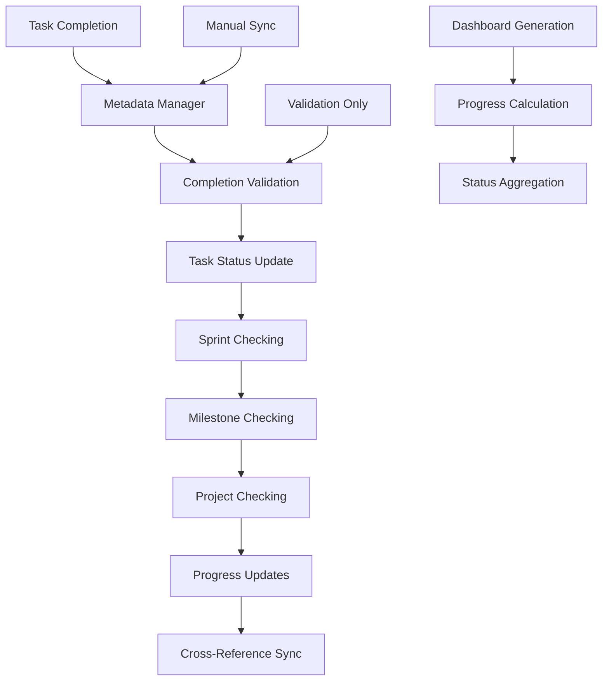

# Metadata Manager - Hierarchical Completion Tracking

**Purpose**: Comprehensive guide to the enhanced metadata manager system for hierarchical completion tracking in the Simone Framework.

**Version**: 3.0.0 | **Updated**: 2025-01-14

## Overview

The Metadata Manager is the central system responsible for maintaining consistency and tracking completion status across the entire project hierarchy. It ensures that when tasks complete, the status properly propagates up through sprints, milestones, and project levels.

## Core Architecture



## Enhanced Features (v3.0.0)

### 1. Completion Validation
- **Acceptance Criteria Checking**: Prevents completion without all criteria met
- **Quality Gate Validation**: Ensures quality standards before completion
- **Output Documentation**: Encourages proper completion documentation
- **Dependency Validation**: Checks prerequisite completion

### 2. Hierarchical Status Propagation
- **Task → Sprint**: Automatically marks sprints complete when all tasks done
- **Sprint → Milestone**: Automatically marks milestones complete when all sprints done
- **Milestone → Project**: Automatically marks project complete when all milestones done
- **Progress Percentages**: Real-time progress tracking at all levels

### 3. Comprehensive Synchronization
- **Cross-Reference Updates**: Maintains consistency across all tracking files
- **Metadata Repair**: Automatically fixes detected inconsistencies
- **Atomic Transactions**: Safe updates with rollback capability
- **Audit Trail**: Complete logging of all metadata changes

## Core Functions

### Primary Update Function

```bash
update_task_status() {
    local task_id="$1"
    local new_status="$2"
    local effort_hours="${3:-}"
    local reason="${4:-}"
    
    # NEW: Completion validation
    if [[ "$new_status" == "completed" ]]; then
        validate_completion_requirements "$task_file" || return 1
    fi
    
    # Atomic transaction processing
    # NEW: Hierarchical completion checking
    if [[ "$new_status" == "completed" && -n "$sprint_dir" ]]; then
        check_sprint_completion "$sprint_dir"
    fi
}
```

### Completion Validation Functions

#### validate_completion_requirements()
```bash
validate_completion_requirements() {
    local task_file="$1"
    local errors=0
    
    # Check acceptance criteria completion
    local unchecked_criteria=$(grep -c "^- \[ \]" "$task_file" 2>/dev/null || echo "0")
    if [[ $unchecked_criteria -gt 0 ]]; then
        echo "❌ $unchecked_criteria acceptance criteria not completed"
        ((errors++))
    fi
    
    # Check quality gates
    local failed_gates=$(grep -c "quality_gate: failed" "$task_file" 2>/dev/null || echo "0")
    if [[ $failed_gates -gt 0 ]]; then
        echo "❌ $failed_gates quality gates failed"
        ((errors++))
    fi
    
    return $errors
}
```

### Hierarchical Checking Functions

#### check_sprint_completion()
```bash
check_sprint_completion() {
    local sprint_dir="$1"
    
    # Count total and completed tasks
    local total_tasks=$(find "$sprint_dir" -name "*.md" -not -name "*meta*" | wc -l)
    local completed_tasks=0
    
    # Count completed tasks
    while IFS= read -r -d '' task_file; do
        if grep -q "^status: completed" "$task_file"; then
            ((completed_tasks++))
        fi
    done < <(find "$sprint_dir" -name "*.md" -not -name "*meta*" -print0)
    
    # Auto-complete sprint if all tasks done
    if [[ $completed_tasks -eq $total_tasks ]]; then
        update_sprint_status "$sprint_dir" "completed"
        
        # Check milestone completion
        local milestone_id=$(basename "$sprint_dir" | grep -o "M[0-9]\+")
        if [[ -n "$milestone_id" ]]; then
            check_milestone_completion "$milestone_id"
        fi
    fi
}
```

#### check_milestone_completion()
```bash
check_milestone_completion() {
    local milestone_id="$1"
    
    # Count total and completed sprints
    local total_sprints=$(find ".simone/03_SPRINTS" -name "*$milestone_id*" -type d | wc -l)
    local completed_sprints=0
    
    # Check each sprint status
    while IFS= read -r -d '' sprint_dir; do
        local sprint_meta=$(find "$sprint_dir" -name "*sprint*meta*.md" | head -1)
        if [[ -f "$sprint_meta" ]]; then
            local sprint_status=$(grep "^status:" "$sprint_meta" | cut -d':' -f2 | xargs)
            if [[ "$sprint_status" == "completed" ]]; then
                ((completed_sprints++))
            fi
        fi
    done < <(find ".simone/03_SPRINTS" -name "*$milestone_id*" -type d -print0)
    
    # Auto-complete milestone if all sprints done
    if [[ $completed_sprints -eq $total_sprints ]]; then
        update_milestone_status "$milestone_dir" "completed"
        check_project_completion
    fi
}
```

#### check_project_completion()
```bash
check_project_completion() {
    # Count total and completed milestones
    local total_milestones=$(find ".simone/02_REQUIREMENTS" -name "M*" -type d | wc -l)
    local completed_milestones=0
    
    # Check each milestone status
    while IFS= read -r -d '' milestone_dir; do
        local milestone_meta=$(find "$milestone_dir" -name "*milestone*meta*.md" | head -1)
        if [[ -f "$milestone_meta" ]]; then
            local milestone_status=$(grep "^status:" "$milestone_meta" | cut -d':' -f2 | xargs)
            if [[ "$milestone_status" == "completed" ]]; then
                ((completed_milestones++))
            fi
        fi
    done < <(find ".simone/02_REQUIREMENTS" -name "M*" -type d -print0)
    
    # Mark project complete if all milestones done
    if [[ $completed_milestones -eq $total_milestones ]]; then
        echo "🎉 ALL MILESTONES COMPLETED - PROJECT COMPLETE!"
        update_project_status "completed"
        generate_project_completion_report
    fi
}
```

### Synchronization Functions

#### sync_all_metadata()
```bash
sync_all_metadata() {
    echo "🔄 Synchronizing all metadata across project hierarchy"
    
    # Step 1: Validate completion requirements
    local validation_errors=0
    while IFS= read -r -d '' task_file; do
        local task_status=$(grep "^status:" "$task_file" | cut -d':' -f2 | xargs)
        if [[ "$task_status" == "completed" ]]; then
            if ! validate_completion_requirements "$task_file"; then
                ((validation_errors++))
            fi
        fi
    done < <(find ".simone" -name "*.md" -path "*/03_SPRINTS/*" -o -path "*/04_GENERAL_TASKS/*" -print0)
    
    # Step 2: Sync sprint progress
    while IFS= read -r -d '' sprint_dir; do
        check_sprint_completion "$sprint_dir"
    done < <(find ".simone/03_SPRINTS" -type d -mindepth 1 -print0)
    
    # Step 3: Sync milestone progress
    while IFS= read -r -d '' milestone_dir; do
        local milestone_id=$(basename "$milestone_dir" | grep -o "M[0-9]\+")
        if [[ -n "$milestone_id" ]]; then
            check_milestone_completion "$milestone_id"
        fi
    done < <(find ".simone/02_REQUIREMENTS" -name "M*" -type d -print0)
    
    # Step 4: Sync project status
    check_project_completion
}
```

### Dashboard Generation

#### generate_completion_dashboard()
```bash
generate_completion_dashboard() {
    echo "## 📊 Completion Status Dashboard"
    echo "**Generated**: $(date '+%Y-%m-%d %H:%M:%S')"
    
    # Calculate project metrics
    local total_milestones=$(find ".simone/02_REQUIREMENTS" -name "M*" -type d | wc -l)
    local completed_milestones=0
    local total_sprints=$(find ".simone/03_SPRINTS" -type d -mindepth 1 | wc -l)
    local completed_sprints=0
    local total_tasks=0
    local completed_tasks=0
    
    # Count completions at each level
    # [counting logic...]
    
    # Calculate percentages
    local project_progress=0
    if [[ $total_milestones -gt 0 ]]; then
        project_progress=$(( (completed_milestones * 100) / total_milestones ))
    fi
    
    echo "### 🎯 Project Overview"
    echo "- **Project Progress**: $project_progress% ($completed_milestones/$total_milestones milestones)"
    echo "- **Sprint Progress**: $sprint_progress% ($completed_sprints/$total_sprints sprints)"
    echo "- **Task Progress**: $task_progress% ($completed_tasks/$total_tasks tasks)"
}
```

## Command Line Interface

### Basic Usage
```bash
# Update task status with hierarchical checking
.simone/01_UTILS/metadata-manager.sh update_task TASK_001 completed

# Comprehensive metadata sync
.simone/01_UTILS/metadata-manager.sh sync_all

# Generate completion dashboard
.simone/01_UTILS/metadata-manager.sh completion_dashboard

# Validate metadata consistency
.simone/01_UTILS/metadata-manager.sh validate

# Check specific task/sprint/milestone completion
.simone/01_UTILS/metadata-manager.sh check_completion TASK_001
```

### Advanced Operations
```bash
# Initialize metadata manager
.simone/01_UTILS/metadata-manager.sh init

# Validate completion requirements for specific task
validate_completion_requirements .simone/03_SPRINTS/S01/TASK_001.md

# Manual sprint completion check
check_sprint_completion .simone/03_SPRINTS/S01_M01_Sprint

# Force milestone completion check
check_milestone_completion M01
```

## Integration with Commands

### update_task_status Command Integration
```markdown
## Enhanced Workflow (8 Steps)

1. Initialize validation and start transaction
2. Parse arguments and locate task file
3. Validate current status and transition
4. **NEW**: Validate completion requirements (if marking completed)
5. Execute atomic metadata update using metadata-manager
6. Validate all updates succeeded
7. Commit transaction or rollback on failure
8. **NEW**: Check hierarchical completion (sprint/milestone/project)
```

### do_task_auto Command Integration
```bash
# After task completion in do_task_auto
if [[ "$task_status" == "completed" ]]; then
    echo "🔗 Checking hierarchical completion status..."
    .simone/01_UTILS/metadata-manager.sh check_completion "$TASK_ID"
fi
```

### sync_metadata Command Integration
```bash
# Full project synchronization
/project:simone:sync_metadata

# Dashboard only
/project:simone:sync_metadata --dashboard

# Validation only
/project:simone:sync_metadata --validate-only

# Aggressive repair mode
/project:simone:sync_metadata --fix-inconsistencies
```

## Transaction Management

### Atomic Updates
```bash
# Begin transaction
transaction_id=$(begin_update_transaction "task_status_update")

# Perform updates
update_task_file_metadata "$task_file" "$new_status"
update_manifest_task_status "$task_id" "$new_status"
update_sprint_meta_status "$sprint_dir" "$task_id" "$new_status"

# Commit or rollback
if validate_all_updates; then
    commit_transaction "$transaction_id"
else
    rollback_transaction "$transaction_id"
fi
```

### Backup and Recovery
```bash
# Automatic backup before changes
backup_file "$task_file" "$transaction_id"
backup_file "$MANIFEST_FILE" "$transaction_id"

# Recovery on failure
restore_from_backup "$transaction_id"
```

## Configuration and Setup

### Environment Variables
```bash
# Set in project environment
export SIMONE_ROOT=".simone"
export MANIFEST_FILE=".simone/00_PROJECT_MANIFEST.md"
export VALIDATION_LOG=".simone/.cache/validation.log"
export TRANSACTION_DIR=".simone/.cache/transactions"
```

### Initialization
```bash
# Initialize metadata manager
init_metadata_manager() {
    mkdir -p "$SIMONE_ROOT/.cache/transactions"
    mkdir -p "$SIMONE_ROOT/.cache/backups"
    touch "$VALIDATION_LOG"
    
    # Initialize database connections if needed
    # Set up logging
    # Validate project structure
}
```

## Performance and Optimization

### Efficient Scanning
```bash
# Use find with specific patterns
find "$SIMONE_ROOT" -name "*.md" -path "*/03_SPRINTS/*" -o -path "*/04_GENERAL_TASKS/*"

# Batch operations when possible
while IFS= read -r -d '' file; do
    # Process multiple files in single loop
done < <(find ... -print0)
```

### Caching Strategy
```bash
# Cache progress calculations
cache_file="$SIMONE_ROOT/.cache/progress_cache"
if [[ ! -f "$cache_file" || "$cache_file" -ot "$last_update" ]]; then
    recalculate_progress > "$cache_file"
fi
```

## Monitoring and Logging

### Comprehensive Logging
```bash
log_metadata_event() {
    local event_type="$1"
    local details="$2"
    local timestamp=$(date -u +%Y-%m-%dT%H:%M:%SZ)
    
    echo "[$timestamp] $event_type: $details" >> "$VALIDATION_LOG"
}
```

### Health Monitoring
```bash
# Regular health checks
validate_metadata_consistency() {
    local errors=0
    
    # Check project manifest exists
    # Check task files have required metadata
    # Check cross-reference consistency
    
    return $errors
}
```

## Security and Validation

### Input Validation
```bash
validate_task_id() {
    local task_id="$1"
    if [[ ! "$task_id" =~ ^TASK_[0-9]+(_S[0-9]+)?$ ]]; then
        echo "❌ Invalid task ID format: $task_id"
        return 1
    fi
}

validate_status_value() {
    local status="$1"
    local valid_statuses="pending in_progress review testing completed blocked cancelled"
    if [[ ! " $valid_statuses " =~ " $status " ]]; then
        echo "❌ Invalid status: $status"
        return 1
    fi
}
```

### Access Control
```bash
# Check write permissions
check_write_permissions() {
    if [[ ! -w "$SIMONE_ROOT" ]]; then
        echo "❌ No write permission to $SIMONE_ROOT"
        return 1
    fi
}
```

## Troubleshooting Integration

### Diagnostic Functions
```bash
# Generate comprehensive diagnostic report
generate_diagnostic_report() {
    echo "=== Metadata Manager Diagnostic Report ==="
    echo "Generated: $(date)"
    
    # System information
    echo "### System Info"
    echo "- Script: $(realpath "${BASH_SOURCE[0]}")"
    echo "- Working directory: $(pwd)"
    echo "- Simone root: $SIMONE_ROOT"
    
    # Project statistics
    echo "### Project Statistics"
    echo "- Milestones: $(find "$SIMONE_ROOT/02_REQUIREMENTS" -name "M*" -type d | wc -l)"
    echo "- Sprints: $(find "$SIMONE_ROOT/03_SPRINTS" -type d -mindepth 1 | wc -l)"
    echo "- Tasks: $(find "$SIMONE_ROOT" -name "*.md" -path "*/03_SPRINTS/*" -o -path "*/04_GENERAL_TASKS/*" | wc -l)"
    
    # Validation results
    echo "### Validation Results"
    validate_metadata_consistency
}
```

## Future Enhancements

### Planned Features
- **External Integration**: Support for external project management tools
- **Advanced Analytics**: Trend analysis and forecasting
- **Automated Reporting**: Scheduled progress reports
- **API Interface**: RESTful API for external tool integration
- **Real-time Monitoring**: Live dashboard updates

### Extension Points
```bash
# Plugin architecture for custom validation
register_completion_validator() {
    local validator_function="$1"
    COMPLETION_VALIDATORS+=("$validator_function")
}

# Hook system for external integrations
trigger_completion_hooks() {
    local completion_event="$1"
    for hook in "${COMPLETION_HOOKS[@]}"; do
        "$hook" "$completion_event"
    done
}
```

## Conclusion

The enhanced Metadata Manager system provides comprehensive hierarchical completion tracking that solves the core problem of completion status not propagating through the project hierarchy. With robust validation, atomic transactions, and comprehensive synchronization, it ensures accurate project progress tracking at all levels.

**Key Benefits**:
- ✅ **Automatic Status Propagation**: Tasks → Sprints → Milestones → Project
- ✅ **Completion Validation**: Prevents incomplete work from being marked done
- ✅ **Real-time Progress**: Accurate percentages at all hierarchy levels
- ✅ **Consistency Assurance**: All tracking systems stay synchronized
- ✅ **Audit Trail**: Complete history of all metadata changes
- ✅ **Recovery Capability**: Rollback and repair mechanisms

For troubleshooting specific issues, refer to the [Metadata Tracking Issues Guide](../troubleshooting/metadata-tracking-issues.md).