# Task Management System

**Purpose**: Comprehensive guide to Simone's task management capabilities  
**Audience**: Developers, Project Managers, Technical Leaders

## Overview

Simone's task management system is the heart of the framework, providing enterprise-grade task tracking with 21+ metadata fields, complete lifecycle management, and AI-optimized scoping. Every task is designed to be executable in a single Claude Code session while maintaining rich context and quality standards.

## Task Types and Categories

### Sprint Tasks
**Format**: `task-##-s##` (e.g., `task-01-s01`, `task-03-s02`)
- **Purpose**: Implementation work tied to specific sprints and milestones
- **Location**: `.simone/03_SPRINTS/S##_M##_Sprint_Name/`
- **Lifecycle**: Created → In Progress → Review → Testing → Completed
- **Branch naming**: `task/t##-s##-feature-name`

### General Tasks  
**Format**: `task-###` (e.g., `task-001`, `task-002`)
- **Purpose**: Work not tied to specific sprints (maintenance, research, technical debt resolution)
- **Location**: `.simone/04_GENERAL_TASKS/`
- **Lifecycle**: Same as sprint tasks
- **Branch naming**: `task/t###-feature-name`

### Technical Debt Resolution Tasks
**Format**: `task-###-debt-td###` (e.g., `task-015-debt-td003`)
- **Purpose**: Tasks specifically created to resolve technical debt items
- **Location**: `.simone/04_GENERAL_TASKS/` or within relevant sprint
- **Linking**: Must reference originating debt item (TD_###)
- **Lifecycle**: Standard task workflow with debt item status updates

### Completed Tasks
**Format**: `tx##-s##` or `tx###` (e.g., `tx01-s01`, `tx001`)
- **Purpose**: Archive of completed work for reference and velocity tracking
- **Status**: Automatically renamed when marked completed
- **Retention**: Maintained for project history and pattern analysis

## Task Metadata System

### Core Identification (Required)
```yaml
task_id: "task-01-s01"           # Unique identifier
task_title: "Implement user authentication"
task_type: "feature"             # feature, bug, refactor, documentation, infrastructure, research
milestone_id: "M01"              # Parent milestone
sprint_id: "S01_M01"            # Parent sprint (if applicable)
```

### Status and Progress Tracking
```yaml
status: "pending"                # pending, in_progress, review, testing, completed, blocked
priority: "high"                 # low, medium, high, critical
complexity: "medium"             # simple, medium, complex, very_complex
estimated_effort: "3.5"         # Hours (decimal allowed)
actual_effort: "4.2"            # Actual time spent
assignee: "john.doe"             # Developer assigned
```

### Risk and Business Context
```yaml
risk_level: "medium"             # low, medium, high
business_value: "high"           # low, medium, high, critical
technical_value: "medium"        # low, medium, high, critical
dependencies: ["task-01-s01"]    # Other tasks this depends on
blocked_by: ["EXTERNAL_API"]     # Current blockers
tags: ["auth", "security", "api"] # Searchable categories
```

### Temporal Tracking
```yaml
created_date: "2025-01-10 09:00"
updated_date: "2025-01-10 15:30"
```

## Task Complexity Guidelines

### Simple (Target: 1-2 hours)
- **Examples**: Update configuration, add logging, fix typos
- **Characteristics**: Single file changes, minimal testing required
- **Acceptance criteria**: 1-3 bullet points
- **No architecture impact**

### Medium (Target: 2-4 hours) 
- **Examples**: Add new endpoint, implement feature component, write integration test
- **Characteristics**: Multiple file changes, moderate testing required
- **Acceptance criteria**: 3-7 bullet points
- **Minimal architecture impact**

### Complex (Auto-split by framework)
- **Framework action**: Automatically broken into 2-3 Medium tasks
- **Rationale**: Maintains Claude Code session effectiveness
- **Process**: Uses intelligent task breakdown algorithms

### Very Complex (Not allowed)
- **Framework action**: Rejected during task creation
- **Alternative**: Must be broken down at sprint planning level
- **Escalation**: Review sprint scope and requirements clarity

## Task Lifecycle Management

### Status Workflow


### Status Transitions

#### pending → in_progress
**Trigger**: `/project:simone:do_task TASK_ID` or `/project:simone:update_task_status TASK_ID in_progress`
**Actions**:
- Creates git branch with format `task/t##-s##-feature-name`
- Updates task metadata with start timestamp
- Loads project context and dependencies
- Validates prerequisite completion

#### in_progress → review
**Trigger**: Task completion via `do_task` command with approval gates
**Actions**:
- **NEW**: User approval gate for commit review with change preview
- **NEW**: Auto-commit execution with proper task reference
- **NEW**: User approval gate for PR creation with team assignment
- **NEW**: Auto-PR creation with comprehensive documentation
- Updates effort tracking with actual time spent
- Links PR to task metadata for full traceability
- Updates task status to "review" for team collaboration

#### review → testing
**Trigger**: Code review approval (manual or automated)
**Actions**:
- Merges changes to integration branch
- Triggers automated test suite
- Updates task with review feedback and approvals
- Notifies stakeholders of testing phase

#### testing → completed
**Trigger**: All tests pass and acceptance criteria met
**Actions**:
- **NEW**: Validates completion requirements (acceptance criteria, quality gates)
- Renames task file from `TASK_##` to `TX##` format  
- Updates project manifest with completion metrics
- Archives branch and updates sprint progress
- **NEW**: Automatically checks hierarchical completion (sprint → milestone → project)
- **NEW**: Updates progress percentages across all hierarchy levels
- Triggers any dependent task notifications
- **NEW**: Generates completion dashboard if milestones/project completed

#### Any → blocked
**Trigger**: Manual status update with blocker description
**Actions**:
- Documents blocker details in task metadata
- Updates sprint timeline and capacity planning
- Notifies project stakeholders of impediment
- Tracks blocker resolution progress

## Task Template Structure

### Header Section (YAML Frontmatter)
- **21+ metadata fields** for complete traceability
- **Structured data** for automated processing and reporting
- **Cross-references** to related tasks, milestones, and ADRs

### Overview Section
- **Description**: Clear, concise task summary
- **Business Context**: Why this task matters to the organization
- **Technical Context**: How it fits into the system architecture
- **Success Criteria**: Measurable outcomes for completion

### Requirements Section
- **Functional Requirements**: What the system should do
- **Non-Functional Requirements**: Performance, security, usability constraints
- **Acceptance Criteria**: Detailed, testable requirements with checkboxes

### Technical Implementation Section
- **Architecture Impact**: Changes to system design or patterns
- **Components Affected**: Specific modules, services, or systems involved  
- **Implementation Approach**: High-level technical strategy
- **Code Changes Required**: File-level breakdown of modifications

### Testing Strategy Section
- **Unit Tests**: Component-level testing requirements
- **Integration Tests**: System interaction validation
- **E2E Tests**: End-to-end user workflow testing
- **Performance Tests**: Load, stress, and benchmark requirements

### Quality Assurance Section
- **Code Quality Checklist**: Standards compliance verification
- **Security Checklist**: Security best practices validation
- **Documentation Requirements**: What needs to be documented
- **Review Criteria**: Approval standards and reviewers
- **Technical Debt Assessment**: Documentation of any debt discovered or created during implementation

## Advanced Task Features

### Intelligent Task Creation

#### Context-Aware Generation
The `create_sprint_tasks` command uses parallel agents to:
1. **Load sprint context** with requirements and constraints
2. **Research existing codebase** for patterns and conventions
3. **Analyze architecture decisions** for implementation guidance
4. **Generate detailed tasks** with implementation roadmaps
5. **Validate complexity** and auto-split complex tasks

#### Automatic Complexity Assessment
```yaml
# Generated complexity metadata
complexity_score: 7.2           # Algorithmic score (1-10)
complexity_factors:
  - code_changes: 5              # Number of files/components
  - test_requirements: 3         # Testing complexity
  - architecture_impact: 2       # Architectural changes required
  - integration_complexity: 4    # External system dependencies
```

### Task Dependencies and Relationships

#### Hard Dependencies
- **Definition**: Tasks that MUST be completed before this task can start
- **Enforcement**: Automatic validation in `do_task` command
- **Visualization**: Dependency graphs in project reviews

#### Soft Dependencies  
- **Definition**: Tasks that provide helpful context but don't block execution
- **Usage**: Referenced during task execution for context
- **Documentation**: Cross-linked in task documentation

#### Circular Dependency Detection
- **Validation**: Automatic detection during task creation
- **Resolution**: Framework prompts for dependency restructuring
- **Prevention**: Sprint planning validation catches circular references

### Quality Integration

#### Built-in Code Review
Every task execution includes:
1. **Architecture Compliance**: Validates against established ADRs
2. **Code Quality Standards**: Enforces formatting, patterns, conventions
3. **Security Review**: Checks for common vulnerabilities (OWASP Top 10)
4. **Performance Assessment**: Identifies potential performance issues
5. **Documentation Validation**: Ensures appropriate documentation updates

#### Test Coverage Requirements
```yaml
# Test requirements metadata
test_coverage:
  minimum_coverage: 80          # Percentage required
  unit_tests_required: true
  integration_tests_required: true
  e2e_tests_required: false    # Based on task type
```

## Task Execution Commands

### Core Commands

#### `/project:simone:do_task [TASK_ID]`
**Purpose**: Execute complete task implementation with guided approval workflow
**Enhanced Process**:
1. Validates task readiness and dependencies
2. Creates git branch with proper naming convention
3. Loads comprehensive project context
4. Implements solution following established patterns
5. **NEW**: Implementation quality review and validation
6. Runs integrated code review with parallel subagents
7. **NEW**: Commit approval gate with change preview and user control
8. **NEW**: Auto-commit execution with task reference
9. **NEW**: PR approval gate with team assignment and documentation
10. **NEW**: Auto-PR creation with proper linking and metadata
11. **NEW**: Task status update to "review" with full traceability
12. **NEW**: Technical debt logging - Documents any debt discovered or created during implementation

**Approval Gate Benefits**:
- **User Control**: Developer reviews each step before execution
- **Quality Assurance**: Comprehensive validation before integration
- **Team Integration**: Automatic PR creation with proper reviewers
- **Safety First**: Ability to modify, skip, or abort at any checkpoint
- **Complete Workflow**: End-to-end task completion with Git integration

#### `/project:simone:create_sprint_tasks`
**Purpose**: Generate implementation-ready tasks for current sprint
**Features**:
- Parallel context loading for efficiency
- Codebase research for implementation guidance
- Automatic complexity assessment and task splitting
- Quality checklist generation

#### `/project:simone:update_task_status TASK_ID STATUS [EFFORT]`
**Purpose**: Manual task status management with metadata tracking
**Parameters**:
- `TASK_ID`: Task identifier (required)
- `STATUS`: New status (required)  
- `EFFORT`: Time spent in hours (optional)

### Advanced Commands

#### `/project:simone:yolo`
**Purpose**: Autonomous task execution for entire sprint
**Safety Features**:
- Task complexity validation (only Simple/Medium tasks)
- Critical system protection (no database migrations, auth changes)
- Quality gate enforcement at each task
- Comprehensive logging and rollback capability

#### `/project:simone:start_task TASK_ID`
**Purpose**: Initialize task without full execution (for manual development)
**Actions**:
- Creates branch and updates status to in_progress
- Loads context and displays implementation guidance
- Sets up development environment

## Hierarchical Completion Tracking

**NEW in v3.0.0**: The Simone framework now includes comprehensive hierarchical completion tracking that automatically propagates completion status from tasks up through sprints, milestones, and project levels.

### Completion Hierarchy

```mermaid
flowchart TD
    A[Task Completion] --> B{All Sprint Tasks Done?}
    B -->|Yes| C[Auto-Mark Sprint Complete]
    B -->|No| D[Update Sprint Progress %]
    
    C --> E{All Milestone Sprints Done?}
    E -->|Yes| F[Auto-Mark Milestone Complete]
    E -->|No| G[Update Milestone Progress %]
    
    F --> H{All Project Milestones Done?}
    H -->|Yes| I[🎉 PROJECT COMPLETE!]
    H -->|No| J[Update Project Progress %]
    
    D --> K[Continue Development]
    G --> K
    J --> K
    I --> L[Generate Completion Report]
```



### Completion Validation

**Before marking any task as completed**, the system now validates:

1. **Acceptance Criteria**: All `- [ ]` items must be checked `- [x]`
2. **Quality Gates**: Any quality_gate fields must not be "failed"
3. **Output Documentation**: Recommended to have an "## Output" section
4. **Dependencies**: All hard dependencies must be completed

**Example Validation**:
```bash
🔍 Validating completion requirements for: TASK_001_user_auth.md
✅ All acceptance criteria completed
✅ Quality gates passed
⚠️ No output section - consider adding completion details
✅ Task completion validation passed
```

### Automatic Status Propagation

**When a task is marked completed**, the system automatically:

1. **Checks Sprint Completion**:
   ```bash
   🔍 Checking sprint completion: S01_M01_Authentication_Sprint
   📊 Sprint progress: 5/5 tasks completed
   🎉 All tasks completed - updating sprint status
   ```

2. **Checks Milestone Completion**:
   ```bash
   🔗 Checking milestone completion for: M01
   📊 Milestone progress: 3/4 sprints completed
   📊 Milestone progress updated to: 75%
   ```

3. **Checks Project Completion**:
   ```bash
   🔍 Checking overall project completion
   📊 Project progress: 2/4 milestones completed
   📊 Project progress updated to: 50%
   ```

### Progress Tracking

**Real-time progress percentages** are maintained at all levels:

- **Task Level**: Individual completion status (completed/total)
- **Sprint Level**: `(completed_tasks / total_tasks) × 100`
- **Milestone Level**: `(completed_sprints / total_sprints) × 100`
- **Project Level**: `(completed_milestones / total_milestones) × 100`

### Completion Dashboard

**Use the new completion dashboard** to monitor progress:

```bash
/project:simone:sync_metadata --dashboard
```

**Example Output**:
```
## 📊 Completion Status Dashboard

### 🎯 Project Overview
- **Project Progress**: 75% (3/4 milestones)
- **Sprint Progress**: 85% (17/20 sprints)
- **Task Progress**: 89% (156/175 tasks)

### 🎯 Active Milestones
- **M04_Deployment**: active (60%)

### 🏃 Active Sprints  
- **S03_M04_Production_Setup**: active (75%)
- **S04_M04_Security_Hardening**: in_progress (25%)
```

### Metadata Synchronization

**Weekly maintenance** with the sync command:

```bash
# Comprehensive sync across all levels
/project:simone:sync_metadata

# Validate without making changes
/project:simone:sync_metadata --validate-only

# Fix detected inconsistencies
/project:simone:sync_metadata --fix-inconsistencies
```

**The sync process**:
1. Validates all completion requirements
2. Synchronizes sprint progress based on actual task completion
3. Synchronizes milestone progress based on actual sprint completion  
4. Synchronizes project progress based on actual milestone completion
5. Fixes any detected inconsistencies
6. Generates completion dashboard

### Integration with Commands

**Hierarchical completion is integrated into**:

- **`update_task_status`**: Automatically checks hierarchy when marking tasks complete
- **`do_task` / `do_task_auto`**: Includes completion checking in workflow
- **`sync_metadata`**: Comprehensive hierarchy synchronization
- **`status`**: Shows current completion state across all levels

### Benefits

✅ **Accurate Progress Tracking**: Real-time visibility into actual completion state  
✅ **Automatic Status Updates**: No manual milestone/project status management  
✅ **Completion Validation**: Prevents incomplete work from being marked as done  
✅ **Consistency Assurance**: All tracking systems stay synchronized  
✅ **Project Visibility**: Clear understanding of overall project completion  

## Best Practices

### Task Creation
1. **Use templates consistently** - All tasks should follow the standard template
2. **Write clear acceptance criteria** - Each criteria should be independently testable
3. **Maintain proper complexity** - If estimation exceeds 4 hours, break down further
4. **Document business context** - Help future developers understand the "why"
5. **Link related work** - Reference relevant ADRs, tasks, and requirements

### Task Execution
1. **Prime context first** - Run `/project:simone:prime` before starting work
2. **Check dependencies** - Verify prerequisite tasks are completed
3. **Follow quality gates** - Don't bypass code review and testing requirements
4. **Update metadata** - Keep effort tracking and progress updates current
5. **Document decisions** - Update task with implementation notes and decisions

### Quality Management
1. **Review acceptance criteria** - Ensure all criteria are met before completion
2. **Run comprehensive tests** - Unit, integration, and E2E as required
3. **Validate architecture compliance** - Check against established ADRs
4. **Update documentation** - Keep technical docs current with changes
5. **Conduct retrospectives** - Document lessons learned in task postmortem

## Integration with Other Systems

### Git Integration
- **Branch naming**: Automatic branch creation with consistent naming
- **Commit messages**: Semantic commits with task ID references
- **Merge strategy**: Configurable merge vs. squash policies
- **Tag management**: Automatic tagging for completed milestones

### CI/CD Integration
- **Build triggers**: Task completion triggers appropriate build pipelines
- **Quality gates**: Integration with external code quality tools
- **Deployment**: Automatic deployment for completed sprints/milestones
- **Monitoring**: Integration with APM and error tracking systems

### Project Management Tools
- **Jira integration**: Sync task status with external project management
- **Slack notifications**: Team updates on task progress and completion
- **Time tracking**: Integration with time tracking and billing systems
- **Reporting**: Automated progress reports for stakeholders

## Metrics and Analytics

### Task Velocity Metrics
- **Completion rate**: Tasks completed per sprint/week
- **Effort accuracy**: Estimated vs. actual effort variance
- **Complexity distribution**: Breakdown of task complexity over time
- **Blocker frequency**: Identification of common impediments

### Quality Metrics
- **Review cycle time**: Time from task completion to approval
- **Defect rate**: Bugs found per completed task
- **Test coverage**: Percentage of code covered by tests
- **Architecture compliance**: Adherence to established patterns

### Team Performance
- **Individual velocity**: Tasks completed per developer
- **Collaboration patterns**: Cross-task dependencies and handoffs
- **Knowledge sharing**: Documentation quality and completeness
- **Continuous improvement**: Retrospective insights and actions

---

**Next Steps**: Explore the [Template System](./template-system.md) to understand task templates in detail, or review [Command Reference](./command-reference.md) for complete command documentation.