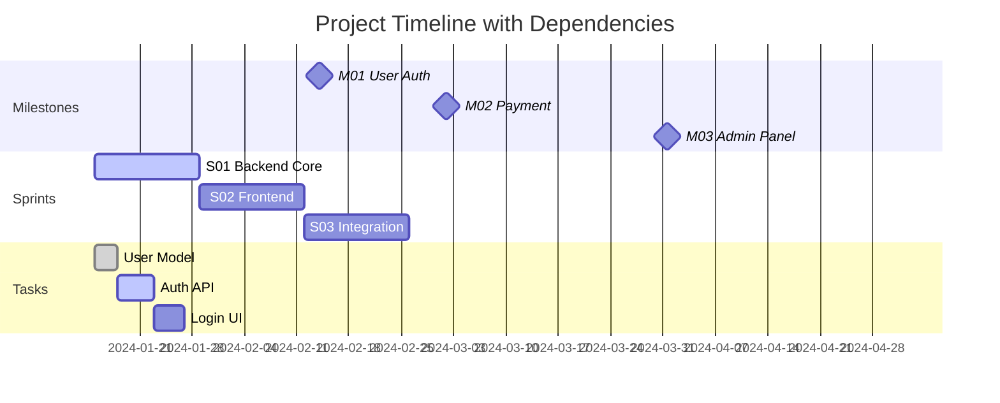
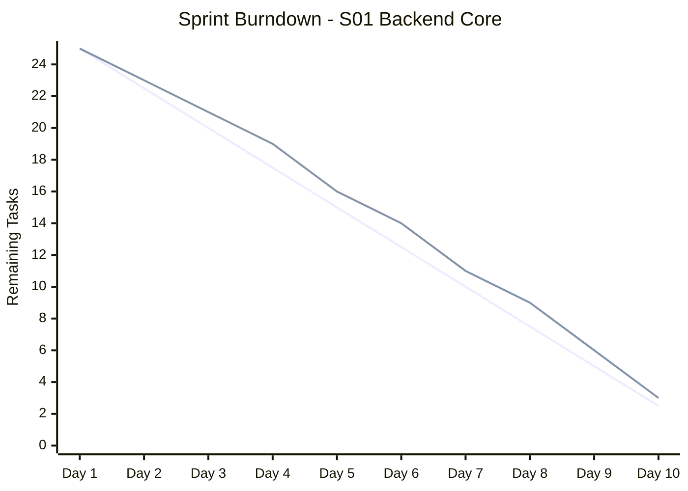
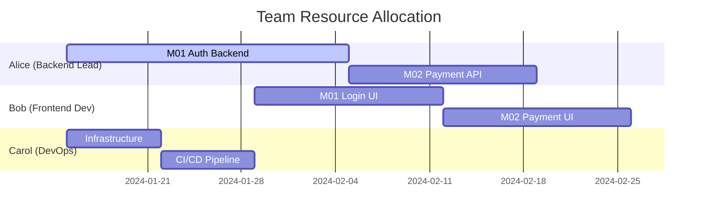

# Simone Interactive Dashboard Proposal

## Vision

Create a comprehensive, interactive dashboard that visualizes the entire Simone project lifecycle through Gantt charts, Kanban boards, burndown charts, and real-time analytics. The dashboard should parse existing Simone YAML frontmatter and generate dynamic visualizations that update as the project evolves.

## Core Features

### 1. Project Overview Dashboard

**Real-time Status Board**
- Current milestone progress with completion percentages
- Active sprints with velocity tracking
- Team capacity utilization
- Risk assessment heatmap
- Critical path analysis

**Key Metrics Panel**
- Total project completion: XX%
- Current milestone: M## - Name (XX% complete)
- Active sprints: X sprints, XX tasks in progress
- Team velocity: XX tasks/sprint (trending up/down)
- Open blockers: X critical, XX medium

### 2. Interactive Gantt Charts

**Multi-Level Gantt Visualization**


**Features:**
- **Zoomable timeline**: From daily view to quarterly overview
- **Dependency visualization**: Color-coded dependency lines
- **Critical path highlighting**: Show bottleneck tasks
- **Resource allocation**: Show team member assignments
- **Progress indicators**: Real-time completion bars
- **Milestone markers**: Key delivery dates
- **Risk indicators**: Tasks with high risk highlighted

### 3. Advanced Task Management

**Interactive Kanban Board**
- Drag-and-drop task movement
- Real-time status updates
- Priority-based swimlanes
- Assignee filtering
- Sprint-based grouping

**Task Analytics**
- Cycle time analysis
- Lead time tracking
- Throughput metrics
- Bottleneck identification
- Work distribution analysis

### 4. Sprint Dashboards

**Sprint Burndown Charts**


**Sprint Metrics**
- Velocity tracking over time
- Scope creep monitoring  
- Team capacity vs. commitment
- Quality metrics (bugs, rework)
- Sprint health indicators

### 5. Resource Management

**Team Capacity Dashboard**
- Individual workload visualization
- Skill matrix and availability
- Cross-project resource allocation
- Capacity planning tools
- Utilization trends

**Resource Allocation Gantt**


## Technical Implementation

### 1. Data Parsing Engine

**YAML Frontmatter Parser**
```javascript
// Parse Simone metadata from markdown files
class SimoneParser {
  parseProject(projectPath) {
    return {
      manifest: this.parseManifest(),
      milestones: this.parseMilestones(),
      sprints: this.parseSprints(),
      tasks: this.parseTasks(),
      dependencies: this.buildDependencyGraph()
    };
  }
  
  buildDependencyGraph() {
    // Build dependency tree from YAML metadata
    // Support milestone → sprint → task hierarchy
    // Track blocking relationships
  }
}
```

**Real-time File Monitoring**
- Watch `.simone/` directory for changes
- Parse updated YAML frontmatter
- Trigger dashboard refreshes
- Maintain change history

### 2. Visualization Engine

**Technology Stack Options**

**Option A: Web-based Dashboard**
- **Frontend**: React/Vue.js with D3.js for charts
- **Backend**: Node.js/Python API server
- **Real-time**: WebSocket updates
- **Deployment**: Served locally or self-hosted

**Option B: Desktop Application**
- **Framework**: Electron with React
- **Charts**: Chart.js or Recharts
- **File System**: Direct file watching
- **Distribution**: Cross-platform executable

**Option C: VS Code Extension**
- **Platform**: VS Code extension API
- **Integration**: Claude Code integration
- **Rendering**: Webview panels
- **Access**: Integrated development experience

### 3. Chart Libraries & Visualization

**Gantt Chart Implementation**
```javascript
// Using D3.js for interactive Gantt charts
class GanttChart {
  constructor(container, data) {
    this.svg = d3.select(container).append('svg');
    this.data = this.processSimoneData(data);
    this.render();
  }
  
  processSimoneData(simoneData) {
    return {
      milestones: simoneData.milestones.map(m => ({
        id: m.milestone_id,
        name: m.milestone_name,
        start: new Date(m.start_date),
        end: new Date(m.target_date),
        progress: m.completion_percentage,
        sprints: m.sprints,
        dependencies: m.dependencies
      }))
    };
  }
  
  render() {
    // Create interactive Gantt visualization
    // Support zoom, pan, drag operations
    // Show dependencies as connecting lines
    // Color-code by status and priority
  }
}
```

**Burndown Chart Integration**
```javascript
class BurndownChart {
  generateFromSprint(sprintData) {
    const idealLine = this.calculateIdealBurndown(sprintData);
    const actualLine = this.calculateActualBurndown(sprintData);
    
    return {
      planned: idealLine,
      actual: actualLine,
      projection: this.projectCompletion(actualLine)
    };
  }
}
```

### 4. Data Models

**Dashboard Data Structure**
```typescript
interface SimoneDashboard {
  project: {
    manifest: ProjectManifest;
    health: ProjectHealth;
    metrics: ProjectMetrics;
  };
  
  milestones: Milestone[];
  sprints: Sprint[];
  tasks: Task[];
  
  timeline: {
    gantt: GanttData;
    dependencies: DependencyGraph;
    criticalPath: Task[];
  };
  
  analytics: {
    velocity: VelocityData;
    burndown: BurndownData;
    capacity: ResourceData;
    risks: RiskAssessment;
  };
}

interface ProjectHealth {
  schedule: 'ahead' | 'on_track' | 'at_risk' | 'behind';
  budget: 'under' | 'on_track' | 'over';
  quality: number; // 1-10 score
  team_morale: number; // 1-10 score
  risk_level: 'low' | 'medium' | 'high' | 'critical';
}
```

## User Interface Design

### 1. Main Dashboard Layout

```
┌─────────────────────────────────────────────────────────────┐
│ 🎯 Project Overview                                    ⚙️   │
├─────────────────────────────────────────────────────────────┤
│ Current: M02 Payment Integration (65% complete)             │
│ Sprint: S04 Frontend Polish (Day 7/10, on track)          │
│ Team: 4 active, 85% capacity, 2.3 velocity                │
├─────────────────────────────────────────────────────────────┤
│ 📊 Timeline View                           📋 Task Board    │
│ ┌─────────────────────────┐               ┌──────────────┐  │
│ │                         │               │ TODO    ▣ 12│  │
│ │      Gantt Chart        │               │ PROGRESS ▣ 8│  │
│ │                         │               │ REVIEW   ▣ 3│  │
│ │                         │               │ DONE     ▣ 45│ │
│ └─────────────────────────┘               └──────────────┘  │
├─────────────────────────────────────────────────────────────┤
│ 📈 Analytics                              📊 Team Health   │
│ ┌─────────────────────────┐               ┌──────────────┐  │
│ │    Sprint Burndown      │               │  Velocity    │  │
│ │                         │               │  Capacity    │  │
│ │                         │               │  Quality     │  │
│ └─────────────────────────┘               └──────────────┘  │
└─────────────────────────────────────────────────────────────┘
```

### 2. Interactive Features

**Timeline Navigation**
- Zoom controls (day/week/month/quarter view)
- Date range picker
- Today marker and navigation
- Milestone/sprint quick jump

**Filtering & Search**
- Filter by milestone, sprint, assignee
- Search tasks by title or ID
- Status filtering (active, blocked, completed)
- Priority-based filtering

**Real-time Updates**
- Live progress updates
- Status change notifications
- New task alerts
- Dependency change warnings

### 3. Responsive Design

**Desktop View**: Full featured dashboard
**Tablet View**: Simplified charts, touch optimized
**Mobile View**: Key metrics and status updates

## Integration Features

### 1. Claude Code Integration

**Dashboard Commands**
- `/project:simone:dashboard` - Open main dashboard
- `/project:simone:gantt M01` - Show milestone Gantt
- `/project:simone:burndown S03` - Show sprint burndown
- `/project:simone:capacity` - Show team capacity

**Contextual Awareness**
- Detect current working context
- Highlight relevant tasks/sprints
- Auto-refresh when files change
- Integration with todo management

### 2. Export Capabilities

**Static Reports**
- PDF export of Gantt charts
- Excel export of task data
- PNG export of burndown charts
- HTML summary reports

**Dynamic Exports**
- Embed charts in documents
- Live dashboard links
- API endpoints for external tools
- Webhook integrations

### 3. External Tool Integration

**Git Integration**
- Link commits to tasks
- Show development progress
- Branch visualization
- Code review metrics

**Communication Tools**
- Slack/Teams notifications
- Daily standup summaries
- Sprint review exports
- Milestone announcements

## Advanced Features

### 1. Predictive Analytics

**Machine Learning Integration**
- Velocity prediction based on historical data
- Risk assessment using pattern recognition
- Resource optimization suggestions
- Timeline forecasting

**What-if Analysis**
- Resource reallocation scenarios
- Scope change impact analysis
- Timeline adjustment modeling
- Team composition optimization

### 2. Collaboration Features

**Real-time Collaboration**
- Multi-user dashboard viewing
- Shared cursor/selection
- Comment system on tasks
- Live activity feeds

**Review Workflows**
- Dashboard-based sprint reviews
- Milestone health checks
- Stakeholder reporting
- Executive summaries

### 3. Customization

**Dashboard Themes**
- Light/dark mode
- Color customization
- Layout preferences
- Chart type selection

**Metric Configuration**
- Custom KPI definitions
- Alert thresholds
- Report templates
- Widget selection

## Implementation Roadmap

### Phase 1: Core Dashboard (4-6 weeks)
1. **Week 1-2**: YAML parser and data models
2. **Week 3-4**: Basic Gantt chart implementation
3. **Week 5-6**: Task board and basic metrics

### Phase 2: Advanced Visualization (4-6 weeks)
1. **Week 1-2**: Interactive Gantt with dependencies
2. **Week 3-4**: Sprint burndown and velocity charts
3. **Week 5-6**: Resource allocation dashboard

### Phase 3: Integration & Polish (3-4 weeks)
1. **Week 1-2**: Claude Code integration
2. **Week 3**: Export and sharing features
3. **Week 4**: Performance optimization and testing

### Phase 4: Advanced Features (4-6 weeks)
1. **Week 1-2**: Predictive analytics
2. **Week 3-4**: Collaboration features
3. **Week 5-6**: Mobile responsiveness

## Success Metrics

### User Adoption
- Dashboard usage frequency
- Feature utilization rates
- User satisfaction scores
- Productivity improvements

### Project Management Efficiency
- Reduced planning time
- Improved sprint completion rates
- Better resource utilization
- Faster risk identification

### Development Impact
- Decreased project overruns
- Improved team velocity
- Better milestone predictability
- Enhanced stakeholder satisfaction

## Technical Architecture

### Backend Services
```
Dashboard API Server
├── Data Parser Service
│   ├── YAML Frontmatter Parser
│   ├── File System Watcher
│   └── Change Detection Engine
├── Analytics Engine
│   ├── Velocity Calculator
│   ├── Burndown Generator
│   └── Predictive Models
├── Export Service
│   ├── PDF Generator
│   ├── Chart Image Export
│   └── Data Export (CSV/JSON)
└── WebSocket Server
    ├── Real-time Updates
    ├── Collaboration Features
    └── Notification System
```

### Frontend Application
```
React Dashboard App
├── Chart Components
│   ├── Gantt Chart (D3.js)
│   ├── Burndown Chart (Chart.js)
│   ├── Kanban Board (React DnD)
│   └── Metrics Widgets
├── Navigation & Layout
│   ├── Responsive Grid System
│   ├── Filter & Search
│   └── Theme Management
├── Real-time Features
│   ├── WebSocket Client
│   ├── Auto-refresh Logic
│   └── Notification System
└── Export & Sharing
    ├── Chart Export Utils
    ├── Report Generation
    └── Link Sharing
```

## Security Considerations

### Data Privacy
- Local-first architecture option
- Encrypted data transmission
- User access controls
- Audit logging

### Authentication
- SSO integration
- Role-based permissions
- API key management
- Session security

## Deployment Options

### Option 1: Local Desktop App
- Electron-based application
- Direct file system access
- Offline functionality
- Auto-updater integration

### Option 2: Self-hosted Web App
- Docker container deployment
- Nginx reverse proxy
- Database persistence
- Backup/restore capabilities

### Option 3: Cloud-hosted Service
- Multi-tenant architecture
- Scalable infrastructure
- Global CDN distribution
- Managed updates

## Cost Analysis

### Development Costs
- Core development: 16-20 weeks
- UI/UX design: 4-6 weeks
- Testing & QA: 4-6 weeks
- Documentation: 2-3 weeks

### Infrastructure Costs
- Local deployment: Minimal
- Self-hosted: $50-200/month
- Cloud-hosted: $500-2000/month (depending on scale)

### Maintenance Costs
- Bug fixes and updates: 20% of development cost annually
- Feature enhancements: 30-50% of development cost annually
- Support and documentation: 10-15% of development cost annually

## Conclusion

The Simone Interactive Dashboard would transform project management by providing real-time visibility into project health, progress, and team performance. By leveraging the rich YAML metadata already present in the Simone framework, we can create a powerful visualization layer that enhances decision-making and improves project outcomes.

The modular architecture allows for incremental development and deployment, with each phase delivering tangible value. The combination of Gantt charts, burndown analytics, and real-time collaboration features would make this a best-in-class project management tool specifically designed for the Simone methodology.

---

**Next Steps:**
1. Technical feasibility analysis
2. UI/UX mockup creation  
3. Technology stack selection
4. Development timeline planning
5. Resource allocation planning

*Proposal prepared for Simone Framework v2.0.3 | Interactive Dashboard Enhancement*