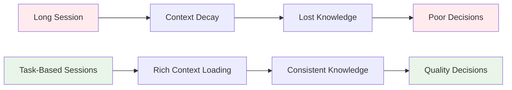
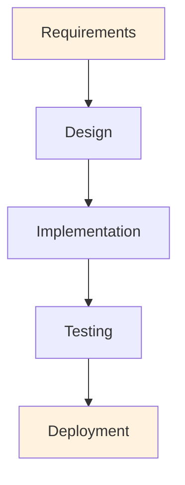
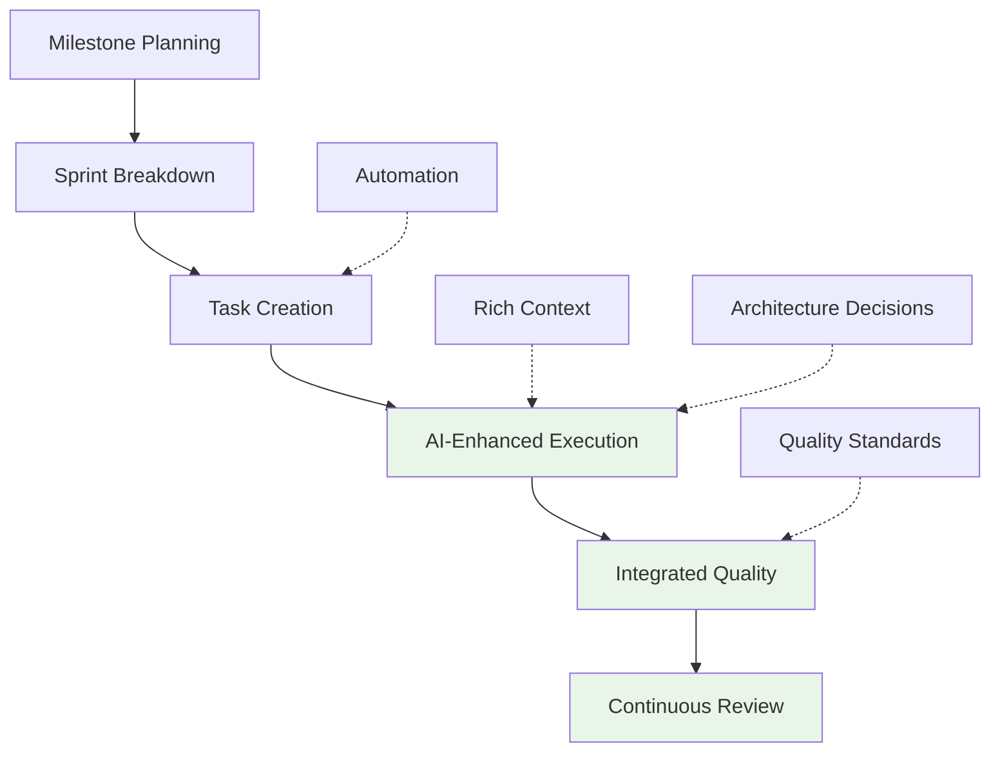

# Framework Overview

**Purpose**: Comprehensive introduction to Simone framework concepts and philosophy  
**Audience**: All team members, especially newcomers to the framework  
**Reading Time**: 15 minutes

## What is Simone?

Simone is a sophisticated, directory-based project management framework specifically designed for AI-assisted enterprise software development. It bridges traditional project management disciplines with modern AI-driven development workflows, providing comprehensive metadata management, architectural decision tracking, and integrated quality control processes.

## Core Philosophy

### The Context Problem

Traditional AI coding sessions face a fundamental challenge: **context decay**. As development sessions grow longer, critical project knowledge silently falls off the end of the context window. You don't know what's been forgotten until something goes wrong.

### The Simone Solution

**Start fresh for each task, but provide rich surrounding context.**



By keeping tasks focused and well-scoped, Simone dedicates more of the context window to relevant project knowledge, requirements, and architectural decisions, ensuring:

- ✅ **Each task starts with exactly the project context it needs**
- ✅ **No critical knowledge gets lost in long sessions**
- ✅ **Claude can work confidently with full awareness of requirements**
- ✅ **The surrounding context guides development, not just the task description**

## Framework Architecture

### Directory Structure Philosophy

Simone organizes projects hierarchically, reflecting natural project management flow:

```
.simone/
├── 00_PROJECT_MANIFEST.md          # Central project reference
├── 01_PROJECT_DOCS/                # General documentation
├── 02_REQUIREMENTS/                # Business requirements by milestone
│   └── M##_Milestone_Name/         # Strategic milestone containers
├── 03_SPRINTS/                     # Execution sprints by milestone
│   └── S##_M##_Sprint_Name/        # Tactical sprint containers
├── 04_GENERAL_TASKS/               # Non-sprint work items
├── 05_ARCHITECTURAL_DECISIONS/     # Technical decision records
├── 06_BUGS/                        # Bug tracking and resolution
├── 07_TECHNICAL_DEBT/              # Technical debt tracking and management
├── 10_STATE_OF_PROJECT/            # Project health snapshots
└── 99_TEMPLATES/                   # Standardized templates
```

### Naming Conventions

Simone uses consistent naming patterns that enable:
- **Automatic sorting** and navigation
- **Cross-reference linking** between documents
- **Tool integration** and automation
- **Visual organization** in file explorers

#### Key Patterns
- **Project Manifest**: `00_PROJECT_MANIFEST.md` (exact name required)
- **Milestones**: `M##_Milestone_Name/` (e.g., `M01_Backend_Setup/`)
- **Sprints**: `S##_M##_Sprint_Name/` (e.g., `S01_M01_Initial_API/`)
- **Tasks**: `TASK_##_S##_Task_Name.md` or `TASK_###_Task_Name.md`
- **Technical Debt**: `TD_###_brief_description.md` (e.g., `TD_001_duplicate_validation.md`)
- **ADRs**: `ADR_###_Decision_Topic.md`

## Core Concepts

### 1. Hierarchical Organization

#### Strategic Level: Milestones
- **Purpose**: Major business objectives and feature releases
- **Duration**: 4-12 weeks typically
- **Scope**: Significant user value delivery
- **Documentation**: PRDs, technical specifications, business requirements

#### Tactical Level: Sprints  
- **Purpose**: Logical groups of related implementation tasks
- **Duration**: 1-3 weeks typically
- **Scope**: Coherent technical deliverables
- **Documentation**: Sprint plans, task breakdowns, execution tracking

#### Operational Level: Tasks
- **Purpose**: Individual work items scoped for one Claude session
- **Duration**: 1-4 hours typically
- **Scope**: Specific, testable implementations
- **Documentation**: Detailed implementation guidance and quality checklists

### 2. Metadata-Driven Management

Every document includes rich YAML frontmatter providing:

```yaml
# Example task metadata (21+ fields)
task_id: "task-01-s01"
task_title: "Implement user authentication"
task_type: "feature"
status: "pending"
priority: "high"
complexity: "medium"
estimated_effort: "3.5"
business_value: "high"
technical_value: "medium"
dependencies: ["task-00-s01"]
# ... and many more fields
```

**Benefits**:
- 🔍 **Searchability** - Find work by any metadata dimension
- 📊 **Reporting** - Automated dashboards and progress tracking
- 🤖 **Automation** - Commands can make intelligent decisions
- 🔗 **Traceability** - Complete audit trail from requirements to deployment

### 3. Quality-First Approach

Quality is integrated at every level, not added as an afterthought:

#### Built-in Quality Gates
- **Task level** - Acceptance criteria and implementation checklists
- **Sprint level** - Definition of done and quality standards
- **Milestone level** - Success metrics and business value validation
- **Project level** - Health monitoring and continuous improvement

#### Automated Quality Assurance
- **Code review integration** - Every task execution includes quality review
- **Technical debt tracking** - Systematic identification and management of technical debt
- **Testing requirements** - Comprehensive testing strategy in every task
- **Architecture compliance** - ADR alignment verification
- **Security validation** - Security considerations in all templates

### 4. Technical Debt Management

Proactive technical debt tracking prevents maintenance burden accumulation:

#### Structured Debt Categorization
- **Code Quality**: Duplication, complexity, naming, maintainability issues
- **Architecture**: Design violations, coupling issues, missing abstractions
- **Security**: Authentication gaps, validation flaws, data exposure risks
- **Performance**: Inefficient algorithms, resource leaks, optimization opportunities
- **Documentation**: Missing or outdated documentation, unclear implementations
- **Testing**: Coverage gaps, flaky tests, missing test scenarios

#### Impact-Driven Prioritization
- **Risk scoring** (1-25 scale) based on likelihood and impact assessment
- **Business impact** analysis including development velocity and maintenance cost
- **Resolution planning** with effort estimation and strategic timing
- **Integration** with sprint planning and milestone delivery

### 5. AI-Enhanced Development

Simone is specifically designed for AI-assisted development:

#### Context Optimization
- **Rich context loading** - Every task execution loads comprehensive project context
- **Intelligent scoping** - Tasks are sized for optimal AI execution
- **Pattern recognition** - Framework learns from existing codebase patterns
- **Decision guidance** - Architecture decisions provide implementation guidance

#### Automation Features
- **Intelligent task creation** - AI analyzes requirements and generates implementation-ready tasks
- **Quality automation** - Built-in code review and testing validation
- **Progress tracking** - Automatic metadata updates and progress reporting
- **Knowledge capture** - Implementation decisions automatically documented

## Key Features

### 1. Comprehensive Task Management

#### 21+ Metadata Fields
Every task includes comprehensive tracking:
- **Identification** - ID, title, type, milestone, sprint
- **Status** - Progress, priority, complexity, effort estimation
- **Context** - Business value, technical value, dependencies
- **Quality** - Risk level, testing requirements, review criteria

#### Intelligent Task Breakdown
- **Complexity assessment** - Automatic evaluation of task complexity
- **Smart splitting** - Complex tasks automatically broken into manageable pieces
- **Dependency tracking** - Prerequisite identification and validation
- **Implementation guidance** - Detailed technical approach documentation

### 2. Template-Driven Consistency

#### Comprehensive Template Library
- **14 core templates** covering all aspects of project management
- **Rich YAML frontmatter** for metadata consistency
- **Structured sections** for standardized documentation
- **Quality checklists** integrated into all templates

#### Customization Support
- **Organization adaptation** - Templates can be customized for specific needs
- **Extension mechanisms** - Add custom metadata fields and sections
- **Version management** - Template evolution with backward compatibility
- **Validation** - Automatic validation of template compliance

### 3. Architecture Decision Management

#### Structured ADR Process
- **Decision documentation** - Comprehensive ADR templates
- **Alternative analysis** - Systematic evaluation of options
- **Implementation guidance** - Technical implementation direction
- **Review and approval** - Structured review and approval workflows

#### Architecture Compliance
- **Automatic validation** - Task execution validates against established ADRs
- **Pattern enforcement** - Ensures consistency with architectural decisions
- **Evolution tracking** - Documents architectural evolution over time
- **Technical debt management** - Identifies and tracks architecture debt

### 4. MCP Server Integration

#### Five Integrated MCP Servers
1. **Serena** - Enhanced IDE assistance and project management
2. **Context7** - Advanced context management and retrieval
3. **Playwright** - Browser automation and testing capabilities
4. **Work History** - Command tracking and audit trails
5. **Sequential Thinking** - Structured reasoning and problem-solving

#### Enhanced Capabilities
- **Intelligent context** - MCP servers provide enhanced context understanding
- **Advanced automation** - Sophisticated automation beyond basic Claude Code
- **External integration** - Connection to external tools and services
- **Persistent memory** - Cross-session context and knowledge retention

### 5. Quality Assurance Integration

#### Multi-Level Quality Control
- **Code quality** - Automated code review and standards enforcement
- **Testing** - Comprehensive testing requirements and validation
- **Security** - Security considerations integrated throughout
- **Documentation** - Documentation quality standards and validation

#### Continuous Improvement
- **Retrospectives** - Built-in retrospective processes
- **Metrics tracking** - Comprehensive metrics and KPI monitoring
- **Process optimization** - Continuous process improvement based on data
- **Knowledge management** - Lessons learned capture and application

### 6. Cognitive Personas - Domain Expertise Integration

Simone includes **9 specialized AI personas** that provide domain-specific expertise throughout the development lifecycle. This system is inspired by **SuperClaude**, which provides AI persona concepts and cognitive enhancement patterns.

**Key capabilities**: 🏗️ Architecture • 🔒 Security • 🎨 Frontend • ⚙️ Backend • 📊 Analysis • 🎓 Mentoring • 🔧 Refactoring • ⚡ Performance • ✅ QA

**Smart features**: Auto-activation, multi-domain analysis, transparent reasoning, token optimization, consensus validation

> 📖 **Complete Guide**: [Cognitive Personas Documentation](../advanced/cognitive-personas.md)

## Benefits by Role

### For Developers
- 🎯 **Clear task scoping** - Always know exactly what to build
- 🧠 **Rich context** - Full project knowledge available for every task
- ⚡ **Efficient execution** - AI-optimized development workflow with domain expertise
- 🔍 **Quality guidance** - Built-in quality standards and specialized persona insights
- 📚 **Knowledge transfer** - Comprehensive documentation that stays current

### For Project Managers
- 📊 **Complete visibility** - Real-time progress tracking and health metrics
- 🎯 **Predictable delivery** - Consistent task scoping and velocity tracking
- 📋 **Standardized processes** - Consistent approach across teams and projects
- 🔍 **Risk management** - Built-in risk identification and mitigation
- 📈 **Data-driven decisions** - Rich metrics for informed decision making

### For Technical Leaders
- 🏗️ **Architecture governance** - Structured ADR process and compliance tracking
- 🧹 **Technical debt management** - Systematic identification, tracking, and strategic resolution
- 📊 **Quality oversight** - Comprehensive quality metrics and standards
- 🎓 **Team development** - Consistent practices and knowledge sharing
- 🔄 **Continuous improvement** - Data-driven process optimization with AI insights

### For Organizations
- 📈 **Improved predictability** - Consistent delivery and quality outcomes
- 💰 **Reduced risk** - Comprehensive risk management and quality control
- 🏢 **Scalable processes** - Standards that work from startup to enterprise
- 📋 **Compliance support** - Built-in audit trails and governance processes
- 🎯 **Strategic alignment** - Clear connection from business objectives to implementation
- 💰 **Cost optimization** - AI-enhanced development with intelligent resource usage

## Comparison with Traditional Approaches

### Traditional Project Management


**Challenges**:
- ❌ **Context loss** in long development sessions
- ❌ **Inconsistent quality** without built-in standards
- ❌ **Poor traceability** from requirements to implementation
- ❌ **Manual processes** prone to human error
- ❌ **Limited reusability** of project management artifacts

### Simone Approach


**Advantages**:
- ✅ **Consistent context** through rich metadata and documentation
- ✅ **Built-in quality** with integrated quality gates and standards
- ✅ **Complete traceability** from business objectives to implementation
- ✅ **Intelligent automation** reducing manual effort and errors
- ✅ **Reusable patterns** and templates across projects and teams

## Getting Started Path

### For Individuals (Quick Start)
1. **Install Simone** - 5 minutes with automated installer
2. **Initialize project** - 10 minutes interactive setup
3. **Create first task** - 5 minutes task generation
4. **Execute task** - Experience AI-enhanced development

### For Teams (Pilot Approach)
1. **Team training** - Framework concepts and best practices
2. **Pilot project** - Small project to learn and adapt
3. **Process refinement** - Customize templates and workflows
4. **Full adoption** - Roll out across team projects

### For Organizations (Enterprise Rollout)
1. **Governance setup** - Establish standards and processes
2. **Pilot teams** - Start with early adopter teams
3. **Template customization** - Adapt for organizational needs
4. **Phased rollout** - Systematic expansion across organization
5. **Continuous improvement** - Ongoing optimization and evolution

## Success Indicators

You know Simone is working well when:

### Technical Indicators
- ✅ **Tasks consistently scoped** to 2-4 hours of work
- ✅ **Code follows patterns** established in your project
- ✅ **Documentation stays current** with minimal manual effort
- ✅ **Quality gates catch issues** before they reach production
- ✅ **Architecture decisions** are consistently applied

### Process Indicators
- ✅ **Sprint velocity** is predictable and improving
- ✅ **Team communication** is clear and consistent
- ✅ **Stakeholder confidence** in delivery commitments
- ✅ **Knowledge sharing** happens naturally through documentation
- ✅ **Onboarding time** for new team members is reduced

### Business Indicators
- ✅ **Delivery predictability** meets or exceeds expectations
- ✅ **Quality metrics** show consistent improvement
- ✅ **Customer satisfaction** with delivered features
- ✅ **Time to market** improvements
- ✅ **Development costs** optimization

## Common Misconceptions

### "Simone is just another task tracker"
**Reality**: Simone is a comprehensive framework that includes task management but extends far beyond it to include architecture decisions, quality management, and AI-enhanced development workflows.

### "Too much overhead for small projects"
**Reality**: Simone scales from individual projects to enterprise deployments. Small projects benefit from the structure and quality standards, while larger projects leverage the full governance and coordination features.

### "AI will do everything automatically"
**Reality**: Simone enhances human decision-making with AI assistance. Strategic decisions, architecture choices, and business priorities still require human judgment and oversight.

### "Only works with Claude Code"
**Reality**: While optimized for Claude Code, Simone's templates and processes provide value for any development approach. The metadata and documentation standards improve any development workflow.

---

**Next Steps**: 
- **Hands-on**: Try the [Quick Start Guide](./quick-start.md) to experience Simone in 15 minutes
- **Deep dive**: Explore [Task Management](../core-components/task-management.md) to understand the execution engine
- **Enterprise**: Review [Enterprise Standards](../best-practices/enterprise-standards.md) for organizational deployment