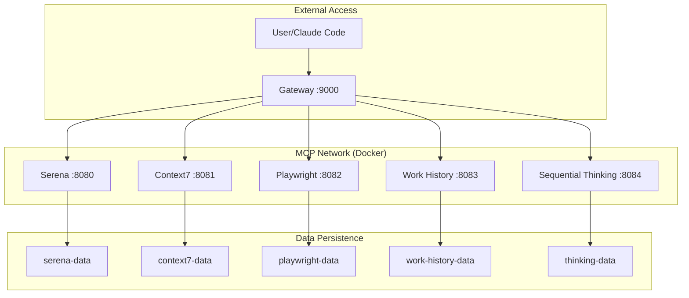

# Docker-based MCP Server Setup

**Version**: 1.0.0 | **Status**: Ready | **Framework**: Simone v3.0.0

This guide provides comprehensive instructions for running all MCP servers using Docker containers instead of local uvx installations.

## Overview

The Docker-based MCP setup provides:

- **Isolated environments** for each MCP server
- **Consistent deployments** across different systems
- **Easy scaling** and management of services
- **Centralized gateway** for unified access
- **Health monitoring** and service discovery
- **Persistent data storage** with Docker volumes

## Architecture



## Quick Start

### 1. Prerequisites

- **Docker**: Version 20.10+ 
- **Docker Compose**: Version 2.0+
- **Curl**: For health checks

```bash
# Check Docker installation
docker --version
docker compose version

# Verify Docker is running
docker ps
```

### 2. Setup and Start

```bash
# Navigate to your Simone project
cd /path/to/your/simone-project

# Run setup (first time only)
./scripts/mcp-docker.sh setup

# Start all services
./scripts/mcp-docker.sh start

# Check service status
./scripts/mcp-docker.sh status
```

### 3. Verify Installation

```bash
# Health check all services
./scripts/mcp-docker.sh health

# Access gateway
curl http://localhost:9000/health

# View service status dashboard
curl http://localhost:9000/status
```

## Detailed Configuration

### Environment Variables

Copy and customize the environment file:

```bash
cp .env.mcp.example .env.mcp
nano .env.mcp  # Edit configuration
```

**Key Configuration Options:**

```bash
# Project integration
PROJECT_PATH=${PWD}

# Context7 Redis (optional)
UPSTASH_REDIS_REST_URL=https://your-redis.upstash.io
UPSTASH_REDIS_REST_TOKEN=your-token

# Work History retention
HISTORY_RETENTION_DAYS=30

# Sequential Thinking mode
THINKING_MODE=structured  # structured|analytical|creative|debug

# Playwright display
RESOLUTION=1920x1080x24
```

### Service Ports

| Service | Port | Description |
|---------|------|-------------|
| Gateway | 9000 | Central proxy and status |
| Serena | 8080 | IDE assistance and project management |
| Context7 | 8081 | Context management and retrieval |
| Playwright | 8082 | Browser automation and testing |
| Work History | 8083 | Command tracking and logging |
| Sequential Thinking | 8084 | Enhanced reasoning and problem-solving |

## Management Commands

### Service Management

```bash
# Start all services
./scripts/mcp-docker.sh start

# Stop all services
./scripts/mcp-docker.sh stop

# Restart all services
./scripts/mcp-docker.sh restart

# View service status
./scripts/mcp-docker.sh status
```

### Monitoring and Debugging

```bash
# Check health of all services
./scripts/mcp-docker.sh health

# View logs for all services
./scripts/mcp-docker.sh logs

# View logs for specific service
./scripts/mcp-docker.sh logs serena
./scripts/mcp-docker.sh logs playwright

# Follow logs in real-time
./scripts/mcp-docker.sh logs -f
```

### Container Management

```bash
# Rebuild containers (after code changes)
./scripts/mcp-docker.sh build

# Clean up (removes containers and volumes)
./scripts/mcp-docker.sh cleanup

# Manual Docker commands
docker compose -f docker-compose.mcp.yml ps
docker compose -f docker-compose.mcp.yml exec serena sh
```

## Claude Code Integration

### Gateway Mode (Recommended)

Configure Claude Code to use the gateway for unified access:

```bash
# Single gateway endpoint
claude mcp add mcp-gateway -- http://localhost:9000
```

### Individual Services Mode

Configure each service separately:

```bash
claude mcp add serena-docker -- http://localhost:8080
claude mcp add context7-docker -- http://localhost:8081
claude mcp add playwright-docker -- http://localhost:8082
claude mcp add work-history-docker -- http://localhost:8083
claude mcp add sequential-thinking-docker -- http://localhost:8084
```

### Service Discovery

Use the gateway's service discovery endpoints:

```bash
# List available services
curl http://localhost:9000/

# Detailed service status
curl http://localhost:9000/status

# Health check
curl http://localhost:9000/health
```

## Data Persistence

### Volume Management

Each service uses named Docker volumes for data persistence:

```bash
# List MCP volumes
docker volume ls | grep mcp-

# Inspect volume details
docker volume inspect mcp-serena-data

# Backup volume data
docker run --rm -v mcp-serena-data:/data -v $(pwd):/backup alpine tar czf /backup/serena-backup.tar.gz -C /data .

# Restore volume data
docker run --rm -v mcp-serena-data:/data -v $(pwd):/backup alpine tar xzf /backup/serena-backup.tar.gz -C /data
```

### Data Locations

| Service | Volume | Purpose |
|---------|--------|---------|
| Serena | `mcp-serena-data` | Project analysis cache, IDE state |
| Context7 | `mcp-context7-data` | Context storage, session data |
| Playwright | `mcp-playwright-data` | Browser profiles, test artifacts |
| Work History | `mcp-work-history-data` | Command logs, execution history |
| Sequential Thinking | `mcp-sequential-thinking-data` | Reasoning chains, problem analysis |

## Advanced Configuration

### Custom Network

The default configuration creates a bridge network `mcp-network` with subnet `172.20.0.0/16`. To customize:

```yaml
# In docker-compose.mcp.yml
networks:
  mcp-network:
    driver: bridge
    ipam:
      config:
        - subnet: 172.30.0.0/16  # Custom subnet
```

### Resource Limits

Add resource constraints to services:

```yaml
# Example for serena service
serena:
  # ... existing configuration
  deploy:
    resources:
      limits:
        memory: 512M
        cpus: '0.5'
      reservations:
        memory: 256M
        cpus: '0.25'
```

### External Database

Configure Context7 with external Redis:

```bash
# In .env.mcp
UPSTASH_REDIS_REST_URL=https://your-redis.upstash.io
UPSTASH_REDIS_REST_TOKEN=your-redis-token
```

## Troubleshooting

### Common Issues

**Services Not Starting**

```bash
# Check Docker daemon
systemctl status docker

# Check available ports
netstat -tlnp | grep -E '(8080|8081|8082|8083|8084|9000)'

# Check container logs
./scripts/mcp-docker.sh logs
```

**Gateway Connection Issues**

```bash
# Test gateway health
curl -v http://localhost:9000/health

# Check service connectivity
docker compose -f docker-compose.mcp.yml exec mcp-gateway ping serena

# Verify service registration
curl http://localhost:9000/status | jq .
```

**Playwright Browser Issues**

```bash
# Check X11 forwarding
echo $DISPLAY

# Test browser installation
docker compose -f docker-compose.mcp.yml exec playwright playwright --version

# Check container capabilities
docker compose -f docker-compose.mcp.yml exec playwright ls -la /tmp/.X11-unix/
```

### Performance Optimization

**Memory Usage**

```bash
# Monitor container memory
docker stats --format "table {{.Container}}\t{{.CPUPerc}}\t{{.MemUsage}}"

# Adjust container limits in docker-compose.mcp.yml
```

**Network Performance**

```bash
# Test internal network speed
docker compose -f docker-compose.mcp.yml exec serena ping -c 3 context7

# Monitor network usage
docker network inspect mcp-network
```

### Maintenance

**Regular Cleanup**

```bash
# Clean up unused images
docker image prune -f

# Clean up unused volumes (careful!)
docker volume prune -f

# Update container images
./scripts/mcp-docker.sh build --no-cache
```

**Log Rotation**

```bash
# Configure log rotation in docker-compose.mcp.yml
logging:
  driver: "json-file"
  options:
    max-size: "10m"
    max-file: "3"
```

## Security Considerations

### Network Security

- Services are isolated in private Docker network
- Only gateway port (9000) exposed externally
- Internal service communication encrypted

### Data Security

- Persistent volumes for sensitive data
- No secrets in environment files
- Use Docker secrets for production deployment

### Production Deployment

```yaml
# Production security enhancements
secrets:
  redis_token:
    external: true
    
services:
  context7:
    secrets:
      - redis_token
    environment:
      UPSTASH_REDIS_REST_TOKEN_FILE: /run/secrets/redis_token
```

## Migration from Local MCP

### Backup Existing Setup

```bash
# Export current MCP configuration
claude mcp list > mcp-backup.txt

# Backup any local MCP data
cp -r ~/.claude/mcp/ ~/.claude/mcp-backup/
```

### Switch to Docker

```bash
# Stop local MCP servers
claude mcp stop-all

# Remove local MCP servers (optional)
# claude mcp remove serena
# claude mcp remove context7
# ...

# Start Docker MCP services
./scripts/mcp-docker.sh start

# Configure Claude Code for Docker MCP
./scripts/mcp-docker.sh config
```

### Rollback Process

```bash
# Stop Docker services
./scripts/mcp-docker.sh stop

# Restore local MCP configuration
cp mcp-backup.txt ~/.claude/mcp-config.txt

# Restart local MCP servers
claude mcp start-all
```

## Support and Resources

### Getting Help

- **GitHub Issues**: [Report Docker-specific issues](https://github.com/steig/claude-steig/issues)
- **Documentation**: Check individual service documentation in `docker/mcp-servers/*/README.md`
- **Logs**: Always include relevant logs when reporting issues

### Useful Commands Reference

```bash
# Quick status check
./scripts/mcp-docker.sh health

# Debug specific service
docker compose -f docker-compose.mcp.yml logs -f serena

# Interactive container access
docker compose -f docker-compose.mcp.yml exec serena sh

# Port forwarding test
curl http://localhost:9000/api/serena/health

# Resource monitoring
docker stats --format "table {{.Container}}\t{{.CPUPerc}}\t{{.MemUsage}}"
```

---

**Docker MCP Setup Guide v1.0.0** | **Simone Framework** | **Last Updated**: 2025-01-14