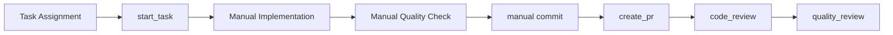
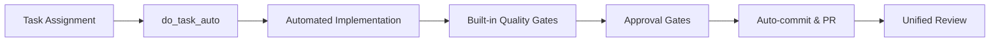

# Migration Guide for Deprecated Features

**Version**: 3.0.0 Migration | **Updated**: 2025-01-14 | **Status**: Active

This guide provides step-by-step migration paths for all deprecated components in the Simone Framework. Use this guide to update your workflows and remove dependencies on deprecated features.

## Overview of Deprecations

The Simone Framework has evolved to provide more unified, automated workflows. Several components have been deprecated to reduce complexity and improve maintainability.

### Deprecation Categories

1. **Superseded Commands** - Replaced by more comprehensive alternatives
2. **Consolidated Templates** - Multiple templates merged into unified versions
3. **Integrated Utilities** - Standalone scripts integrated into framework
4. **Unified Review System** - Multiple review commands replaced by single unified command

## Command Migrations

### 1. Review Commands → Unified Review System

**Deprecated Commands:**
- `code_review.md`
- `quality_review.md` 
- `testing_review.md`
- `discuss_review.md`

**Migration Path:**

#### Before (Deprecated)
```bash
/project:simone:code_review <file_path>
/project:simone:quality_review <file_path>
/project:simone:testing_review <file_path>
/project:simone:discuss_review <topic>
```

#### After (New Unified System)
```bash
/project:simone:review --type-code <file_path>
/project:simone:review --type-quality <file_path>
/project:simone:review --type-testing <file_path>
/project:simone:review --type-discussion <topic>
```

#### Benefits of Migration
- **Single command interface** reduces cognitive overhead
- **Consistent review workflows** across all review types
- **Enhanced cross-type analysis** (e.g., quality + testing in one review)
- **Better metadata tracking** with unified review history

#### Migration Steps
1. **Update any scripts or documentation** that reference the old commands
2. **Retrain team members** on the new unified syntax
3. **Update IDE configurations** or shortcuts that use old commands
4. **Review existing workflows** and update to use `--type-*` flags

### 2. Task Commands → Enhanced Automation

**Deprecated Command:**
- `start_task.md`

**Migration Path:**

#### Before (Deprecated)
```bash
/project:simone:start_task <task_id>
# Separate manual steps for implementation, commit, PR
```

#### After (Enhanced Automation)
```bash
# For guided workflow with approval gates
/project:simone:do_task <task_id>

# For full automation with minimal intervention
/project:simone:do_task_auto <task_id>
```

#### Benefits of Migration
- **Complete workflow integration** from task start to PR creation
- **Built-in quality gates** and validation
- **Automated Git workflow** with user approval points
- **Technical debt tracking** integrated into task execution

#### Migration Steps
1. **Update task assignment workflows** to use `do_task` instead of `start_task`
2. **Train team on approval gate system** in `do_task` command
3. **Configure automation preferences** for `do_task_auto` usage
4. **Update documentation** references to task workflow

## Template Consolidations

### 1. Architecture Templates → Unified Template

**Deprecated Template:**
- `architecture_initialization_checklist.md`

**Migration Path:**

#### Before (Deprecated)
```
.simone/99_TEMPLATES/
├── architecture_template.md
└── architecture_initialization_checklist.md  # DEPRECATED
```

#### After (Unified)
```
.simone/99_TEMPLATES/
└── architecture_template.md  # Includes initialization checklist
```

#### Migration Steps
1. **Review existing architecture documents** created with old template
2. **Update to include checklist sections** from unified template
3. **Remove references** to `architecture_initialization_checklist.md`
4. **Use unified template** for all new architecture documentation

### 2. Bug Templates → Unified Bug Template

**Deprecated:**
- Multiple competing bug templates

**Migration Path:**

#### Before (Multiple Templates)
```
.simone/99_TEMPLATES/
├── bug_template_v1.md
├── bug_template_v2.md
└── simple_bug_template.md
```

#### After (Unified)
```
.simone/99_TEMPLATES/
└── unified_bug_template.md  # Comprehensive consolidated template
```

#### Migration Steps
1. **Update bug creation workflows** to use unified template
2. **Retrain team** on comprehensive bug reporting process
3. **Review existing bug reports** and enhance with unified template sections
4. **Update automation scripts** that reference old bug templates

## Utility Script Migrations

### 1. Quality Gate Validator → Integrated Validation

**Deprecated Script:**
- `quality-gate-validator.sh`

**Migration Path:**

#### Before (Standalone Script)
```bash
# Manual quality validation
.simone/01_UTILS/quality-gate-validator.sh --check-all
```

#### After (Integrated Validation)
```bash
# Built into automated workflows
/project:simone:do_task_auto <task_id>  # Includes quality validation
# OR GitHub Actions automatically validate on PR
```

#### Migration Steps
1. **Remove script references** from custom automation
2. **Update CI/CD workflows** to rely on GitHub Actions
3. **Configure quality thresholds** in automated commands
4. **Train team** on new integrated validation approach

### 2. Command Validator → Framework Validation

**Deprecated Script:**
- `command-validator.sh`

**Migration Path:**

#### Before (External Validation)
```bash
# Manual command validation
.simone/01_UTILS/command-validator.sh start_command_execution
```

#### After (Built-in Validation)
- **No action required** - validation now automatic in framework
- **Commands self-validate** execution steps
- **GitHub Actions provide** additional validation layer

#### Migration Steps
1. **Remove script calls** from custom workflows
2. **Trust framework validation** built into commands
3. **Monitor GitHub Actions** for validation results
4. **Report issues** if validation doesn't catch problems

## Workflow Updates

### Development Workflow Migration

#### Old Workflow


#### New Unified Workflow


### Quality Assurance Migration

#### Old QA Process
1. Run separate quality validation script
2. Execute multiple review commands
3. Manual integration of review results
4. Separate technical debt tracking

#### New Integrated QA
1. **Automatic quality validation** in task execution
2. **Unified review command** with comprehensive analysis
3. **Integrated technical debt** tracking and logging
4. **GitHub Actions validation** for additional assurance

## Team Training Requirements

### For Development Teams

#### Essential Training Topics
1. **Unified Review Command**
   - New `--type-*` flag syntax
   - Cross-type review capabilities
   - Review history and metadata

2. **Enhanced Task Execution**
   - `do_task` vs `do_task_auto` decision making
   - Understanding approval gates
   - Working with automated quality validation

3. **Integrated Quality Process**
   - Built-in validation understanding
   - GitHub Actions monitoring
   - Technical debt tracking workflow

#### Training Timeline
- **Week 1**: Introduction to unified review system
- **Week 2**: Hands-on with enhanced task execution
- **Week 3**: Quality process integration
- **Week 4**: Team workflow optimization

### For Project Managers

#### Key Changes
- **Reduced manual oversight** due to automated validation
- **Enhanced visibility** through integrated tracking
- **Streamlined approval processes** with defined gates
- **Better technical debt visibility** and management

## Validation Checklist

### Pre-Migration Validation
- [ ] **Inventory current usage** of deprecated commands/scripts
- [ ] **Document custom integrations** that need updating
- [ ] **Plan team training** schedule and materials
- [ ] **Test new workflows** in development environment
- [ ] **Backup current configurations** before migration

### Migration Execution
- [ ] **Update command references** in documentation
- [ ] **Migrate custom scripts** and automation
- [ ] **Train team members** on new workflows
- [ ] **Update IDE configurations** and shortcuts
- [ ] **Test end-to-end workflows** with new commands

### Post-Migration Validation
- [ ] **Verify all workflows function** with new commands
- [ ] **Collect team feedback** on new processes
- [ ] **Monitor quality metrics** for improvements
- [ ] **Document lessons learned** for future migrations
- [ ] **Remove deprecated files** after confirmation period

## Rollback Plan

If issues arise during migration:

### Immediate Rollback
1. **Restore deprecated files** from backup
2. **Revert command references** to old syntax
3. **Notify team** of rollback and timeline
4. **Document issues** encountered during migration

### Gradual Rollback
1. **Identify specific problem areas** causing issues
2. **Maintain new system** for working components
3. **Rollback only problematic** components
4. **Plan remediation** for identified issues

## Support and Resources

### Getting Help
- **Framework Issues**: Create issue in project repository
- **Migration Questions**: Reference this guide or team documentation
- **Training Materials**: Available in team knowledge base
- **Technical Support**: Contact framework maintainers

### Additional Resources
- [Command Reference](../core-components/command-reference.md) - Complete command documentation
- [Workflow Documentation](../workflows/) - Updated workflow guides
- [Quality Assurance Guide](../workflows/quality-assurance.md) - New QA processes
- [GitHub Actions Documentation](../../.github/workflows/) - CI/CD integration guides

---

## Timeline and Planning

### Recommended Migration Schedule

#### Phase 1: Preparation (Week 1)
- [ ] Complete pre-migration validation checklist
- [ ] Prepare team training materials
- [ ] Set up testing environment for new workflows
- [ ] Document current state and dependencies

#### Phase 2: Core Migration (Week 2-3)
- [ ] Migrate review commands to unified system
- [ ] Update task execution workflows
- [ ] Integrate new quality validation processes
- [ ] Train team on new commands and workflows

#### Phase 3: Cleanup (Week 4)
- [ ] Remove deprecated file references
- [ ] Clean up utility scripts and configurations
- [ ] Validate complete migration success
- [ ] Document final state and lessons learned

#### Phase 4: Optimization (Week 5+)
- [ ] Optimize workflows based on team feedback
- [ ] Enhance automation based on usage patterns
- [ ] Plan future improvements and enhancements
- [ ] Share migration experience with broader community

---

*Migration Guide v3.0.0 | Simone Framework Evolution | Comprehensive Deprecation Management*