# Multi-Project Docker MCP Setup

**Complete guide for running multiple Simone projects simultaneously with isolated Docker containers.**

## Table of Contents

1. [Overview](#overview)
2. [Quick Start](#quick-start)
3. [Detailed Setup](#detailed-setup)
4. [Project Isolation](#project-isolation)
5. [Claude Code Integration](#claude-code-integration)
6. [Management Commands](#management-commands)
7. [Troubleshooting](#troubleshooting)
8. [Best Practices](#best-practices)

## Overview

The multi-project MCP setup allows you to run up to 3 Simone projects simultaneously, each with completely isolated Docker containers, ports, networks, and data volumes.

### Key Benefits

- ✅ **Complete Isolation**: Each project has its own containers, data, and network
- ✅ **Simultaneous Operation**: Run multiple projects at the same time
- ✅ **No Port Conflicts**: Automatic port assignment prevents conflicts
- ✅ **Persistent Data**: Each project's data is preserved in Docker volumes
- ✅ **Independent Scaling**: Scale or restart projects independently

### Architecture

```mermaid
graph TB
    subgraph "Project 1 (Ports 9000-9004)"
        P1G[Gateway :9000]
        P1S[Serena :8080]
        P1C[Context7 :8081]
        P1P[Playwright :8082]
        P1W[Work History :8083]
        P1T[Sequential :8084]
    end
    
    subgraph "Project 2 (Ports 9010-9014)"
        P2G[Gateway :9010]
        P2S[Serena :8090]
        P2C[Context7 :8091]
        P2P[Playwright :8092]
        P2W[Work History :8093]
        P2T[Sequential :8094]
    end
    
    subgraph "Project 3 (Ports 9020-9024)"
        P3G[Gateway :9020]
        P3S[Serena :8100]
        P3C[Context7 :8101]
        P3P[Playwright :8102]
        P3W[Work History :8103]
        P3T[Sequential :8104]
    end
    
    subgraph "Data Isolation"
        V1[Project 1 Volumes]
        V2[Project 2 Volumes]
        V3[Project 3 Volumes]
    end
    
    P1G --- V1
    P2G --- V2
    P3G --- V3
```



## Quick Start

### Prerequisites

- Docker and Docker Compose installed
- `jq` for enhanced status parsing (recommended)
- At least 4GB RAM available for containers

### 5-Minute Setup

```bash
# 1. Setup project 1 in current directory
cd /path/to/your/project1
./scripts/mcp-multi.sh setup 1

# 2. Start project 1
./scripts/mcp-multi.sh start 1

# 3. Setup and start project 2
cd /path/to/your/project2
./scripts/mcp-multi.sh setup 2
./scripts/mcp-multi.sh start 2

# 4. Check status of all projects
./scripts/mcp-multi.sh status
```

**That's it!** You now have two projects running simultaneously:
- Project 1: http://localhost:9000
- Project 2: http://localhost:9010

## Detailed Setup

### Step 1: Project Directory Setup

Each Simone project should have its own directory with a `.simone` folder:

```bash
# Example project structure
/path/to/project1/
├── .simone/
│   ├── 00_PROJECT_MANIFEST.md
│   ├── 02_REQUIREMENTS/
│   └── 03_SPRINTS/
├── src/
└── README.md
```

### Step 2: Project Registration

Register each project with the multi-project system:

```bash
# Project 1
cd /path/to/project1
./scripts/mcp-multi.sh setup 1
# Creates: .env.mcp.project1

# Project 2
cd /path/to/project2
./scripts/mcp-multi.sh setup 2
# Creates: .env.mcp.project2

# Project 3
cd /path/to/project3
./scripts/mcp-multi.sh setup 3
# Creates: .env.mcp.project3
```

### Step 3: Start Projects

Projects can be started independently:

```bash
# Start project 1
./scripts/mcp-multi.sh start 1 /path/to/project1

# Start project 2 (while project 1 is running)
./scripts/mcp-multi.sh start 2 /path/to/project2

# Start project 3
./scripts/mcp-multi.sh start 3 /path/to/project3
```

### Step 4: Verify Setup

```bash
# Check all projects
./scripts/mcp-multi.sh status

# Check specific project health
./scripts/mcp-multi.sh health 1
./scripts/mcp-multi.sh health 2
./scripts/mcp-multi.sh health 3
```

## Project Isolation

### Port Assignments

| Project | Gateway | Serena | Context7 | Playwright | Work History | Sequential | Network Subnet |
|---------|---------|--------|----------|------------|--------------|------------|----------------|
| 1       | 9000    | 8080   | 8081     | 8082       | 8083         | 8084       | 172.20.0.0/16  |
| 2       | 9010    | 8090   | 8091     | 8092       | 8093         | 8094       | 172.21.0.0/16  |
| 3       | 9020    | 8100   | 8101     | 8102       | 8103         | 8104       | 172.22.0.0/16  |

### Container Naming

Containers are named with project-specific suffixes:

```bash
# Project 1 containers
mcp-gateway-project1
mcp-serena-project1
mcp-context7-project1
mcp-playwright-project1
mcp-work-history-project1
mcp-sequential-thinking-project1

# Project 2 containers
mcp-gateway-project2
mcp-serena-project2
# ... etc
```

### Data Volumes

Each project gets isolated Docker volumes:

```bash
# Project 1 volumes
mcp-serena-data-project1
mcp-context7-data-project1
mcp-playwright-data-project1
mcp-work-history-data-project1
mcp-sequential-thinking-data-project1

# Project 2 volumes
mcp-serena-data-project2
# ... etc
```

### Network Isolation

Projects run on separate Docker networks with different subnets, preventing any cross-project communication.

## Claude Code Integration

### Option 1: Gateway Access (Recommended)

Configure Claude Code to use project-specific gateways:

```bash
# Add each project's gateway
claude mcp add project1-gateway -- http://localhost:9000
claude mcp add project2-gateway -- http://localhost:9010
claude mcp add project3-gateway -- http://localhost:9020
```

### Option 2: Individual Services

For fine-grained control, configure individual services:

```bash
# Project 1 services
claude mcp add project1-serena -- http://localhost:8080
claude mcp add project1-context7 -- http://localhost:8081
claude mcp add project1-playwright -- http://localhost:8082
claude mcp add project1-work-history -- http://localhost:8083
claude mcp add project1-sequential -- http://localhost:8084

# Project 2 services
claude mcp add project2-serena -- http://localhost:8090
claude mcp add project2-context7 -- http://localhost:8091
# ... etc
```

### Project Switching in Claude Code

When working on different projects:

```bash
# Switch to project 1 context
claude mcp use project1-gateway

# Switch to project 2 context
claude mcp use project2-gateway
```

## Management Commands

### Basic Operations

```bash
# Setup
./scripts/mcp-multi.sh setup <1-3> [directory]

# Start/Stop
./scripts/mcp-multi.sh start <1-3> [directory]
./scripts/mcp-multi.sh stop <1-3> [directory]
./scripts/mcp-multi.sh restart <1-3> [directory]

# Monitoring
./scripts/mcp-multi.sh status [1-3]
./scripts/mcp-multi.sh health <1-3>
./scripts/mcp-multi.sh logs <1-3> [service]

# Maintenance
./scripts/mcp-multi.sh cleanup <1-3> [directory]
```

### Advanced Usage

#### Working with Specific Directories

```bash
# Setup project 2 in a specific directory
./scripts/mcp-multi.sh setup 2 /home/user/my-projects/ecommerce-site

# Start project 2 from any location
./scripts/mcp-multi.sh start 2 /home/user/my-projects/ecommerce-site

# Stop project 2
./scripts/mcp-multi.sh stop 2 /home/user/my-projects/ecommerce-site
```

#### Service-Specific Logs

```bash
# View all logs for project 1
./scripts/mcp-multi.sh logs 1

# View only serena logs for project 2
./scripts/mcp-multi.sh logs 2 serena

# View playwright logs for project 3
./scripts/mcp-multi.sh logs 3 playwright
```

#### Status Monitoring

```bash
# Quick status of all projects
./scripts/mcp-multi.sh status

# Detailed status of project 1
./scripts/mcp-multi.sh status 1

# Comprehensive health check
./scripts/mcp-multi.sh health 1
./scripts/mcp-multi.sh health 2
./scripts/mcp-multi.sh health 3
```

## Troubleshooting

### Common Issues

#### Port Conflicts

**Problem**: Service won't start due to port conflicts

```bash
# Check what's using ports
netstat -tlnp | grep -E "(9000|9010|9020|8080|8090|8100)"

# OR on macOS
lsof -i :9000
lsof -i :9010
```

**Solution**: Stop conflicting services or use different project numbers

#### Container Won't Start

**Problem**: Container fails to start

```bash
# Check container logs
./scripts/mcp-multi.sh logs 1 serena

# Check Docker resources
docker system df
docker system prune  # Clean up if needed
```

**Solution**: Check logs for specific error messages, ensure adequate disk space

#### Project Not Found

**Problem**: `Project environment file not found`

**Solution**: Run setup command:
```bash
cd /path/to/project
./scripts/mcp-multi.sh setup 1
```

#### Services Unhealthy

**Problem**: Gateway responds but services show as unhealthy

```bash
# Check individual service health
curl http://localhost:9000/status | jq .

# Check specific service
curl http://localhost:8080/health  # Serena for project 1
```

**Solution**: Restart project or check individual service logs

### Debugging Commands

```bash
# List all containers
docker ps --filter "name=mcp-"

# Check container resource usage
docker stats --format "table {{.Container}}\t{{.CPUPerc}}\t{{.MemUsage}}"

# Inspect project network
docker network ls | grep mcp-network
docker network inspect mcp-network-project1

# Check volumes
docker volume ls | grep mcp-
docker volume inspect mcp-serena-data-project1
```

### Recovery Procedures

#### Restart All Projects

```bash
# Stop all projects
./scripts/mcp-multi.sh stop 1
./scripts/mcp-multi.sh stop 2
./scripts/mcp-multi.sh stop 3

# Start all projects
./scripts/mcp-multi.sh start 1 /path/to/project1
./scripts/mcp-multi.sh start 2 /path/to/project2
./scripts/mcp-multi.sh start 3 /path/to/project3
```

#### Clean Restart Single Project

```bash
# Stop project
./scripts/mcp-multi.sh stop 1

# Remove containers (keeps data)
docker rm -f $(docker ps -aq --filter "name=mcp-.*-project1")

# Start project
./scripts/mcp-multi.sh start 1
```

#### Complete Project Reset

```bash
# ⚠️ WARNING: This deletes ALL project data
./scripts/mcp-multi.sh cleanup 1 /path/to/project1

# Setup again
./scripts/mcp-multi.sh setup 1 /path/to/project1
./scripts/mcp-multi.sh start 1 /path/to/project1
```

## Best Practices

### Resource Management

1. **Monitor Resource Usage**
   ```bash
   # Check overall Docker resource usage
   docker system df
   
   # Monitor container performance
   docker stats
   ```

2. **Limit Concurrent Projects**
   - Don't run all 3 projects simultaneously unless you have adequate RAM (8GB+)
   - Monitor CPU usage during intensive operations

3. **Regular Cleanup**
   ```bash
   # Clean up unused Docker resources weekly
   docker system prune -f
   
   # Remove old/unused volumes (careful!)
   docker volume prune
   ```

### Development Workflow

1. **Project-Specific Development**
   ```bash
   # Always work from project directory
   cd /path/to/project1
   
   # Use project-specific commands
   /project:simone:do_task T01_S01
   ```

2. **Testing Across Projects**
   ```bash
   # Test project 1
   curl http://localhost:9000/health
   
   # Test project 2
   curl http://localhost:9010/health
   
   # Compare responses
   diff <(curl -s http://localhost:9000/status) <(curl -s http://localhost:9010/status)
   ```

3. **Data Backup Strategy**
   ```bash
   # Backup project data
   docker run --rm -v mcp-serena-data-project1:/data -v $(pwd):/backup alpine tar czf /backup/project1-backup.tar.gz -C /data .
   
   # Restore project data
   docker run --rm -v mcp-serena-data-project1:/data -v $(pwd):/backup alpine tar xzf /backup/project1-backup.tar.gz -C /data
   ```

### Security Considerations

1. **Network Isolation**
   - Projects cannot communicate with each other
   - Each project has its own network subnet
   - Only necessary ports are exposed to host

2. **File System Access**
   - Containers only access specific project directories
   - Read-only mounts prevent accidental modifications
   - Logs and data stored in isolated volumes

3. **Container Security**
   - Use latest container images
   - Monitor for security updates
   - Regularly update base images

### Performance Optimization

1. **Container Limits**
   ```yaml
   # Add to docker-compose.mcp-multi.yml if needed
   deploy:
     resources:
       limits:
         memory: 512M
         cpus: '0.5'
   ```

2. **Volume Optimization**
   - Use volume mounts instead of bind mounts where possible
   - Consider using faster storage for Docker volumes

3. **Network Performance**
   - Projects on separate networks eliminate cross-talk
   - Gateway provides optimized routing within each project

### Monitoring and Alerting

1. **Health Checks**
   ```bash
   # Create monitoring script
   #!/bin/bash
   for i in 1 2 3; do
     if ! ./scripts/mcp-multi.sh health $i >/dev/null 2>&1; then
       echo "Project $i unhealthy" | mail admin@company.com
     fi
   done
   ```

2. **Log Aggregation**
   ```bash
   # Collect logs from all projects
   ./scripts/mcp-multi.sh logs 1 > project1.log 2>&1 &
   ./scripts/mcp-multi.sh logs 2 > project2.log 2>&1 &
   ./scripts/mcp-multi.sh logs 3 > project3.log 2>&1 &
   ```

3. **Resource Monitoring**
   ```bash
   # Monitor resource usage
   docker stats --format "table {{.Container}}\t{{.CPUPerc}}\t{{.MemUsage}}" --no-stream > usage.log
   ```

---

## Summary

The multi-project Docker MCP setup provides complete isolation and simultaneous operation of up to 3 Simone projects. Each project gets:

- **Dedicated ports** (no conflicts)
- **Isolated containers** (no resource sharing)
- **Separate data volumes** (no data mixing)
- **Independent networks** (no cross-communication)
- **Individual management** (start/stop independently)

This setup is ideal for:
- Developers working on multiple projects
- Teams comparing different implementations
- Testing and development environments
- Client work with strict data isolation requirements

The comprehensive tooling and documentation ensure reliable operation and easy troubleshooting.

---

**Multi-Project MCP Setup** | **Simone Framework v3.0.0** | **Last Updated**: 2025-01-14