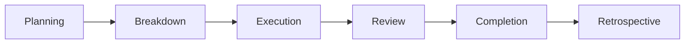

# Milestone Management Workflow

Comprehensive guide for planning, executing, and tracking project milestones using the Simone Framework.

## Overview

Milestones represent major project phases or deliverables, typically spanning 4-12 weeks. They provide strategic alignment between business objectives and development activities, breaking down large projects into manageable, measurable phases.

## Milestone Lifecycle



## Planning a Milestone

### Step 1: Create Milestone Structure

```bash
# Create milestone directory
mkdir .simone/02_REQUIREMENTS/M##_Milestone_Name

# Example:
mkdir .simone/02_REQUIREMENTS/M01_User_Authentication
```

### Step 2: Define Milestone Metadata

Create `M##_META.md` using the milestone template:

```yaml
milestone_id: "M01"
milestone_name: "User Authentication System"
start_date: "2024-01-15"
target_date: "2024-03-15"
status: "planning"
priority: "high"
business_value: "critical"
technical_complexity: "high"
estimated_effort: 8  # person-weeks
team_size: 3
completion_percentage: 0
success_metrics:
  primary_metric: "User login success rate"
  target_values: ["99.9% uptime", "<2s login time", "0 security vulnerabilities"]
dependencies:
  external: ["Auth provider API", "SSL certificates"]
  internal: ["Database setup", "Frontend framework"]
risk_assessment:
  overall_risk_level: "medium"
  primary_risks: ["Third-party API reliability", "Security compliance"]
  mitigation_strategies: ["Implement fallback auth", "Security audit"]
```

### Step 3: Define Requirements

Create requirement documents in the milestone directory:

1. **Product Requirements (M##_PRD.md)**:
   - User stories and acceptance criteria
   - Business objectives and success metrics
   - User experience requirements
   - Non-functional requirements

2. **Technical Specifications (M##_SPECS.md)**:
   - System architecture changes
   - API specifications
   - Database schema updates
   - Integration requirements

3. **Additional Documents** as needed:
   - `M##_Security_Requirements.md`
   - `M##_Performance_Targets.md`
   - `M##_Migration_Plan.md`

### Step 3.5: AI-Enhanced Requirements Analysis with Cognitive Personas

Leverage specialized AI personas to validate and enhance your milestone requirements:

#### Strategic Persona Application

**🏗️ Architecture Analysis:**
```bash
/project:simone:create_milestone "User Authentication System" --persona-architect --introspect
```
**Benefits:**
- Technical feasibility validation and system design recommendations
- Scalability considerations and integration pattern analysis
- Architecture decision record (ADR) suggestions
- Technology stack compatibility assessment

**🔒 Security Requirements:**
```bash
/project:simone:create_milestone "User Authentication System" --persona-security --persona-architect
```
**Benefits:**
- OWASP compliance requirements identification
- Security threat modeling and risk assessment
- Authentication flow security validation
- Data protection and privacy requirement analysis

**📊 Complexity Assessment:**
```bash
/project:simone:create_milestone "User Authentication System" --persona-analyzer --think-deep
```
**Benefits:**
- Effort estimation refinement based on technical complexity
- Risk factor identification and mitigation planning
- Dependency analysis and critical path assessment
- Quality metrics and success criteria definition

#### Multi-Persona Validation Workflow

**Comprehensive Analysis (for critical milestones):**
```bash
# Sequential analysis for thorough validation
/project:simone:create_milestone "Payment Gateway Integration" --persona-security --persona-backend --consensus --think-deep
```

**Benefits of Multi-Persona Approach:**
- **Conflict Resolution**: Identifies competing requirements and trade-offs
- **Comprehensive Coverage**: Ensures no critical aspects are overlooked
- **Quality Enhancement**: Multiple expert perspectives validate decisions
- **Risk Mitigation**: Early identification of potential issues

#### When to Use Persona Enhancement

| Milestone Type | Recommended Personas | Key Benefits |
|----------------|---------------------|--------------|
| **Authentication/Security** | Security + Architecture | OWASP compliance, secure design patterns |
| **Performance Critical** | Performance + Backend + Architecture | Optimization strategies, scalability planning |
| **User Interface** | Frontend + Performance + QA | UX optimization, accessibility compliance |
| **Data Migration** | Backend + Security + Analyzer | Data integrity, security, complexity assessment |
| **API Development** | Backend + Security + QA | RESTful design, security, testing strategies |
| **Complex Integration** | Architecture + Analyzer + Consensus | System design, risk assessment, validation |

#### Persona-Enhanced Documentation

The personas will automatically populate milestone metadata with domain-specific insights:

```yaml
# Enhanced milestone metadata (auto-populated by personas)
architecture_guidance: "Microservices architecture recommended for scalability"
security_assessment: "OAuth 2.0 with PKCE required for security compliance"
performance_considerations: "Response time target: <200ms for auth endpoints"
quality_insights: "90% test coverage required for authentication flows"
complexity_analysis: "High complexity due to third-party integrations"
```

> 💡 **Pro Tip**: Use `--introspect` flag to see the AI reasoning process and learn from expert analysis patterns.

### Step 4: Capacity Planning

Calculate team capacity and resource allocation:

```markdown
## Capacity Planning

### Team Allocation
- Backend Developer: 100% (8 weeks)
- Frontend Developer: 75% (6 weeks)
- DevOps Engineer: 50% (4 weeks)
- **Total Capacity**: 18 person-weeks

### Resource Requirements
- Development environments: 3
- Staging environment: 1
- Third-party services: Auth0, SendGrid
- Budget allocation: $15,000
```

## Breaking Down Milestones

### Step 1: Identify Major Components

Analyze the milestone to identify major work streams:

```markdown
## Work Breakdown Structure

### 1. Backend Authentication (40%)
- User model and database schema
- Authentication API endpoints
- Session management
- Password reset flow
- OAuth integration

### 2. Frontend Integration (30%)
- Login/signup forms
- Session handling
- Protected routes
- User profile management

### 3. Infrastructure & Security (30%)
- SSL setup and configuration
- Security hardening
- Monitoring and logging
- Performance optimization
```

### Step 2: Create Sprints from Milestone

Use the Simone command to generate sprints:

```
/project:simone:create_sprints_from_milestone M01
```

This will:
1. Analyze milestone scope and complexity
2. Create optimal sprint structure (typically 2-week sprints)
3. Distribute work across sprints
4. Set up sprint directories and metadata

Example sprint breakdown:
```
.simone/03_SPRINTS/
├── S01_M01_Backend_Core/
│   ├── S01_META.md
│   └── S01_TASKS.md
├── S02_M01_Frontend_Integration/
│   ├── S02_META.md
│   └── S02_TASKS.md
└── S03_M01_Security_Polish/
    ├── S03_META.md
    └── S03_TASKS.md
```

### Step 3: Create Detailed Tasks

For each sprint, create specific tasks:

```
/project:simone:create_sprint_tasks S01 "Implement user model and database schema"
/project:simone:create_sprint_tasks S01 "Create authentication API endpoints"
/project:simone:create_sprint_tasks S01 "Implement JWT token generation"
```

## Executing Milestones

### Progress Tracking

Update milestone metadata regularly:

```yaml
completion_percentage: 35
current_sprint: "S02"
completed_features:
  - "User registration API"
  - "Login functionality"
  - "Database schema implementation"
active_blockers:
  - "OAuth provider setup delayed"
  - "Performance issues with session storage"
```

### Status Monitoring

Use the status command for milestone overview:

```
/project:simone:status milestone M01
```

Output includes:
- Overall progress percentage
- Sprint completion status
- Risk assessment updates
- Blocker identification
- Resource utilization

### Risk Management

Continuously update risk assessment:

```yaml
risk_updates:
  - date: "2024-02-01"
    risk: "OAuth provider delays"
    impact: "high"
    mitigation: "Implement basic auth first, OAuth in next sprint"
  - date: "2024-02-15"
    risk: "Performance degradation"
    impact: "medium"
    mitigation: "Add caching layer, optimize queries"
```

## Milestone Review Process

### Weekly Milestone Review

1. **Progress Assessment**:
   - Review completion percentage
   - Check sprint velocity
   - Identify blockers
   - Assess risk changes

2. **Stakeholder Communication**:
   - Update executive summary
   - Prepare status reports
   - Schedule demos if needed

3. **Adjustment Planning**:
   - Rebalance remaining work
   - Adjust sprint scope
   - Update timelines if needed

### Milestone Health Metrics

Track key health indicators:

```yaml
health_metrics:
  schedule_health: "on_track"  # ahead, on_track, at_risk, behind
  budget_health: "on_track"
  quality_metrics:
    test_coverage: 85
    code_review_completion: 100
    documentation_status: 75
  team_health:
    velocity_trend: "stable"
    morale: "good"
    blockers_count: 2
```

## Milestone Completion

### Completion Criteria

Before marking a milestone complete:

1. **Feature Completion**:
   - [ ] All planned features implemented
   - [ ] Acceptance criteria met
   - [ ] Edge cases handled

2. **Quality Standards**:
   - [ ] Test coverage meets targets
   - [ ] No critical bugs
   - [ ] Performance benchmarks achieved
   - [ ] Security audit passed

3. **Documentation**:
   - [ ] User documentation complete
   - [ ] API documentation updated
   - [ ] Deployment guide created
   - [ ] ADRs for major decisions

4. **Stakeholder Approval**:
   - [ ] Product owner sign-off
   - [ ] Technical review passed
   - [ ] Demo to stakeholders completed

### Completion Process

1. **Final Review**:
   ```
   /project:simone:project_review milestone M01
   ```

2. **Update Status**:
   ```yaml
   status: "completed"
   completion_date: "2024-03-10"
   actual_effort: 19  # person-weeks
   final_metrics:
     features_delivered: 15
     bugs_fixed: 23
     test_coverage: 87
     performance_improvement: "40%"
   ```

3. **Create Release**:
   ```
   /project:simone:version release M01
   ```

## Milestone Retrospective

### Retrospective Meeting

Conduct a structured retrospective:

1. **What Went Well**:
   - Successful deliverables
   - Process improvements
   - Team achievements
   - Technical wins

2. **What Could Improve**:
   - Process bottlenecks
   - Communication gaps
   - Technical challenges
   - Resource issues

3. **Action Items**:
   - Process improvements
   - Tool enhancements
   - Training needs
   - Documentation updates

### Document Lessons Learned

Create `.simone/10_STATE_OF_PROJECT/M01_Retrospective.md`:

```markdown
# M01 User Authentication - Retrospective

## Summary
Milestone completed 5 days ahead of schedule with all features delivered.

## Key Achievements
- Implemented secure authentication system
- Achieved 99.9% uptime target
- Reduced login time to 1.5s (exceeded target)
- Zero security vulnerabilities found

## Challenges Overcome
- OAuth provider integration delays resolved by parallel development
- Performance issues solved with Redis caching
- Team capacity constraints managed through scope prioritization

## Improvements for Next Milestone
1. Earlier third-party integration testing
2. More granular task estimation
3. Daily standups instead of every other day
4. Automated performance testing in CI/CD

## Team Feedback
- "Clear requirements made development smooth"
- "Sprint structure helped maintain focus"
- "Need better async communication tools"
```

## Multi-Milestone Planning

### Portfolio View

For projects with multiple parallel milestones:

```
.simone/02_REQUIREMENTS/
├── M01_User_Authentication/     (In Progress)
├── M02_Payment_Integration/     (Planning)
├── M03_Admin_Dashboard/         (Blocked by M01)
└── M04_Mobile_App/             (Future)
```

### Dependency Management

Track inter-milestone dependencies:

```yaml
# In M03_META.md
dependencies:
  milestones: ["M01"]  # Must complete authentication first
  shared_resources: ["Backend Team", "Database"]
  integration_points: ["User API", "Session Management"]
```

### Resource Balancing

Manage resources across milestones:

```markdown
## Q1 Resource Allocation

| Team Member | M01 | M02 | M03 | Capacity |
|-------------|-----|-----|-----|----------|
| Backend Dev | 75% | 25% | -   | 100%     |
| Frontend    | 50% | -   | 50% | 100%     |
| DevOps      | 25% | 50% | 25% | 100%     |
```

## Integration with Other Workflows

### Sprint Execution

Milestones provide context for sprints:
- Sprint goals align with milestone objectives
- Task priorities reflect milestone priorities
- Sprint reviews include milestone progress

### Quality Assurance

Milestone quality gates:
- Code coverage targets per milestone
- Performance benchmarks
- Security requirements
- Documentation standards

### Release Management

Milestones often align with releases:
- Feature flags for gradual rollout
- Version tags for milestone completion
- Release notes from milestone summary
- Deployment coordination

## Best Practices

### Planning Best Practices

1. **Right-size Milestones**: 4-12 weeks is optimal
2. **Clear Success Criteria**: Measurable, specific targets
3. **Buffer for Unknown**: Add 20% capacity buffer
4. **Early Risk Assessment**: Identify and plan mitigations
5. **Stakeholder Alignment**: Get buy-in before starting

### Execution Best Practices

1. **Regular Check-ins**: Weekly milestone health checks
2. **Proactive Communication**: Update stakeholders early
3. **Flexible Scope**: Prioritize must-haves vs nice-to-haves
4. **Continuous Integration**: Merge work frequently
5. **Quality Throughout**: Don't save testing for the end

### Tracking Best Practices

1. **Update Metadata**: Keep completion percentage current
2. **Document Decisions**: Use ADRs for major choices
3. **Track Actuals**: Record actual vs estimated effort
4. **Measure Success**: Use defined metrics consistently
5. **Learn Continuously**: Regular retrospectives

## Common Patterns

### Pattern 1: Feature Milestone

For new feature development:
```
Structure:
- Design & Architecture Sprint
- Core Implementation Sprints (2-3)
- Integration & Polish Sprint
- Release Preparation Sprint
```

### Pattern 2: Technical Debt Milestone

For refactoring and improvements:
```
Structure:
- Assessment & Planning Sprint
- Refactoring Sprints (2-3)
- Migration Sprint
- Validation & Cleanup Sprint
```

### Pattern 3: Research Milestone

For exploration and prototyping:
```
Structure:
- Research & Discovery Sprint
- Prototype Development Sprint
- Evaluation & Decision Sprint
- Documentation Sprint
```

## Troubleshooting

### Common Issues

1. **Scope Creep**:
   - Solution: Strict change control process
   - Document all scope changes as ADRs
   - Adjust timeline/resources accordingly

2. **Resource Conflicts**:
   - Solution: Clear resource allocation matrix
   - Regular capacity planning reviews
   - Cross-training for critical skills

3. **Integration Delays**:
   - Solution: Early integration testing
   - Mock external dependencies
   - Parallel development tracks

4. **Quality Issues**:
   - Solution: Continuous testing
   - Regular code reviews
   - Automated quality gates

## Metrics and Reporting

### Key Performance Indicators

Track these KPIs for milestone health:

1. **Schedule Variance**: Actual vs planned completion
2. **Effort Variance**: Actual vs estimated person-weeks
3. **Quality Metrics**: Test coverage, bug count, tech debt
4. **Business Metrics**: Feature adoption, performance gains
5. **Team Metrics**: Velocity, satisfaction, knowledge sharing

### Executive Reporting

Create concise milestone reports:

```markdown
## M01 Executive Summary

**Status**: On Track (75% complete)
**Timeline**: On schedule for March 15 completion
**Budget**: Within allocated resources
**Risks**: OAuth integration (mitigated)
**Next Steps**: Frontend polish and security audit

### Key Achievements This Period
- Backend API 100% complete
- Frontend integration 60% complete
- Performance targets exceeded

### Upcoming Milestones
- Security audit: Feb 28
- UAT begins: March 5
- Production deploy: March 15
```

---

Effective milestone management provides the strategic framework for successful project delivery. By following these workflows and best practices, teams can deliver complex projects predictably and with high quality.