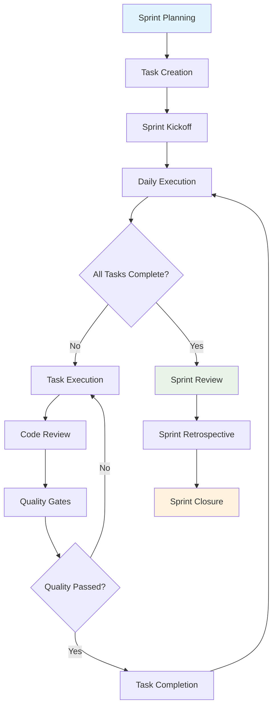
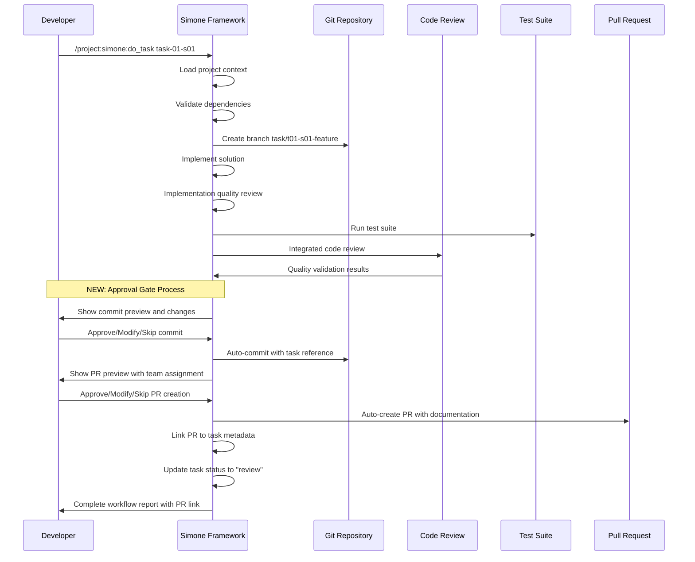

# Sprint Execution Workflow

**Purpose**: Complete guide to executing sprints using Simone framework  
**Audience**: Development Teams, Scrum Masters, Technical Leaders

## Overview

Simone's sprint execution workflow transforms traditional Agile practices with AI-enhanced development, comprehensive quality gates, and intelligent automation. This guide covers the complete sprint lifecycle from planning to retrospective.

## Sprint Execution Overview



## Phase 1: Sprint Preparation

### Sprint Planning Session

#### Prerequisites Checklist
- [ ] **Milestone requirements** are clear and documented in `02_REQUIREMENTS/M##_*/`
- [ ] **Architecture decisions** are documented with relevant ADRs
- [ ] **Team capacity** is known and available for planning
- [ ] **Previous sprint retrospective** actions are addressed
- [ ] **Dependencies** from other teams/sprints are identified

#### Planning Process
1. **Review milestone context** - Load all milestone documentation
2. **Assess team capacity** - Account for vacations, meetings, other commitments
3. **Break down into sprints** if not already done
4. **Validate sprint scope** - Ensure sprint goal is achievable
5. **Identify risks and dependencies** - Plan mitigation strategies

### Sprint Setup Command
```bash
# Initialize sprint structure (if not already created)
/project:simone:create_sprints_from_milestone

# Generate detailed tasks for the sprint
/project:simone:create_sprint_tasks
```

### Task Creation and Refinement

#### Automatic Task Generation
The `create_sprint_tasks` command performs:
1. **Parallel context loading** - Multiple agents load different aspects
2. **Codebase research** - Understands existing patterns and conventions
3. **Task creation** - Generates implementation-ready tasks
4. **Complexity validation** - Ensures proper task sizing
5. **Quality checklist generation** - Creates comprehensive review criteria

#### Task Refinement Process
```yaml
# Example generated task metadata
task_id: "task-01-s01"
estimated_effort: "3.5"          # Auto-generated estimate
complexity: "medium"             # Auto-assessed complexity
business_value: "high"           # Based on milestone context
technical_value: "medium"        # Architecture impact assessment
```

#### Task Validation Criteria
- ✅ **Proper scoping**: 1-4 hours estimated effort
- ✅ **Clear acceptance criteria**: 3-7 testable requirements
- ✅ **Implementation guidance**: Technical approach documented
- ✅ **Quality requirements**: Testing and review criteria defined
- ✅ **Dependency clarity**: Prerequisites and blockers identified

## Phase 2: Sprint Execution

### Daily Development Workflow

#### Morning Routine (5 minutes)
```bash
# Refresh project context
/project:simone:prime

# Check sprint status
/project:simone:status

# Review available tasks
ls .simone/03_SPRINTS/S01_M01_*/task-*.md
```

#### Task Execution Process

##### Enhanced Task Execution with Approval Gates
```bash
# Execute next available task with guided workflow
/project:simone:do_task

# Or execute specific task with approval gates
/project:simone:do_task task-03-s01
```

**New Approval Gate Features**:
- **Commit Review**: Preview all changes before committing
- **PR Review**: Review PR details before creation
- **User Control**: Modify, skip, or abort at any checkpoint
- **Auto-execution**: Commands run automatically after approval

**Complete Workflow Process**:
1. Task implementation with quality checks
2. **NEW**: Implementation quality review
3. Automated code review with parallel validation
4. **NEW**: Commit approval gate with change preview
5. **NEW**: Auto-commit with proper task reference
6. **NEW**: PR approval gate with team assignment
7. **NEW**: Auto-PR creation with documentation
8. **NEW**: Task status update to "review"

##### YOLO Mode Execution (Advanced)
```bash
# Autonomous execution of simple/medium tasks
/project:simone:yolo
```

**YOLO Mode Benefits**:
- ⚡ **High velocity** - Executes multiple tasks autonomously
- 🛡️ **Safety controls** - Only handles Simple/Medium complexity tasks
- 🔍 **Quality assurance** - Built-in code review and testing
- 📊 **Comprehensive logging** - Detailed execution reports

**YOLO Mode Limitations**:
- ❌ **No complex tasks** - Requires manual attention for complex work
- ❌ **No critical changes** - Avoids database migrations, auth changes
- ❌ **Safety boundaries** - Stops on first quality gate failure

#### Enhanced Task Execution with Cognitive Personas

Simone's cognitive personas provide specialized domain expertise for task execution:

```bash
# Security-critical tasks
/project:simone:do_task task-auth-implementation --persona-security --persona-backend

# Architecture decisions  
/project:simone:do_task task-api-design --persona-architect --persona-performance

# Complex multi-domain tasks
/project:simone:do_task task-payment-integration --persona-security --persona-backend --consensus
```

**Smart auto-activation**: Personas automatically activate based on task content and keywords.

> 📖 **Complete Guide**: [Cognitive Personas Documentation](../advanced/cognitive-personas.md)

### Task Execution Deep Dive

#### Context Loading Process
When executing a task, Simone loads:
1. **Project manifest** - Current status and health metrics
2. **Sprint requirements** - Goals and constraints for current sprint
3. **Task dependencies** - Prerequisite tasks and their outputs
4. **Architecture decisions** - Relevant ADRs and technical constraints
5. **Existing codebase** - Patterns, conventions, and integration points

#### Enhanced Implementation Process with Approval Gates


#### Quality Gates Integration
Every task execution includes automatic:
1. **Architecture compliance** - Validates against established ADRs
2. **Code quality standards** - Formatting, conventions, best practices
3. **Security assessment** - OWASP Top 10 vulnerability checks
4. **Performance review** - Identifies potential performance issues
5. **Test coverage validation** - Ensures adequate test coverage
6. **Documentation updates** - Keeps technical documentation current

### Daily Standup Integration

#### Status Reporting
```bash
# Generate standup report
/project:simone:status
```

**Sample Output**:
```
📊 Sprint S01_M01 Status (Day 5 of 10)
=====================================

🎯 Sprint Goal: Set up backend infrastructure and authentication
📈 Progress: 6/10 tasks completed (60%)
⏱️  Velocity: 1.2 tasks/day (on track)

✅ Completed Today:
- task-03-s01: Database schema implementation (3.2h)
- task-04-s01: User authentication endpoints (4.1h)

🔄 In Progress:
- task-05-s01: API rate limiting (2h remaining)

📋 Ready for Development:
- task-06-s01: Error handling middleware
- task-07-s01: Logging infrastructure

⚠️  Blockers:
- None currently

🎯 Today's Focus:
- Complete task-05-s01
- Start task-06-s01
- Code review for task-03-s01
```

#### Team Coordination
- **Parallel work identification** - Tasks that can be worked simultaneously
- **Dependency coordination** - When tasks must be sequenced
- **Blocker escalation** - Process for resolving impediments
- **Knowledge sharing** - Cross-task context and decisions

## Phase 3: Quality Assurance

### Continuous Quality Process

#### Task-Level Quality Gates
Each task completion triggers:
1. **Automatic code review** - Architecture and quality compliance
2. **Test execution** - Unit, integration, and E2E tests as required
3. **Security scan** - Vulnerability assessment
4. **Performance check** - Regression testing for performance impact
5. **Documentation validation** - Ensures docs are updated

#### Sprint-Level Quality Review
```bash
# Comprehensive project health check
/project:simone:project_review
```

**Review Coverage**:
- 🏗️ **Architecture alignment** - Compliance with established patterns
- 🧪 **Test infrastructure** - Coverage and quality of test suite
- 📚 **Documentation health** - Completeness and currency of docs
- 🔧 **Technical debt** - Identification and prioritization
- 🚀 **Performance metrics** - System performance and scalability
- 🔒 **Security posture** - Security best practices adherence

### Quality Metrics Dashboard

#### Sprint Health Indicators
```yaml
# Generated in project review
sprint_health:
  overall_score: 8.7/10           # Composite health score
  test_coverage: 92%              # Code coverage percentage
  technical_debt: "Low"           # Technical debt assessment
  architecture_compliance: 95%    # ADR adherence percentage
  documentation_score: 8.5/10     # Documentation quality
  security_score: 9.2/10         # Security posture rating
```

#### Velocity and Progress Tracking
- **Task completion rate** - Tasks per day/week
- **Effort estimation accuracy** - Estimated vs. actual effort variance
- **Quality metrics** - Defect rate, review cycle time
- **Team productivity** - Individual and team velocity trends

## Phase 4: Sprint Review and Closure

### Sprint Review Process

#### Demo Preparation
1. **Gather completed features** - All tasks marked as completed
2. **Prepare demo environment** - Staging environment with sprint changes
3. **Create demo script** - User-focused demonstration of functionality
4. **Gather stakeholder feedback** - Business value and user acceptance

#### Review Documentation
```bash
# Generate sprint completion report
/project:simone:project_review
```

**Report Contents**:
- ✅ **Completed tasks** - Full list with effort tracking
- 📊 **Sprint metrics** - Velocity, quality, and health indicators
- 🎯 **Goal achievement** - Sprint goal completion assessment
- 🔄 **Lessons learned** - Technical and process insights
- 📈 **Recommendations** - Improvements for future sprints

### Sprint Retrospective

#### Retrospective Template Integration
Simone generates structured retrospectives:
1. **What went well** - Successes and positive patterns
2. **What could be improved** - Process and technical improvements
3. **Action items** - Specific, actionable improvements for next sprint
4. **Metrics analysis** - Velocity, quality, and team health trends

#### Process Improvement Actions
Common retrospective outcomes:
- **Template customization** - Adapt Simone templates to team needs
- **Quality standard updates** - Refine review criteria and standards
- **Automation enhancements** - Identify opportunities for additional automation
- **Team training** - Skills development for framework and tools
- **Tool integration** - Additional integrations with team toolchain

### Sprint Closure Activities

#### Technical Closure
1. **Merge completed work** - Integrate all approved changes
2. **Update documentation** - Ensure all docs reflect current state
3. **Archive sprint artifacts** - Move completed tasks to archive
4. **Tag release** - Create version tag for sprint completion
5. **Deploy to staging** - Prepare for next phase of testing

#### Administrative Closure
1. **Update project manifest** - Reflect sprint completion status
2. **Generate metrics report** - Velocity and quality metrics
3. **Plan next sprint** - Based on retrospective insights
4. **Stakeholder communication** - Progress update to stakeholders

## Advanced Sprint Execution Features

### Parallel Task Execution

#### Configuration
```bash
# Enable parallel task execution (if supported)
claude config set --global "parallelTasksCount" 3
```

#### Benefits and Considerations
**Benefits**:
- ⚡ **Increased velocity** - Multiple tasks executed simultaneously
- 🎯 **Efficient resource usage** - Better utilization of AI capabilities
- 📊 **Faster feedback** - Parallel quality checks and reviews

**Considerations**:
- 💰 **Higher API usage** - Increased costs for parallel execution
- 🔄 **Potential conflicts** - Risk of concurrent changes to same files
- 🎛️ **Complexity management** - More coordination required

### Integration with External Tools

#### CI/CD Pipeline Integration
- **Build triggers** - Automatic builds on task completion
- **Quality gates** - Integration with external code quality tools
- **Deployment automation** - Staging deployments for sprint reviews
- **Monitoring integration** - Performance and error tracking setup

#### Project Management Tool Sync
- **Jira integration** - Sync task status with external project management
- **Slack notifications** - Real-time team updates on progress
- **Time tracking** - Integration with billing and capacity planning
- **Stakeholder dashboards** - Executive visibility into progress

## Best Practices

### Sprint Planning Best Practices
1. **Right-size the sprint** - Ensure sprint goal is achievable with available capacity
2. **Balance task complexity** - Mix of simple, medium tasks for steady velocity
3. **Plan for quality time** - Reserve 20% of capacity for review and refinement
4. **Address technical debt** - Include debt reduction tasks in each sprint
5. **Validate dependencies** - Ensure external dependencies are available

### Daily Execution Best Practices  
1. **Start with context** - Always run `/project:simone:prime` at session start
2. **One task at a time** - Focus on completing tasks rather than starting many
3. **Quality first** - Don't bypass quality gates for speed
4. **Document decisions** - Update tasks with implementation notes and rationale
5. **Communicate blockers** - Surface impediments quickly for team resolution

### Quality Management Best Practices
1. **Automate what you can** - Use YOLO mode for appropriate tasks
2. **Review with fresh eyes** - Conduct thorough reviews of AI-generated code
3. **Test comprehensively** - Don't skip testing requirements for speed
4. **Maintain standards** - Enforce code quality and architecture compliance
5. **Learn continuously** - Use retrospectives to improve processes

---

**Next Steps**: Review [Quality Assurance](./quality-assurance.md) for detailed quality processes, or explore [Release Management](./release-management.md) for end-to-end delivery workflows.