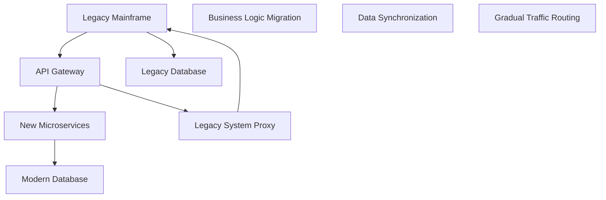

# Legacy System Migration Project Manifest

---
id: "legacy-migration-2025"
title: "Legacy Mainframe to Cloud Migration"
type: "migration_project"
created_date: "2025-07-10 15:00"
updated_date: "2025-07-10 15:00"
status: "active"
priority: "critical"
business_value: "high"
technical_complexity: "very_complex"
project_lead: "Patricia Wong"
product_owner: "Marcus Johnson"
technical_lead: "Elena Vasquez"
team_size: 25
estimated_duration: "24 months"
target_launch: "2027-06-30"
current_phase: "analysis"
completion_percentage: 20
quality_score: 8.5
risk_level: "critical"
version: "1.0.0"
legacy_systems_count: 12
migration_approach: "strangler_fig"
downtime_tolerance: "zero"
---

**Status**: Active Development | **Priority**: Critical | **Completion**: 20%  
**Target Launch**: 2027-06-30 | **Business Value**: High | **Risk**: Critical  
**Migration**: 12 Legacy Systems | **Approach**: Strangler Fig | **Downtime**: Zero Tolerance

## Executive Summary

### Project Vision
Migrate 12 critical legacy mainframe systems to a modern, cloud-native architecture while maintaining zero downtime for business operations and ensuring complete data integrity throughout the transition.

### Strategic Business Objectives
1. **Cost Reduction**: Eliminate $3M/year in mainframe maintenance costs
2. **Business Agility**: Enable rapid feature deployment and system updates
3. **Risk Mitigation**: Reduce dependency on aging systems and scarce expertise
4. **Scalability**: Support 300% business growth without infrastructure constraints
5. **Compliance**: Maintain SOX compliance throughout migration

### Technical Objectives
1. **Zero Downtime**: Maintain 99.99% uptime during migration
2. **Data Integrity**: 100% data accuracy with real-time synchronization
3. **Performance**: Match or exceed current system performance
4. **Security**: Enhance security posture with modern controls
5. **Maintainability**: Reduce system complexity and technical debt

## Current Status

### Migration Phases
- **Phase 1**: Legacy System Analysis & Discovery (85% complete)
- **Phase 2**: Target Architecture Design (60% complete)
- **Phase 3**: Data Migration Strategy (40% complete)
- **Phase 4**: Parallel System Development (15% complete)
- **Phase 5**: Incremental Cutover (Planning)

### Legacy System Inventory
1. **Customer Management System** (COBOL, DB2) - Analysis complete
2. **Order Processing System** (COBOL, IMS) - Analysis complete
3. **Inventory Management** (PL/I, VSAM) - Analysis in progress
4. **Financial Reporting** (COBOL, DB2) - Discovery phase
5. **Billing System** (COBOL, IMS) - Discovery phase
6. **Product Catalog** (Assembler, VSAM) - Discovery phase
7. **Customer Service** (COBOL, DB2) - Discovery phase
8. **Shipping & Logistics** (COBOL, IMS) - Discovery phase
9. **Returns Processing** (PL/I, VSAM) - Discovery phase
10. **Analytics & Reporting** (SAS, DB2) - Discovery phase
11. **Security & Access Control** (RACF, LDAP) - Discovery phase
12. **Batch Processing Engine** (JCL, COBOL) - Discovery phase

### Current Sprint (Analysis Phase)
- **Duration**: 3 weeks (2025-07-01 to 2025-07-22)
- **Focus**: Complete discovery for systems 3-6
- **Progress**: 75% complete
- **Team Velocity**: 22 analysis points

## Team Structure

### Migration Leadership
- **Patricia Wong** - Migration Program Manager
- **Marcus Johnson** - Business Product Owner
- **Elena Vasquez** - Technical Migration Lead
- **Dr. Robert Kim** - Legacy Systems Architect

### Specialized Teams
- **Legacy Analysis Team** (6 members): COBOL, PL/I, mainframe experts
- **Modern Architecture Team** (5 members): Cloud architects and developers
- **Data Migration Team** (4 members): ETL specialists and data engineers
- **Infrastructure Team** (4 members): Cloud platform and DevOps engineers
- **Quality Assurance Team** (3 members): Test automation and validation
- **Business Analysis Team** (3 members): Process mapping and requirements

### External Partners
- **Legacy Consulting Firm**: IBM mainframe specialists
- **Cloud Integration Partner**: AWS migration specialists
- **Data Migration Vendor**: Informatica implementation team

## Migration Strategy

### Strangler Fig Pattern Implementation

### Migration Approach by System
1. **Customer Management**: Lift-and-shift to containers, then refactor
2. **Order Processing**: Rewrite as microservices with event sourcing
3. **Inventory**: Hybrid approach with real-time sync
4. **Financial Reporting**: Replace with commercial solution + customization
5. **Billing**: Complete rewrite with modern billing platform
6. **Product Catalog**: Migrate to cloud-native e-commerce platform

### Data Migration Strategy
- **Dual-Write Pattern**: Synchronous writes to both systems
- **Event Sourcing**: Capture all changes for replay and verification
- **Incremental Sync**: Real-time data synchronization during transition
- **Rollback Capability**: Ability to revert to legacy system if needed

## Technology Stack

### Legacy Systems (Current)
- **Mainframe**: IBM z/OS with CICS and IMS
- **Languages**: COBOL, PL/I, Assembler
- **Databases**: DB2, IMS, VSAM
- **Integration**: MQ Series, file transfers

### Target Modern Stack
- **Cloud Platform**: AWS with multi-region deployment
- **Containers**: Docker with Amazon EKS
- **Languages**: Java 17, Python 3.11, TypeScript
- **Databases**: PostgreSQL, MongoDB, Redis
- **Integration**: Apache Kafka, REST APIs, GraphQL

### Migration Tools & Platforms
- **Code Analysis**: Micro Focus Enterprise Analyzer
- **Data Migration**: Informatica PowerCenter
- **Testing**: IBM Application Replay
- **Monitoring**: Dynatrace, DataDog
- **Project Management**: Jira, Confluence

## Risk Management (Critical Migration Risks)

### Business Continuity Risks
1. **System Downtime** (Critical - $10M impact/day)
   - **Mitigation**: Parallel systems with real-time sync
   - **Contingency**: Immediate rollback procedures tested weekly

2. **Data Loss or Corruption** (Critical - $50M+ impact)
   - **Mitigation**: Multiple backup strategies and validation checkpoints
   - **Contingency**: Point-in-time recovery with 15-minute RTO

3. **Performance Degradation** (High - $1M impact/week)
   - **Mitigation**: Extensive performance testing and optimization
   - **Contingency**: Capacity scaling and query optimization

### Technical Migration Risks
1. **Legacy Code Complexity** (High - 6-month delay risk)
   - **Mitigation**: Deep-dive analysis with mainframe experts
   - **Contingency**: Additional specialist contractors on standby

2. **Integration Dependencies** (High - 3-month delay risk)
   - **Mitigation**: API-first design with backward compatibility
   - **Contingency**: Extended parallel operation period

3. **Skills Gap** (Medium - Resource availability risk)
   - **Mitigation**: Cross-training and external partnerships
   - **Contingency**: Extended contractor relationships

## Quality Assurance (Migration-Specific)

### Migration Testing Strategy
- **Data Validation**: Automated comparison of legacy vs. modern data
- **Performance Testing**: Load testing with production traffic patterns
- **Business Process Testing**: End-to-end workflow validation
- **Rollback Testing**: Weekly rollback procedure validation
- **Disaster Recovery**: Full DR testing every 6 months

### Quality Gates (Migration)
- **Data Integrity**: 100% data accuracy validation
- **Performance**: <10% performance variance from baseline
- **Functionality**: 100% business process equivalence
- **Security**: Enhanced security posture verification
- **Rollback**: <15 minute rollback capability verified

## Success Metrics

### Technical Migration KPIs
- **Migration Progress**: % of systems successfully migrated
- **Data Accuracy**: 99.99% data integrity maintained
- **Performance**: <5% performance degradation during transition
- **Availability**: 99.99% uptime maintained throughout migration
- **Security**: Zero security incidents during migration

### Business Impact KPIs
- **Cost Savings**: $3M/year mainframe cost elimination
- **Time to Market**: 50% faster feature deployment
- **Business Agility**: Support for 300% business growth
- **Risk Reduction**: 90% reduction in legacy system dependencies
- **Compliance**: 100% SOX compliance maintained

### Project Management KPIs
- **Timeline Adherence**: <1 month variance from major milestones
- **Budget Control**: <5% variance from $8M approved budget
- **Quality Metrics**: <0.01% critical defect rate
- **Team Retention**: >90% team retention throughout project
- **Stakeholder Satisfaction**: >4.5/5 satisfaction rating

## Migration Timeline

### Phase 1: Analysis & Planning (Months 1-6)
- **M01**: Complete legacy system discovery and documentation
- **M02**: Define target architecture and migration strategy
- **M03**: Establish data migration and validation processes
- **M04**: Build migration tooling and automation

### Phase 2: Parallel Development (Months 7-12)
- **M05**: Customer Management system parallel deployment
- **M06**: Order Processing microservices development
- **M07**: Data synchronization infrastructure
- **M08**: Initial integration testing and validation

### Phase 3: Incremental Migration (Months 13-18)
- **M09**: Begin strangler fig pattern implementation
- **M10**: Migrate non-critical systems first
- **M11**: Establish parallel operation for critical systems
- **M12**: Performance optimization and scaling

### Phase 4: Critical System Migration (Months 19-24)
- **M13**: Migrate financial and billing systems
- **M14**: Complete all system migrations
- **M15**: Decommission legacy infrastructure
- **M16**: Post-migration optimization and documentation

## Budget & Resource Allocation

### Total Migration Budget: $8M
- **Team Costs**: $4.5M (56%)
- **External Consulting**: $1.5M (19%)
- **Infrastructure & Tools**: $1.0M (12.5%)
- **Cloud Migration Costs**: $0.8M (10%)
- **Contingency**: $0.2M (2.5%)

### Resource Allocation by Phase
- **Analysis & Planning**: 15 FTEs
- **Development & Migration**: 25 FTEs
- **Testing & Validation**: 20 FTEs
- **Cutover & Support**: 12 FTEs

## Communication Plan

### Executive Level
- **Steering Committee**: Monthly migration status and risk review
- **Board Updates**: Quarterly progress and budget reports
- **Business Continuity**: Weekly operational status reports

### Technical Level
- **Architecture Reviews**: Bi-weekly technical design sessions
- **Migration Team Syncs**: Daily cross-team coordination
- **Infrastructure Planning**: Weekly capacity and performance reviews

### Business Level
- **User Training**: Monthly sessions on new system features
- **Change Management**: Bi-weekly impact and readiness assessments
- **Support Planning**: Weekly support team preparation sessions

---

## Related Documents

### Migration Planning
- [Legacy System Analysis Reports](01_PROJECT_DOCS/LEGACY_ANALYSIS/)
- [Target Architecture Design](01_PROJECT_DOCS/TARGET_ARCHITECTURE.md)
- [Data Migration Strategy](01_PROJECT_DOCS/DATA_MIGRATION_STRATEGY.md)

### Risk & Compliance
- [Business Continuity Plan](01_PROJECT_DOCS/BUSINESS_CONTINUITY.md)
- [Rollback Procedures](01_PROJECT_DOCS/ROLLBACK_PROCEDURES.md)
- [Compliance Validation](01_PROJECT_DOCS/COMPLIANCE_VALIDATION.md)

### Technical Documentation
- [Integration Specifications](01_PROJECT_DOCS/INTEGRATION_SPECS.md)
- [Performance Benchmarks](01_PROJECT_DOCS/PERFORMANCE_BENCHMARKS.md)
- [Security Architecture](01_PROJECT_DOCS/SECURITY_ARCHITECTURE.md)

---

**Migration Metadata**
- **Created**: 2025-07-10 by Patricia Wong
- **Last Updated**: 2025-07-10 by Patricia Wong
- **Version**: 1.0.0
- **Next Review**: 2025-07-17 (Migration Steering Committee)
- **Document Status**: Active
- **Classification**: Confidential - Business Critical
- **Migration Pattern**: Strangler Fig with Zero Downtime