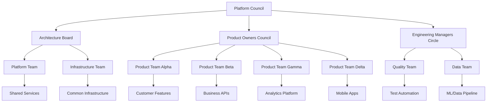

# Multi-Team Platform Project Manifest

---
id: "multi-team-platform-2025"
title: "Unified Development Platform Initiative"
type: "platform_project"
created_date: "2025-07-10 15:00"
updated_date: "2025-07-10 15:00"
status: "active"
priority: "high"
business_value: "high"
technical_complexity: "very_complex"
project_lead: "Alexandra Foster"
product_owner: "David Chen"
technical_lead: "Maria Santos"
team_size: 75
estimated_duration: "15 months"
target_launch: "2026-10-31"
current_phase: "development"
completion_percentage: 35
quality_score: 8.8
risk_level: "medium"
version: "2.1.0"
teams_count: 8
departments_count: 4
coordination_model: "federated_agile"
---

**Status**: Active Development | **Priority**: High | **Completion**: 35%  
**Target Launch**: 2026-10-31 | **Business Value**: High | **Risk**: Medium  
**Teams**: 8 Teams | **Departments**: 4 | **Model**: Federated Agile

## Executive Summary

### Project Vision
Build a unified development platform that enables 8 cross-functional teams across 4 departments to collaborate efficiently while maintaining team autonomy, shared standards, and consistent delivery practices.

### Strategic Business Objectives
1. **Development Velocity**: Increase feature delivery speed by 60%
2. **Quality Improvement**: Reduce production defects by 45%
3. **Team Efficiency**: Eliminate duplicate work and improve collaboration
4. **Time to Market**: Reduce new feature time-to-market by 40%
5. **Innovation**: Enable rapid experimentation and A/B testing

### Technical Objectives
1. **Platform Standardization**: Common tools and processes across teams
2. **Developer Experience**: Self-service capabilities and automated workflows
3. **Observability**: Unified monitoring and analytics across all services
4. **Security**: Built-in security and compliance automation
5. **Scalability**: Support 10x growth in team size and product complexity

## Current Status

### Team Coordination Structure
- **Platform Team**: Core infrastructure and shared services (8 members)
- **Product Team Alpha**: Customer-facing features (9 members)
- **Product Team Beta**: Business logic and APIs (10 members)
- **Product Team Gamma**: Analytics and insights (8 members)
- **Product Team Delta**: Mobile applications (9 members)
- **Infrastructure Team**: DevOps and site reliability (12 members)
- **Data Team**: Data engineering and ML (10 members)
- **Quality Team**: Testing automation and quality assurance (9 members)

### Cross-Department Involvement
- **Engineering**: 5 teams (Platform, Product Alpha/Beta, Infrastructure, Quality)
- **Product**: 2 teams (Product Gamma, Product Strategy)
- **Data**: 1 team (Data Team with ML focus)
- **Design**: Embedded designers in each product team

### Current Quarter Objectives (Q3 2025)
- Complete shared authentication and authorization platform
- Establish unified CI/CD pipeline for all teams
- Deploy centralized monitoring and observability stack
- Implement cross-team API governance and documentation

## Team Structure & Coordination

### Federated Agile Model

### Governance Structure
- **Platform Council**: Strategic decisions and cross-team prioritization
- **Architecture Board**: Technical standards and architectural decisions
- **Product Owners Council**: Feature alignment and customer value prioritization
- **Engineering Managers Circle**: Resource allocation and team coordination

### Team Autonomy & Alignment
- **Team Autonomy**: Technology choices within platform standards
- **Shared Standards**: Common APIs, security, monitoring, and deployment
- **Federated Decision Making**: Teams make local decisions within global constraints
- **Regular Synchronization**: Weekly cross-team demos and monthly alignment sessions

## Technology Stack (Standardized Platform)

### Shared Platform Services
- **Identity & Access**: Keycloak with OIDC/OAuth2
- **API Gateway**: Kong with rate limiting and analytics
- **Service Mesh**: Istio for inter-service communication
- **Configuration**: Consul for distributed configuration management

### Development Standards
- **Languages**: Java 17, TypeScript, Python 3.11 (team choice within these)
- **Frameworks**: Spring Boot, React/Next.js, FastAPI
- **Databases**: PostgreSQL (primary), MongoDB (documents), Redis (cache)
- **Messaging**: Apache Kafka for event streaming

### Shared Infrastructure
- **Container Platform**: Kubernetes (AWS EKS)
- **CI/CD**: GitLab CI with standardized pipelines
- **Monitoring**: Prometheus + Grafana + DataDog
- **Logging**: ELK Stack (Elasticsearch, Logstash, Kibana)
- **Security**: Vault for secrets, Falco for runtime security

### Team-Specific Technology Choices
- **Frontend Frameworks**: Teams choose React, Vue, or Angular
- **Testing Frameworks**: Teams choose Jest, Cypress, or Playwright
- **State Management**: Teams choose Redux, Zustand, or MobX
- **Database Optimization**: Teams can add specialized databases as needed

## Cross-Team Coordination

### Sprint Alignment Model
- **Sprint Duration**: All teams use 2-week sprints
- **Sprint Start**: All teams start sprints on same Monday
- **Cross-Team Dependencies**: Planned and tracked in shared dependency board
- **Integration Points**: Weekly integration testing across team boundaries

### Shared Sprint Ceremonies
- **Cross-Team Planning**: Monthly planning with dependency identification
- **System Demo**: Bi-weekly integrated system demonstration
- **Retrospective of Retrospectives**: Monthly cross-team improvement sharing
- **Architecture Sync**: Weekly technical alignment and standard updates

### Dependency Management
- **Dependency Mapping**: Visual dependency tracking between teams
- **Interface Contracts**: API contracts defined and versioned
- **Integration Testing**: Automated contract testing between services
- **Rollback Coordination**: Coordinated rollback procedures for breaking changes

## Quality Standards (Multi-Team)

### Shared Definition of Done
- [ ] Feature meets acceptance criteria with cross-team impact analysis
- [ ] Unit tests with 90%+ coverage within team boundaries
- [ ] Integration tests passing for team APIs and shared services
- [ ] Performance testing for shared platform components
- [ ] Security review for changes affecting shared infrastructure
- [ ] Code review by team member and architecture review if needed
- [ ] API documentation updated in shared developer portal
- [ ] Monitoring and alerting configured for new components
- [ ] Deployment to staging environment successful
- [ ] Cross-team impact assessment completed

### Platform Quality Gates
- **API Compatibility**: No breaking changes without migration path
- **Performance**: No degradation of shared platform services
- **Security**: All shared services pass security scanning
- **Observability**: All services emit standardized metrics and logs
- **Documentation**: API changes documented in shared portal

## Success Metrics (Multi-Team KPIs)

### Team Coordination Metrics
- **Cross-Team Dependencies**: <20% of stories blocked by external dependencies
- **Integration Issues**: <5% of deployments cause cross-team issues
- **Shared Service Reliability**: 99.9% uptime for platform services
- **Developer Satisfaction**: >4.2/5 platform and tooling satisfaction
- **Knowledge Sharing**: >80% teams participate in cross-team learning

### Platform Adoption Metrics
- **Standardization**: >90% teams using shared platform services
- **Self-Service**: >70% infrastructure needs met through self-service
- **Reusability**: >50% new features use existing shared components
- **Deployment Frequency**: >10 deployments per team per week
- **Lead Time**: <2 days from code commit to production

### Business Impact Metrics
- **Feature Delivery**: 60% increase in feature delivery velocity
- **Quality**: 45% reduction in production defects
- **Time to Market**: 40% reduction in new feature delivery time
- **Developer Productivity**: 50% reduction in setup and maintenance time
- **Innovation Rate**: 30% increase in experimentation and A/B tests

## Risk Management (Multi-Team Coordination)

### Coordination Risks
1. **Team Alignment Drift** (Medium - Delivery impact)
   - **Mitigation**: Regular cross-team alignment sessions and shared metrics
   - **Contingency**: Architecture Board intervention and realignment sprint

2. **Shared Service Bottlenecks** (High - Productivity impact)
   - **Mitigation**: Platform team capacity planning and SLA monitoring
   - **Contingency**: Temporary workarounds and rapid platform scaling

3. **Integration Complexity** (Medium - Quality impact)
   - **Mitigation**: Contract-driven development and automated integration testing
   - **Contingency**: Integration team support and extended testing phases

### Technical Platform Risks
1. **Platform Single Point of Failure** (High - Availability impact)
   - **Mitigation**: High availability design and disaster recovery planning
   - **Contingency**: Rapid rollback procedures and team-level fallbacks

2. **Technology Stack Divergence** (Medium - Maintenance impact)
   - **Mitigation**: Architecture governance and regular standard reviews
   - **Contingency**: Migration assistance and deprecated technology sunset plans

## Communication Plan (Multi-Team)

### Cross-Team Coordination
- **Daily**: Individual team stand-ups with cross-team blocker escalation
- **Weekly**: Cross-team dependency review and integration planning
- **Bi-weekly**: System-wide demo and integration showcase
- **Monthly**: Architecture review and platform roadmap updates

### Leadership Alignment
- **Platform Council**: Monthly strategic alignment and priority setting
- **Architecture Board**: Bi-weekly technical decision making
- **Engineering Managers**: Weekly resource and capacity planning
- **Product Owners**: Weekly feature alignment and customer value review

### Knowledge Sharing
- **Tech Talks**: Weekly technical presentations by teams
- **Architecture Sessions**: Monthly deep-dive technical sessions
- **Best Practices**: Quarterly cross-team retrospective and improvement sharing
- **Documentation**: Continuous updates to shared knowledge base

## Resource Allocation & Coordination

### Shared Resources (Platform Team)
- **Platform Engineering**: 5 engineers focused on shared services
- **Developer Experience**: 2 engineers focused on tooling and automation
- **Security Engineering**: 1 engineer focused on platform security

### Cross-Team Shared Responsibilities
- **On-Call Rotation**: All teams participate in platform service on-call
- **Architecture Review**: Each team contributes architects to review board
- **Quality Champions**: Each team has quality champion in quality team meetings
- **Documentation**: All teams contribute to shared documentation

### Budget Allocation
- **Shared Platform**: 25% of total budget
- **Individual Teams**: 60% of total budget
- **Cross-Team Initiatives**: 10% of total budget
- **Tooling and Infrastructure**: 5% of total budget

## Upcoming Milestones (Cross-Team)

### Q3 2025: Platform Foundation
- **M07**: Shared authentication platform deployment
- **M08**: Unified CI/CD pipeline for all teams
- **M09**: Centralized monitoring and observability
- **M10**: API governance and documentation platform

### Q4 2025: Advanced Integration
- **M11**: Cross-team automated testing framework
- **M12**: Shared data platform and analytics
- **M13**: Advanced deployment strategies (blue-green, canary)
- **M14**: Developer self-service portal

### Q1 2026: Optimization & Scale
- **M15**: Performance optimization across all services
- **M16**: Advanced security automation and compliance
- **M17**: Multi-region deployment capabilities
- **M18**: Full platform maturity and documentation

---

## Related Documents

### Cross-Team Coordination
- [Team Charter and Responsibilities](01_PROJECT_DOCS/TEAM_CHARTER.md)
- [Cross-Team Dependency Management](01_PROJECT_DOCS/DEPENDENCY_MANAGEMENT.md)
- [Federated Agile Playbook](01_PROJECT_DOCS/FEDERATED_AGILE_PLAYBOOK.md)

### Platform Architecture
- [Shared Platform Architecture](01_PROJECT_DOCS/PLATFORM_ARCHITECTURE.md)
- [API Standards and Governance](01_PROJECT_DOCS/API_STANDARDS.md)
- [Shared Service Catalog](01_PROJECT_DOCS/SERVICE_CATALOG.md)

### Team Management
- [Resource Allocation Framework](01_PROJECT_DOCS/RESOURCE_ALLOCATION.md)
- [Cross-Team Communication Plan](01_PROJECT_DOCS/COMMUNICATION_PLAN.md)
- [Conflict Resolution Procedures](01_PROJECT_DOCS/CONFLICT_RESOLUTION.md)

---

**Platform Metadata**
- **Created**: 2025-07-10 by Alexandra Foster
- **Last Updated**: 2025-07-10 by Alexandra Foster
- **Version**: 2.1.0
- **Next Review**: 2025-07-17 (Platform Council)
- **Document Status**: Active
- **Coordination Model**: Federated Agile with Platform Council Governance
- **Team Count**: 8 teams across 4 departments