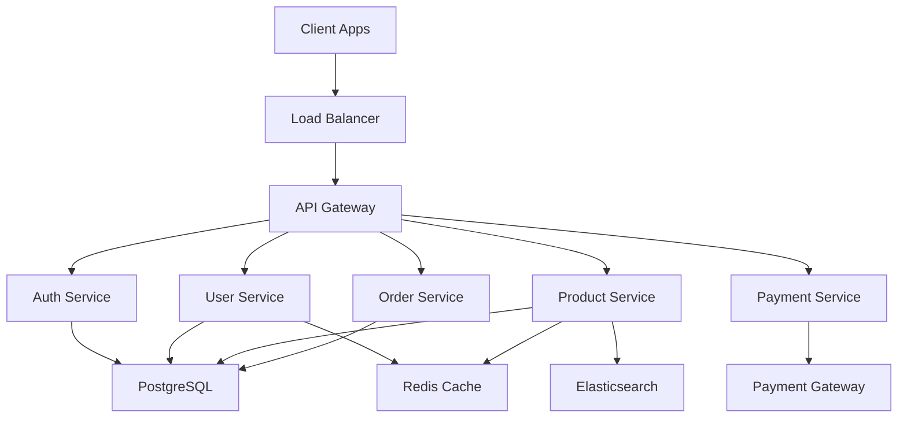

# E-Commerce Platform Project Manifest

---
id: "ecommerce-platform-2025"
title: "E-Commerce Platform Development"
type: "web_application"
created_date: "2025-01-15 09:00"
updated_date: "2025-07-10 14:30"
status: "active"
priority: "high"
business_value: "high"
technical_complexity: "complex"
project_lead: "Sarah Johnson"
product_owner: "Mike Chen"
technical_lead: "Alex Rodriguez"
team_size: 8
estimated_duration: "6 months"
target_launch: "2025-07-15"
current_phase: "development"
completion_percentage: 45
quality_score: 8.2
risk_level: "medium"
version: "1.2.0"
---

**Status**: Active Development | **Priority**: High | **Completion**: 45%  
**Target Launch**: 2025-07-15 | **Business Value**: High | **Risk**: Medium

## Executive Summary

### Project Vision
Build a modern, scalable e-commerce platform that provides seamless shopping experiences across web and mobile platforms, supporting B2C and B2B customers with advanced personalization and analytics.

### Business Objectives
1. **Revenue Growth**: Increase online sales by 200% within first year
2. **Market Expansion**: Support international markets with multi-currency/language
3. **Customer Experience**: Achieve 4.8+ customer satisfaction rating
4. **Operational Efficiency**: Reduce order processing time by 60%

### Technical Objectives
1. **Scalability**: Support 100k+ concurrent users
2. **Performance**: Sub-200ms page load times
3. **Availability**: 99.9% uptime SLA
4. **Security**: PCI DSS compliance and data protection

## Current Status

### Active Milestones
- **M01_Foundation_Setup** (Completed ✅)
- **M02_User_Management** (In Progress 🔄 - 80% complete)
- **M03_Product_Catalog** (Planned 📋)
- **M04_Shopping_Cart** (Planned 📋)

### Current Sprint
- **S01_M02_User_Authentication** (Sprint 1 of M02)
- **Duration**: 2 weeks (2025-07-01 to 2025-07-15)
- **Progress**: 75% complete
- **Team Velocity**: 28 story points

### Key Metrics
- **Code Coverage**: 87%
- **Bug Count**: 12 open (3 critical, 4 high, 5 medium)
- **Technical Debt**: 2.3 days
- **Team Velocity**: 28 story points/sprint (target: 30)

## Team Structure

### Core Team
- **Sarah Johnson** - Project Manager
- **Mike Chen** - Product Owner
- **Alex Rodriguez** - Technical Lead
- **Emma Davis** - Senior Frontend Developer
- **James Wilson** - Senior Backend Developer
- **Lisa Zhang** - UI/UX Designer
- **Tom Brown** - DevOps Engineer
- **Anna Martinez** - QA Engineer

### Stakeholders
- **CEO**: John Smith
- **CTO**: Dr. Rachel Green
- **VP Marketing**: David Kim
- **VP Sales**: Jennifer Liu

## Technology Stack

### Frontend
- **Framework**: React 18.x
- **Styling**: Tailwind CSS
- **State Management**: Redux Toolkit
- **Testing**: Jest, React Testing Library

### Backend
- **Runtime**: Node.js 18.x
- **Framework**: Express.js
- **Database**: PostgreSQL 14
- **Cache**: Redis 7
- **Search**: Elasticsearch 8

### Infrastructure
- **Cloud Provider**: AWS
- **Container Platform**: Docker + Kubernetes
- **CI/CD**: GitHub Actions
- **Monitoring**: Datadog

## Architecture Overview

## Quality Standards

### Definition of Done
- [ ] Feature implemented according to acceptance criteria
- [ ] Unit tests written with 90%+ coverage
- [ ] Integration tests passing
- [ ] Code reviewed and approved
- [ ] Security review completed
- [ ] Performance benchmarks met
- [ ] Documentation updated
- [ ] Accessibility standards met (WCAG 2.1 AA)

### Quality Gates
- **Code Quality**: SonarQube quality gate passing
- **Test Coverage**: Minimum 85% for new code
- **Performance**: No regression beyond 10% baseline
- **Security**: No high/critical vulnerabilities
- **Accessibility**: WCAG 2.1 AA compliance

## Risk Management

### Current Risks
1. **Payment Integration Complexity** (High)
   - **Mitigation**: Early prototype and vendor consultation
   - **Contingency**: Backup payment provider identified

2. **Scalability Under Load** (Medium)
   - **Mitigation**: Performance testing throughout development
   - **Contingency**: Auto-scaling policies and monitoring

3. **Third-party API Dependencies** (Medium)
   - **Mitigation**: Fallback strategies and circuit breakers
   - **Contingency**: Alternative service providers identified

## Success Metrics

### Technical KPIs
- **Performance**: Page load time < 200ms (Current: 180ms ✅)
- **Availability**: 99.9% uptime (Current: 99.95% ✅)
- **Scalability**: Support 100k concurrent users
- **Security**: Zero security incidents

### Business KPIs
- **Conversion Rate**: 3.5% target (Current: 2.8%)
- **Customer Satisfaction**: 4.8/5 target
- **Revenue Growth**: 200% increase year-over-year
- **Market Expansion**: 5 new countries supported

## Current Challenges

### Technical Challenges
1. **Database Performance**: Complex queries causing slowdowns
2. **Frontend State Management**: Managing complex user flows
3. **Microservices Communication**: Service discovery and reliability
4. **Real-time Features**: WebSocket scaling and connection management

### Business Challenges
1. **Changing Requirements**: Frequent scope adjustments
2. **Competitive Pressure**: Fast-moving market demands
3. **Compliance Requirements**: Multiple regulatory standards
4. **Resource Allocation**: Balancing feature development vs. technical debt

## Upcoming Milestones

### M03_Product_Catalog (Next - Q3 2025)
- **Duration**: 6 weeks
- **Team Size**: 6 developers
- **Key Features**: Product search, categories, inventory management
- **Success Criteria**: 100k products supported, sub-100ms search

### M04_Shopping_Cart (Q3 2025)
- **Duration**: 4 weeks
- **Team Size**: 5 developers
- **Key Features**: Cart persistence, wishlist, recommendations
- **Success Criteria**: 99.9% cart reliability, <50ms cart updates

### M05_Checkout_Payment (Q4 2025)
- **Duration**: 8 weeks
- **Team Size**: 7 developers
- **Key Features**: Multi-payment methods, fraud detection, international
- **Success Criteria**: PCI compliance, 99.99% transaction reliability

## Resource Allocation

### Current Sprint Capacity
- **Frontend**: 40 story points
- **Backend**: 35 story points
- **DevOps**: 15 story points
- **QA**: 25 story points
- **Total**: 115 story points/sprint

### Budget Status
- **Total Budget**: $2.4M
- **Spent to Date**: $1.1M (46%)
- **Remaining**: $1.3M
- **Burn Rate**: $200k/month
- **Projected Completion**: On budget ✅

## Communication Plan

### Daily
- **Stand-ups**: 9:00 AM daily
- **Blockers Review**: As needed
- **Stakeholder Updates**: Critical issues only

### Weekly
- **Sprint Planning**: Mondays 2:00 PM
- **Sprint Review**: Fridays 3:00 PM
- **Stakeholder Demo**: Fridays 4:00 PM

### Monthly
- **Project Review**: First Friday of month
- **Architecture Review**: Second Friday of month
- **Business Review**: Third Friday of month

## Compliance and Governance

### Security Compliance
- **PCI DSS**: Payment card industry compliance
- **GDPR**: European data protection regulation
- **SOC 2**: Security and availability controls
- **OWASP**: Web application security standards

### Quality Governance
- **Code Reviews**: Mandatory for all changes
- **Security Reviews**: For sensitive components
- **Performance Reviews**: For high-traffic features
- **Architecture Reviews**: For major technical decisions

---

## Related Documents

### Requirements
- [M02 User Management Requirements](02_REQUIREMENTS/M02_User_Management/)
- [M03 Product Catalog Requirements](02_REQUIREMENTS/M03_Product_Catalog/)

### Architecture
- [System Architecture](01_PROJECT_DOCS/ARCHITECTURE.md)
- [API Documentation](01_PROJECT_DOCS/API_DOCS.md)
- [Database Schema](01_PROJECT_DOCS/DATABASE_SCHEMA.md)

### Project Management
- [Current Sprint Plan](03_SPRINTS/S01_M02_User_Authentication/)
- [Risk Register](01_PROJECT_DOCS/RISK_REGISTER.md)
- [Quality Checklist](01_PROJECT_DOCS/QUALITY_CHECKLIST.md)

---

**Project Metadata**
- **Created**: 2025-01-15 by Sarah Johnson
- **Last Updated**: 2025-07-10 by Sarah Johnson
- **Version**: 1.2.0
- **Next Review**: 2025-07-17
- **Document Status**: Active