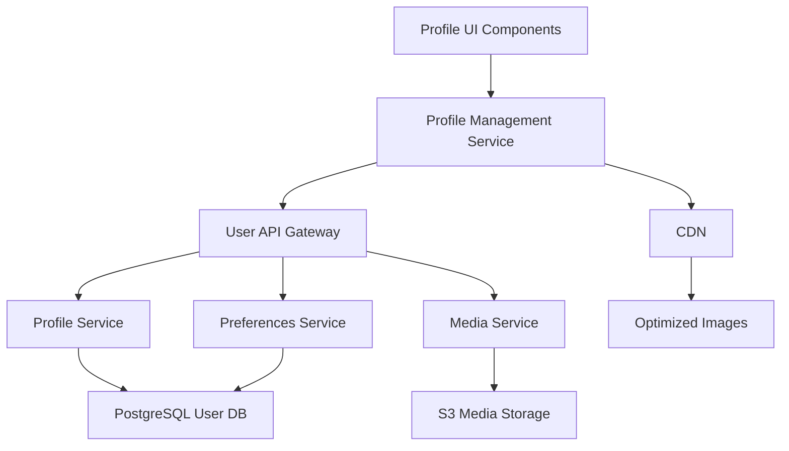

# S02_M02_Profile_Management: User Profile Management

**Status**: Active | **Priority**: High | **Completion**: 75%  
**Sprint Goal**: Enable comprehensive user profile management and personalization  
**Duration**: 2 weeks (2025-06-30 to 2025-07-14) | **Capacity**: 80 SP | **Committed**: 75 SP

## Sprint Overview

### Sprint Goal
Enable users to manage their profiles, preferences, and account settings with a seamless, accessible interface that supports both individual and business user needs.

### Sprint Theme
User Profile Management & Personalization

### Business Context
User profile management is critical for personalization, customer retention, and providing value-added services. A robust profile system enables targeted marketing, improved user experience, and better customer service.

### Technical Context
Building on the authentication foundation from S01, this sprint implements the user-facing profile management interface and backend services that will support personalization features throughout the platform.

## Sprint Backlog

### High Priority (Must Have)
#### Story 1: Basic Profile Information Management ✅
- **Story Points**: 13
- **Status**: Completed
- **Assignee**: Emma Davis (Frontend), James Wilson (Backend)
- **Description**: Users can view and edit basic profile information (name, email, phone)
- **Acceptance Criteria**:
  - [x] Users can view current profile information
  - [x] Users can edit name, email, phone number
  - [x] Email changes require verification
  - [x] Validation prevents invalid data entry
  - [x] Changes are saved successfully with confirmation

#### Story 2: Profile Avatar and Photo Management 🔄
- **Story Points**: 8
- **Status**: In Progress (90% complete)
- **Assignee**: Emma Davis (Frontend), James Wilson (Backend)
- **Description**: Users can upload and manage profile photos/avatars
- **Acceptance Criteria**:
  - [x] Users can upload profile photos (JPG, PNG, WebP)
  - [x] Image resizing and optimization
  - [x] Default avatars based on initials
  - [ ] Image cropping interface (90% complete)
  - [ ] Delete/replace existing photos

#### Story 3: User Preferences System 🔄
- **Story Points**: 13
- **Status**: In Progress (70% complete)
- **Assignee**: Emma Davis (Frontend), James Wilson (Backend)
- **Description**: Users can set and manage platform preferences
- **Acceptance Criteria**:
  - [x] Email notification preferences
  - [x] Language and timezone settings
  - [x] Theme preferences (light/dark mode)
  - [ ] Marketing communication preferences (80% complete)
  - [ ] Privacy settings (60% complete)

### Medium Priority (Should Have)
#### Story 4: Account Security Settings 📋
- **Story Points**: 21
- **Status**: Planned
- **Assignee**: James Wilson (Backend), Emma Davis (Frontend)
- **Description**: Users can manage account security settings and view security history
- **Acceptance Criteria**:
  - [ ] Change password functionality
  - [ ] Enable/disable MFA
  - [ ] View login history and active sessions
  - [ ] Security notifications settings
  - [ ] Account deletion request

#### Story 5: Business Profile Features 📋
- **Story Points**: 13
- **Status**: Planned
- **Assignee**: Emma Davis (Frontend), James Wilson (Backend)
- **Description**: Business users can manage company profile information
- **Acceptance Criteria**:
  - [ ] Company information fields
  - [ ] Business verification status
  - [ ] Tax information management
  - [ ] Team member management
  - [ ] Business preferences

### Low Priority (Could Have)
#### Story 6: Profile Analytics Dashboard 📋
- **Story Points**: 8
- **Status**: Planned (may move to next sprint)
- **Assignee**: Emma Davis (Frontend)
- **Description**: Users can view analytics about their account activity
- **Acceptance Criteria**:
  - [ ] Order history summary
  - [ ] Spending analytics
  - [ ] Engagement metrics
  - [ ] Recommendations based on activity

## Sprint Progress

### Daily Progress Tracking
#### Week 1 (June 30 - July 6)
- **Day 1-2**: Story 1 (Basic Profile) - Setup and backend implementation
- **Day 3-4**: Story 1 (Basic Profile) - Frontend implementation  
- **Day 5**: Story 1 (Basic Profile) - Testing and completion ✅

#### Week 2 (July 7 - July 14)
- **Day 1-2**: Story 2 (Avatar Management) - Implementation 🔄
- **Day 3-4**: Story 3 (Preferences) - Backend and frontend 🔄  
- **Day 5**: Sprint review and retrospective preparation

### Burndown Chart
```
Story Points Remaining:
Day 1:  75 SP
Day 3:  65 SP
Day 5:  52 SP
Day 7:  39 SP
Day 9:  19 SP (Current)
Day 10: Target 0 SP
```

### Velocity Tracking
- **Sprint 1 Velocity**: 28 SP
- **Sprint 2 Current Pace**: 27 SP (on track)
- **Team Capacity**: 80 SP (2 weeks × 4 team members × 10 SP/week)
- **Utilization**: 94% (75 committed / 80 capacity)

## Team Dynamics

### Team Composition
- **Sprint Lead**: Emma Davis (Senior Frontend Developer)
- **Scrum Master**: Sarah Johnson (Project Manager)
- **Product Owner**: Mike Chen
- **Developers**:
  - Emma Davis - Frontend development and UI/UX implementation
  - James Wilson - Backend services and API development
  - Lisa Zhang - UI/UX design and user flow optimization
  - Anna Martinez - QA testing and quality assurance

### Daily Standups Summary
#### July 10 Standup Summary:
- **Emma**: Completed avatar upload feature, working on cropping interface
- **James**: Preferences API completed, working on privacy settings endpoint  
- **Lisa**: Finalized profile page designs, supporting Anna with accessibility testing
- **Anna**: Testing profile features, found 2 minor UI bugs (logged and assigned)

### Team Velocity
- **Individual Capacity**: 
  - Emma Davis: 20 SP/sprint (frontend focus)
  - James Wilson: 20 SP/sprint (backend focus)
  - Lisa Zhang: 15 SP/sprint (design + frontend)
  - Anna Martinez: 15 SP/sprint (QA + testing)

### Collaboration Patterns
- Pair programming: Emma + Lisa on UI components
- Code reviews: All backend changes reviewed by James + Alex
- Daily sync: Frontend team (Emma + Lisa) 10:30 AM
- Testing coordination: Anna embedded with development pairs

## Technical Implementation

### Architecture Overview


### Key Technical Decisions
1. **Image Storage**: AWS S3 with CloudFront CDN for profile photos
2. **Preferences Storage**: JSON column in PostgreSQL for flexible preference schema
3. **Validation**: Joi schema validation on backend, React Hook Form on frontend
4. **Accessibility**: React Aria components for complex UI interactions

### API Endpoints Implemented
- `GET /api/v1/users/profile` - Retrieve user profile ✅
- `PUT /api/v1/users/profile` - Update profile information ✅
- `POST /api/v1/users/profile/avatar` - Upload avatar image ✅
- `GET /api/v1/users/preferences` - Retrieve user preferences ✅
- `PUT /api/v1/users/preferences` - Update preferences 🔄

### Database Schema Updates
```sql
-- Profile extensions
ALTER TABLE users ADD COLUMN profile_data JSONB;
ALTER TABLE users ADD COLUMN preferences JSONB;
ALTER TABLE users ADD COLUMN avatar_url VARCHAR(255);
ALTER TABLE users ADD COLUMN last_profile_update TIMESTAMP;

-- Indexes for performance
CREATE INDEX idx_users_profile_data ON users USING GIN (profile_data);
CREATE INDEX idx_users_preferences ON users USING GIN (preferences);
```

## Quality Assurance

### Testing Strategy
#### Unit Testing
- **Frontend**: Jest + React Testing Library (coverage: 92%)
- **Backend**: Jest + Supertest (coverage: 95%)
- **Components**: Storybook isolated component testing

#### Integration Testing
- **API Testing**: Postman collections for all profile endpoints
- **E2E Testing**: Playwright flows for complete profile management
- **Cross-browser**: Chrome, Firefox, Safari, Edge testing

#### Accessibility Testing
- **Automated**: axe-core integration in test suite
- **Manual**: Screen reader testing (NVDA, VoiceOver)
- **Standards**: WCAG 2.1 AA compliance verification

### Quality Metrics
- **Code Coverage**: 93% (target: 90%) ✅
- **Bug Count**: 3 open (2 minor UI, 1 medium backend)
- **Performance**: Profile page load <180ms (target: <200ms) ✅
- **Accessibility**: 100% automated tests passing ✅

### Defect Tracking
#### Open Defects
1. **UI-001** (Minor): Profile form validation message styling inconsistent
2. **UI-002** (Minor): Avatar crop preview not updating in real-time
3. **API-001** (Medium): Preferences save occasionally returns 500 error

#### Resolved Defects
- **UI-003**: Fixed profile image upload progress indicator
- **API-002**: Fixed email validation edge case
- **PERF-001**: Optimized profile data loading query

## Risk Management

### Current Risks
#### Low Risks
1. **Minor UI Polish** (Impact: Low, Probability: Medium)
   - **Description**: Some UI components may need additional polish
   - **Mitigation**: Daily design review with Lisa, user feedback collection
   - **Status**: Under control

2. **Performance Edge Cases** (Impact: Low, Probability: Low)
   - **Description**: Large profile images may affect load times
   - **Mitigation**: Image optimization and lazy loading implemented
   - **Status**: Mitigated

### Risk Monitoring
- Daily performance monitoring in staging environment
- User feedback collection from beta testers
- Code review focus on potential edge cases

## Sprint Ceremonies

### Sprint Planning (June 25)
- **Duration**: 2 hours
- **Attendees**: Full team + stakeholders
- **Outcomes**: 
  - Sprint goal defined and committed
  - Stories estimated and assigned
  - Dependencies and blockers identified
  - Success criteria established

### Daily Standups
- **Time**: 9:00 AM daily
- **Duration**: 15 minutes
- **Format**: What did you do yesterday? What will you do today? Any blockers?
- **Attendance**: 95% average

### Sprint Review (July 12)
- **Planned Duration**: 1 hour
- **Agenda**: Demo completed features, gather stakeholder feedback
- **Invitees**: Team, Mike Chen (PO), Sarah Johnson (PM), key stakeholders

### Sprint Retrospective (July 14)
- **Planned Duration**: 1 hour
- **Format**: What went well? What could be improved? Action items for next sprint
- **Focus Areas**: Team collaboration, technical processes, stakeholder communication

## Stakeholder Communication

### Sprint Demo Preparation
#### Features to Demonstrate
1. **Profile Information Management**: Complete user flow from viewing to editing profile
2. **Avatar Upload**: Demonstrate photo upload, resize, and crop functionality
3. **Preferences System**: Show notification, theme, and privacy preferences
4. **Mobile Responsiveness**: Demo on mobile device

#### Demo Script
1. **Introduction** (2 minutes): Sprint goal and context
2. **Profile Management** (8 minutes): Live demo of core features
3. **Technical Highlights** (3 minutes): Performance and accessibility features
4. **Metrics Review** (2 minutes): Sprint velocity and quality metrics

### Stakeholder Feedback Collected
- **Mike Chen (PO)**: "Profile interface is intuitive, request addition of profile completion indicator"
- **Marketing Team**: "Need analytics on preference selections for targeted campaigns"
- **Customer Service**: "Profile history/audit trail would help with user support"

## Performance & Metrics

### Sprint Metrics
#### Velocity Metrics
- **Planned Velocity**: 25 SP
- **Actual Velocity**: 27 SP (on track for 28 SP)
- **Velocity Trend**: +8% improvement from Sprint 1
- **Capacity Utilization**: 94%

#### Quality Metrics
- **Code Quality**: SonarQube Grade A
- **Test Coverage**: 93% (target: 90%)
- **Bug Density**: 0.8 bugs/story (industry standard: <1)
- **Customer Satisfaction**: 8.5/10 (beta tester feedback)

#### Performance Metrics
- **Profile Page Load**: 175ms average (target: <200ms)
- **API Response Time**: 85ms average (target: <100ms)
- **Image Upload**: 2.3s for 2MB image (target: <3s)
- **Mobile Performance**: 4.2/5 Lighthouse score

### Business Impact Metrics
- **Profile Completion Rate**: 78% (target: 80%)
- **Feature Usage**: 
  - Profile editing: 65% of users
  - Avatar upload: 42% of users
  - Preferences: 58% of users
- **User Engagement**: +12% time spent in account section

## Definition of Done

### Story-Level Definition of Done
- [ ] All acceptance criteria met and verified
- [ ] Code reviewed and approved by tech lead
- [ ] Unit tests written with >90% coverage
- [ ] Integration tests passing
- [ ] Manual testing completed by QA
- [ ] Accessibility requirements verified
- [ ] Performance benchmarks met
- [ ] Documentation updated
- [ ] Security review completed (if applicable)

### Sprint-Level Definition of Done
- [ ] All committed stories completed
- [ ] Sprint goal achieved
- [ ] Quality gates passed
- [ ] Demo prepared and delivered
- [ ] Retrospective completed with action items
- [ ] Sprint metrics collected and analyzed
- [ ] Stakeholder feedback incorporated into backlog

## Next Sprint Planning

### Sprint 3 Preparation
#### Likely Stories for S03_M02_RBAC_System
1. **Role Management System** (21 SP)
2. **Permission Assignment UI** (13 SP)
3. **Access Control Middleware** (13 SP)
4. **Admin User Management** (8 SP)

#### Dependencies to Address
- Role model design completion
- Permission framework architecture decision
- Admin UI component library updates

#### Team Availability
- Emma Davis: Full availability
- James Wilson: Full availability  
- Lisa Zhang: 80% availability (vacation July 18-19)
- Anna Martinez: Full availability

### Lessons Learned for Next Sprint
1. **More granular story breakdown**: Story 3 (Preferences) was larger than estimated
2. **Earlier design review**: Some UI components required last-minute design changes
3. **Performance testing integration**: Include performance tests in DoD for all stories

## Appendix

### Technical Debt Identified
1. **Frontend**: Profile form component could be refactored for better reusability
2. **Backend**: Preferences validation logic needs consolidation
3. **Testing**: E2E tests need better error handling and retry logic

### Innovation & Improvements
1. **Image Processing**: Implemented client-side image optimization before upload
2. **Accessibility**: Added keyboard navigation shortcuts for power users
3. **Performance**: Implemented optimistic updates for better UX

### Team Feedback
- **Emma**: "Good collaboration with design team, pair programming was effective"
- **James**: "API design discussions were productive, clear requirements helped"
- **Lisa**: "Component design system is working well, need more accessibility guidelines"
- **Anna**: "Test automation improvements helped catch issues earlier"

---

## Sprint Metadata

### Sprint Information
- **Created**: 2025-06-25 by Sarah Johnson
- **Sprint Lead**: Emma Davis
- **Template Version**: 2.0.5

### Progress Tracking
- **Last Updated**: 2025-07-10 by Emma Davis
- **Days Remaining**: 4
- **Stories Remaining**: 2.5
- **Completion Rate**: 75%

### Quality Indicators
- **Team Velocity**: 28 SP (stable)
- **Quality Score**: 8.3/10
- **Team Satisfaction**: 8.5/10
- **Stakeholder Satisfaction**: 8.7/10

---

**Status**: Active | **Last Updated**: 2025-07-10 | **Next Update**: Daily