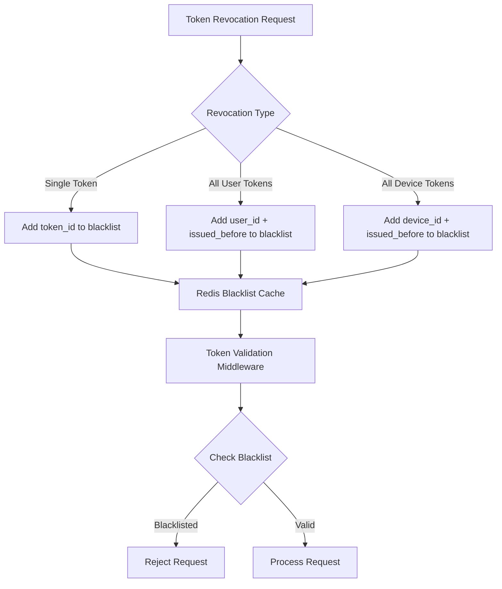

# ADR_003: User Authentication Strategy for E-Commerce Platform

**Status**: Accepted ✅  
**Decision Date**: 2025-06-20  
**Author**: Alex Rodriguez (Technical Lead)

## Summary

This ADR establishes the authentication strategy for the e-commerce platform, defining how users will authenticate, session management, and security measures to protect user accounts and sensitive data.

## Context and Problem Statement

The e-commerce platform requires a robust authentication system that supports both B2C customers and B2B business users. The system must be secure, scalable, user-friendly, and compliant with industry standards including SOC 2, GDPR, and PCI DSS.

### Key Requirements
1. **Security**: Protect against common vulnerabilities (OWASP Top 10)
2. **Scalability**: Support 100k+ concurrent authenticated users
3. **User Experience**: Seamless login/registration with minimal friction
4. **Compliance**: Meet SOC 2, GDPR, and PCI DSS requirements
5. **Integration**: Support enterprise SSO for B2B customers
6. **Performance**: Authentication response time <100ms
7. **Availability**: 99.9% authentication service uptime

### Business Context
- Target 50k+ user registrations in Q1 2025
- Enterprise customers require SSO integration
- Mobile app requires offline-capable authentication
- Customer service needs admin authentication features
- Marketing requires user segmentation capabilities

### Technical Context
- Microservices architecture with API gateway
- React frontend with mobile React Native app
- Node.js backend services
- PostgreSQL primary database
- Redis for caching and sessions
- AWS cloud infrastructure

## Decision Drivers

### Business Drivers
- **Customer Acquisition**: Reduce registration friction to improve conversion
- **Enterprise Sales**: SSO integration required for B2B customer deals
- **Security Compliance**: Industry standards required for payment processing
- **Global Expansion**: Multi-region authentication for international users
- **Customer Support**: Admin tools for account management and troubleshooting

### Technical Drivers
- **Stateless Architecture**: Support horizontal scaling and microservices
- **API-First Design**: Enable multiple client applications
- **Performance**: Sub-100ms authentication for better user experience
- **Maintainability**: Clear separation of concerns and testable code
- **Flexibility**: Support multiple authentication methods and future extensions

### Security Drivers
- **Zero Trust Model**: Verify every authentication request
- **Defense in Depth**: Multiple layers of security controls
- **Principle of Least Privilege**: Minimal access by default
- **Audit Trail**: Complete logging for compliance and forensics
- **Incident Response**: Rapid detection and response to security events

## Considered Options

### Option 1: Traditional Session-Based Authentication
**Architecture**: Server-side sessions with session cookies

**Pros**:
- Simple to implement and understand
- Mature patterns and libraries available
- Server-side session control (easy revocation)
- Built-in CSRF protection with SameSite cookies

**Cons**:
- Stateful design doesn't scale horizontally
- Requires sticky sessions or shared session storage
- Not suitable for microservices architecture
- Limited mobile app support
- Cross-domain authentication challenges

**Security Considerations**:
- Session fixation vulnerabilities
- Session storage security requirements
- Cookie security configurations

### Option 2: JWT with Stateless Architecture (Chosen)
**Architecture**: JSON Web Tokens with RS256 signature

**Pros**:
- Stateless design enables horizontal scaling
- Perfect for microservices and API-first architecture
- Excellent mobile app support
- Cross-domain authentication capability
- Self-contained tokens with user claims
- Industry standard with broad library support

**Cons**:
- Token revocation complexity
- Larger token size than session IDs
- Token replay attack risks if compromised
- Clock synchronization requirements
- Key management complexity

**Security Considerations**:
- RS256 asymmetric signature prevents tampering
- Short token expiration (15 minutes) limits exposure
- Refresh token rotation prevents long-term compromise
- Token blacklisting for immediate revocation

### Option 3: OAuth 2.0 / OpenID Connect Only
**Architecture**: Delegate authentication to external providers

**Pros**:
- Reduced authentication logic complexity
- Leverages proven identity providers
- User familiarity with social login
- Reduced security responsibility

**Cons**:
- Dependency on external providers
- Limited control over user experience
- Privacy concerns with data sharing
- Not suitable for all user types (B2B)
- Vendor lock-in risks

**Security Considerations**:
- Trust boundaries with external providers
- Token validation and refresh complexity
- Provider security incident impacts

### Option 4: Hybrid Approach
**Architecture**: JWT for APIs + OAuth for social login + Enterprise SSO

**Pros**:
- Flexibility for different user types
- Reduced friction for social users
- Enterprise SSO support
- Fallback options available

**Cons**:
- Increased complexity
- Multiple authentication flows to maintain
- Consistent user experience challenges
- Higher development and testing effort

## Decision

**Selected Option**: Option 2 - JWT with Stateless Architecture

### Primary Authentication Method
- **JWT Tokens**: RS256-signed JSON Web Tokens for API authentication
- **Access Tokens**: Short-lived (15 minutes) for API access
- **Refresh Tokens**: Longer-lived (7 days) for token renewal
- **Token Storage**: httpOnly cookies for web, secure storage for mobile

### Supplementary Authentication Methods
- **Social Login**: OAuth 2.0 integration with Google, Facebook, Apple
- **Enterprise SSO**: SAML 2.0 and OpenID Connect for business customers
- **Magic Links**: Email-based passwordless login option
- **Multi-Factor Authentication**: TOTP-based MFA for enhanced security

### Session Management Strategy
- **Stateless Design**: No server-side session storage
- **Redis Cache**: Token blacklisting for immediate revocation
- **Refresh Token Rotation**: New refresh token issued on each use
- **Device Tracking**: Track and manage user devices/sessions

## Rationale

### Why JWT was Selected

#### 1. Architectural Alignment
JWT's stateless nature perfectly aligns with our microservices architecture. Each service can independently validate tokens without cross-service communication or shared session storage.

#### 2. Scalability Benefits
Stateless authentication enables horizontal scaling without session affinity concerns. Load balancers can route requests to any available instance.

#### 3. Mobile App Requirements
JWT tokens work seamlessly across web and mobile applications, enabling consistent authentication across all client platforms.

#### 4. Performance Characteristics
Token validation is computationally lightweight (cryptographic signature verification) compared to database session lookups.

#### 5. Security Model
RS256 asymmetric signing provides strong security guarantees while enabling distributed token validation.

### Security Implementation Details

#### Token Structure
```json
{
  "header": {
    "alg": "RS256",
    "typ": "JWT",
    "kid": "key-id-1"
  },
  "payload": {
    "sub": "user-123",
    "iss": "ecommerce-platform",
    "aud": "api.platform.com",
    "iat": 1625097600,
    "exp": 1625098500,
    "scope": "user:profile order:read",
    "role": "customer",
    "session_id": "sess_abc123"
  }
}
```

#### Key Management
- **RSA Key Pairs**: 2048-bit keys generated securely
- **Key Rotation**: Monthly rotation with overlapping validity
- **Key Storage**: AWS KMS for production key management
- **Key Distribution**: JWKS endpoint for public key distribution

#### Token Revocation Strategy


### Multi-Factor Authentication (MFA)

#### TOTP Implementation
- **Algorithm**: HMAC-SHA1 with 6-digit codes
- **Time Window**: 30-second intervals with ±1 window tolerance
- **Backup Codes**: 10 single-use backup codes per user
- **QR Code Generation**: Standard otpauth:// URI format
- **Recovery Process**: Admin-assisted MFA reset with identity verification

#### MFA Enforcement Policies
- **Optional by Default**: Users can opt-in to MFA
- **Required for Admin**: All admin accounts must use MFA
- **Risk-Based**: Automatic MFA prompt for suspicious activity
- **Enterprise Policy**: B2B accounts can enforce MFA for all users

### Enterprise SSO Integration

#### SAML 2.0 Support
- **Identity Providers**: Support for major providers (Okta, Azure AD, Google Workspace)
- **Metadata Exchange**: Automated SP metadata generation and IdP metadata import
- **Attribute Mapping**: Configurable mapping of SAML attributes to user properties
- **Just-in-Time Provisioning**: Automatic user creation from SAML assertions

#### OpenID Connect Support
- **Standard Flows**: Authorization Code flow with PKCE
- **Discovery**: Support for .well-known/openid_configuration
- **Token Validation**: ID token verification and userinfo endpoint integration
- **Logout**: Support for RP-initiated logout with return URLs

## Implementation Plan

### Phase 1: Core JWT Authentication (4 weeks)
- [ ] JWT signing and validation infrastructure
- [ ] User registration and login APIs
- [ ] Password hashing with Argon2id
- [ ] Basic rate limiting and security headers
- [ ] Unit and integration tests

### Phase 2: Enhanced Security Features (3 weeks)
- [ ] Refresh token rotation implementation
- [ ] Token blacklisting with Redis
- [ ] Multi-factor authentication (TOTP)
- [ ] Account lockout and suspicious activity detection
- [ ] Security event logging and monitoring

### Phase 3: Social and SSO Integration (4 weeks)
- [ ] OAuth 2.0 integration (Google, Facebook, Apple)
- [ ] SAML 2.0 service provider implementation
- [ ] OpenID Connect relying party implementation
- [ ] Enterprise account management features
- [ ] Admin tools for SSO configuration

### Phase 4: Advanced Features (2 weeks)
- [ ] Magic link passwordless authentication
- [ ] Device management and tracking
- [ ] Advanced audit logging
- [ ] Performance monitoring and optimization
- [ ] Security incident response procedures

## Consequences

### Positive Consequences

#### Technical Benefits
- **Scalability**: Stateless design supports unlimited horizontal scaling
- **Performance**: Fast token validation without database lookups
- **Flexibility**: Easy integration with multiple client applications
- **Maintainability**: Clear separation between authentication and business logic
- **Testability**: Stateless design simplifies testing scenarios

#### Business Benefits
- **User Experience**: Fast authentication with minimal latency
- **Enterprise Sales**: SSO support enables B2B customer acquisition
- **Compliance**: Industry-standard approach meets regulatory requirements
- **Global Scaling**: Stateless design supports multi-region deployment
- **Developer Productivity**: Standard JWT libraries accelerate development

#### Security Benefits
- **Defense in Depth**: Multiple security layers (signatures, expiration, blacklisting)
- **Cryptographic Security**: RS256 provides strong tamper protection
- **Incident Response**: Token blacklisting enables rapid security response
- **Audit Trail**: Comprehensive logging supports forensic analysis
- **Zero Trust**: Every request validated cryptographically

### Negative Consequences

#### Technical Challenges
- **Token Management**: Refresh token rotation adds complexity
- **Revocation**: Immediate token revocation requires blacklisting infrastructure
- **Key Management**: RSA key rotation and distribution complexity
- **Clock Synchronization**: Token expiration requires accurate system clocks
- **Token Size**: JWT tokens larger than session IDs (bandwidth impact)

#### Operational Challenges
- **Monitoring**: Need to monitor token validation performance and errors
- **Key Rotation**: Operational procedures for regular key rotation
- **Blacklist Management**: Redis blacklist requires monitoring and cleanup
- **Cross-Service Security**: All services must validate tokens correctly
- **Incident Response**: Token revocation procedures during security incidents

#### Mitigation Strategies
- **Comprehensive Testing**: Extensive test coverage for all authentication flows
- **Monitoring and Alerting**: Real-time monitoring of authentication metrics
- **Documentation**: Detailed operational procedures and troubleshooting guides
- **Training**: Team training on JWT security best practices
- **Incident Playbooks**: Documented procedures for security incident response

## Monitoring and Success Metrics

### Technical Metrics
- **Authentication Latency**: <100ms for token validation
- **Token Validation Success Rate**: >99.9%
- **Key Rotation Success**: 100% successful monthly rotations
- **Blacklist Performance**: <10ms blacklist lookup time
- **Service Availability**: 99.9% authentication service uptime

### Business Metrics
- **User Registration Conversion**: >85% completion rate
- **Login Success Rate**: >99% for valid credentials
- **MFA Adoption**: >30% voluntary adoption
- **Enterprise SSO Success**: >98% SSO login success
- **Customer Satisfaction**: >4.5/5 authentication experience rating

### Security Metrics
- **Failed Login Attempts**: Monitor for brute force attacks
- **Suspicious Activity Detection**: Automated flagging and response
- **Token Compromise Detection**: Monitor for unusual token usage
- **Security Incident Response Time**: <2 hours for critical issues
- **Compliance Audit Results**: 100% compliance with SOC 2, GDPR, PCI DSS

## Risk Assessment

### High Risks
1. **Token Compromise** (Impact: High, Probability: Low)
   - **Description**: Attacker gains access to valid JWT tokens
   - **Mitigation**: Short token expiration, refresh token rotation, blacklisting
   - **Monitoring**: Unusual token usage patterns, geographic anomalies

2. **Key Compromise** (Impact: Critical, Probability: Very Low)
   - **Description**: Private signing keys are compromised
   - **Mitigation**: Hardware security modules, key rotation, access controls
   - **Response**: Emergency key rotation, token invalidation, incident response

### Medium Risks
1. **Performance Degradation** (Impact: Medium, Probability: Low)
   - **Description**: Authentication latency impacts user experience
   - **Mitigation**: Performance monitoring, caching strategies, load testing
   - **Response**: Auto-scaling, performance optimization, fallback procedures

2. **Third-Party Provider Issues** (Impact: Medium, Probability: Medium)
   - **Description**: Social login or SSO providers experience outages
   - **Mitigation**: Multiple provider options, fallback authentication methods
   - **Response**: Provider redundancy, communication to users, manual override

### Low Risks
1. **Clock Synchronization Issues** (Impact: Low, Probability: Low)
   - **Description**: Server clock drift affects token validation
   - **Mitigation**: NTP synchronization, token time tolerance windows
   - **Monitoring**: Clock drift alerts, token validation error rates

## Compliance Considerations

### SOC 2 Type II
- **Access Controls**: Role-based access with principle of least privilege
- **Audit Logging**: Comprehensive logging of all authentication events
- **Encryption**: Data encryption in transit and at rest
- **Monitoring**: Continuous monitoring of authentication systems
- **Incident Response**: Documented procedures for security incidents

### GDPR Compliance
- **Data Minimization**: Only collect necessary authentication data
- **Right to Erasure**: Account deletion removes all authentication data
- **Data Portability**: User can export authentication history
- **Consent Management**: Clear consent for data processing
- **Privacy by Design**: Default privacy-preserving configurations

### PCI DSS Requirements
- **Secure Authentication**: Strong authentication for payment-related access
- **Access Controls**: Restrict authentication system access
- **Encryption**: Protect authentication data with strong encryption
- **Monitoring**: Log and monitor authentication system access
- **Testing**: Regular security testing of authentication systems

## Future Considerations

### Planned Enhancements
- **Biometric Authentication**: Fingerprint and face recognition for mobile
- **Risk-Based Authentication**: Adaptive authentication based on user behavior
- **Passwordless Authentication**: WebAuthn/FIDO2 support for modern browsers
- **Zero-Knowledge Proofs**: Enhanced privacy for authentication
- **Quantum-Resistant Algorithms**: Prepare for post-quantum cryptography

### Technology Evolution
- **WebAuthn Standard**: Industry standard for passwordless authentication
- **OAuth 2.1**: Next generation OAuth standard adoption
- **Decentralized Identity**: Self-sovereign identity and verifiable credentials
- **AI/ML Integration**: Behavioral biometrics and anomaly detection
- **Edge Computing**: Distributed authentication for global performance

## References

### Standards and Specifications
- [RFC 7519: JSON Web Token (JWT)](https://tools.ietf.org/html/rfc7519)
- [RFC 7515: JSON Web Signature (JWS)](https://tools.ietf.org/html/rfc7515)
- [RFC 6749: OAuth 2.0 Authorization Framework](https://tools.ietf.org/html/rfc6749)
- [OpenID Connect Core 1.0](https://openid.net/specs/openid-connect-core-1_0.html)
- [SAML 2.0 Core Specification](http://docs.oasis-open.org/security/saml/v2.0/)

### Security Guidelines
- [OWASP Authentication Cheat Sheet](https://cheatsheetseries.owasp.org/cheatsheets/Authentication_Cheat_Sheet.html)
- [NIST Digital Identity Guidelines](https://pages.nist.gov/800-63-3/)
- [IETF Security Best Practices for OAuth 2.0](https://tools.ietf.org/html/draft-ietf-oauth-security-topics)

### Implementation Resources
- [Auth0 JWT Best Practices](https://auth0.com/blog/a-look-at-the-latest-draft-for-jwt-bcp/)
- [SANS Authentication Best Practices](https://www.sans.org/white-papers/authentication-best-practices/)
- [NIST Cybersecurity Framework](https://www.nist.gov/cyberframework)

---

## ADR Metadata

### Document Information
- **Created**: 2025-06-15 by Alex Rodriguez
- **Last Updated**: 2025-06-20 by Alex Rodriguez
- **Status**: Accepted
- **Next Review**: 2025-12-20

### Stakeholder Sign-offs
- **Technical Lead**: Alex Rodriguez ✅ (2025-06-20)
- **CTO**: Dr. Rachel Green ✅ (2025-06-20)
- **Product Owner**: Mike Chen ✅ (2025-06-20)
- **Security Lead**: James Wilson ✅ (2025-06-20)
- **Project Manager**: Sarah Johnson ✅ (2025-06-20)

### Implementation Status
- **Decision Approved**: 2025-06-20
- **Implementation Started**: 2025-06-22
- **Target Completion**: 2025-08-15
- **Current Progress**: 45% (Phase 1 and 2 in progress)

---

**Status**: Accepted | **Last Updated**: 2025-06-20 | **Next Review**: 2025-12-20