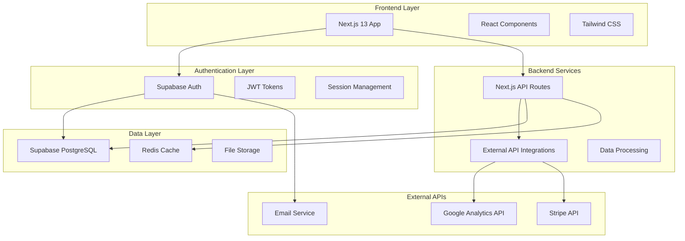
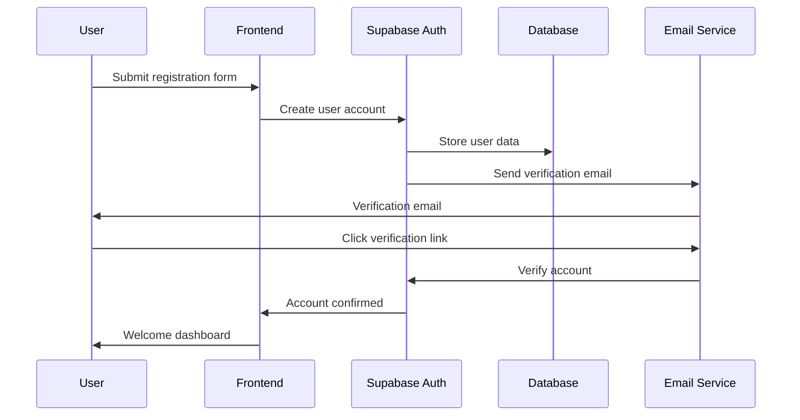
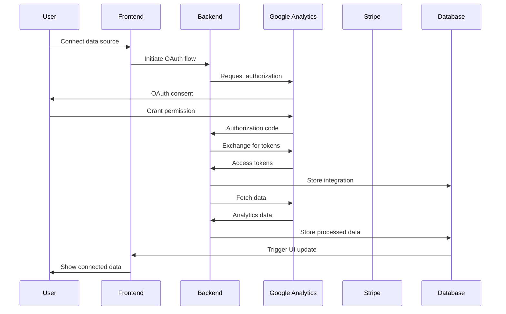
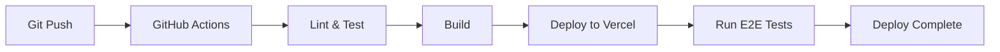

# SaaS Analytics Platform - System Architecture

---
document_type: "technical_architecture"
version: "1.0.0"
created_date: "2025-07-01"
updated_date: "2025-07-10"
author: "Alex Chen"
reviewers: ["Jordan Kim", "Maria Gonzalez"]
status: "active"
classification: "internal"
---

## Architecture Overview

### System Architecture


### Technology Stack

#### Frontend
- **Framework**: Next.js 13 with App Router
- **Language**: TypeScript 5.0
- **Styling**: Tailwind CSS 3.0
- **State Management**: React Context + useReducer
- **UI Components**: Headless UI + Custom Components
- **Charts**: Chart.js / Recharts
- **Testing**: Jest + React Testing Library

#### Backend
- **Runtime**: Node.js 18
- **Framework**: Next.js API Routes
- **Authentication**: Supabase Auth
- **Database**: Supabase PostgreSQL
- **Caching**: Redis (Railway addon)
- **File Storage**: Supabase Storage

#### Infrastructure
- **Frontend Hosting**: Vercel
- **Backend Hosting**: Railway
- **Database**: Supabase
- **Monitoring**: Sentry
- **Analytics**: Mixpanel

## System Components

### Core Modules

#### Authentication Service
```typescript
interface AuthService {
  signUp(email: string, password: string, profile: UserProfile): Promise<AuthResult>;
  signIn(email: string, password: string): Promise<AuthResult>;
  signOut(): Promise<void>;
  resetPassword(email: string): Promise<void>;
  getCurrentUser(): Promise<User | null>;
  updateProfile(profile: Partial<UserProfile>): Promise<void>;
}
```

#### Data Integration Service
```typescript
interface DataIntegrationService {
  connectGoogleAnalytics(authCode: string): Promise<Integration>;
  connectStripe(authCode: string): Promise<Integration>;
  syncData(integrationId: string): Promise<SyncResult>;
  getMetrics(timeRange: TimeRange): Promise<Metrics>;
  scheduleSync(integrationId: string, frequency: SyncFrequency): Promise<void>;
}
```

#### Analytics Engine
```typescript
interface AnalyticsEngine {
  calculateKPIs(data: RawData[]): Promise<KPISet>;
  generateInsights(metrics: Metrics): Promise<Insight[]>;
  createReport(template: ReportTemplate, data: Metrics): Promise<Report>;
  exportData(format: ExportFormat, data: Metrics): Promise<string>;
}
```

### Data Flow Architecture

#### User Registration Flow


#### Data Synchronization Flow


## Database Design

### Core Tables

#### User Profiles
```sql
CREATE TABLE user_profiles (
  id UUID REFERENCES auth.users(id) PRIMARY KEY,
  first_name TEXT NOT NULL,
  last_name TEXT NOT NULL,
  company_name TEXT,
  role TEXT,
  phone TEXT,
  timezone TEXT DEFAULT 'UTC',
  created_at TIMESTAMP WITH TIME ZONE DEFAULT NOW(),
  updated_at TIMESTAMP WITH TIME ZONE DEFAULT NOW()
);
```

#### Data Integrations
```sql
CREATE TABLE data_integrations (
  id UUID DEFAULT gen_random_uuid() PRIMARY KEY,
  user_id UUID REFERENCES user_profiles(id) NOT NULL,
  provider TEXT NOT NULL, -- 'google_analytics', 'stripe'
  provider_account_id TEXT NOT NULL,
  access_token TEXT NOT NULL,
  refresh_token TEXT,
  expires_at TIMESTAMP WITH TIME ZONE,
  status TEXT DEFAULT 'active', -- 'active', 'error', 'disabled'
  last_sync_at TIMESTAMP WITH TIME ZONE,
  created_at TIMESTAMP WITH TIME ZONE DEFAULT NOW(),
  updated_at TIMESTAMP WITH TIME ZONE DEFAULT NOW()
);
```

#### Metrics Data
```sql
CREATE TABLE metrics_daily (
  id UUID DEFAULT gen_random_uuid() PRIMARY KEY,
  user_id UUID REFERENCES user_profiles(id) NOT NULL,
  integration_id UUID REFERENCES data_integrations(id) NOT NULL,
  date DATE NOT NULL,
  metric_type TEXT NOT NULL, -- 'revenue', 'visitors', 'conversions'
  value DECIMAL(15,2) NOT NULL,
  metadata JSONB,
  created_at TIMESTAMP WITH TIME ZONE DEFAULT NOW(),
  
  UNIQUE(user_id, integration_id, date, metric_type)
);
```

### Row Level Security (RLS)
```sql
-- User profiles security
ALTER TABLE user_profiles ENABLE ROW LEVEL SECURITY;
CREATE POLICY "Users can view own profile" ON user_profiles
  FOR SELECT USING (auth.uid() = id);
CREATE POLICY "Users can update own profile" ON user_profiles
  FOR UPDATE USING (auth.uid() = id);

-- Data integrations security  
ALTER TABLE data_integrations ENABLE ROW LEVEL SECURITY;
CREATE POLICY "Users can manage own integrations" ON data_integrations
  FOR ALL USING (user_id = auth.uid());

-- Metrics security
ALTER TABLE metrics_daily ENABLE ROW LEVEL SECURITY;
CREATE POLICY "Users can view own metrics" ON metrics_daily
  FOR SELECT USING (user_id = auth.uid());
```

## API Design

### REST API Endpoints

#### Authentication Endpoints
```typescript
// Handled by Supabase Auth
POST /auth/signup      // User registration
POST /auth/signin      // User login
POST /auth/signout     // User logout
POST /auth/reset       // Password reset
```

#### User Management
```typescript
GET    /api/user/profile    // Get user profile
PUT    /api/user/profile    // Update user profile
DELETE /api/user/account    // Delete user account
```

#### Data Integrations
```typescript
GET    /api/integrations           // List user integrations
POST   /api/integrations/google    // Connect Google Analytics
POST   /api/integrations/stripe    // Connect Stripe
DELETE /api/integrations/:id       // Disconnect integration
POST   /api/integrations/:id/sync  // Manual sync trigger
```

#### Analytics Data
```typescript
GET /api/metrics?timeRange=30d&metrics=revenue,visitors // Get metrics
GET /api/dashboard                                       // Dashboard data
GET /api/reports                                        // Available reports
POST /api/reports/generate                              // Generate report
GET /api/export?format=csv&timeRange=30d              // Export data
```

## Security Architecture

### Authentication & Authorization
- **Authentication**: Supabase Auth with JWT tokens
- **Authorization**: Row Level Security (RLS) in PostgreSQL
- **Session Management**: Automatic token refresh
- **Password Policy**: 8+ characters, mixed case, numbers

### Data Protection
- **Encryption in Transit**: TLS 1.3 for all communications
- **Encryption at Rest**: AES-256 encryption for database
- **API Security**: Rate limiting and input validation
- **OAuth Security**: Secure token storage and refresh

### Security Headers
```typescript
// Next.js security headers
const securityHeaders = [
  {
    key: 'X-DNS-Prefetch-Control',
    value: 'on'
  },
  {
    key: 'Strict-Transport-Security',
    value: 'max-age=63072000; includeSubDomains; preload'
  },
  {
    key: 'X-Frame-Options',
    value: 'DENY'
  },
  {
    key: 'X-Content-Type-Options',
    value: 'nosniff'
  },
  {
    key: 'Referrer-Policy',
    value: 'origin-when-cross-origin'
  }
];
```

## Performance Considerations

### Frontend Performance
- **Code Splitting**: Automatic with Next.js App Router
- **Image Optimization**: Next.js built-in optimization
- **Caching**: SWR for data fetching with cache
- **Bundle Size**: Tree shaking and dynamic imports

### Backend Performance
- **Database Indexing**: Proper indexes on query columns
- **Connection Pooling**: Supabase handles connection pooling
- **Caching Strategy**: Redis for frequently accessed data
- **API Rate Limiting**: Prevent abuse and ensure stability

### Caching Strategy
```typescript
// Cache configuration
const cacheConfig = {
  metrics: {
    ttl: 3600, // 1 hour for metrics data
    revalidate: 300 // 5 minutes background refresh
  },
  dashboards: {
    ttl: 1800, // 30 minutes for dashboard data
    revalidate: 180 // 3 minutes background refresh
  },
  reports: {
    ttl: 86400, // 24 hours for generated reports
    revalidate: 3600 // 1 hour background refresh
  }
};
```

## Scalability Plan

### Current Capacity (MVP)
- **Users**: 100 concurrent users
- **Data Volume**: 1GB database storage
- **API Requests**: 10,000 requests/day
- **Data Sync**: Daily synchronization

### Growth Targets (6 months)
- **Users**: 1,000 concurrent users  
- **Data Volume**: 10GB database storage
- **API Requests**: 100,000 requests/day
- **Data Sync**: Hourly synchronization

### Scaling Strategies
1. **Database Scaling**: Supabase Pro plan with read replicas
2. **Caching**: Redis cluster for improved performance
3. **CDN**: Cloudflare for static asset delivery
4. **Background Jobs**: Queue system for data processing
5. **Monitoring**: Comprehensive performance monitoring

## Deployment Architecture

### Environments
- **Development**: Local development with Supabase local
- **Staging**: Vercel preview with Supabase staging instance
- **Production**: Vercel production with Supabase production

### CI/CD Pipeline


### Infrastructure as Code
```yaml
# Vercel deployment configuration
{
  "framework": "nextjs",
  "env": {
    "NEXT_PUBLIC_SUPABASE_URL": "@supabase-url",
    "NEXT_PUBLIC_SUPABASE_ANON_KEY": "@supabase-anon-key",
    "SUPABASE_SERVICE_ROLE_KEY": "@supabase-service-key"
  },
  "functions": {
    "pages/api/**": {
      "maxDuration": 10
    }
  }
}
```

## Monitoring & Observability

### Application Monitoring
- **Error Tracking**: Sentry for error monitoring
- **Performance**: Vercel Analytics for performance metrics
- **User Analytics**: Mixpanel for user behavior
- **Infrastructure**: Supabase dashboard for database metrics

### Key Metrics
- **Performance**: Page load times, API response times
- **Reliability**: Uptime, error rates, success rates
- **Business**: User registrations, feature adoption
- **Security**: Failed login attempts, unusual access patterns

### Alerting
```typescript
// Alert configuration
const alerts = {
  errorRate: {
    threshold: 5, // 5% error rate
    window: '5m',
    action: 'email'
  },
  responseTime: {
    threshold: 1000, // 1 second
    window: '5m', 
    action: 'slack'
  },
  database: {
    threshold: 80, // 80% CPU usage
    window: '10m',
    action: 'email'
  }
};
```

## Related Documentation

### Technical Documents
- [ADR001: Authentication Strategy](../05_ARCHITECTURAL_DECISIONS/ADR001_Authentication_Strategy.md)
- [API Documentation](./API_DOCUMENTATION.md)
- [Database Schema](./DATABASE_SCHEMA.md)
- [Security Guidelines](./SECURITY_GUIDELINES.md)

### Deployment Guides
- [Development Setup](./DEVELOPMENT_SETUP.md)
- [Production Deployment](./PRODUCTION_DEPLOYMENT.md)
- [Environment Configuration](./ENVIRONMENT_CONFIG.md)

---

**Document Control**
- **Classification**: Internal Technical Documentation
- **Next Review**: 2025-08-01
- **Owner**: Alex Chen (Technical Lead)
- **Reviewers**: Jordan Kim (Product), Maria Gonzalez (Advisor)