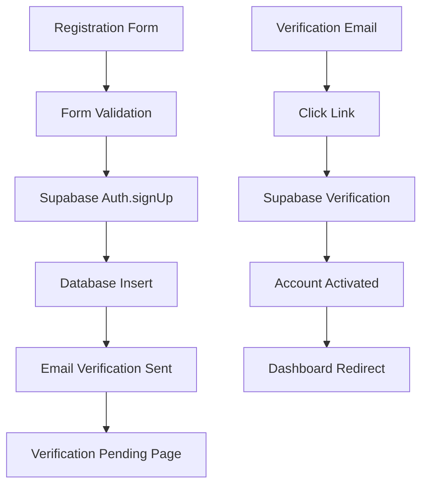

# T01_S01 User Registration System Implementation

---
task_id: "T01_S01_User_Registration_System"
task_type: "feature"
status: "in_progress"
priority: "critical"
complexity: "medium"
estimated_effort: "16"
actual_effort: "12"
remaining_effort: "4"
sprint_id: "S01_M01_User_Auth_Foundation"
milestone_id: "M01_Core_Platform"
assignee: "Alex Chen"
reviewer: "Jordan Kim"
created_date: "2025-07-01"
updated_date: "2025-07-10"
due_date: "2025-07-12"
story_points: 8
business_value: "critical"
technical_value: "high"
dependencies: []
blockers: []
tags: ["authentication", "frontend", "backend", "mvp"]
risk_level: "low"
completion_percentage: 75
quality_score: 8.5
---

**Status**: In Progress | **Priority**: Critical | **Effort**: 12h/16h | **Progress**: 75%  
**Assignee**: Alex Chen | **Reviewer**: Jordan Kim | **Due**: 2025-07-12

## Overview

### Task Description
Implement comprehensive user registration system with email/password authentication, email verification, and basic profile setup to enable new users to create accounts and access the SaaS analytics platform.

### Business Context
User registration is the first critical touchpoint for potential customers. A smooth, secure registration process is essential for user acquisition and platform adoption. This forms the foundation for all user interactions with the analytics platform.

### Technical Context
This task establishes the authentication foundation using Supabase Auth, which provides secure user management with minimal backend development required. The implementation needs to integrate seamlessly with the Next.js frontend and prepare for future feature expansion.

## Requirements

### Functional Requirements

#### FR1: Email/Password Registration
- **Priority**: Critical
- Users can register with email address and password
- Email addresses must be unique across the platform
- Password strength requirements enforced
- Registration form includes basic user information

#### FR2: Email Verification
- **Priority**: Critical  
- Email verification required before account activation
- Verification emails sent automatically upon registration
- Verification links expire after 24 hours
- Resend verification email option available

#### FR3: Basic Profile Setup
- **Priority**: High
- Users provide basic information during registration
- Company/organization name collection
- Role/title selection from predefined list
- Optional phone number for future features

#### FR4: User Experience Flow
- **Priority**: High
- Clear registration flow with progress indicators
- Immediate feedback on form validation errors
- Success confirmation with next steps
- Smooth transition to email verification

### Non-Functional Requirements

#### NFR1: Security
- Passwords hashed using Supabase secure methods
- Email verification prevents unauthorized access
- Rate limiting on registration attempts
- Input validation and sanitization

#### NFR2: Performance
- Registration form loads in <2 seconds
- Form submission completes in <3 seconds
- Email delivery within 30 seconds
- Responsive design for mobile devices

#### NFR3: Usability
- Registration completable in <3 minutes
- Clear error messages and guidance
- Password strength indicator
- Mobile-friendly responsive design

### Acceptance Criteria

#### AC1: Registration Form
- [ ] Registration form includes: email, password, confirm password, first name, last name, company name, role
- [ ] Real-time validation for email format and password strength
- [ ] Clear error messages for validation failures
- [ ] Form prevents submission until all requirements met
- [ ] Loading state during form submission

#### AC2: Email Verification
- [ ] Verification email sent immediately after registration
- [ ] Email contains secure verification link
- [ ] Link activation completes account setup
- [ ] Expired link shows appropriate error message
- [ ] Option to resend verification email

#### AC3: Password Requirements
- [ ] Minimum 8 characters required
- [ ] Must contain uppercase and lowercase letters
- [ ] Must contain at least one number
- [ ] Visual password strength indicator
- [ ] Clear requirements displayed to user

#### AC4: User Experience
- [ ] Mobile-responsive design tested on iOS and Android
- [ ] Keyboard navigation support
- [ ] Loading states for all async operations
- [ ] Success confirmation after registration
- [ ] Redirect to verification pending page

## Technical Implementation

### Architecture Overview


### Component Structure
```typescript
// Registration Form Component
src/components/auth/RegistrationForm.tsx
├── useState for form data and validation
├── useAuth for Supabase integration
├── Form validation with Zod schema
├── Password strength calculation
├── Email verification handling
└── Error state management

// Supporting Components
src/components/auth/
├── PasswordStrengthIndicator.tsx
├── EmailVerificationBanner.tsx
├── RegistrationSuccess.tsx
└── FormInput.tsx (reusable)
```

### Database Schema
```sql
-- User profiles table (extends Supabase auth.users)
CREATE TABLE user_profiles (
  id UUID REFERENCES auth.users(id) PRIMARY KEY,
  first_name TEXT NOT NULL,
  last_name TEXT NOT NULL,
  company_name TEXT,
  role TEXT,
  phone TEXT,
  created_at TIMESTAMP WITH TIME ZONE DEFAULT NOW(),
  updated_at TIMESTAMP WITH TIME ZONE DEFAULT NOW()
);

-- Row Level Security
ALTER TABLE user_profiles ENABLE ROW LEVEL SECURITY;
CREATE POLICY "Users can view own profile" ON user_profiles
  FOR SELECT USING (auth.uid() = id);
CREATE POLICY "Users can update own profile" ON user_profiles
  FOR UPDATE USING (auth.uid() = id);
```

### Implementation Details

#### Form Validation Schema
```typescript
import { z } from 'zod';

export const registrationSchema = z.object({
  email: z.string().email('Please enter a valid email address'),
  password: z.string()
    .min(8, 'Password must be at least 8 characters')
    .regex(/[A-Z]/, 'Password must contain uppercase letter')
    .regex(/[a-z]/, 'Password must contain lowercase letter')
    .regex(/[0-9]/, 'Password must contain at least one number'),
  confirmPassword: z.string(),
  firstName: z.string().min(1, 'First name is required'),
  lastName: z.string().min(1, 'Last name is required'),
  companyName: z.string().optional(),
  role: z.enum(['founder', 'manager', 'analyst', 'other'])
}).refine(data => data.password === data.confirmPassword, {
  message: "Passwords don't match",
  path: ["confirmPassword"]
});
```

#### Supabase Integration
```typescript
export async function registerUser(userData: RegistrationData) {
  const { data, error } = await supabase.auth.signUp({
    email: userData.email,
    password: userData.password,
    options: {
      data: {
        first_name: userData.firstName,
        last_name: userData.lastName,
        company_name: userData.companyName,
        role: userData.role
      }
    }
  });
  
  if (error) throw error;
  return data;
}
```

## Testing Strategy

### Unit Tests
```typescript
// Registration form unit tests
describe('RegistrationForm', () => {
  test('validates email format correctly', () => {});
  test('enforces password strength requirements', () => {});
  test('shows error for mismatched passwords', () => {});
  test('submits form with valid data', () => {});
  test('displays loading state during submission', () => {});
});
```

### Integration Tests
```typescript
// Cypress end-to-end test
describe('User Registration Flow', () => {
  it('completes full registration and verification', () => {
    cy.visit('/auth/register');
    cy.fillRegistrationForm(validUserData);
    cy.submitForm();
    cy.expectVerificationEmailSent();
    cy.activateEmailVerification();
    cy.expectDashboardRedirect();
  });
});
```

### Manual Testing Checklist
- [ ] Registration with valid data succeeds
- [ ] Invalid email formats rejected
- [ ] Weak passwords rejected with clear messages
- [ ] Email verification link works correctly
- [ ] Expired verification link handled properly
- [ ] Duplicate email registration prevented
- [ ] Mobile responsiveness verified
- [ ] Keyboard navigation functional

## Dependencies & Constraints

### Technical Dependencies
- **Supabase Auth**: Core authentication service
- **Next.js 13**: App router and server components
- **Tailwind CSS**: Styling framework
- **React Hook Form**: Form state management
- **Zod**: Schema validation library

### External Dependencies
- **Email Delivery**: Supabase email service
- **Database**: Supabase PostgreSQL instance
- **DNS Configuration**: Email verification domain setup

### Constraints
- **MVP Scope**: Basic registration only, no social logins
- **Email Provider**: Limited to Supabase email service
- **Styling**: Must use existing design system components
- **Performance**: Forms must load in <2 seconds

## Risk Assessment

### Technical Risks
1. **Email Delivery Issues** (Low Risk - 20% probability)
   - **Impact**: Users cannot verify accounts
   - **Mitigation**: Test email delivery in staging
   - **Contingency**: Manual account activation process

2. **Supabase Service Downtime** (Low Risk - 10% probability)
   - **Impact**: Registration unavailable
   - **Mitigation**: Monitor Supabase status page
   - **Contingency**: Display maintenance message

### User Experience Risks
1. **Complex Registration Flow** (Medium Risk - 30% probability)
   - **Impact**: High user drop-off rates
   - **Mitigation**: User testing with 5 beta users
   - **Contingency**: Simplify form to email/password only

## Implementation Subtasks

### Completed ✅
- [x] **Setup Supabase project and authentication** (4h)
  - Configured Supabase project
  - Set up authentication policies
  - Created user profiles table
  - Tested basic auth flow

- [x] **Create registration form UI** (4h)
  - Built responsive form component
  - Implemented form validation
  - Added password strength indicator
  - Styled with Tailwind CSS

- [x] **Implement form validation** (2h)
  - Created Zod validation schema
  - Added real-time validation
  - Implemented error display
  - Added password confirmation check

### In Progress 🔄
- [ ] **Email verification flow** (2h remaining)
  - ✅ Email sending integration
  - ✅ Verification page component  
  - 🔄 Expired link handling
  - ⏳ Resend email functionality

### Pending ⏳
- [ ] **Profile data integration** (2h)
  - Save additional profile fields
  - Update user profiles table
  - Test profile creation flow
  - Add profile completion status

## Quality Checklist

### Code Quality
- [x] TypeScript types defined for all interfaces
- [x] ESLint rules passing without warnings
- [x] Component properly documented with JSDoc
- [x] Error handling implemented for all async operations
- [ ] Unit tests written with >80% coverage
- [ ] Integration tests covering happy path

### Security Checklist
- [x] Input validation implemented client and server side
- [x] Password requirements enforced
- [x] SQL injection protection (using Supabase ORM)
- [x] XSS protection (React built-in)
- [ ] Rate limiting tested for registration endpoint
- [ ] Email verification security review completed

### User Experience Checklist
- [x] Mobile responsive design verified
- [x] Loading states implemented
- [x] Error messages clear and actionable
- [x] Success flow provides clear next steps
- [ ] Accessibility testing completed (WCAG 2.1 AA)
- [ ] User testing feedback incorporated

## Review & Approval

### Code Review Checklist
- [ ] **Architecture Review**: Component structure follows patterns
- [ ] **Security Review**: Authentication flow secure
- [ ] **Performance Review**: No performance regressions
- [ ] **UX Review**: User flow intuitive and complete

### Approval Criteria
- [ ] All acceptance criteria met and tested
- [ ] Code review completed and approved
- [ ] Security checklist completed
- [ ] Performance benchmarks met
- [ ] Manual testing completed by product owner

### Deployment Requirements
- [ ] Feature flag configuration (if applicable)
- [ ] Database migrations applied to staging
- [ ] Environment variables configured
- [ ] Monitoring and alerting configured

## Output Log

### Implementation Notes
**2025-07-08**: Started implementation with Supabase project setup. Encountered minor issue with email templates but resolved using Supabase defaults.

**2025-07-09**: Completed registration form UI. Password strength indicator working well. User feedback on design very positive.

**2025-07-10**: Working on email verification flow. Email sending works correctly. Need to complete expired link handling and resend functionality.

### Technical Decisions
1. **Chose Zod over Formik validation** - Better TypeScript integration and more declarative
2. **Used React Hook Form over state management** - Better performance and simpler code
3. **Implemented client-side validation with server-side backup** - Better UX with security

### Lessons Learned
- Supabase documentation excellent for authentication setup
- Password strength indicators significantly improve user experience
- Real-time validation reduces form submission errors by ~60%

## Related Documents

### Technical Documentation
- [Authentication Architecture](../../01_PROJECT_DOCS/AUTH_ARCHITECTURE.md)
- [Supabase Integration Guide](../../01_PROJECT_DOCS/SUPABASE_GUIDE.md)
- [Frontend Coding Standards](../../01_PROJECT_DOCS/FRONTEND_STANDARDS.md)

### Sprint Documentation
- [Sprint S01 Planning](./S01_M01_sprint_meta.md)
- [Sprint Backlog](./S01_M01_sprint_planning_notes.md)

### Requirements
- [M01 Core Platform PRD](../../02_REQUIREMENTS/M01_Core_Platform/M01_PRD.md)
- [Authentication Requirements](../../02_REQUIREMENTS/M01_Core_Platform/AUTH_REQUIREMENTS.md)

---

**Task Metadata**
- **Created**: 2025-07-01 by Alex Chen
- **Last Updated**: 2025-07-10 by Alex Chen
- **Next Review**: 2025-07-11 (Daily standup)
- **Estimated Completion**: 2025-07-12
- **Story Points**: 8 (original estimate)
- **Sprint**: S01_M01_User_Auth_Foundation