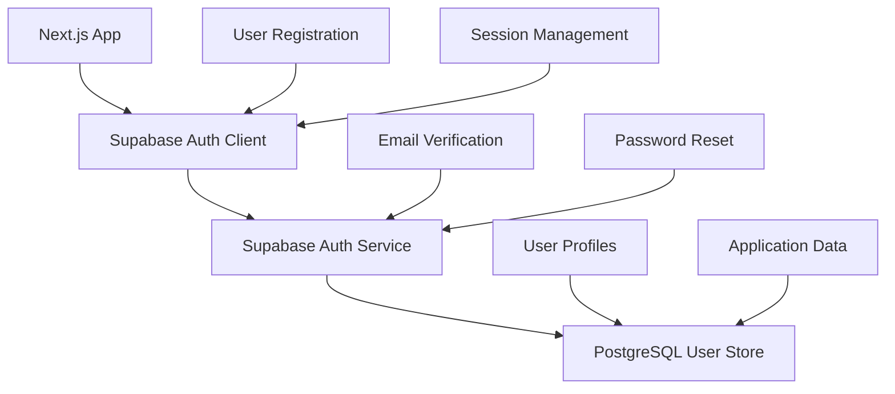

# ADR001: Authentication Strategy for SaaS Analytics Platform

---
adr_id: "ADR001"
title: "Authentication Strategy Selection"
status: "accepted"
decision_date: "2025-07-01"
author: "Alex Chen"
reviewers: ["Jordan Kim", "Maria Gonzalez"]
created_date: "2025-07-01"
updated_date: "2025-07-01"
category: "security"
impact_level: "high"
complexity: "medium"
related_decisions: []
superseded_by: null
implementation_status: "in_progress"
---

## Status
**Accepted** - Decision made and implementation in progress

## Context

### Problem Statement
The SaaS analytics platform MVP requires a secure, scalable authentication system that enables rapid development while maintaining security best practices. As a startup with limited resources, we need to balance development speed, security requirements, and future scalability.

### Business Requirements
- Support 100+ beta users initially, scaling to 10,000+ users within 12 months
- Enable rapid MVP development with 3-person team
- Ensure data security and user privacy compliance
- Minimize ongoing maintenance overhead
- Support future enterprise features (SSO, SAML)

### Technical Requirements
- Email/password authentication for MVP
- Social login capability for future releases
- Session management and token refresh
- Password reset functionality
- Email verification for account activation
- Integration with Next.js 13 application

### Constraints
- **Budget**: Limited startup budget, prefer cost-effective solutions
- **Team Size**: 3-person team with limited backend expertise
- **Timeline**: 6-week MVP development cycle
- **Compliance**: Basic security requirements, potential GDPR compliance needed

## Decision

**We will use Supabase Auth as our primary authentication service.**

### Rationale
Supabase Auth provides a comprehensive authentication solution that meets our immediate needs while supporting future scaling requirements with minimal development overhead.

## Options Considered

### Option 1: Custom Authentication with Express.js + JWT
**Implementation**: Build custom auth server with Express.js, JWT tokens, and bcrypt password hashing.

**Pros:**
- Full control over authentication logic
- No external service dependencies
- Custom features can be implemented as needed
- No per-user costs

**Cons:**
- Significant development time (3-4 weeks for full implementation)
- Requires backend security expertise we don't have
- Ongoing maintenance and security updates required
- Manual implementation of best practices (rate limiting, password policies)
- Complex session management and token refresh logic

**Cost**: High development time, low ongoing costs
**Risk**: High (security implementation complexity)

### Option 2: Auth0
**Implementation**: Integrate Auth0 managed authentication service.

**Pros:**
- Enterprise-grade security and compliance
- Comprehensive feature set (SSO, MFA, social logins)
- Excellent documentation and developer experience
- Proven scalability
- Advanced security features built-in

**Cons:**
- Higher cost at scale ($23/month for 1000 active users)
- Complex pricing structure
- May be over-engineered for MVP needs
- Learning curve for team
- Vendor lock-in concerns

**Cost**: $0 for development + $23+/month at scale
**Risk**: Medium (vendor dependency)

### Option 3: Firebase Authentication
**Implementation**: Use Google Firebase Auth service.

**Pros:**
- Well-established service with good reliability
- Easy integration with Google ecosystem
- Social login integrations built-in
- Generous free tier
- Good mobile SDK support

**Cons:**
- Google vendor lock-in
- Limited customization options
- Complex pricing at scale
- Less control over data location
- Not ideal for data-sensitive applications

**Cost**: Free tier + usage-based pricing
**Risk**: Medium (vendor lock-in)

### Option 4: Supabase Auth ⭐ **Selected**
**Implementation**: Use Supabase authentication with PostgreSQL backend.

**Pros:**
- Open-source foundation (can self-host if needed)
- Excellent Next.js integration
- Built-in PostgreSQL database included
- Rapid development with good DX
- Comprehensive auth features (email, social, magic links)
- Reasonable pricing structure
- Real-time capabilities for future features
- Direct SQL access to user data

**Cons:**
- Relatively newer service (less enterprise adoption)
- Limited advanced enterprise features compared to Auth0
- Smaller ecosystem compared to Firebase
- Self-hosting complexity if vendor issues arise

**Cost**: Free tier (up to 50,000 users) + $25/month Pro plan
**Risk**: Medium-Low (newer service, but open-source foundation)

### Option 5: AWS Cognito
**Implementation**: Use Amazon Cognito for user management.

**Pros:**
- Part of AWS ecosystem (good for scaling)
- Enterprise security features
- Advanced user pool management
- Good integration with other AWS services

**Cons:**
- Complex setup and configuration
- AWS-specific knowledge required
- Poor developer experience
- Complex pricing structure
- Steep learning curve

**Cost**: Pay-per-use model
**Risk**: Medium (complexity)

## Implementation Details

### Technical Architecture


### Integration Approach
1. **Client-Side Integration**: Use `@supabase/auth-helpers-nextjs` for seamless Next.js integration
2. **Session Management**: Leverage Supabase session handling with automatic token refresh
3. **Database Schema**: Extend Supabase auth.users table with custom user_profiles table
4. **Email Configuration**: Use Supabase email service for verification and password reset

### Authentication Flow
```typescript
// Registration
const { data, error } = await supabase.auth.signUp({
  email: 'user@example.com',
  password: 'secure_password',
  options: {
    data: {
      first_name: 'John',
      last_name: 'Doe',
      company: 'Acme Corp'
    }
  }
});

// Login
const { data, error } = await supabase.auth.signInWithPassword({
  email: 'user@example.com',
  password: 'secure_password'
});

// Session management (automatic)
const { data: { session } } = await supabase.auth.getSession();
```

## Implementation Plan

### Phase 1: Core Authentication (Week 1-2)
- Set up Supabase project and configure authentication
- Implement email/password registration and login
- Create user profiles table and basic profile management
- Implement email verification flow

### Phase 2: Enhanced Features (Week 3-4)
- Add password reset functionality
- Implement session management and token refresh
- Add basic user profile management
- Integrate with application authorization

### Phase 3: Production Readiness (Week 5-6)
- Implement rate limiting and security best practices
- Add comprehensive error handling
- Set up monitoring and logging
- Performance testing and optimization

## Consequences

### Positive Consequences
- **Rapid Development**: Reduces authentication development time from 3-4 weeks to 1-2 weeks
- **Security Best Practices**: Built-in security features and compliance
- **Scalability**: Can handle growth from 100 to 10,000+ users without changes
- **Cost Effective**: Free tier covers MVP needs, reasonable scaling costs
- **Database Integration**: Unified data platform with auth and application data
- **Future Flexibility**: Open-source foundation allows self-hosting if needed

### Negative Consequences
- **Vendor Dependency**: Reliance on Supabase service availability
- **Limited Customization**: Some authentication flows may be constrained by Supabase APIs
- **Learning Curve**: Team needs to learn Supabase-specific patterns
- **Enterprise Features**: May need migration for advanced enterprise features

### Risk Mitigation Strategies
1. **Vendor Risk**: Monitor Supabase stability and have self-hosting plan as contingency
2. **Data Export**: Ensure regular backups and data export capabilities
3. **Alternative Planning**: Document migration path to Auth0 for enterprise needs
4. **Cost Monitoring**: Track usage and optimize for cost efficiency

## Compliance Considerations

### Security Standards
- **Password Security**: Bcrypt hashing, configurable password policies
- **Data Encryption**: End-to-end encryption for sensitive data
- **Session Security**: Secure token management with automatic refresh
- **Rate Limiting**: Built-in protection against brute force attacks

### Privacy Compliance
- **GDPR Compliance**: Data deletion and export capabilities
- **Data Residency**: EU data residency options available
- **Audit Logging**: Authentication events logging for compliance

## Success Metrics

### Technical Metrics
- **Implementation Time**: Target <2 weeks vs 4 weeks for custom
- **Authentication Performance**: <500ms login time
- **Reliability**: >99.9% authentication success rate
- **Security**: Zero critical security vulnerabilities

### Business Metrics
- **User Registration**: >90% successful registration completion
- **User Retention**: Authentication not a barrier to user adoption
- **Development Velocity**: Authentication features don't slow other development
- **Cost Efficiency**: Authentication costs <5% of total infrastructure

## Review and Updates

### Next Review Date
**2025-10-01** - Review after 3 months of production usage

### Review Criteria
- User adoption and feedback on authentication experience
- Performance metrics and scalability assessment
- Security incident review and compliance audit
- Cost analysis and budget impact
- Team satisfaction with development experience

### Potential Updates
- **Enterprise Features**: Evaluate Auth0 migration if enterprise customers require SSO
- **Performance Optimization**: Custom caching or session management if needed
- **Cost Optimization**: Self-hosting evaluation if costs become significant
- **Feature Enhancement**: Social logins and MFA implementation

## Related Decisions

### Future ADRs
- **ADR002**: Database Strategy (will leverage Supabase PostgreSQL)
- **ADR003**: Session Management Strategy (building on this auth decision)
- **ADR004**: API Authorization Strategy (will integrate with Supabase auth)

### Dependencies
- **Technology Stack**: Supports Next.js 13 and TypeScript choices
- **Database Strategy**: Influences database selection (PostgreSQL via Supabase)
- **Infrastructure**: Affects hosting and deployment strategy

---

**Decision Record Metadata**
- **Document Status**: Active
- **Implementation Status**: In Progress (75% complete)
- **Next Review**: 2025-10-01
- **Created By**: Alex Chen
- **Approved By**: Jordan Kim (Product), Maria Gonzalez (Technical Advisor)
- **Implementation Team**: Alex Chen (Lead), Sam Rodriguez (Frontend Integration)